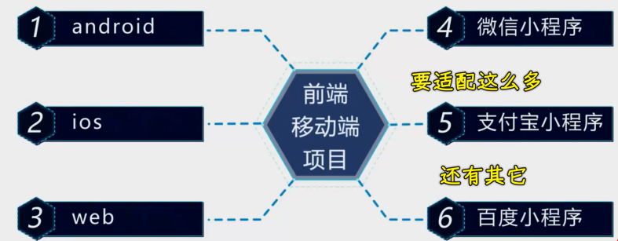
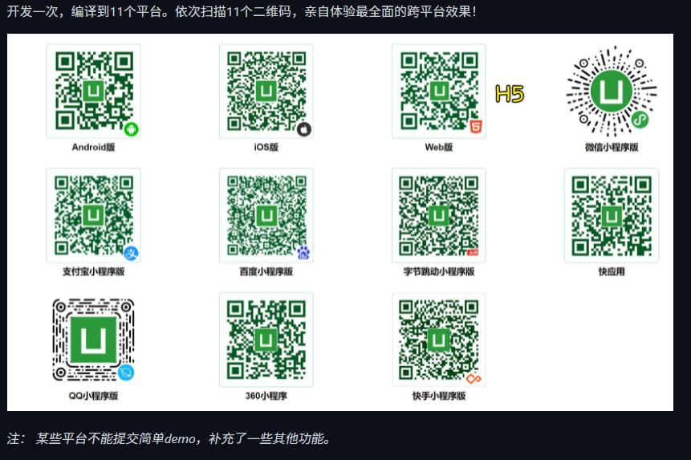
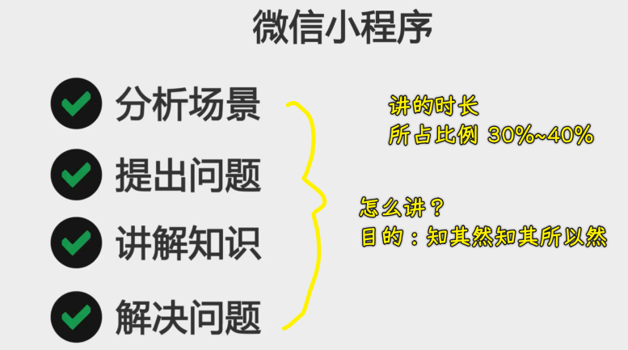
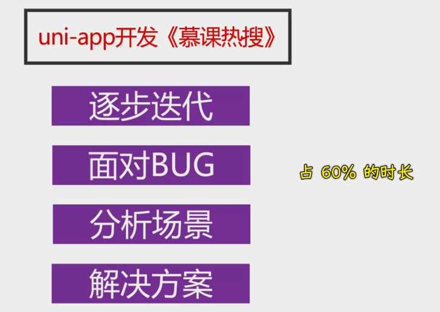
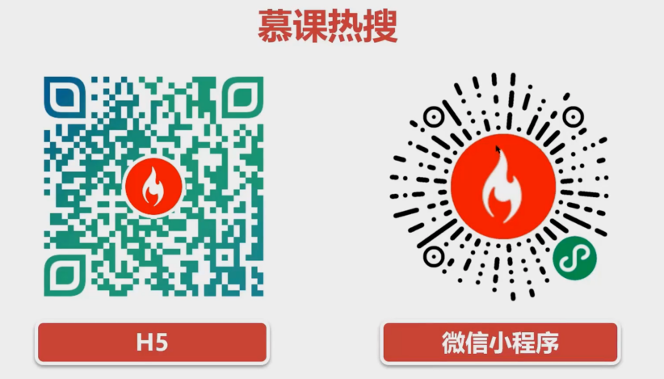
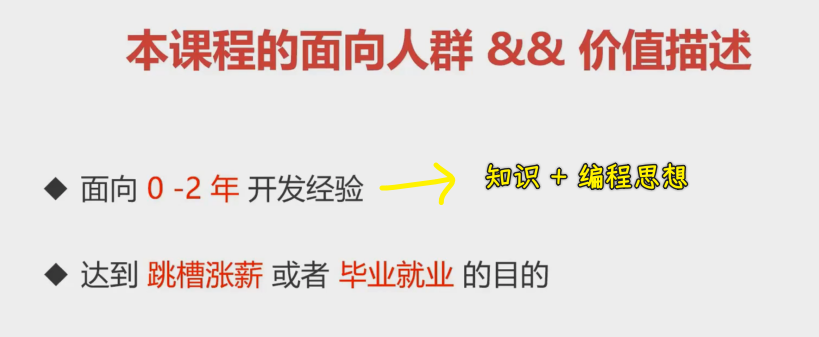
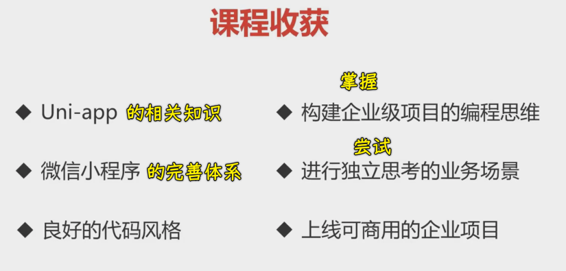

### ✍️ Tangxt ⏳ 2021-12-04 🏷️ 导学

# 01-导学

### <mark>1）微信小程序</mark>

- 微信小程序是腾讯于 2017 年 1 月 9 日推出的一种不需要下载安装即可在微信平台上使用的应用程序，主要提供给企业、政府、媒体、其他组织或个人的开发者在微信平台上提供服务。 截止 2018 年 3 月，微信小程序用户规模突破 4 亿，小游戏类微信小程序占比达 28%。
- 阿拉丁数据：
  - 2019 的 MAU（活跃用户数） 是 6.2 亿
  - 2020 的 MAU 是 8.3 亿
  - 这意味着对于小程序这个市场，企业和开发者都不得不重视
- 其它大厂看到微信小程序牛逼？
  - 推出了自家的小程序，如支付宝小程序、字节跳动小程序、百度小程序 -> 希望在这个庞大的小程序市场中分一杯羹
- 小程序全网总数突破 600 w -> 关于前端的移动端市场都已经被各种各样的平台给包围了
  - 微信小程序 -> 380 万+
  - 支付宝小程序 -> 200 万+
  - 百度小程序 -> 42 万+

### <mark>2）一个企业要开发一个前端移动端项目</mark>

要适配这么多平台？

- 对于企业而言 -> 成本剧增
- 对于开发者而言 -> 写到吐……

在这种情况下，就必须得要有一个东西来应对这种场景了

这个时候，uni-app 就诞生了

有了它：

- 企业成本减低
- 广大前端开发者省事儿多了

### <mark>3）本课程的内容规划 & 项目介绍</mark>

#### <mark>1、微信小程序</mark>

> 35%~40% -> 10~15 个小时

#### <mark>2、uni-app 开发 《慕课热搜》</mark>

企业级开发，从不完美的实现，到最终解决方案 -> 这是一个真实开发过程

> 15 个小时左右

最终上线效果：

项目内容总共分成三个部分：

- 热榜 -> 上中小
  - 上：搜索按钮 -> 点击搜索进入到搜索页面 -> 搜索结果有下拉刷新，已经上拉加载更多这样的分页展示 -> 搜索结果下边有个按钮，可以回到搜索框 -> 点击一条搜索结果会进入到文章页面（文章内容和评论） -> 评论默认展示经典评论，点击按钮可展示全部评论、还有我们可以发送评论、文章有点赞和收藏、还有关注用户等功能
    - 有推荐的搜索的内容 -> 点击「推荐的搜素内容」会进入到对应的搜索结果
    - 不点击推荐的 -> 自己输入搜索内容（输入框默认有推荐的搜索的内容）
      - 自己输入内容
      - 不输入内容，搜索输入框默认推荐的内容
  - 中：tabs 横向滑动 -> 下边有个文章标题列表 -> 向下滑动列表，有吸顶的效果 -> 我们可以左右滑动列表，以此来切换 tabs -> 点击一个列表 -> 进入到文章详情 -> 文章详情里边有图片 -> 点击图片可以进行一个图片的基本展示（在手机上可以通过两根手指放大和缩小图片内容）
  - 以上就是热搜的大概部分了
- 热播
  - 热播页面 -> 主要是视频内容，同样包含下拉刷新，已经上拉加载更多 -> 点击视频可以播放、也可以点击全屏按钮来全屏播放 -> 点击视频项，进入到当前视频的详情页面 -> 某些视频里边包含弹幕内容（类似评论区，只是叫全部弹幕罢了）、我们可以发送弹幕
- 我的（也就是个人中心）
  - 有「微信用户一键登录功能」 -> 登录到当前项目 -> 这个功能也适用 H5 端，因为我们做了一个适配

这三个模块完成对接真实数据，并且具备完善的业务逻辑

在这个项目里边有接近 20 个自定义的功能组件 -> 尽大地反映出真实级的企业项目开发的代码以及这所对应的场景

### <mark>4）本课程的面向人群 & 价值描述</mark>

> 知识+编程思想

课程收获：

通过这样一种方式 -> 构建出一条前端小程序端的一个技术体系
