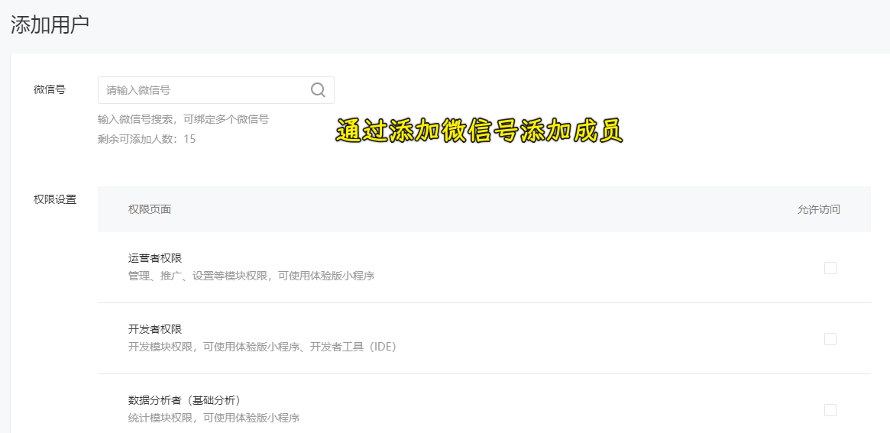

### ✍️ Tangxt ⏳ 2021-12-05 🏷️ 小程序

# 02-小程序初体验

1）开篇介绍


2）小程序开发前的准备

1. 到 [微信公众平台](https://mp.weixin.qq.com/) 注册账号 -> 注册完后微信扫码登录
2. 下载「[微信开发者工具](https://developers.weixin.qq.com/miniprogram/dev/devtools/download.html)」 -> 选择稳定版进行安装

3）开发第一个小程序应用

打开微信开发者工具，创建小程序项目：


微信开发者工具介绍：


4）了解小程序项目的基本组成结构

微信开发者工具为我们创建的这个小程序项目 -> 这里边初始化好的目录结构以及文件都起到什么作用呢？


1、三个问题


2、pages 目录

- `pages`目录 -> 存放所有的小程序页面 -> 每一个页面都以单独的文件夹这种形式而存在
  - 默认给了我们两个页面：`index`、`logs`
    - `index`文件夹 -> 包含了 4 个文件 -> 一个小程序页面就是由这 4 个文件所组成的
      - `index.js` -> 页面的脚本文件 -> 用来存放页面的数据、事件处理函数或者生命周期等等这些内容
      - `index.json` -> 当前这个`index`页面的配置文件，如配置当前这个页面的外观
      - `index.wxml` -> 代表页面的模板结构
      - `index.wxss` -> 代表当前页面的页面样式表
      - 以上就是组成一个页面的四个文件，以及它们各自的一个基本作用

3、utils 目录

- `utils`目录 -> 工具类文件夹 -> 你想要在这个项目里边创建一些工具文件，如`util.js`，那么你就把这个文件放到这个目录里边

4、app.js

- `app.js` -> 代表小程序的项目逻辑文件 -> 在这个文件里边，我们可以注册小程序实例、绑定生命周期回调函数、错误监听和页面不存在监听函数等等这些内容

5、app.json

- `app.json` -> 小程序公共配置文件 -> 在该文件里边包括里整个小程序里边的一些页面路径、窗口表现、设置网络超时时间、设置多 tab 等等这些内容

6、app.wxss

- `app.wxss` -> 它表示的是我们小程序当中的公共样式表

7、project.config.json

- `project.config.json` -> 项目配置文件 -> 用来记录我们对小程序开发者工具所做的一些个性化配置，比如：
  - `setting` -> 这个字段里边保存了「编译相关的配置」
  - `projectname` -> 保存的是小程序的「项目名称」
  - `appid` -> 保存的是「小程序的账号 ID」
  - ……

总之有关这个小程序开发者工具的个性化配置都记录在这个文件里边

8、sitemap.json

- `sitemap.json` -> 它表示的是小程序及其页面是否可以被微信去进行索引
  - `rules`中保存了索引规则列表的配置
  - `rules`规则中，`action`表示页面是否能被索引（`allow`，`disallow`），`page`表示生效的页面

它提供了一个链接：

``` json
{
  "desc": "关于本文件的更多信息，请参考文档 https://developers.weixin.qq.com/miniprogram/dev/framework/sitemap.html",
  "rules": [{
  "action": "allow",
  "page": "*"
  }]
}
```

在这个 [链接](https://developers.weixin.qq.com/miniprogram/dev/framework/sitemap.html) 里边，我们可以查看`sitemap.json`这个文件的深层次作用


---

以上就是小程序开发者工具默认配置的这些初始化文件的一个作用

9、回看最初的三个问题

问题 1：


问题 2：


问题 3：


---

以上就是这三个问题以及它们所各自对应的答案

检测学习效果？ -> 可以轻松回答这 3 个问题，那么对于这节课的吸收基本上就没啥问题了！

5）wxml VS html

> 我们很熟悉`js`和`json`文件，可`wxml`文件和`wxss`是什么鬼？

开头还是提出一个问题，带着这个问题去学习会事半功倍：


1、什么是 wxml？

`WXML`（`WeiXin Markup Language`）是框架设计的一套标签语言，这套标签语言里边我们所写入的都是微信小程序之中给我们准备好的一些组件，这些东西可以**用来构建小程序页面的结构**，其作用非常类似于我们网页开发中的 `HTML`，比如我们在 HTML 文件里边写`span`，`div`等，而我们在 WXML 文件里边也是在做类似的事情

2、WXML 和 HTML 的区别

- 标签名称不同
 - HTML(div, span, img, a)
 - WXML(view, text, image, navigator) -> 小程序提供的对应组件


- 属性节点不同
 - `<a href="#">超链接</a>` -> HTML 里边给`href`值
 - `<navigator url="/pages/home/home">跳转到 home 页</navigator>` -> WXML 里边写的是微信小程序给我们提供的组件，我们能传入的这些内容，如`url="/pages/home/home"`，都是组件给我们提供的一些能力或者说是`prop` -> 学过 Vue 都知道 -> 总之，我们往`wxml`里边写的东西叫做组件，组件里边的这些属性都是可以在组件之中去进行定义的

还提供了一些功能上的不同，比如：

- 提供了动态渲染数据的模板语法
 - 数据绑定
 - 条件渲染
 - 列表渲染

---

WXML 类似 网页开发中的 HTML，它与 HTML 的不同，大概有三点！

回到最初的那个问题，我们能否在`wxml`里边写 HTML 标签呢？ -> 从目前所了解到的知识，显然是不可以的

当然，眼见为实，耳听为虚

我们测试得知：


3、问题答案


总之，一旦我们在`wxml`文件里边写入了一个小程序不认识的标签，那这个标签就会被渲染成为一个`view`标签 -> `view`标签的作用类似 `html` 文件里边的`div`标签

这就是为啥`div`和`h1`可以被解析，其内容可以显示出来，但其样式不能显示出来的原因 -> `h1`的效果被取消掉了，因为它被变成了一个类似于`view`标签的效果

6）wxss VS css

1、问题

> 1. `wxss` 新增了什么尺寸单位？
> 2. `wxss` 中推荐使用什么选择器？

2、知识点


1. 什么是 `WXSS`
   - WXSS` (`WeiXin Style Sheets`) 是一套样式语言，用于描述 `WXML` 的组件样式
   - 类似于网页开发中的 `CSS`
   - `WXSS` 具有 `CSS` 大部分的特性
2. 新增了尺寸单位 --  **rpx**，一个 `rpx` 表示为页面宽度的 `1 / 750` -> 说白了，微信就是把整个页面的宽度平分为 750 等份，其中一等份就代表`1rpx`
   
   
   
3. 提供了全局的样式和局部样式。
   1. 全局样式：只要被写入到 **根目录的`wxss`** 中的样式，我们就称之为全局样式
   2. 局部样式：写入到 **页面的 `wxss` ** 中的样式
   
   
   
4. 此外 `WXSS` 仅支持部分 `CSS` 选择器
   1. **`.class`（推荐使用）** 和 `#id`
   2. `element`   
   3. 并集选择器和后代选择器 
   4. `::after` 和 `::before` 等伪类选择器

3、答案

> 1. `wxss` 新增了什么尺寸单位？
>    1. `rpx` 尺寸单位，一个 `rpx` 为页面宽度的 `1 / 750`
> 2. `wxss` 中推荐使用什么选择器？
>    1. 最推荐使用`.class` 类选择器


7）.json 文件

1、问题

> 1. 小程序中的 `.json` 文件主要分为哪两种？
> 2. 当这两种配置文件，一旦出现相同配置时，那么这会出现什么样的结果？

2、.json 文件所起到的作用

小程序中，额外多出了一个 `.json` 的配置文件，`.json` 文件主要分为两个：

1. 项目根目录下的 `.json` 文件
   1. 修改项目的基本配置
      1. 首页
      2. `navigationBarBackgroundColor`
2. 页面中的 `.json` 文件
   1. 修改页面的基本配置（优先级高）
      1. `navigationBarBackgroundColor`


3、答案

> 1. 小程序中的 `.json` 文件主要分为哪两种？
>    1. 项目根目录下的 `.json` 文件
>    2. 页面中的 `.json` 文件
> 2. 当这两种配置文件出现相同配置时，会出现什么结果？
>    1. 以页面的 `.json` 文件为主或者说页面的`.json`文件优先级更高，会覆盖全局配置中的`.json`文件

8）宿主环境与小程序的运行环境

1、问题


2、宿主环境指的是什么？

1. 宿主环境指的是 **程序运行所必须的依赖环境**
   1. web 前端的宿主环境为：浏览器
   2. `android` 软件的宿主环境为：`android` 系统
   3. `IOS` 软件的宿主环境为：`IOS` 系统
2. 小程序的宿主环境是什么？
   1. 小程序的宿主环境为：**手机微信**
      1. 所以：小程序可以调用 **手机微信** 中的
         1. 扫码
         2. 支付
         3. 登录
         4. 分享
         5. 等等功能

3、小程序的运行环境


1. 小程序的运行环境分成**渲染层**和**逻辑层**
   1. 其中 `WXML` 模板和 `WXSS` 样式工作在**渲染层**
      1. **渲染层**的界面使用了`WebView` 进行渲染
      2. 如果一个小程序存在**多个界面**，那么渲染层就会存在**多个`WebView`**线程
   2. JS 脚本工作在**逻辑层**。
      1. **逻辑层**采用`JsCore`线程运行 JS 脚本
2. 这**两个线程的通信**会经由**微信客户端**做中转
   1. **逻辑层**发送**网络请求**也会经由 **`Native（手机原生系统）`** 去进行一个转发

以上只是对小程序的运行环境的一个简单的叙述 -> 仅作了解即可

4、答案

> 1. 什么是**宿主环境**？
>    1. 宿主环境指的是 **程序运行时所必须的依赖环境** -> 如 web 前端依赖于 web 浏览器，安卓 App 需要依赖于安卓系统，IOS APP 需要依赖于 IOS 系统
> 2. 微信小程序项目为什么可以调用 **微信支付** 功能？
>    1. 因为 微信小程序 的宿主环境为 **手机微信**，而 **手机微信** 提供了对应的功能
> 3. 小程序的运行环境是如何划分的？
>    1. 小程序的运行环境分成两部分，分别是**渲染层**和**逻辑层**

9）小程序内置组件-view

打开开发者文档：


「组件」这块的内容：


1. [view](https://developers.weixin.qq.com/miniprogram/dev/component/view.html)
3. [scroll-view](https://developers.weixin.qq.com/miniprogram/dev/component/scroll-view.html)
4. [swiper](https://developers.weixin.qq.com/miniprogram/dev/component/swiper.html) && [swiper-item](https://developers.weixin.qq.com/miniprogram/dev/component/swiper-item.html)
5. [text](https://developers.weixin.qq.com/miniprogram/dev/component/text.html) && [rich-text](https://developers.weixin.qq.com/miniprogram/dev/component/rich-text.html)
6. [button](https://developers.weixin.qq.com/miniprogram/dev/component/button.html)
7. [image](https://developers.weixin.qq.com/miniprogram/dev/component/image.html)

1、view 组价

`view` 组件非常类似于 HTML 里边的`div`标签，其作用非常类似于`div`，小程序把它称之为「视图容器」

对于这个`view`组件，它所提供的属性就这么四个：


💡：`hover-class`

`hover-class` -> 我们用鼠标（或者手指）按下这个视图容器不放的时候，会给这个容器新增一个类名


💡：`hover-stop-propagation`

`hover-stop-propagation` -> 不要冒泡，你就设置为`true`，默认值是`false`，也就是冒泡

默认情况：


子元素不要冒泡：


💡：`hover-start-time` & `hover-stay-time`


---

这一小节讲了`view`组件它的一个作用以及它的一个属性

10）小程序内置组件-scrollView

可滚动视图区域。使用竖向滚动时，需要给 scroll-view 一个固定高度，通过 WXSS 设置 height。组件属性的长度单位默认为 `px`，2.4.0 起支持传入单位 (`rpx/px`)

可滚动视图区域 -> 可以理解为添加了`overflow:scroll`属性的`div` -> 也就是可以进行横向滚动和纵向滚动的`div`

💡：如何让视图容器（`scroll-view`）产生滚动行为？

1. 该视图容器指定了`scroll-x`或`scroll-y`属性
2. 子元素的宽或高大于视图容器固定的宽或高

💡：测试竖向滚动

``` html
<scroll-view class="scroll-view-parent" scroll-y="true">
  <view class="scroll-view-child scroll-view-child-01">a</view>
  <view class="scroll-view-child scroll-view-child-02">b</view>
  <view class="scroll-view-child scroll-view-child-03">c</view>
</scroll-view>
```

``` css
.scroll-view-parent {
  width: 200px;
  height: 200px;
  background-color: tomato;
  text-align: center;
}

.scroll-view-child {
  width: 200px;
  height: 200px;
}

.scroll-view-child-01 {
  background-color: wheat;
}
.scroll-view-child-02 {
  background-color: yellowgreen;
}
.scroll-view-child-03 {
  background-color: skyblue;
}
```

效果：


竖向滚动出现的条件：

1. `scroll-view`拥有固定的高度
2. `scroll-view`内容的高度超出本身的高度
3. 给`scroll-view`添加了`scroll-y`属性

💡：测试横向滚动

横向滚动出现的条件：

1. `scroll-view`拥有固定的宽度
2. `scroll-view`内容的宽度超出本身的宽度
3. 给`scroll-view`添加了`scroll-x`属性

``` html
<scroll-view class="scroll-view-x" scroll-x="true">
  <view class="scroll-view-x-child ">abcdefg</view>
</scroll-view>
```

``` css
.scroll-view-x {
  width: 200px;
  height: 200px;
  background-color: tomato;
}

.scroll-view-x-child {
  width: 400px;
  height: 100px;
  background-color: yellow;
}
```


---

这个组件有很多很多的属性，但它最核心的功能还是去实现一个可滚动的视图区域

> `scroll-view`类似带`overflow: scroll`属性的`div` -> 它是一个容器，让想容器里边的内容可以滚动，我们可以设置`scroll-x/y`属性 -> 当然，要出现滚动现象需要满足特定条件

11）小程序内置组件-swiper

要现实现广告的轮播效果？ -> 自己实现很麻烦，小程序提供了一个组件来帮我们实现这一点


`swiper`组件：滑块视图容器。其中只可放置`swiper-item`组件，否则会导致未定义的行为。

``` html
<swiper indicator-dots="true" indicator-active-color="pink">
  <swiper-item class="swiper-item swiper-item-a">A</swiper-item>
  <swiper-item class="swiper-item swiper-item-b">B</swiper-item>
  <swiper-item class="swiper-item swiper-item-c">C</swiper-item>
</swiper>
```

``` css
.swiper-item {
  width: 200px;
  height: 200px;
}

.swiper-item-a {
  background-color: yellowgreen;
}
.swiper-item-b {
  background-color: tomato;
}
.swiper-item-c {
  background-color: yellow;
}
```


其它属性：

- `autoplay`：是否自动切换，不用我们手动去操作，默认切换的间隔时间是`5s`
- `interval`：自动切换时间间隔，默认值`5000ms`

12）小程序内置组件-text&&rich-text

💡：`text`

`text`：用来展示文本的组件，可看做是`span`


💡：`rich-text`

`rich-text`：用来展示富文本的组件，所谓「富文本」就是包含结构的文本

``` html
<rich-text nodes="<ul><li class='list1'>list1</li><li>list2</li></ul>"></rich-text>
```


13）小程序内置组件-button-image

根据 HTML 里边的`button`元素，实现了对应的`button`组件，还有`image`组件也是类似`img`标签这样的实现

💡：`button`

对于`button`组件，它提供了很多属性用来表示当前按钮的一些样式

``` html
<button>我是一个 button</button>
<button type="primary">我是一个 button</button>
<button type="primary" plain="true">我是一个 button</button>
```


`button`组件有一个非常非常重要的属性，那就是`open-type` -> 该属性也是`button`组件里边最复杂的一个属性

`open-type`表示微信的开放能力

💡：`image`

`image`组件的作用和`img`是一样的 -> 就是为了去显示图片

它支持 JPG、PNG、SVG、WEBP、GIF 等格式，2.3.0 起支持云文件 ID。

它最核心的一个属性就是`src`

常用属性`mode`（图片裁剪、缩放的模式），该属性有最常用的是 3 个值：


> 默认值是`scaleToFill`

测试：

``` html
<image src="https://ppambler.github.io/article/avatar.jpg"></image>
<image src="https://ppambler.github.io/article/avatar.jpg" mode="aspectFit"></image>
<image src="https://ppambler.github.io/article/avatar.jpg" mode="aspectFill"></image>
```

`scaleToFill`和`aspectFit`的效果：


`aspectFill`的效果


通过`mode`，我们可以设置图片的展示，这一点`img`标签是没有的

14）小程序成员管理

什么叫小程序成员管理？或者说为啥需要小程序成员管理？

在公司里边实际开发一个小程序项目，不同员工都会有不同的角色，比如你是这个小程序项目的一个开发者，然后有对应的产品经理，开发出来的项目需要交由产品经理去进行确认，然后你公司里边有对应的项目负责人

每个人都有不同的角色 -> 在我们去开发一个小程序项目的时候，我就需要对这些角色或者说是成员去进行一个统一的管理 -> 只有这样，才能让我们的小程序开发更加地便捷

💡：整个小程序成员被分成了什么样的一些内容


小程序中的成员角色被分成了三种类型：

- 第一种是管理员 -> 比如小程序的项目负责人就是管理员身份
- 第二种是项目成员 -> 一般指的是小程序项目的开发人员，也就是程序员
- 第三种是体验成员 -> 可以是项目经理，也可以是测试人员 -> 其作用就是用来去体验当前小程序项目开发完成之后的一个版本

这三个就是小程序里边的成员角色，所以问题来了 -> 我们该如何去管理这些角色呢？

💡：小程序成员如何管理？

如果我们想要管理小程序成员，首先要进入这个小程序项目的管理后台

小程序管理页面：<https://mp.weixin.qq.com/>（自己登录）


添加项目成员操作：


点击「编辑」 -> 点击「添加成员」：



同理，添加「体验成员」也是如此：


---

以上就是通过项目管理后台来管理我们项目成员的一种方式！

15）小程序发布流程

当我们的小程序项目开发完成之后，那我们就需要把它发布到微信小程序里边，以此来让用户进行使用

整个微信小程序项目的发布流程和我们之前所了解到前端项目发布流程是不太一样的

💡：小程序发布流程


整个小程序的发布流程，分成了两个大的版本，也就是说根据小程序的版本可以分成两个大的版本

第一个大版本叫做「本地版本」 -> 对于本地而言，只存在一个「开发版本」需求 -> 当我们在本地把项目开发完成之后，那我们就需要进行上传 -> 把项目上传到小程序管理后台之后，此时就处于「上传」的一个「开发版本」或者叫做「体验版本」的这样一种情况，上传的这个版本默认会被设置成「体验版本」

设置成「体验版本」后，如果我们想要把项目进行发布，那么这还需要进行一个版本的审核，版本审核完成之后才会变成一个「线上版本」

具体就是四个小版本，两个大版本（一个本地，一个上传） -> 这就是我们整个小程序的一个发布流程

💡：演示小程序发布流程

第一步，在小程序开发者工具里边上传本地版之开发版本：


点击「上传」，上传完成之后，会给出这样一个提示：


上传成功之后，我们到该小程序项目的管理后台去查看该项目：


把开发版本设置为体验版本：


对于这个体验版本，项目管理员，开发人员，体验人员都可以通过扫描这个体验版本的二维码来进行访问

点击「提交审核」，把开发版本提交为审核版本

> 如果已经有「审核版本」，那么此时的开发版本是无法提交审核的


一个示例：


---

当项目审核完成之后，那么这个「审核版本」会自动变成「线上版本」


---

以上就是我们整个小程序的一个基本的发布流程！

16）本章小结

- 小程序账号 & 微信开发者工具 的概念
- **小程序项目的基本页面结构**
- **wxml 的概念**
- **wxss 的概念**
- **`.json` 配置文件的作用**
- **宿主环境的概念**
- **部分的小程序内置组件**
- 小程序成员管理的方式和项目发布的流程

