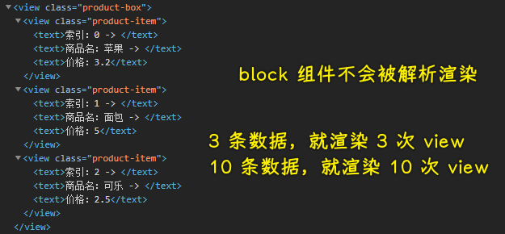
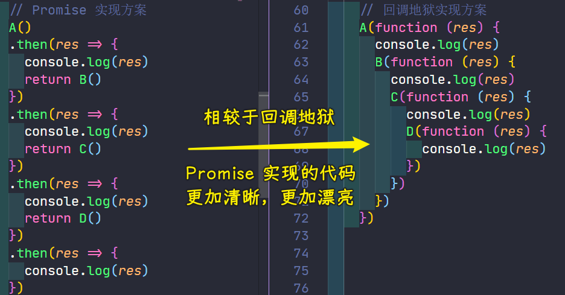

### ✍️ Tangxt ⏳ 2021-12-09 🏷️ 小程序

# 03-小程序核心语法

1）开篇介绍

本章会讲解小程序里边所有的核心语法，主要讲的内容，分成了以下三大块：


- 第一块：数据驱动原则 -> 现阶段前端开发或者大前端开发的一个核心原则之一，无论是小程序，还是三大框架 Vue、React、Angular，它们都秉承了基本的数据驱动原则 -> 这一块必须优先掌握
- 第二块：通过两个案例来串联整个第三章中的所有核心知识点
  - 案例 1：商品案例
  - 案例 2：列表案例

这两个案例都搞懂了，意味着第三章的内容都掌握了

2）小程序的数据驱动原则

> 界面依赖数据，数据变化了，界面响应式的更新

1、问题

> 1. 什么是数据驱动？
> 2. 在小程序中如何完成数据绑定？

2、数据驱动

```js
// 商品
let product = {
  price: 10,
  num: 5
}
// 总价格
let total = 0;
// 计算总价格的方法
function getTotal(product) {
  return product.price * product.num
}
// 计算商品的总价格
total = getTotal(product)
// 进行打印
console.log('总价格：' + total);
// 50 太贵了，所以我们少购买了两个商品，也就是让 num = 3
product.num = 3;
// 问：总价格是多少？
console.log('总价格：' + total); // 此时，打印发现总价格还是 50 元，如果要说原因的话，那么应该很简单，【因为我们没有重新进行价格的计算嘛】
// 但是，此时大家有没有想过一点？我们为什么要进行价格的计算呢？
// ----------------------------------------------------
// 当商品的数量发生变化时，商品的总价格【理应发生变化】，不是吗？
```

上面的例子，就是我想要跟大家说的：【当数量发生变化时，商品的总价格理应发生改变】。

那么同样的道理，在我们的页面中，假如：

> 某一个 DOM 依赖于某个数据进行展示，那么【当数据发生变化时，视图也理应发生变化】。

而这个就是【响应式数据驱动】。

> PS：如果你想要更深入的了解，那么你可以查看这篇博客：[Vue 3 深入响应式原理 - 聊一聊响应式构建的那些经历_慕课手记](https://www.imooc.com/article/320582)

3、小程序中完成响应式

- 在 `data` 中定义数据
  
  
  
- 在 `wxml` 中使用数据
  
  
  

现在我们已经可以在 `js 的 data` 中定义数据，并且在 `wxml 中通过 🟡🟡🟡🟡` 语法使用数据。

那么我们回过头来看我们的问题：

4、答案

> 1. 什么是数据驱动？
>    1. 当数据发生变化时，视图理应发生变化
> 2. 在小程序中如何完成数据绑定？
>    1. 在 `data` 中定义数据
>    2. 在 `wxml` 中通过 `🟡🟡🟡🟡` 使用数据

但是在此时，大家心里应该还有一个疑惑，那就是：【现在数据还没有发生变化呀？我也没有看到视图的变化呀？】。

如果你心中确实有这么一个困惑的话，那么就继续往下看！

3）小程序的常用事件与属性列表

> `product.num`这个`.`是特殊字符，所以需要加`''`

1、问题

> 1. 如何为按钮添加点击事件？
> 2. 如何修改 `data` 中数据的值？

2、处理点击事件

接下来我们希望做一件事情：

> 创建一个按钮
>
> 当用户点击按钮时
>
> 让 `product` 的 `num` + 1

创建按钮的方式非常简单：

``` html
<button type="primary">num + 1</button>
```

问题在于：我们如何给这个按钮添加点击事件呢？

有过开发经验的同学，可能会猜到：我们可以给 `button` 一个 `click` 事件来监听按钮的点击。

可是大家需要知道，现在我们是在【小程序】中，所以如果你想要给 `button` 添加点击事件的话，我们是不可以使用 `click`的，而是使用**`bind:tap / bindtap`**。（推荐使用`bindtap`）

> `bind`是个关键字

其中 `bind: / bind` 表示【绑定事件】，`tap` 为绑定的具体事件。小程序具体事件列表，可以点击 [这里](https://developers.weixin.qq.com/miniprogram/dev/framework/view/wxml/event.html#%E4%BA%8B%E4%BB%B6%E7%9A%84%E4%BD%BF%E7%94%A8%E6%96%B9%E5%BC%8F) 查看。

``` html
<button type="primary" bindtap="onAddNum">num + 1</button>
```

接下来需要在 `js` 中定义对应的 **事件**

```js
/**
* 定义事件处理的方法
*/
{
  onAddNum () {
    console.log('onAddNum')
  }
}
```

到目前：我们已经 **监听了按钮的点击事件，并且写入了对应的处理函数** ，接下来就需要 **修改 `num` 的值**


3、修改 data 的数据：`setData`

想要修改 `data` 中的数据，那么我们需要借助一个函数 `setData`。

`setData` 接收一个对象作为参数，这个对象就是最新的 `data` 数据。

其中 `key` 为要修改的数据， `value` 为当前`key`的最新值

4、访问 data 的数据：`this.data`

因为我们想要让 `num + 1` ，所以我们还需要拿到 `num` 的当前值，想要访问 `num` 的值，可以通过 `this.data.product.num` 的形式访问

所以最终的修改 `num` 的代码为：


此时，当我们点击 `button` ，可以发现：【当 `num` 发生改变时，总价格也发生了对应的变化】

5、答案

> 1. 如何为按钮添加点击事件？
>    1. `bindtap` or `bind:tap`
> 2. 如何修改 data 中数据的值？
>    1. 通过 `this.setData({})` 定义新的值
>    2. 通过 `this.data` 访问具体的值

4）小程序的事件传参

1、问题

> 如果想要在【点击事件中】传递参数，那么需要怎么做？

2、新的需求

现在让我们把需求变得更加复杂一些。

> 我们希望 `onAddNum` 方法可以接收一个参数，每次点击 `num` 增加的数量为传入的参数

那么如果想要实现这个需求的话，那么就需要涉及到一个知识点：【事件传参】。

如果大家有过开发经验的话，那么可能会认为这是一个非常简单的需求，顺便可以写下如下代码：


假如我们真按照以上代码进行实现的话，那么 **你应该会收到以下如下的警告：**


这个警告的意思是：没有一个叫做 `onAddNumN(5)` 的方法用来处理当前的这个 `tap` 事件。

也即是说：`onAddNumN(5)` 会被当做一个 **完整的方法名字**，而不是 方法名为：`onAddNumN`，传入了参数为 `5` ！

那么如果我们想要传递参数，那应该怎么做呢？

> 文档：[事件 - 微信开放文档](https://developers.weixin.qq.com/miniprogram/dev/framework/view/wxml/event.html#dataset)

在小程序中，如果想要给 **点击事件传递参数的话，**那么需要借助 **`event`对象** 和 **`data-`属性** ！

参数的传递包含两个部分：

1. 形参 -> 起到形参功能的就是`event`对象 -> 表示当前函数想要接收到的参数
2. 实参 -> 起到实参功能的就是`data-`属性 -> 表示调用当前函数实际传递的参数

3、形参

首先先来看 **形参**，对于 **点击事件的回调方法** 而言，默认会接收一个参数 **event （事件对象）**。这个 `event` 对象为：**回调方法的唯一参数**

也就是说回调方法只有一个形参，那就是`event`（可简写成`e`）

``` js
{
  onAddNumN (e) {}
}
```

4、实参

对于 **小程序** 中，我们不能直接为 **回调方法传递实参**。

而是需要通过：**属性绑定的形式，把需要传递的参数绑定到 当前 `DOM` 元素中**，绑定数据的属性需要以 `data-` 开头。该属性可以通过 `e.target.dataset` 进行访问。


---

最终实现：


5、答案


5）实现【双向数据绑定】

1、问题

> 1. 什么叫做双向数据绑定？
> 2. 小程序中如何实现双向数据绑定？

2、实现双向数据绑定

上一章节中我们通过【事件传参】实现了【每次点击 + 5】 的功能，但是这样的功能未免还是有些太单调了。

所以我们接下来希望实现一个新的功能：

> 创建一个数字输入框，输入框 与【商品数量】完成 【双向数据绑定】。
>
> 即：
>
> 1. 输入框内容（视图）发生变化时，商品数量（数据）同步跟随变化
> 2. 商品数量（数据）发生变化时，输入框内容（视图）同步跟随变化

那么这样的功能我们应该如何去实现呢？

---

如果想要实现这个功能，那么我们需要先把这个功能进行拆解，【**把一个复杂的功能拆解成多个简单的功能或者说多个可执行的步骤**】是实现一个复杂逻辑的标准方式。

那么如何进行拆解呢？ **大家可以先进行以下思考，然后再继续向下进行学习！**

---

以上功能可拆解成五个步骤，步骤如下：

> 1. 创建一个【数字输入框】
> 2. 设置 【商品数量】 为输入框的初始值
> 3. 监听用户的输入行为
> 4. 获取用户输入的值
> 5. 赋值给【商品数量】

根据这可量化的步骤去实现我们的功能


题外话：查看一个组件文档（想要看看`input`组件给我们提供了哪些能力）


那么现在功能我们已经实现了，那么大家在回忆一下我们的问题：

3、答案

第一个问题：


第二个问题：


6）条件渲染

1、问题

> 1. v-if 和 hidden 的区别是什么？

2、条件渲染

现在你已经买了很多的商品了，可是当你出去结账的时候，售货员小姐姐对你发出了一声惊呼：

> 1. 如果【总价格 <= 100 】：hello 帅哥
> 2. 如果【总价格 > 100 && 总价格 < 1000】：哇哦 有钱人哦
> 3. 如果【总价格 >= 1000】：土豪 你好

如果想要实现这么一个功能的话，那么就需要使用【条件渲染】的功能了。

小程序中提供了两个 API 都可以实现【条件渲染】的功能：

1. `wx:if ... wx:elif ... wx:else`
2. `hidden`

那么下面我们就分别用这两个语法来实现一下这个功能：

第一个：


第二个：


3、v-if vs hidden

> 有 Vue 开发经验，可以理解为 `v-if`（销毁、重建） vs `v-show`（`display`控制）

1. 当`wx:if`条件满足则进行渲染，否则不渲染
2. 当`hidden`条件满足则隐藏，否则不隐藏

那我们应该在什么情况下使用`wx:if`，使用`hidden`呢？

一般来说，`wx:if` 有更高的切换消耗而 `hidden` 有更高的初始渲染消耗。因此，如果需要频繁切换的情景下，用 `hidden` 是更好，如果在运行时条件不大可能改变，用 `wx:if` 是更好的。


所以，针对当前业务，使用 `hidden` 是更好的选择！

4、答案


➹：[前端答疑 - v-if 重新渲染导致的 Bug - SegmentFault 思否](https://segmentfault.com/a/1190000022525432)

7）列表渲染

1、什么是列表渲染？


2、问题

> 1. 使用 `wx:for` 时，当前项的【下标变量名】和【当前项变量名】默认分别是什么？
> 2. `block` 组件是否会被渲染？

`block`组件在循环列表里边起到了啥作用？

3、新的需求

> 如果我们有一组商品，并且希望把这组商品全部渲染出来的话，那么就需要使用到【列表渲染】的功能。

小程序中为我们提供了 `v-for` 指令，让我们进行【列表渲染】的实现。

同时也为我们提供了一个：**包裹性质的容器 `block` 组件**，当我们去循环多个元素时，可以使用 `block` 进行包裹，`block` 组件只起到包裹其他组件的作用，本身并不会进行渲染。

定义一组数据：


渲染这组数据：


渲染出来的结构：



对于列表循环渲染，我们需要重点掌握的内容是：

1. 循环渲染的基本语法，即`wx:for`的语法
2. `block`组件的作用
3. 循环渲染的逻辑，即循环渲染`block`里边的元素 -> 有 5 条数据，就渲染 5 个`view`，有 10 条数据，就渲染出 10 个`view`

4、答案

> 1. 使用 `wx:for` 时，当前项的【下标变量名】和【当前项变量名】默认分别是什么？
>    1. 默认数组的当前项的下标变量名默认为 `index`
>    2. 数组当前项的变量名默认为 `item`
> 2. `block` 组件是否会被渲染？
>    1. `block` 只是一个包裹性质的容器，不会被解析渲染。

8）配置文件解读

> 第一个商品案例，已经搞定了，接下来就是第二个案例——列表案例

我们之前了解过配置文件，但是这些配置文件都有啥属性呢？以及每一个配置属性都能配置啥内容呢？


文档：

1. `app.json` 配置文件：<https://developers.weixin.qq.com/miniprogram/dev/reference/configuration/app.html>
   1. `pages` 数组：<https://developers.weixin.qq.com/miniprogram/dev/reference/configuration/app.html#pages>
      1. 创建 `list` 页面
   2. `window` 对象：<https://developers.weixin.qq.com/miniprogram/dev/reference/configuration/app.html#window>
   3. `tabbar` 对象：<https://developers.weixin.qq.com/miniprogram/dev/reference/configuration/app.html#tabBar>
      1. `index` 页面
      2. `list` 页面
2. `页面。json` 配置文件：<https://developers.weixin.qq.com/miniprogram/dev/reference/configuration/page.html>

1、全局配置（app.json 配置文件）

该配置文件里边有很多属性 -> 挑选其中三个重点属性来进行重点讲解


💡：`pages`

> 用于指定小程序由哪些页面组成，每一项都对应一个页面的 路径（含文件名） 信息。文件名不需要写文件后缀，框架会自动去寻找对应位置的 `.json`, `.js`, `.wxml`, `.wxss` 四个文件进行处理。

我们想要创建一个新页面 -> 有两种方式可以注册页面

第一种：

1. 创建一个承载页面的文件夹
2. 创建页面


第二种：

这种方式相对来说就比较简单了，我们直接修改`app.json`里边的这个`pages`节点的内容即可


---

这种两种创建页面的方式都行，推荐使用第二种，因为省事儿！

💡：`window`

`window`描述的是「全局的默认窗口表现」 -> 用于设置小程序的状态栏、导航条、标题、窗口背景色。

话说，啥叫「导航条、标题」？


`navigationBar`这块：


`background`这块：

> 页面有下拉功能才会看到背景色


💡：`tabBar`


`tabBar`：底部 `tab` 栏的表现

> 如果小程序是一个多 tab 应用（客户端窗口的底部或顶部有 tab 栏可以切换页面），可以通过 tabBar 配置项指定 tab 栏的表现，以及 tab 切换时显示的对应页面。


至少有两个`tab`才会有效果 -> 最多 5 个 `tab`


2、页面配置

> 每一个小程序页面也可以使用 `.json` 文件来对本页面的窗口表现进行配置。页面中配置项在当前页面会覆盖 `app.json` 的 `window` 中相同的配置项。文件内容为一个 JSON 对象

与全局配置有重复的属性 -> 主要是`window`这块


9）数据请求

1、场景

先去试想一个场景，现在你是【慕课网的前端开发工程师】，然后你开发了这样的一个【小程序】


现在系统已经上线了。

有一天，你想要修改里面的一块数据，比如：把【C 语言系统化精讲】改成【C 语言精讲】，那么你应该怎么做？

记住，现在你的项目已经发布上线了！你想要修改线上版本的内容，那么你怎么做呢？难道要为了修改这个文字发布一个新的版本吗？如果以后再有了类似的文字修改呢？

那么此时面对这样的场景，我们就需要使用到【数据请求】了。

2、问题


3、wx.request

[wx.request](https://developers.weixin.qq.com/miniprogram/dev/api/network/request/wx.request.html) 发起 HTTPS 网络请求，请求的方式主要分为两种：

1. get 请求
2. post 请求

这里准备了两个数据请求接口，可以用来测试 [wx.request](https://developers.weixin.qq.com/miniprogram/dev/api/network/request/wx.request.html) 的数据请求（详见接口文档）：

1. `/api/test/getList`
2. `/api/test/postData`

那么接下来我们就根据 [wx.request](https://developers.weixin.qq.com/miniprogram/dev/api/network/request/wx.request.html) 来完成一个基本的接口请求

💡：演示 `get` 请求


这个代码看起来没有任何问题，但是我们却得到了一个错误，而要解决这个报错问题，我们就需要明确一个问题：**小程序中的数据请求有什么限制？**

1. 只能请求 `HTTPS` 类型的接口
2. 必须将接口的域名添加到信任列表中

**解决方案：**

1. 生产环境（兼容开发环境）：将想要请求的域名协议【更改为 HTTPS】并【添加到域名信任列表】
2. 开发环境：通过勾选「不校验合法域名……」
  
   
  

再次测试：

对于开发环境的设置：


对于生产环境的设置：


> 注意：一定要使用配置了合法域名的 APPID，如果你用的是测试 ID，显然是不生效的！

💡：演示 `post` 请求


效果：


---

至此，我们通过`wx.request`发起了一个`get`请求和一个`post`请求，对于这一小节，我们需要理解：

- `wx.request`方法的作用
- 小程序中关于请求的限制，已经对于这个限制的解决方案


4、题外话（扩展内容：针对有 web 前端开发经验的同学）

1. **跨域问题：** 跨域问题主要针对 **浏览器** 而言，而小程序宿主环境为【微信小程序客户端】，所以小程序中不存在【跨域问题】
2. **`ajax` 请求：** `ajax` 请求主要依赖于浏览器给我们提供的 `XMLHttpRequest` 对象，而小程序的宿主环境是【微信小程序客户端】，它是没有`XMLHttpRequest`对象的，所以小程序中的【网络请求】**不是** `ajax` 请求

总之，小程序里边的网络请求和`ajax`请求没有半毛钱关系

5、答案

问题 1：


问题 2：


问题 3：


---

这一节我们学习的是小程序中关于数据请求的一个概念

10）异步编程新方案 - Promise

1、场景

首先先去假设一个场景：

> 目前有一个需求，需要你按照以下的逻辑去进行接口请求：
>
> 1. 先去请求接口 A
> 2. 在接口 A 获取到数据之后，再去请求接口 B
> 3. 在接口 B 获取到数据之后，再去请求接口 C
> 4. 在接口 C 获取到数据之后，再去请求接口 D

如果按照上一小节学习到的内容，那么我们会得到以下的代码：


对于这个功能，我们实现了，但是在一些大厂里边我们实现功能是我们的本职需求 -> 实现出这个功能没有任何值得骄傲的地方

在现在这个 **颜值即正义** 的世界里面，我们这样的代码结构应该是 **没有前途的**（领导看到这个代码结构，会毫不犹豫地把它们删掉了）。 因为它太丑了，并且太难以阅读了。

假想一下，如果我们要请求 10 个接口的话，那么这代码会变成什么样子呢？

所以在编程圈里对这样的代码有一个非常学术的名字：**回调地狱** -> 回调函数的大量嵌套导致出现 **复杂且难以阅读** 的逻辑

对于这个回调地狱代码，我们在日常工作中是绝对不能出现的！

所以，问题来了 -> 既然不能写回调地狱这种代码，那么我们该用什么方式去实现我们的需求呢？

2、问题

> 1. promise 是如何解决回调地狱的问题呢？
> 2. Promise 的状态分为几种，分别是什么？
> 3. 如何让 Promise 变成 **已兑现**（fulfilled）的状态，如何接收已兑现（fulfilled）状态的结果

3、内容

> 点击 [Promise](https://developer.mozilla.org/zh-CN/docs/Web/JavaScript/Reference/Global_Objects/Promise) 进入官方文档

使用 Promise 进行定义接口：

Promise 对象用于表示一个异步操作的最终完成 （或失败）及其结果值。

它是一个构造函数，所以我们可以通过 `new` 关键字来构建 Promise 的实例。
 
在 Promise 中，分为了三种状态：

1. 待定（pending）: 初始状态，既没有被兑现，也没有被拒绝。
2. 已兑现（fulfilled）: 意味着操作成功完成。
3. 已拒绝（rejected）: 意味着操作失败。

代码（保证跟原来的代码处理逻辑一样）：


给 Promise 构造函数传入一个回调函数，该回调函数接收两个状态，第一个是`resolve`回调函数，当`resolve`被调用时，我们可以标记 Promise 执行成功了，也就是这个承诺已兑现了，反之，当`reject`被调用，那就是执行失败，Promise 实例进入一个拒绝的状态！

在`resolve`或`reject`还都没有去调用之前，我们的 Promise 实例处于一个待定状态！

同理，其它`B`、`C`、`D`函数也是如此……

💡：使用 Promise 实例


我们可以简写成「链式调用」：


至此，我们就完成了我们最初的那个需求了

**Promise 与 回调地狱的结果代码对比截图**



4、答案

问题 1：


问题 2：


问题 3：


或许看到这里之后，可能还会有很多同学 **充满疑惑**， 比如“ 我并不感觉 `promise` 的这种方式更加简单呀？ ”，如果你确实有这样的 **疑问** 的话，那么你应该相信这样的疑问在之前也被人提出过。

那么这个问题是怎么解决的呢？请看下一节 **异步编程再升级 - async + await**

11）异步编程再升级-async 和 await

1、场景

`Promise` 的方案解决了 **回调地狱** 的问题，但是 `Promise` 又带来了新的问题，那就是：**大量的链式调用，让我们的代码变得又臭又长！**

我们回过头看一下 `promise` 和 **回调地狱** 两种方案的代码对比：


可以发现：**回调地狱 `12` 行的代码**，在 `promise` 中足足花了 `16` 行才解决，代码量足足多了 `30%`。

这种 **“退步”** 是绝对不可以被接受的。那么针对这么一种情况，我们就需要使用到两个新的关键字 `async + await`。

2、问题

> 1. `async` 和 `await` 的作用是什么？
> 2. 使用 `await` 的注意事项是什么？

明确这两个问题后，我们就来就解决 Promise 给我们所带来的问题！

3、内容

> 点击 [async](https://developer.mozilla.org/zh-CN/docs/Web/JavaScript/Reference/Statements/async_function)  + [await](https://developer.mozilla.org/zh-CN/docs/Web/JavaScript/Reference/Operators/await) 进入官方文档

先来明确一下`async`和`await`的作用

- `async+await` 必须配合 `promise`（这就是先讲`promise`的原因） 使用，同时`async`和`await`必须一起使用
- `async+await` 可以简化 `promise` 的异步操作，把`promise`的异步操作变成「同步写法」

话说，什么是「同步写法」呢？

这就是同步写法：

``` js
console.log(1)
console.log(2)
console.log(3)
```

`async`和`await`的作用：

- `async`：标记一个函数为异步函数
- `await`：标记当前操作为异步操作，`await` 关键字只能使用在被「`async` 标记的函数中」

代码：


**三种实现方案截图对比：**


`async+await`就是我们现阶段处理异步编程的终极解决方案

4、答案

> 1. `async` 和 `await` 的作用是什么？
>    1. `async` 和 `await` 可以简化  `promise` 操作
>    2. 使 `promise` 的异步操作拥有 **同步写法**
> 2. 使用 `await` 的注意事项是什么？
>    1. `await` 必须在被 `async` 标记的异步函数中使用

👇：在小程序中，使用`async+await`解决数据请求回调的问题

12）小程序使用 promise 解决异步编程

1、场景

回过头来来看【小程序的代码】，同时回顾一下之前我们解决过的需求：

> 目前有一个需求，需要你按照以下的逻辑去进行接口请求：
>
> 1. 先去请求接口 A
> 2. 在接口 A 获取到数据之后，再去请求接口 B
> 3. 在接口 B 获取到数据之后，再去请求接口 C
> 4. 在接口 C 获取到数据之后，再去请求接口 D

这是我们在学习 `promise` 时所列举的场景，那么这个场景同样适用于【小程序】中的【网络请求场景】。如果我们通过 `wx.request` 实现以上需求的话，那么会得到如下代码：


可以看到这是一个又臭又长的代码……

那么接下来我们需要做的就很简单了，我们要 **使用 async 和 await** 简化以上操作。

2、问题

> 1. 如何使 `wx.request` 配合 `async` 和 `await` 使用？

3、内容

> 不写`method`，默认就是`GET`请求

我们的目标是：

使用`async+await`完成需求：

> 1. 先去请求接口 A
> 2. 在接口 A 获取到数据之后，再去请求接口 B
> 3. 在接口 B 获取到数据之后，再去请求接口 C
> 4. 在接口 C 获取到数据之后，再去请求接口 D

如果要达到我们的目标，那么我们需要分成两步来去操作：

1. 获取到 `promise` 实例对象
2. 使用 `async` 和 `await` 简化 `promise` 的操作

💡：获取到 `promise` 实例对象

因为小程序中的 `wx.request` 不支持 `promise` 化，所以我们需要：**使用 `promise` 封装 `wx.request` 请求**


💡：使用`async+await`简化`promise`操作


---


点击按钮，发起请求，结果控制台抛出了一个错误 -> 错误原因：小程序默认不支持`async+await`

如何解决这个错误？ -> 点开「详情」 -> 「不要勾选 ES6 转 ES5」（我这里是「JS 转 ES5」）

再次点击按钮，发起请求：


4、问题


注意：不要勾选「ES6 转 ES5」

13）小程序页面的生命周期
