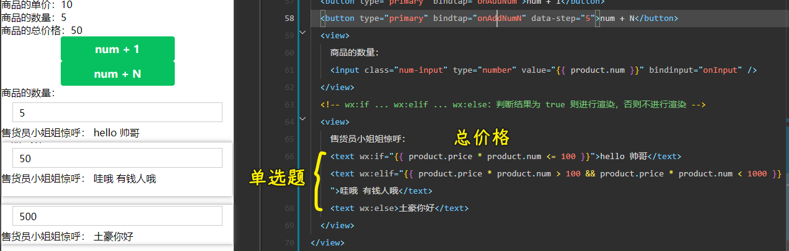
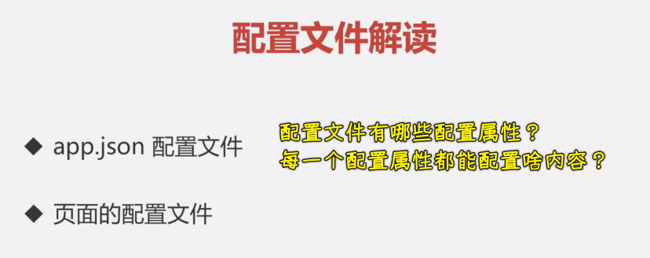
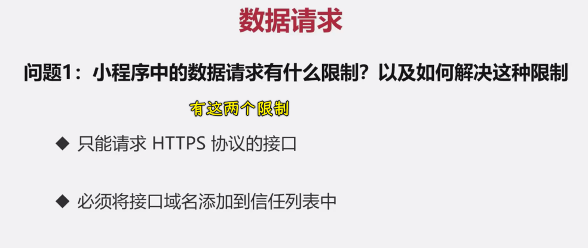
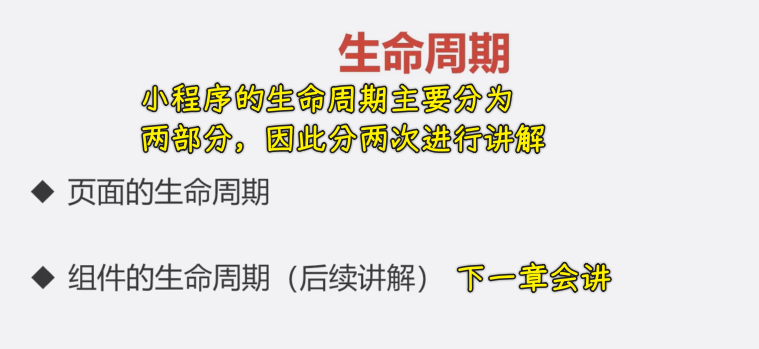
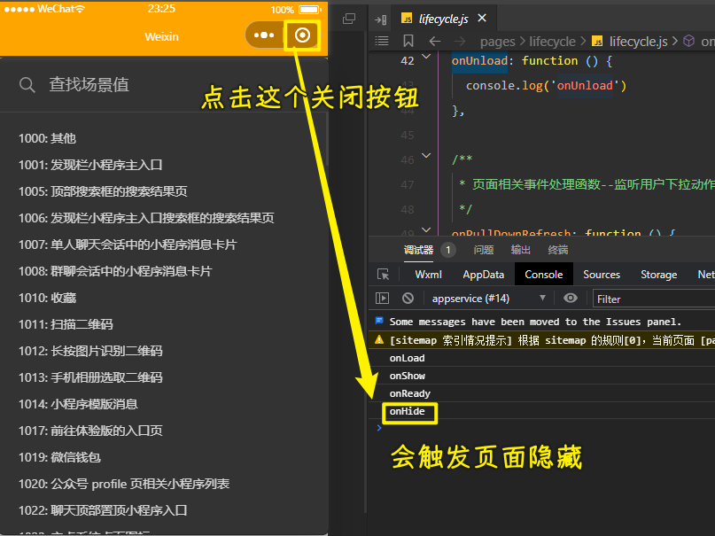
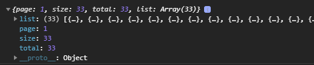
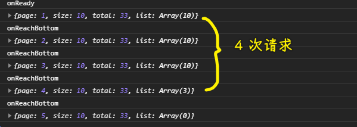
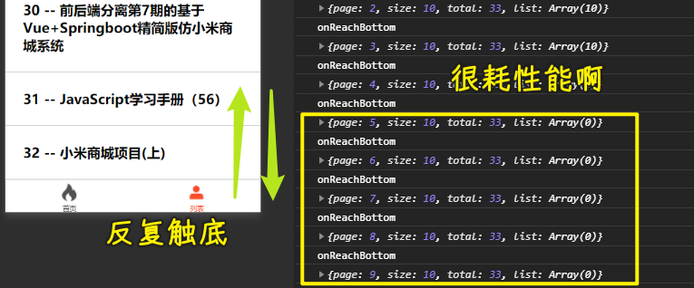

### ✍️ Tangxt ⏳ 2021-12-09 🏷️ 小程序

# 03-小程序核心语法

1）开篇介绍

本章会讲解小程序里边所有的核心语法，主要讲的内容，分成了以下三大块：


- 第一块：数据驱动原则 -> 现阶段前端开发或者大前端开发的一个核心原则之一，无论是小程序，还是三大框架 Vue、React、Angular，它们都秉承了基本的数据驱动原则 -> 这一块必须优先掌握
- 第二块：通过两个案例来串联整个第三章中的所有核心知识点
  - 案例 1：商品案例
  - 案例 2：列表案例

这两个案例都搞懂了，意味着第三章的内容都掌握了

2）小程序的数据驱动原则

> 界面依赖数据，数据变化了，界面响应式的更新

1、问题

> 1. 什么是数据驱动？
> 2. 在小程序中如何完成数据绑定？

2、数据驱动

```js
// 商品
let product = {
  price: 10,
  num: 5
}
// 总价格
let total = 0;
// 计算总价格的方法
function getTotal(product) {
  return product.price * product.num
}
// 计算商品的总价格
total = getTotal(product)
// 进行打印
console.log('总价格：' + total);
// 50 太贵了，所以我们少购买了两个商品，也就是让 num = 3
product.num = 3;
// 问：总价格是多少？
console.log('总价格：' + total); // 此时，打印发现总价格还是 50 元，如果要说原因的话，那么应该很简单，【因为我们没有重新进行价格的计算嘛】
// 但是，此时大家有没有想过一点？我们为什么要进行价格的计算呢？
// ----------------------------------------------------
// 当商品的数量发生变化时，商品的总价格【理应发生变化】，不是吗？
```

上面的例子，就是我想要跟大家说的：【当数量发生变化时，商品的总价格理应发生改变】。

那么同样的道理，在我们的页面中，假如：

> 某一个 DOM 依赖于某个数据进行展示，那么【当数据发生变化时，视图也理应发生变化】。

而这个就是【响应式数据驱动】。

> PS：如果你想要更深入的了解，那么你可以查看这篇博客：[Vue 3 深入响应式原理 - 聊一聊响应式构建的那些经历_慕课手记](https://www.imooc.com/article/320582)

3、小程序中完成响应式

- 在 `data` 中定义数据
  
  
  
- 在 `wxml` 中使用数据
  
  
  

现在我们已经可以在 `js 的 data` 中定义数据，并且在 `wxml 中通过 🟡🟡🟡🟡` 语法使用数据。

那么我们回过头来看我们的问题：

4、答案

> 1. 什么是数据驱动？
>    1. 当数据发生变化时，视图理应发生变化
> 2. 在小程序中如何完成数据绑定？
>    1. 在 `data` 中定义数据
>    2. 在 `wxml` 中通过 `🟡🟡🟡🟡` 使用数据

但是在此时，大家心里应该还有一个疑惑，那就是：【现在数据还没有发生变化呀？我也没有看到视图的变化呀？】。

如果你心中确实有这么一个困惑的话，那么就继续往下看！

3）小程序的常用事件与属性列表

> `product.num`这个`.`是特殊字符，所以需要加`''`

1、问题

> 1. 如何为按钮添加点击事件？
> 2. 如何修改 `data` 中数据的值？

2、处理点击事件

接下来我们希望做一件事情：

> 创建一个按钮
>
> 当用户点击按钮时
>
> 让 `product` 的 `num` + 1

创建按钮的方式非常简单：

``` html
<button type="primary">num + 1</button>
```

问题在于：我们如何给这个按钮添加点击事件呢？

有过开发经验的同学，可能会猜到：我们可以给 `button` 一个 `click` 事件来监听按钮的点击。

可是大家需要知道，现在我们是在【小程序】中，所以如果你想要给 `button` 添加点击事件的话，我们是不可以使用 `click`的，而是使用**`bind:tap / bindtap`**。（推荐使用`bindtap`）

> `bind`是个关键字

其中 `bind: / bind` 表示【绑定事件】，`tap` 为绑定的具体事件。小程序具体事件列表，可以点击 [这里](https://developers.weixin.qq.com/miniprogram/dev/framework/view/wxml/event.html#%E4%BA%8B%E4%BB%B6%E7%9A%84%E4%BD%BF%E7%94%A8%E6%96%B9%E5%BC%8F) 查看。

``` html
<button type="primary" bindtap="onAddNum">num + 1</button>
```

接下来需要在 `js` 中定义对应的 **事件**

```js
/**
* 定义事件处理的方法
*/
{
  onAddNum () {
    console.log('onAddNum')
  }
}
```

到目前：我们已经 **监听了按钮的点击事件，并且写入了对应的处理函数** ，接下来就需要 **修改 `num` 的值**


3、修改 data 的数据：`setData`

想要修改 `data` 中的数据，那么我们需要借助一个函数 `setData`。

`setData` 接收一个对象作为参数，这个对象就是最新的 `data` 数据。

其中 `key` 为要修改的数据， `value` 为当前`key`的最新值

4、访问 data 的数据：`this.data`

因为我们想要让 `num + 1` ，所以我们还需要拿到 `num` 的当前值，想要访问 `num` 的值，可以通过 `this.data.product.num` 的形式访问

所以最终的修改 `num` 的代码为：


此时，当我们点击 `button` ，可以发现：【当 `num` 发生改变时，总价格也发生了对应的变化】

5、答案

> 1. 如何为按钮添加点击事件？
>    1. `bindtap` or `bind:tap`
> 2. 如何修改 data 中数据的值？
>    1. 通过 `this.setData({})` 定义新的值
>    2. 通过 `this.data` 访问具体的值

4）小程序的事件传参

1、问题

> 如果想要在【点击事件中】传递参数，那么需要怎么做？

2、新的需求

现在让我们把需求变得更加复杂一些。

> 我们希望 `onAddNum` 方法可以接收一个参数，每次点击 `num` 增加的数量为传入的参数

那么如果想要实现这个需求的话，那么就需要涉及到一个知识点：【事件传参】。

如果大家有过开发经验的话，那么可能会认为这是一个非常简单的需求，顺便可以写下如下代码：


假如我们真按照以上代码进行实现的话，那么 **你应该会收到以下如下的警告：**


这个警告的意思是：没有一个叫做 `onAddNumN(5)` 的方法用来处理当前的这个 `tap` 事件。

也即是说：`onAddNumN(5)` 会被当做一个 **完整的方法名字**，而不是 方法名为：`onAddNumN`，传入了参数为 `5` ！

那么如果我们想要传递参数，那应该怎么做呢？

> 文档：[事件 - 微信开放文档](https://developers.weixin.qq.com/miniprogram/dev/framework/view/wxml/event.html#dataset)

在小程序中，如果想要给 **点击事件传递参数的话，**那么需要借助 **`event`对象** 和 **`data-`属性** ！

参数的传递包含两个部分：

1. 形参 -> 起到形参功能的就是`event`对象 -> 表示当前函数想要接收到的参数
2. 实参 -> 起到实参功能的就是`data-`属性 -> 表示调用当前函数实际传递的参数

3、形参

首先先来看 **形参**，对于 **点击事件的回调方法** 而言，默认会接收一个参数 **event （事件对象）**。这个 `event` 对象为：**回调方法的唯一参数**

也就是说回调方法只有一个形参，那就是`event`（可简写成`e`）

``` js
{
  onAddNumN (e) {}
}
```

4、实参

对于 **小程序** 中，我们不能直接为 **回调方法传递实参**。

而是需要通过：**属性绑定的形式，把需要传递的参数绑定到 当前 `DOM` 元素中**，绑定数据的属性需要以 `data-` 开头。该属性可以通过 `e.target.dataset` 进行访问。


---

最终实现：


5、答案


5）实现【双向数据绑定】

1、问题

> 1. 什么叫做双向数据绑定？
> 2. 小程序中如何实现双向数据绑定？

2、实现双向数据绑定

上一章节中我们通过【事件传参】实现了【每次点击 + 5】 的功能，但是这样的功能未免还是有些太单调了。

所以我们接下来希望实现一个新的功能：

> 创建一个数字输入框，输入框 与【商品数量】完成 【双向数据绑定】。
>
> 即：
>
> 1. 输入框内容（视图）发生变化时，商品数量（数据）同步跟随变化
> 2. 商品数量（数据）发生变化时，输入框内容（视图）同步跟随变化

那么这样的功能我们应该如何去实现呢？

---

如果想要实现这个功能，那么我们需要先把这个功能进行拆解，【**把一个复杂的功能拆解成多个简单的功能或者说多个可执行的步骤**】是实现一个复杂逻辑的标准方式。

那么如何进行拆解呢？ **大家可以先进行以下思考，然后再继续向下进行学习！**

---

以上功能可拆解成五个步骤，步骤如下：

> 1. 创建一个【数字输入框】
> 2. 设置 【商品数量】 为输入框的初始值
> 3. 监听用户的输入行为
> 4. 获取用户输入的值
> 5. 赋值给【商品数量】

根据这可量化的步骤去实现我们的功能


题外话：查看一个组件文档（想要看看`input`组件给我们提供了哪些能力）


那么现在功能我们已经实现了，那么大家在回忆一下我们的问题：

3、答案

第一个问题：


第二个问题：


6）条件渲染

1、问题

> 1. v-if 和 hidden 的区别是什么？

2、条件渲染

现在你已经买了很多的商品了，可是当你出去结账的时候，售货员小姐姐对你发出了一声惊呼：

> 1. 如果【总价格 <= 100 】：hello 帅哥
> 2. 如果【总价格 > 100 && 总价格 < 1000】：哇哦 有钱人哦
> 3. 如果【总价格 >= 1000】：土豪 你好

如果想要实现这么一个功能的话，那么就需要使用【条件渲染】的功能了。

小程序中提供了两个 API 都可以实现【条件渲染】的功能：

1. `wx:if ... wx:elif ... wx:else`
2. `hidden`

那么下面我们就分别用这两个语法来实现一下这个功能：

第一个：



第二个：


3、v-if vs hidden

> 有 Vue 开发经验，可以理解为 `v-if`（销毁、重建） vs `v-show`（`display`控制）

1. 当`wx:if`条件满足则进行渲染，否则不渲染
2. 当`hidden`条件满足则隐藏，否则不隐藏

那我们应该在什么情况下使用`wx:if`，使用`hidden`呢？

一般来说，`wx:if` 有更高的切换消耗而 `hidden` 有更高的初始渲染消耗。因此，如果需要频繁切换的情景下，用 `hidden` 是更好，如果在运行时条件不大可能改变，用 `wx:if` 是更好的。


所以，针对当前业务，使用 `hidden` 是更好的选择！

4、答案


➹：[前端答疑 - v-if 重新渲染导致的 Bug - SegmentFault 思否](https://segmentfault.com/a/1190000022525432)

7）列表渲染

1、什么是列表渲染？


2、问题

> 1. 使用 `wx:for` 时，当前项的【下标变量名】和【当前项变量名】默认分别是什么？
> 2. `block` 组件是否会被渲染？

`block`组件在循环列表里边起到了啥作用？

3、新的需求

> 如果我们有一组商品，并且希望把这组商品全部渲染出来的话，那么就需要使用到【列表渲染】的功能。

小程序中为我们提供了 `v-for` 指令，让我们进行【列表渲染】的实现。

同时也为我们提供了一个：**包裹性质的容器 `block` 组件**，当我们去循环多个元素时，可以使用 `block` 进行包裹，`block` 组件只起到包裹其他组件的作用，本身并不会进行渲染。

定义一组数据：


渲染这组数据：


渲染出来的结构：


对于列表循环渲染，我们需要重点掌握的内容是：

1. 循环渲染的基本语法，即`wx:for`的语法
2. `block`组件的作用
3. 循环渲染的逻辑，即循环渲染`block`里边的元素 -> 有 5 条数据，就渲染 5 个`view`，有 10 条数据，就渲染出 10 个`view`

4、答案

> 1. 使用 `wx:for` 时，当前项的【下标变量名】和【当前项变量名】默认分别是什么？
>    1. 默认数组的当前项的下标变量名默认为 `index`
>    2. 数组当前项的变量名默认为 `item`
> 2. `block` 组件是否会被渲染？
>    1. `block` 只是一个包裹性质的容器，不会被解析渲染。

8）配置文件解读

> 第一个商品案例，已经搞定了，接下来就是第二个案例——列表案例

我们之前了解过配置文件，但是这些配置文件都有啥属性呢？以及每一个配置属性都能配置啥内容呢？



文档：

1. `app.json` 配置文件：<https://developers.weixin.qq.com/miniprogram/dev/reference/configuration/app.html>
   1. `pages` 数组：<https://developers.weixin.qq.com/miniprogram/dev/reference/configuration/app.html#pages>
      1. 创建 `list` 页面
   2. `window` 对象：<https://developers.weixin.qq.com/miniprogram/dev/reference/configuration/app.html#window>
   3. `tabbar` 对象：<https://developers.weixin.qq.com/miniprogram/dev/reference/configuration/app.html#tabBar>
      1. `index` 页面
      2. `list` 页面
2. `页面。json` 配置文件：<https://developers.weixin.qq.com/miniprogram/dev/reference/configuration/page.html>

1、全局配置（app.json 配置文件）

该配置文件里边有很多属性 -> 挑选其中三个重点属性来进行重点讲解


💡：`pages`

> 用于指定小程序由哪些页面组成，每一项都对应一个页面的 路径（含文件名） 信息。文件名不需要写文件后缀，框架会自动去寻找对应位置的 `.json`, `.js`, `.wxml`, `.wxss` 四个文件进行处理。

我们想要创建一个新页面 -> 有两种方式可以注册页面

第一种：

1. 创建一个承载页面的文件夹
2. 创建页面


第二种：

这种方式相对来说就比较简单了，我们直接修改`app.json`里边的这个`pages`节点的内容即可


---

这种两种创建页面的方式都行，推荐使用第二种，因为省事儿！

💡：`window`

`window`描述的是「全局的默认窗口表现」 -> 用于设置小程序的状态栏、导航条、标题、窗口背景色。

话说，啥叫「导航条、标题」？


`navigationBar`这块：


`background`这块：

> 页面有下拉功能才会看到背景色


💡：`tabBar`


`tabBar`：底部 `tab` 栏的表现

> 如果小程序是一个多 tab 应用（客户端窗口的底部或顶部有 tab 栏可以切换页面），可以通过 tabBar 配置项指定 tab 栏的表现，以及 tab 切换时显示的对应页面。


至少有两个`tab`才会有效果 -> 最多 5 个 `tab`


2、页面配置

> 每一个小程序页面也可以使用 `.json` 文件来对本页面的窗口表现进行配置。页面中配置项在当前页面会覆盖 `app.json` 的 `window` 中相同的配置项。文件内容为一个 JSON 对象

与全局配置有重复的属性 -> 主要是`window`这块


9）数据请求

1、场景

先去试想一个场景，现在你是【慕课网的前端开发工程师】，然后你开发了这样的一个【小程序】


现在系统已经上线了。

有一天，你想要修改里面的一块数据，比如：把【C 语言系统化精讲】改成【C 语言精讲】，那么你应该怎么做？

记住，现在你的项目已经发布上线了！你想要修改线上版本的内容，那么你怎么做呢？难道要为了修改这个文字发布一个新的版本吗？如果以后再有了类似的文字修改呢？

那么此时面对这样的场景，我们就需要使用到【数据请求】了。

2、问题


3、wx.request

[wx.request](https://developers.weixin.qq.com/miniprogram/dev/api/network/request/wx.request.html) 发起 HTTPS 网络请求，请求的方式主要分为两种：

1. get 请求
2. post 请求

这里准备了两个数据请求接口，可以用来测试 [wx.request](https://developers.weixin.qq.com/miniprogram/dev/api/network/request/wx.request.html) 的数据请求（详见接口文档）：

1. `/api/test/getList`
2. `/api/test/postData`

那么接下来我们就根据 [wx.request](https://developers.weixin.qq.com/miniprogram/dev/api/network/request/wx.request.html) 来完成一个基本的接口请求

💡：演示 `get` 请求


这个代码看起来没有任何问题，但是我们却得到了一个错误，而要解决这个报错问题，我们就需要明确一个问题：**小程序中的数据请求有什么限制？**

1. 只能请求 `HTTPS` 类型的接口
2. 必须将接口的域名添加到信任列表中

**解决方案：**

1. 生产环境（兼容开发环境）：将想要请求的域名协议【更改为 HTTPS】并【添加到域名信任列表】
2. 开发环境：通过勾选「不校验合法域名……」
  
   
  

再次测试：

对于开发环境的设置：


对于生产环境的设置：


> 注意：一定要使用配置了合法域名的 APPID，如果你用的是测试 ID，显然是不生效的！

💡：演示 `post` 请求


效果：


---

至此，我们通过`wx.request`发起了一个`get`请求和一个`post`请求，对于这一小节，我们需要理解：

- `wx.request`方法的作用
- 小程序中关于请求的限制，已经对于这个限制的解决方案


4、题外话（扩展内容：针对有 web 前端开发经验的同学）

1. **跨域问题：** 跨域问题主要针对 **浏览器** 而言，而小程序宿主环境为【微信小程序客户端】，所以小程序中不存在【跨域问题】
2. **`ajax` 请求：** `ajax` 请求主要依赖于浏览器给我们提供的 `XMLHttpRequest` 对象，而小程序的宿主环境是【微信小程序客户端】，它是没有`XMLHttpRequest`对象的，所以小程序中的【网络请求】**不是** `ajax` 请求

总之，小程序里边的网络请求和`ajax`请求没有半毛钱关系

5、答案

问题 1：




问题 2：


问题 3：


---

这一节我们学习的是小程序中关于数据请求的一个概念

10）异步编程新方案 - Promise

1、场景

首先先去假设一个场景：

> 目前有一个需求，需要你按照以下的逻辑去进行接口请求：
>
> 1. 先去请求接口 A
> 2. 在接口 A 获取到数据之后，再去请求接口 B
> 3. 在接口 B 获取到数据之后，再去请求接口 C
> 4. 在接口 C 获取到数据之后，再去请求接口 D

如果按照上一小节学习到的内容，那么我们会得到以下的代码：


对于这个功能，我们实现了，但是在一些大厂里边我们实现功能是我们的本职需求 -> 实现出这个功能没有任何值得骄傲的地方

在现在这个 **颜值即正义** 的世界里面，我们这样的代码结构应该是 **没有前途的**（领导看到这个代码结构，会毫不犹豫地把它们删掉了）。 因为它太丑了，并且太难以阅读了。

假想一下，如果我们要请求 10 个接口的话，那么这代码会变成什么样子呢？

所以在编程圈里对这样的代码有一个非常学术的名字：**回调地狱** -> 回调函数的大量嵌套导致出现 **复杂且难以阅读** 的逻辑

对于这个回调地狱代码，我们在日常工作中是绝对不能出现的！

所以，问题来了 -> 既然不能写回调地狱这种代码，那么我们该用什么方式去实现我们的需求呢？

2、问题

> 1. promise 是如何解决回调地狱的问题呢？
> 2. Promise 的状态分为几种，分别是什么？
> 3. 如何让 Promise 变成 **已兑现**（fulfilled）的状态，如何接收已兑现（fulfilled）状态的结果

3、内容

> 点击 [Promise](https://developer.mozilla.org/zh-CN/docs/Web/JavaScript/Reference/Global_Objects/Promise) 进入官方文档

使用 Promise 进行定义接口：

Promise 对象用于表示一个异步操作的最终完成 （或失败）及其结果值。

它是一个构造函数，所以我们可以通过 `new` 关键字来构建 Promise 的实例。
 
在 Promise 中，分为了三种状态：

1. 待定（pending）: 初始状态，既没有被兑现，也没有被拒绝。
2. 已兑现（fulfilled）: 意味着操作成功完成。
3. 已拒绝（rejected）: 意味着操作失败。

代码（保证跟原来的代码处理逻辑一样）：


给 Promise 构造函数传入一个回调函数，该回调函数接收两个状态，第一个是`resolve`回调函数，当`resolve`被调用时，我们可以标记 Promise 执行成功了，也就是这个承诺已兑现了，反之，当`reject`被调用，那就是执行失败，Promise 实例进入一个拒绝的状态！

在`resolve`或`reject`还都没有去调用之前，我们的 Promise 实例处于一个待定状态！

同理，其它`B`、`C`、`D`函数也是如此……

💡：使用 Promise 实例


我们可以简写成「链式调用」：


至此，我们就完成了我们最初的那个需求了

**Promise 与 回调地狱的结果代码对比截图**


4、答案

问题 1：


问题 2：


问题 3：


或许看到这里之后，可能还会有很多同学 **充满疑惑**， 比如“ 我并不感觉 `promise` 的这种方式更加简单呀？ ”，如果你确实有这样的 **疑问** 的话，那么你应该相信这样的疑问在之前也被人提出过。

那么这个问题是怎么解决的呢？请看下一节 **异步编程再升级 - async + await**

11）异步编程再升级-async 和 await

1、场景

`Promise` 的方案解决了 **回调地狱** 的问题，但是 `Promise` 又带来了新的问题，那就是：**大量的链式调用，让我们的代码变得又臭又长！**

我们回过头看一下 `promise` 和 **回调地狱** 两种方案的代码对比：


可以发现：**回调地狱 `12` 行的代码**，在 `promise` 中足足花了 `16` 行才解决，代码量足足多了 `30%`。

这种 **“退步”** 是绝对不可以被接受的。那么针对这么一种情况，我们就需要使用到两个新的关键字 `async + await`。

2、问题

> 1. `async` 和 `await` 的作用是什么？
> 2. 使用 `await` 的注意事项是什么？

明确这两个问题后，我们就来就解决 Promise 给我们所带来的问题！

3、内容

> 点击 [async](https://developer.mozilla.org/zh-CN/docs/Web/JavaScript/Reference/Statements/async_function)  + [await](https://developer.mozilla.org/zh-CN/docs/Web/JavaScript/Reference/Operators/await) 进入官方文档

先来明确一下`async`和`await`的作用

- `async+await` 必须配合 `promise`（这就是先讲`promise`的原因） 使用，同时`async`和`await`必须一起使用
- `async+await` 可以简化 `promise` 的异步操作，把`promise`的异步操作变成「同步写法」

话说，什么是「同步写法」呢？

这就是同步写法：

``` js
console.log(1)
console.log(2)
console.log(3)
```

`async`和`await`的作用：

- `async`：标记一个函数为异步函数
- `await`：标记当前操作为异步操作，`await` 关键字只能使用在被「`async` 标记的函数中」

代码：


**三种实现方案截图对比：**


`async+await`就是我们现阶段处理异步编程的终极解决方案

4、答案

> 1. `async` 和 `await` 的作用是什么？
>    1. `async` 和 `await` 可以简化  `promise` 操作
>    2. 使 `promise` 的异步操作拥有 **同步写法**
> 2. 使用 `await` 的注意事项是什么？
>    1. `await` 必须在被 `async` 标记的异步函数中使用

👇：在小程序中，使用`async+await`解决数据请求回调的问题

12）小程序使用 promise 解决异步编程

1、场景

回过头来来看【小程序的代码】，同时回顾一下之前我们解决过的需求：

> 目前有一个需求，需要你按照以下的逻辑去进行接口请求：
>
> 1. 先去请求接口 A
> 2. 在接口 A 获取到数据之后，再去请求接口 B
> 3. 在接口 B 获取到数据之后，再去请求接口 C
> 4. 在接口 C 获取到数据之后，再去请求接口 D

这是我们在学习 `promise` 时所列举的场景，那么这个场景同样适用于【小程序】中的【网络请求场景】。如果我们通过 `wx.request` 实现以上需求的话，那么会得到如下代码：


可以看到这是一个又臭又长的代码……

那么接下来我们需要做的就很简单了，我们要 **使用 async 和 await** 简化以上操作。

2、问题

> 1. 如何使 `wx.request` 配合 `async` 和 `await` 使用？

3、内容

> 不写`method`，默认就是`GET`请求

我们的目标是：

使用`async+await`完成需求：

> 1. 先去请求接口 A
> 2. 在接口 A 获取到数据之后，再去请求接口 B
> 3. 在接口 B 获取到数据之后，再去请求接口 C
> 4. 在接口 C 获取到数据之后，再去请求接口 D

如果要达到我们的目标，那么我们需要分成两步来去操作：

1. 获取到 `promise` 实例对象
2. 使用 `async` 和 `await` 简化 `promise` 的操作

💡：获取到 `promise` 实例对象

因为小程序中的 `wx.request` 不支持 `promise` 化，所以我们需要：**使用 `promise` 封装 `wx.request` 请求**


💡：使用`async+await`简化`promise`操作


---


点击按钮，发起请求，结果控制台抛出了一个错误 -> 错误原因：小程序默认不支持`async+await`

如何解决这个错误？ -> 点开「详情」 -> 「不要勾选 ES6 转 ES5」（我这里是「JS 转 ES5」）

再次点击按钮，发起请求：


4、问题


注意：不要勾选「ES6 转 ES5」

13）小程序页面的生命周期

到现在为止我们已经学习了非常多的小程序核心知识点，那么接下来我们就需要去实现一个小的案例了，也就是我们开头说到的第二个案例！

1、需求

那么接下来我们就先去实现这个案例的第一个功能：

> 我们希望 **页面出现之后，可以直接获取接口数据，并进行渲染**

对于这样的一个简单需求，根据我们现在所学到的知识是：**没有办法实现的**。 -> 我们之前都是通过点击一个按钮，然后执行事件处理函数，然后发起请求获取接口数据

如果想要实现这个功能，就需要掌握 **页面的生命周期**

2、问题

> 1. 什么是生命周期？什么是生命周期函数？
> 2. `onReady`  的调用时机是什么？

3、内容

💡：什么是生命周期？

对于「生命周期」这个概念，如果你有过开发经验，那么你显然对它并不感到陌生

小程序里边关于「生命周期」这个概念，跟 Vue、React、Angular 这种框架里边所提到的「生命周期」概念，没有什么本质上的区别

所以，小程序里边的「生命周期」到底是什么呢？

想要学习【小程序】的生命周期，那么我们必须要先搞清楚，什么是【生命周期】

所谓 **生命周期** 就是：一件事物由 **创建** 到 **销毁** 的全部过程。

如一个人由出生到死亡的全部过程，我们就可以认为是这个人的生命周期 -> 在这个人所活的一生之中，可能会有很多重要的时刻，比如考上大学、结婚、生子 -> 每一个重要时刻就是这个生命周期的函数


> 在这个过程中会有很多 **” 关键的时刻 “**，这些关键的时刻就是 **生命周期函数**

生命周期函数它表示的是生命周期中的一些「关键的时刻」

而在小程序之中，它的生命周期概念也是如此！

在【小程序】中，其生命周期主要分为两部分：

1. **页面的生命周期**（本章节内容）
2. **组件的生命周期**（后续章节讲解）



💡：页面的生命周期

创建一个新页面`lifecycle`，在新创建的页面中，我们可以发现在 `js` 文件中已经默认生成了很多的代码：

``` js
// pages/lifecycle/lifecycle.js
Page({

  /**
   * 页面的初始数据
   */
  data: {

  },

  /**
   * 生命周期函数--监听页面加载
   */
  onLoad: function (options) {
    console.log('onLoad')
  },

  /**
   * 生命周期函数--监听页面初次渲染完成
   */
  onReady: function () {
    console.log('onReady')
  },

  /**
   * 生命周期函数--监听页面显示
   */
  onShow: function () {
    console.log('onShow')
  },

  /**
   * 生命周期函数--监听页面隐藏
   */
  onHide: function () {
    console.log('onHide')
  },

  /**
   * 生命周期函数--监听页面卸载
   */
  onUnload: function () {
    console.log('onUnload')
  },

  /**
   * 页面相关事件处理函数--监听用户下拉动作
   */
  onPullDownRefresh: function () {

  },

  /**
   * 页面上拉触底事件的处理函数
   */
  onReachBottom: function () {

  },

  /**
   * 用户点击右上角分享
   */
  onShareAppMessage: function () {

  }
})
```

在这些代码中，我们重点关注 **生命周期函数--xxx** 相关的内容。

这 5 个函数，就是 【小程序中的生命周期函数】，我们把鼠标放入到【函数上】，那么【小程序开发工具】会提示出对应的【函数解释】。

💡：默认启动页面设置


默认是普通编译模式，但是我们可以自定义编译模式！这样一来，我们就不用每次在重新编译后，再重新点击 list tab 切换到列表页了！

---


这三个生命周期函数是我们页面从无到有的一个生命周期的执行顺序

除了这两个以外，还有两个：

- `onHide`：监听页面隐藏
- `onUnload`：监听页面卸载

如何触发页面隐藏？



如何触发页面卸载？

目前，我们没办法执行这个`onUnload`函数，因为`redirectTo`和`navigateBack`，我们还未学到！


话说，这个页面里的生命周期函数我们全部都需要掌握吗？

**这些生命周期函数不需要全部掌握**，对于小程序中的页面生命周期函数而言，我们只需要着重掌握其中两个就可以：

1. `onLoad`：最先被调用，可以用来【接收别的页面传递过来的数据】。在后面的【页面跳转（传参）】中会再去进行讲解。
2. `onReady`：页面初次渲染完成后调用。我们可以 **在这里从服务端获取数据** 

那么知道了这个之后，回到我们最初的需求上，我们希望 **页面出现之后，可以获取接口数据，并进行渲染**。 那么怎么去进行实现呢？

很简单！**只需要在 `onReady` 中调用获取接口数据的方法就可以了**。

那么现在 **我们已经在页面出现之后，获取到了接口的数据**：




所以接下来我们只需要根据数据完成页面的渲染就可以了

循环渲染列表数据：

1. 声明一个`listData`，把请求得到的数据赋值给它
2. 在`wxml`里边，通过`wx:for`循环渲染这个列表数据

因为数据比较多了，有 33 条，所以我们用了`scroll-view(scroll-y)`包裹一下它

第一步：


第二步：


4、答案

问题 1：


问题 2：


---

至此，我们已经完成了小程序中页面生命周期的学习，也实现了我们的第一个需求

14）PullToRefresh 下拉刷新与上拉加载

1、场景

目前，我们已经实现了 **列表页面的一个最基础的一个渲染**，但是这样还是远远不够的。

因为在我们最终的成型项目中， **数据列表是需要分页进行展示的**。

所谓分页就是：**当列表中数据过多时，一次性加载所有的数据回导致请求过慢，所以前端就会通过分页来加载数据。** -> 在开发中，如果你遇到了一个列表之中数据量非常大的情况，那么你就可以考虑进行分页请求了

这种分页的方式在移动端项目上都有大量的体现，比如 【今日头条】、【淘宝】、【微信的聊天记录】等等很多。 -> 几乎所有的应用都会实现「分页」这么一个需求


那么如果我们想要在当前项目中实现【分页请求】功能，就需要借助【下拉刷新与上拉加载】的功能，也就是 `pullToRefresh`

2、问题


👇：实现上拉加载和下拉刷新 -> 说白了就是实现分页请求

3、内容

整个【分页加载】分为两个部分：

1. 上拉加载
2. 下拉刷新

这两部分需要分别来进行处理，首先我们先来看【上拉加载】

💡：上拉加载

在 【小程序】中，默认已经实现了【上拉加载】的功能，可以直接通过监听 `onReachBottom` 函数，来监听：**页面上拉触底事件**。当页面滑动到底部时，会触发 `onReachBottom` 函数。


既然我们已经知道了这个`onReachBottom`函数的调用时机，那么我们就可以通过它来实现我们的「上拉加载」功能了！

如何实现？

1. 对当前数据进行分页 -> 提供的这个接口默认支持分页操作 -> `page`表示当前页数，`size`表示每页有多少条数据（也就是数据量） -> 假设有 100 条数据，第一页就是有 10 条数据，第二页也是 10 条数据……
2. 修改原先的请求代码 -> 这一次需要带参数了 -> 添加一个`data`属性即可
3. `onReachBottom`的处理，也就是「上拉加载」的实现：
   1. 修改`page`
   2. 获取最新数据
   3. 新获取到的数据补充到现有数据的后面

---

在【用户上拉】时，我们希望获取【下一页】的数据，所以我们需要对当前的数据进行分页：


然后【当页面进入时】，我们获取第一页的数据，所以我们需要对代码进行一下修改：


> `https://api.imooc-blog.lgdsunday.club/api/test/getList?page=1&size=10`

效果：


然后在【上拉操作】时，持续进行后续的数据请求：


效果：



目前这个代码是问题的，比如，我们已经拉到底了，又往下滑，也就是页面往上走，然后我们又拉到底，这样往返几次的话，`onReachBottom`也会不停地触发：



这种操作显然是不对的 -> 因为这是平白无故的浪费我们服务器的性能

所以，如何解决这样一个问题呢？

新的需求：

> 当已经没有新数据之后，就不要再发起数据请求了，而且还要给用户一个提示 -> 说白了，也就是判断是否已经没有新数据了

接口给我们提供了一个`total`数据，我们利用这个`total`来判断


样式和结构：


效果：


那么到目前，我们已经完成了【上拉加载】的操作，但是我们知道，我们还缺少一个【下拉刷新】的操作！

💡：下拉刷新

想要在【小程序】中实现【下拉刷新】？这不同于上拉加载，这需要**首先开启**【下拉刷新】：

``` json
{
  "usingComponents": {},
  "backgroundColor": "#cccccc",
  "enablePullDownRefresh": true
}
```

当我们开启了【下拉刷新】之后，我们就可以去监听 `onPullDownRefresh` 函数，这个函数会在：**用户下拉刷新时进行回调**


在此回调中，我们需要进行的操作就非常简单了，我们只需要：**重置页数，获取最新的数据，使用新数据覆盖旧数据（也就是重置数据源），关闭下拉动画（在真机中，下拉刷新的动作是不会自动关闭的）** 就可以了：

> 明确步骤后（上边的高亮就是步骤），才去实现功能


> 微信朋友圈 -> 页面顶部是最新数据，下拉加载一下，相当于刷新页面了

4、答案

> 1. 如何开启下拉刷新
>    1. 对 **页面对应的 `json` 文件** 中通过 `"enablePullDownRefresh": true` 开启
> 2. 在 `onPullDownRefresh` 中，一般进行什么操作 -> 在下拉刷新事件的回调处理函数中，一般我们会：
>    1. 重置页数
>    2. 重置数据源
>    3. 关闭下拉动画
> 3. 在 `onReachBottom` 中，一般进行什么操作 -> 在上拉加载事件的回调处理函数中，一般我们会：
>    1. 判断数据是否已经加载完成
>    2. 自增页数
>    3. 累加数据

以上就是关于「PullToRefresh」的所有操作了！

> [stackjie/vue-pull-to: ⚡️  A pull-down refresh and pull-up load more and infinite scroll component for Vue.js --Vue 下拉刷新组件](https://github.com/stackjie/vue-pull-to)

15）小程序的页面跳转


