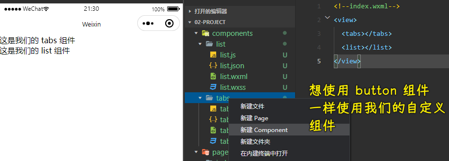
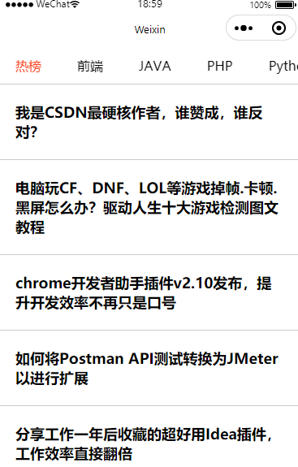

### ✍️ Tangxt ⏳ 2021-12-12 🏷️ 小程序

# 04-小程序进阶概念

1）开篇

在上一大章中我们讲解了 **小程序的核心概念**，那么这一章节我们来讲解 **小程序的进阶概念。**

在本章节中我们将会通过一个 **案例** 来贯穿整个进阶内容的知识。


这个案例看起来似乎很简单，但麻雀虽小，五脏俱全！

同样一个功能可能会有很多不同的一个做法 -> 对于这个案例，我们会通过我们之前没有接触过的小程序知识来实现这样一个功能，其中包括组件化思想、数据监听器、组件的关系和通信、组件中插槽的使用……

2）什么是组件化思想

想要理解小程序中这个「组件」概念 -> 你首先得搞明白一件事，那就是「什么是组件化思想」

一个声明：

**对于组件化思想，如果你没有实际的开发经验的话，那么你可能很难立刻理解它。**

**不过没有关系！**

**随着你对课程的逐渐深入学习，我们会一直为大家灌输组件化思想的概念！**

> 后边用 uni-app 写那个项目的时候，会反复灌输这个「组件化思想」，如果你此刻不能理解，那这也没有关系，随着你接触到越来越多的场景，你就会越来越明白啥是组件化思想了！

---

想要搞明白什么是组件，那么就必须要先搞清楚，组件解决了什么样的问题！ **所有的技术都是因为解决了一个或多个问题，才有存在的价值！**

1、场景


以上的两张截图是【饿了么小程序】中的数据截图，两个截图来自两个不同的页面。

但是我们可以发现：虽然他们来自于不同页面，但是其中店铺的 `item` 项的结构非常类似。

那么我们现在假象一种场景：

> 现在你在【饿了么】工作，现在你领导让你去完成这两个页面，那你怎么做？
>
> 你会创建两个页面，然后在一个页面中用 `wx:for` 指令，创建一堆 `item` 的 `dom 结构` 然后再去渲染它们的 `wxss`。
>
> 然后在到另外一个页面里面，重复这一系列的操作吗？

如果你是这么做的话？那么我打赌你在【饿了么】待不了 3 天。原因就是因为：**你的代码太冗余了！**，换句话来说就是：**不可维护，不可扩展！**

对于我们软件工程师来说，一般情况下，我们会去遵循 **所有可重复的代码，都是可以封装的！** 

这里的封装放到我们当前这个场景下，指的就是 **组件化** 封装。

明确了我们为啥要进行组件化封装之后，接下来我们就来看一下什么是组件化

2、内容

我们可以把【整个项目】比喻成一个 **乐高积木**：


那么，对于当前这个项目之中，【每个组件】都可以认为是【其中一块小的积木】（当前一个积木中的一个一个的小零件），这些小的积木可以在当前的项目中使用，也可以直接拿走放到另外的项目中使用。

一个大的项目，由多个小的组件组成，每一个组件都封装了单独的【结构】、【样式】和【行为】。

这就是现在的组件化思想。

> 图中的的 6 个小积木人，是用来插入到那个大积木里边去的，这些小积木人（有不同的颜色和结构，还有不同的行为）就是组件，如果你有其他大积木，那么你可以把这些小积木人插入到其他大积木里边去

如果之前大家有过 `vue、react、angular` 的开发经验的话，那么应该很好理解 **组件化** 指的是什么意思。

如果大家之前只有过 `html + css + js` 的开发经验的话，那么可以把组件理解为：**是一个包含了【结构】和【样式】的模块。**

最后不要忽略，本小节开头的话：


3）创建第一个组件

1、场景

> 指的是业务场景，简单来说就是「需求」

就像在【开篇】中说到的，**我们会开发一个【案例】，来贯穿整个第四章的内容。**

那么下面我们就来去实现这个案例：

> 对于这个案例，我们把它拆成两个部分：
>
> 1. 顶部的 tabs 
> 2. 底部的 list
>
> 这两个部分，将分别通过两个组件来进行开发 -> 而且这两个组件会产生一定的交互

所以，我们接下来要做的第一件事情，就是【创建这两个组件，并在页面中使用它们】，而这个也就是本小节的主要内容

2、问题

> 1. 组件应该被放入到哪个文件夹中？
> 2. 如何在页面中使用【自定义组件】？

3、内容

1. 创建组件
   1. 创建 `components` 文件夹
   2. 创建 `tabs` 和 `list` 文件夹 -> 用来承载组件的文件夹
   3. 右键 **新建 `Component`** -> 组件的结构几乎和页面一模一样，都是 4 个文件
2. 使用组件
   1. 找到页面的 `.json` 文件 -> 哪个页面需要用到组件？
   2. 在 `usingComponents` 选项下 **注册组件**
      1. `key` 为当前组件在该页面中的标签名
      2. `value` 为组件的代码路径 -> 绝对路径
   3. 在页面的 `wxml` 文件中，以 **注册的 `key`** 为标签名，使用组件

注册组件：


使用组件：



4、答案

> 1. 组件应该被放入到哪个文件夹中？
>    1. `components`
> 2. 如何在页面中使用【自定义组件】？
>    1. 在页面的 `.json` 文件中，通过 `usingComponents` 进行注册
>    2. 注册完后，在 `wxml` 文件中，以注册的 `key`  为 **标签名** 进行使用

以上就是我们「创建第一个组件」所对应的内容了

4）组件的生命周期

> 构建这两个组件的代码 -> 先处理 `tabs` 里边的相关操作 -> `tabs`组件被渲染出来之后，可以获取到对应的数据，并且把这个结构给渲染出来

1、场景

接下来我们希望在 `tabs` 组件被渲染之后，获取 `tabs` 的数据，并且进行渲染。

参考下，上一大章中的 `列表案例` -> 上一章是在页面里边完成，这一次我们要在组件里边完成

要完成这个功能，我们就必须要有一个 **前置条件：**

那就是：**明确组件的生命周期函数，明确在什么时候去获取接口数据** 

2、问题

之前，我们说到小程序里边的生命周期主要分成了两个部分，第一个是页面的生命周期，第二个则是组件的生命周期

> 1. 组件的 **生命周期** 和 **方法** 分别应该被放入到哪个节点下？
> 2. `created` 函数中可以调用 `setData` 吗？
> 3. 获取数据的操作应该在哪个函数中进行？

3、内容

💡：前置知识

**组件** 的生命周期应该被定义在 `lifetimes` 中，而方法必须要放入到 `methods` 中。 -> 这跟页面有非常大的不同，在页面里边我们直接写在`Page({})`的选项对象里边就好了

组件的生命周期一共有三个：

1. `created` ： 组件实例刚刚被创建好。**此时还不能调用 `setData`** -> 用的很少，因为无法调用`setData`，不要跟 Vue 的`created`给混淆了
2. `attached`：组件完全初始化完毕、进入页面节点树后才进行调用。**绝大多数初始化工作可以在这个时机进行** -> 用的最多
3. `detached`：在组件离开页面节点树后才进行调用

💡：实现需求

步骤：

1. 定位到组件的`js`文件，在`Component({})`的`{}`里边添加一个`lifetimes`属性，它是一个列表对象，在这里对象里边添加生命周期函数`attached`
2. 在`methods`里边添加`loadTabsData`方法，用来发送请求获取数据 -> 把获取到的数据赋值给`data`旗下的`listData`
3. 根据`listData`渲染视图 -> 添加相应样式 -> 处理默认选中 -> 添加一个`active`数据

代码：

`tabs.js`：

``` js
// components/tabs/tabs.js
Component({
  /**
   * 组件的属性列表
   */
  properties: {

  },

  /**
   * 组件的初始数据
   */
  data: {
    // 数据源
    listData: [],
    // 选中项
    active: -1
  },

  /**
   * 组件的方法列表（组件中的方法必须定义到 methods 中）
   */
  methods: {
    /**
     * 获取数据的方法
     */
    loadTabsData() {
      wx.request({
        url: 'https://api.imooc-blog.lgdsunday.club/api/hot/tabs',
        success: (res) => {
          console.log(res)
          this.setData({
            listData: res.data.data.list,
            active: 0
          })
        }
      })
    }
  },
  /**
   * 生命周期函数
   */
  lifetimes: {
    attached() {
      this.loadTabsData()
    }
  }
})
```

请求结果：


渲染情况：


4、答案

> 1. 组件的 **生命周期** 和 **方法** 分别应该被放入到哪个节点下？
>    1. 生命周期应该被定义在 `lifetimes` 这个选项中
>    2. 方法必须要放入到 `methods` 这个节点中
> 2. `created` 函数中可以调用 `setData` 吗？
>    1. 不可以
> 3. 获取数据的操作应该在哪个函数中进行？ -> 主要有 3 个生命周期函数
>    1. `attached` -> 我们的大部分操作一般都这个函数中进行

5）数据监听器

1、场景

通过 **接口文档** 我们可以看出，如果想要获取 `list` 那么我们需要传递一个 `type` 的参数，而这个 `type` 就是用户选中的 `tab 项` 的 `id`

所以接下来我们就需要来做一件事情：**监听用户选中的 `tab`，根据用户选中的 `tab` 来切换底部 `list` 的数据**

明确对应的场景之后，就可以来看一下对应的问题了！

2、问题

> 1. 小程序中通过哪个选项来声明数据监听器？
> 2. 数据监听器的使用场景是什么？ -> 这个答案需要自己总结出来

3、内容

目标：**监听用户选中的 `tab`，根据用户选中的 `tab` 来切换底部 `list` 的数据**

有了这个目标后，我们接下来该怎么去完成这对应的一件事情呢？

我们之前说过：

当我们面临一个复杂的需求时，我们需要把这个 **复杂的需求，拆解为几个可执行的步骤**

大家看到这里，可以先思考一下，我们如何拆解以上需求。..

> 注意：这是一个「可具体执行」的步骤

----

步骤拆解如下：

> 1. 监听用户选中项的变化
> 2. 获取用户选中的数据的 `id`
> 3. 把 `id` 传递给 `list` 组件
> 4. `list` 组件根据接收到的 `id` 获取对应的数据

以上步骤就是根据目标所拆解出的这么四步需求！

💡：实现这四步需求

1. 点击事件 -> 传参
2. 修改选中项 -> 也就是点谁谁高亮
3. 监听选中项的变化 -> 也就是`active`的变化 -> `observers` -> 拿到用户选中的数据`id`


效果：


4、答案

> 1. 小程序中通过哪个选项来声明数据监听器
>    1. `observers`
> 2. 数据监听器的使用场景是什么？（需要同学自己思考）
>    1. 有一天你需要监听数据的变化
>    2. 并且在数据变化之后，进行一些操作的时候

到目前，我们已经实现了需求的前两步，那么后面的两步怎么做呢？

请查看我们下一节：**组件之间的关系与组件之间的通讯**

6）组件之间的关系与通讯

1、场景

> 1. 监听用户选中项的变化
> 2. 获取用户选中的数据的 `id`
> 3. 把 `id` 传递给 `list` 组件
> 4. `list` 组件根据接收到的 `id` 获取对应的数据

在上一节中，我们实现了前面两步，但是接下来当我们想要把 `id` 传递给 `list` 组件的时候，却遇到了一些问题。我们不知道如何才能 **在一个组件中把数据传递给另外一个组件** ，那么这一小节我们就来去解决这个问题。

2、问题

> 1. 组件之间数据传递的关系可以分为哪几种？ -> 组件之间进行数据传递，可以分为哪几种传递的形式
> 2. 兄弟组件之间传递数据的方式是什么？

3、内容

> 分为两块来讲

💡：组件之间的关系

组件之间的关系和 `html` 标签之间的关系其实是相同的：

> `html`标签 -> 父标签和子标签，就是父子关系 -> 同级标签就是兄弟关系 -> 同理，组件也是如此

1. 父子关系
   
   
   
2. 兄弟关系
   
   
   

💡：不同关系之间的传递数据方式

我们已经知道了组件之间的关系分为两大类 -> 一个叫父子，一个叫兄弟

我们去分析组件之间的数据传递的时候，也会根据这两大类去进行一个分析

---

首先是父子关系

对于父子关系，它的数据传递形式可以分成两种：

1. 父向子传参
2. 子向父传参

在小程序中，我们想要实现父组件向子组件里边传递数据，我们可以分成两步去完成：

1. 在子组件里边进行操作：通过 `properties` 声明要从父组件中接收的数据
2. 在父组件里边进行操作：通过自定义属性的形式传递数据，以子组件中定义的 `key` 为属性名，以要传递的数据为属性值


实现子向父传参，同样也是分成了两个大步：

1. 在子组件里边做一些事情：小程序提供了一个`triggerEvent`方法，我们可以通过 `triggerEvent` 方法发送一个通知，通知父组件接收数据
   1. 方法的第一个参数为：通知名
   2. 方法的第二个参数为：要传递的数据
2. 在父组件里边做一些事情：通过 `bind` 监听子组件中发送的通知
   1. `bind` 后的内容为 子组件发送的通知名，表达式为接收到该通知时所触发的方法
   2. 方法被触发后可以通过 `e.detail` 的形式获取子组件传递过来的数据对象


> 可以不加`:` -> `bindchange` -> 不过，推荐加`:`，即`bind:change`

至此，我们已经明确了父向子传参和子向父传参这种形式。接下来，就来看第二个关系：兄弟关系

---

其次是兄弟关系

想要搞明白兄弟组件之间传参，首选需要搞明白一点内容：那就是我们一直所说的兄弟关系到底指的是什么呢？

其实，所谓的兄弟关系：**兄弟关系 === 没有关系**

兄弟关系或者兄弟组件只是为了方便称呼的一个叫法而已


所以想要完成兄弟组件之间的传参，就需要：**为它们建立关系**

而建立关系说白了就是为了找到一个：**和这两个组件都认识的 ”中间人“ 。** 

这个中间人一般为：**统一的父组件。**

> 曹丕和曹植 -> 谁认识他们俩兄弟？ -> 他们的父亲——曹操
> 
> 我们给元素之间说兄弟关系，其实根本就不同于现实生活中的兄弟、姐妹这种实际有关系的情况，两个元素处于同级的，实际上就是没有关系！

而最后：兄弟组件之间想要传递数据，就需要利用 ”中间人进行传递“，也就是：

1. 【兄弟 A 组件】传递数据给 父组件（中间人）
2. 父组件（中间人）再把数据传递给 【兄弟 B 组件】

搞明白这一点之后，我们就可以来实现我们的代码了

---

💡：第三步「把 `id` 传递给 `list` 组件」

这一步的实现逻辑：


子向父传参：

1. `tabs`组件 -> `observers` -> `active` -> `triggerEvent`一个`change`通知，参数是`id`
2. `index.wxml` -> `<tabs bind:change="onTabChange"></tabs>`
3. `index.js` -> 写`onTabChange`方法


父向子传参：


💡：最后一步「`list` 组件根据接收到的 `id` 获取对应的数据」

1. 获取数据
2. 渲染数据
3. 写样式 -> 让列表更好看 -> 注意，垂直滚动列表时， tabs 是固定的，这个固定 tabs 的样式写法可以记住，一种固定形式！


每次切换 tab，发起的数据请求：


实现的效果：



4、答案

> 1. 组件之间数据传递的关系可以分为哪几种？ -> 三种
>    1. 父向子传递数据
>    2. 子向父传递数据
>    3. 兄弟组件之间传递数据
> 2. 兄弟组件之间传递数据的方式是什么？ -> 理解兄弟关系等于没有关系，让它们之间有关系，也就是产生联系，需要有一个中间人，也就是都认识它们的父组件
>    1. 【兄弟 A 组件】传递数据给 父组件（中间人）
>    2. 父组件（中间人）再把数据传递给 【兄弟 B 组件】

7）组件的插槽
