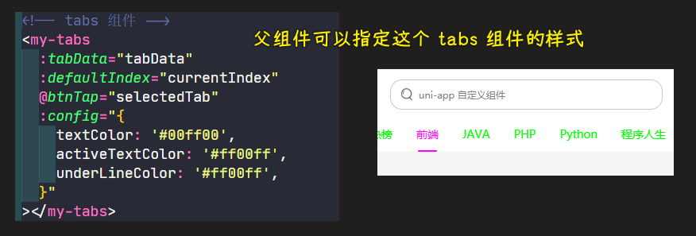

### ✍️ Tangxt ⏳ 2021-12-15 🏷️ uni-app

# 05-uniapp 开发 ImoocBlog

1）开篇

经过前面四个章节，我们已经完成了 **微信小程序** 的学习。那么从这一章开始我们就进入 `uniapp` 的项目开发之中。

整个 `uniapp` 阶段我们会完成一个正式的项目 **慕课热搜** ，以这个项目来作为 `uniapp` 学习阶段的的最终产出，同时通过这个项目来贯穿所有的 `uniapp` 知识点，可以让大家在学习的过程中不至于那么枯燥。

目前我们的项目已经上线了：

1. 微信小程序：微信 -> 发现 -> 小程序 -> 搜索《慕课热搜》
2. `H5` ：`https://imooc.blog.lgdsunday.club/#/`

那么现在：

- html、css、js、微信小程序，等基础知识
- 接口文档、最终效果、等各种项目需求

各种前置条件已经全部准备就绪，项目开发即可开始！

2）uniapp 难吗？

1、引言

《慕课热搜》基于 `uniapp` 进行开发，关于 `uniapp` 的优点 -> 在【课程导学】阶段已经描述过了，如果你忘了，那么你可以回过头去看一下。

这一小节我们来点实在的，光知道它好，不行。因为不是你的，它再好，对你而言也是没啥用的……

那么怎么才能学会它呢？或者说它难学吗？这才是这一小节我们需要说明的内容。

2、内容

[点击这里直接进入 uniapp 官网](https://uniapp.dcloud.io/)

想要学习 `uniapp` 那么需要有三个前置条件：

> 具备了这 3 个条件，学习 uni-app ，对你而言就是小菜一碟

1. `html + css + js`： 这个相信大家都没有问题
2. 微信小程序：这个我们已经在前面的章节非常详细的为大家讲解过了 -> uni-app 借鉴了很多小程序的内容
3. `vue`：可能有很多同学一看这个，心就凉了一截。我不会 `vue` 咋办啊。.. 
   没有关系！
   我敢把这个列出来，肯定就已经为大家想到了这么一点。
   `vue` 的理念和 **微信小程序** 的理念有非常多相同的地方，在我们后面进行项目开发的过程中，遇到一些个别的语法时，我会为大家进行介绍的。

总之，对于大家来说，这三个条件，如果你全部具备，那自然是最好的。

如果你只具备前两个条件，也不要担心，甚至可以说是更加幸运 -> 为啥这么说？ -> 因为接下来你将会在学会 `uniapp` 的同时，也会掌握 `vue` 的核心使用！

> 学会 uni-app 难吗？ -> uni-app 的语法可以简单理解成「vue 语法」和「小程序语法」的结合体 -> 这显然不难！

3）配置 uniapp 开发环境

之前开发微信小程序之前，需要：

1. 申请小程序账号
2. 下载微信小程序开发工具

同样，在进行 uniapp 开发之前，我们也需要做类似这样的事情，也就是需要配置项目的开发环境

uniapp 项目的开发环境主要有两点：

- 下载并安装开发者工具 HBuilder X
- 安装 sass 依赖 -> 项目需要用到 sass 语法

1、下载并安装开发工具

1. `uniapp` 同样提供了一个专门的开发工具 `HBuilder X` -> [HBuilderX 下载页面](https://www.dcloud.io/hbuilderx.html)
2. 点击 `DOWNLOAD` 
3. 选择 `App 开发版本`（因为我们要实现是慕课热搜） -> 推荐使用正式版
4. `Windows` 版本下载完成之后会得到一个 `zip` 的压缩包文件，解压完成即可使用 -> 是一个便携版
5. `MacOS` 版本下来完成会得到一个 `dmg` 的安装包，直接安装即可

2、安装 `sass` 依赖

因为我们的项目开发会使用 `sass`，所以需要为 `HBuilder X` 安装 `sass 编译器`。

1. 打开 `HBuilder X`
2. 打开插件地址：<https://ext.dcloud.net.cn/plugin?id=2046> -> 要登录账号，没有账号，那就注册
   1. 点击【使用 `HBuilderX` 导入插件】 -> 一定要去掉你浏览器的广告插件，不然，这是不会出现这个按钮的
   2. 在弹出框中点击【打开 `HBuilderX`】
3. 点击【是】
4. 此时会在 `HBuilderX` 右下角，提示你【正在下载】
5. 等待完成即可


4）创建 imooc-blog

本小节做两件事：

1. 创建项目 -> 开发工具会自动帮我们生成目录结构，就像微信小程序开发者工具一样
2. 了解项目基本组成结构

1、创建 uni-app 项目

打开 HBuilderX -> 文件 -> 新建 -> 项目：


效果：


2、项目目录介绍

```html
├─pages            // 页面存放文件夹，等同于 微信小程序中的 pages
│  └─index.vue     // 默认生成的页面
├─static           // 静态资源存放文件夹
└─uni_modules      // uni-app 组件目录
│  └─uni-xxx       // uni-app 所提供的业务组件，等同于 微信小程序中的组件
├─App.vue          // 应用配置文件，用来配置全局样式、生命周期函数等，等同于 微信小程序中的 app.js
└─main.js          // 项目入口文件 -> 初始化 Vue
├─mainfest.json    // 配置应用名称、appid、logo、版本等打包信息，
└─pages.json       // 配置页面路径、窗口样式、tabBar 等页面类信息，等同于 微信小程序中的 app.json
└─uni.scss         // uni-app 内置的常用样式变量
```

5）运行项目到 微信开发者工具

**`uniapp` 支持 10 个平台，我们以 微信小程序 和 `h5` 平台为例子，进行演示。**

> 为啥只适配这两个端？ -> 因为其它平台很少使用，比如 360 小程序

1、运行到 微信小程序

1. 配置【微信开发工具】路径：工具 -> 设置
2. 设置【微信开发工具路径】：运行配置 -> 微信开发者工具路径 -> 输入微信开发者工具的安装路径，如「`D:/微信 web 开发者工具`」
3. **切记：** 一定要在 `HBuilder X` 中双击打开你项目中的某一个文件（比如：`App.vue`）
4. 运行到微信小程序：运行 -> 运行到小程序模拟器 -> 微信开发者工具
5. 底部会提示编译
6. 编译成功，微信小程序自动启动

第一个问题：


在小程序开发者工具里边，把安全设置的服务端口给开启了：


> [【报 Bug】无法打开微信小程序开发者工具 - DCloud 问答](https://ask.dcloud.net.cn/question/65922)

打开 IDE 成功：


效果：


2、运行到浏览器

1. **切记：** 一定要在 `HBuilder X` 中双击打开你项目中的某一个文件（比如：`App.vue`） -> 不然浏览器是不认识的
2. 无需配置，直接运行：运行 -> 运行到浏览器 -> Chrome
3. 编译完成，浏览器自动打开，运行成功


> 一般切换到手机调试模式

---

> 在实际项目开发中，微信小程序占据了绝大多数的用户，而 H5 端是我们 web 前端常见的一种形式，所以，在以后的正常开发之中，我们项目多以微信小程序和 H5 端的适配为主

6）使用 VSCode 开发 uniapp

虽说 `HBuilder X` 开发体验还算不错，但是有时候金窝银窝不如自己的狗窝，当我们习惯了 `VSCode` 之后，有时候不太愿意换开发工具。

那么怎么使用 `VSCode` 来开发 `uniapp` 呢？ 其实是有办法的。

1. 使用 `HBuilder X` 运行项目（运行方式，参考上一小节）
2. 使用 `VSCode` 打开项目
3. 在 `VSCode` 中安装插件：
   1. [uni-helper](https://marketplace.visualstudio.com/items?itemName=ModyQyW.vscode-uni-helper) - 让开发者在 VSCode 中开发 `uni-*` 的体验尽可能好。
   2. [uni-app-snippets](https://marketplace.visualstudio.com/items?itemName=ModyQyW.vscode-uni-app-snippets) - 支持 uni-app 基本能力的代码片段，包括组件和 API
   3. [uni-app-schemas](https://marketplace.visualstudio.com/items?itemName=ModyQyW.vscode-uni-app-schemas) - 支持 uni-app `pages.json` 和 `manifest.json` 简单的格式校验
   4. [uni-ui-snippets](https://marketplace.visualstudio.com/items?itemName=ModyQyW.vscode-uni-ui-snippets) - 支持 uni-ui 组件代码片段
4. 在 `VSCode` 中修改代码，运行结果自动发生变化

> 让 `HBuilder X` 作为中介，我们在 VSCode 中写代码 -> 为了提高自己的开发体验（比如 API 提示等），可以安装插件 -> 安装一个`uni-helper`插件，其它三个插件自动安装

💡：uniapp 的 uni_modules 目录需要提交到 Git 吗？

需要提交！

7）创建与配置 tabBar

目前，项目的运行以及开发环境都搞定了，就下来我们要做的就是开发这个项目！

> 先搞定这个项目的结构 -> 也就是 tabBar 切换 -> uniapp 模仿微信小程序，也就是创建姿势，跟微信小程序一样

1、创建页面

> 把默认的页面删了，由于安装了插件，VSCode 也可以右键目录名创建页面 -> 但建议还是用 HBuilder 创建页面

1. 删除 `pages` 下的 `index` 文件夹
2. 在 `pages` 文件夹处，右键 -> 选择新建页面
3. 确认新建页面的信息
4. 点击创建按钮完成新建
5. 循环以上顺序，依次完成 `hot`、`hot-video`、`my` 三个页面的创建


效果：


2、配置 `pages.json`

1. 删除 `index` 路径
2. 新建 `tabBar` 节点
3. 复制 **资源** 文件夹下 `tab-icons` 文件夹到 `static` 文件夹中 -> 删掉原先存在的图片
4. 编写`tabBar`代码
5. 如果修改完成之后，依然得到了以下错误，那么可以在 `HBuilder X` 中重新运行项目到微信开发者工具解决 -> 这是小程序开发者工具的 bug（无法更新已经删除了文件这种情况，似乎有缓存啊） -> 重新运行项目就可以解决这个 bug 了
   
   
   

完整`tabBar`代码：


效果：


8）警告与错误处理

1、解决 【sitemap 索引情况提示】的警告问题


微信小程序默认开启了索引功能，但是因为我们没有配置索引策略，导致出现了这么一个警告的问题。具体情况可以参考：<https://developers.weixin.qq.com/miniprogram/dev/framework/sitemap.html>

而如果想要解决这个警告也非常简单，因为一般情况项目不需要被微信索引，所以我们只需要 **关闭** 默认索引功能即可！


> 双击打开 `manifest.json` -> 点击源码视图 -> 下翻找到 `mp-weixin` 配置节点 -> 在 `settings` 下新增 `"checkSiteMap" : false`

2、解决 ` Cannot read property 'forceUpdate' of undefined` 的错误


这个错误的原因非常简单 -> 因为我们没有为项目配置 `AppID` 的原因，所以只需要完成 `AppID` 配置即可。 -> 我们说过开发一个微信小程序项目，首先得有微信开发者工具，其次得有`AppId`


---

错误处理完成后，就可以进入到我们的页面开发了！

9）热搜页面分析

整个项目分为三大模块，我们首先去开发第一个模块——热搜模块

我们会把「热搜模块」分成四部分去进行开发：


10）认识 `.vue` 文件结构与 logo 图片展示

1、`.vue` 文件结构


1. `template`：定义当前页面的结构。相当于 `wxml` 
2. `script`：定义当前页面的逻辑。相当于 `js`
3. `style`：定义当前页面的样式。相当于 `wxss`
   1. 为 `style` 标签增加 `scoped` 属性：表示当前样式只在当前页面生效

2、logo 图片展示

注意点：

- 路径以`@`开头 -> `@`表示项目的根路径，也就是从项目的根路径开始找文件 -> `src="@/static/images/logo.png"`
- 可以用全局样式变量，因为我们用了`scss` -> 无须导入这个`uni.scss` -> uniapp 帮我们自动引入了，我们可以直接使用这些全局样式变量
- logo 图片 -> 不要拉伸 -> `mode="aspectFit"`

代码：


效果：


👇：logo 处理完成，处理搜索框

11） 创建搜索框组件

- 创建自定义组件的方式跟在微信小程序开发者工具里边所创建的姿势是一模一样的
- 组件的结构和页面的结构是一样的 -> 都是`.vue`文件，里边分为三块
- 组件定义好后，可以直接使用，无需注册 -> 微信小程序需要在页面配置里边注册，而 uni-app 则不需要

做法：

1. 创建 `components` 文件夹
2. 右键`components`文件夹 -> 新建组件
   
   
   
3. 明确当前 `my-search` 组件的能力（暂时不需要考虑太多之后的能力）
   1. 具备输入框的样式
   2. 不可进行输入 ->  本质上是一个按钮，只是看起来像输入框罢了
   3. `placeholder` 内容可以在父组件定义 -> 不是在组件内写死的
4. 代码实现
   1. 第一点和第二点的能力 -> 用 CSS 即可实现
   2. 第三点能力 -> 父向子传值 -> 使用`props` -> 小程序是用`properties`

代码：[创建搜索框组件 · ppambler/imooc-uni-app@651bcb6](https://github.com/ppambler/imooc-uni-app/commit/651bcb6)

目前这个`my-search`组件的功能是非常非常简单的，后边会赋予`my-search`更多的一些能力，这样它就会变得非常非常的复杂了

比如：


12）tabs 组件 - 创建并分析 `my-tabs` 组件

1. 创建 `my-tabs` 组件
2. 分析 `my-tabs` 组件的能力 -> 希望创建一个通用的 `my-tabs` 组件，可以满足各个应用中的需求 -> 既然是通用的，内容就不能写死了
   1. 可在父组件中定制 `my-tabs` 样式 -> 比如下划线颜色
   2. 可在父组件中设置展示数据 -> 每个 `tab` 的内容是啥
   3. 可在父组件中设置默认的激活项（选中项） -> 选中高亮等
   4. 由此分析，定义出以下代码：
   5. [Demo](https://github.com/ppambler/imooc-uni-app/commit/78017c6d0d9735b9f3657e2edc5e9445706b3306)

> 啥叫通用的组件？ -> 这个项目里边能用，其它项目里边导入该组件也能用它 -> 说白了就是「轮子」呗！ -> 既然想要把`my-tabs`开发成一个轮子 -> 那么`my-tabs`的复杂端将远远超过我们之前所开发的`my-search`组件 -> 你可以认为`my-tabs`是我们这个项目中第一个比较复杂的自定义组件

至此，我们指定了三个可定制的内容

本小节我们创建了`my-tabs`组件 -> 分析了`my-tabs`组件中所具备的能力

👇：`my-tabs`组件中的内容开发

13）tabs 组件 - 封装网络请求

要使用`my-tabs`，就需要把`tabs`的数据给展示出来 -> 想要展示`tabs`数据，就得调用封装的接口来获取数据 -> 接口文档：`热搜 -> 热搜文章类型`

发请求在微信小程序里边是`wx.request`，那在 uni-app 里边呢？ -> `uni.request`

1. 创建 `utils` 文件夹
2. 创建 `request.js` ，封装请求对象
3. 创建 `api` 文件夹 -> 放置所有的网络请求的相关方法
4. 创建 `hot.js` 文件，封装 `hot` 相关的请求方法：`getHotTabs`
5. 在`hot.vue`里边使用`getHotTabs` -> 在`loadHotTabs`方法里边发起请求
   1. 在哪里调用`loadHotTabs`方法？ -> 在`created`里边：组件实例配置完成，但 DOM 未渲染，我们可以在这个钩子里边进行网络请求，配置响应式数据 -> 这跟 Vue 是一样的

> [Demo](https://github.com/ppambler/imooc-uni-app/commit/9f83cb531893318f8be934806020859303e163f8)

至此，一个基本的网络请求代码就已经完成了！

14）tabs 组件 - 进行基本的数据展示

文档：[scroll-view - uni-app 官网](https://uniapp.dcloud.io/component/scroll-view)

- `scroll-x`：允许横向滚动 -> 默认值是`false`
- `scroll-with-animation`：在设置滚动条位置时使用动画过渡 -> 默认值是`false`

1. 在 `hot` 中使用`my-tabs`组件 -> 父子通信 -> 传递两个参数：
   1. `tabData`：tabs 数据源
   2. `defaultIndex`：当前的切换 index
2. 在 `my-tabs` 组件中展示
   1. `scroll-view`
   2. `<block v-for="(item, index) in tabData" :key="index"></block>` -> uni-app 遵循 vue 的 `v-for` 指令，小程序是`wx:for="🟡🟡arr🟡🟡"`，默认变量名是`item`，下标是`index`

效果：


> [Demo](https://github.com/ppambler/imooc-uni-app/commit/bd56aef)

15）tabs 组件 - 美化样式

> 这个样式的实现过程是很丑陋的…… -> 我很难理解为啥要嵌套那么多层……


> [Demo](https://github.com/ppambler/imooc-uni-app/commit/f58beb5)

头两个能力已经实现了，并且把数据给展示出来了，那么现在第三个能力「在父组件中选中项」 -> 这该如何实现呢？目前，我们已经给了这个激活项一个对应的`props`（`defaultIndex`）了 -> 有了这个`props`该如何实现激活项呢？

在开始下一小节前，请先自己去实现一遍（唯有自己尝试实现一遍，你才会发现这里边所存在的问题） -> 实现失败有失败的问题，实现成功也有成功的问题 -> 带着问题去看下一小节，唯有这样你才会收获更多！

要实现的效果：


16）tabs 组件 - 设置激活项

自己实现一遍：

1. 判断`defaultIndex`是否和`index`相等 -> 相等即给`item`添加一个`active`类
2. 写样式 -> 如何才能有下划线？
3. 点击某个 tab ，更新 `defaultIndex`的值 -> 如何为`my-tabs`组件绑定点击事件？ -> 子向父传参
4. 下划线的滑动效果如何实现呢？

注意点：

- 父组件传递的数据，我们不应该在子组件中进行修改
- uni-app 的点击事件用`@click`，微信小程序则是用`bind:tap`
  - 用来更新`activeIndex`的值
  - 并且向外界通知一个`tabClick`事件
- 数据监听器用`watch`，微信小程序则是用`observers`
  - 监听`defaultIndex`这个数据 -> 必须添加`immediate: true`，表示`defaultIndex`第一次赋值（默认值或者父传递过来的数据）也要被监听到 -> 为了更新`activeIndex`的值而服务 -> 这就是「父组件传递的数据」不应该在子组件中进行修改
- 发送事件通知用`$emit` ，微信小程序则是用`triggerEvent `

关于老师的代码实现：`active`的切换是在子组件内部通过修改`activeIndex`来完成的，而我的是在父组件通过修改`defaultIndex`的值来完成的

> [Demo](https://github.com/ppambler/imooc-uni-app/commit/2035bf5)

实现效果：


👇：实现激活项下边的滑块效果

17）tabs 组件 - 定义滑块

- 使用`style`添加内联样式
- 定义了一个`slider`数据，它旗下有个`left`属性，用来指定这个滑块距离左侧的距离是多少，默认是`0`


> [Demo](https://github.com/ppambler/imooc-uni-app/commit/b7a37ff)

👇：实现滑块的滚动效果

18）tabs 组件 - 实现滑块的滚动 01

想要实现滑块的滚动：

1. 确定滚动的时机 -> 也就是滑块什么时候发生滚动 -> 监听激活项的变化 + tab 的点击事件处理时
2. 计算滑块滚动的距离 -> 也就是`this.slider.left`的值

如何计算滑块滚动的距离？


我们要知道`tabItem`的宽度，`tabItem`的`left`，slider 的`width`

一个标准的数学公式：

``` js
left = tabItem.left + (tabItem.width - slider.width) / 2
```


> 这个公式似曾相识

19）tabs 组件 - 实现滑块的滚动 - 02

1. slider 的`width`很容易确定，因为这是固定的 -> 添加默认配置数据：`defaultConfig`
   1. 配置下划线的宽高以及颜色 -> 添加到 `view.underLine`的`style`
2. 创建一个内部维护的数据对象`tabList`，相较于父组件传过来的`tabData`，每个`item`多了一个`_slider`属性，该属性有个`left`属性，存储的是滑块距离左侧的距离值
3. 监听`tabData`的变化，再次强调，设置了`immediate:true`，第一次的初始值，也是会执行它的`handler`的，所以在`updateTabWidth`和`tabToIndex`会有一个判断`tabList`是否为空数组的语句
   1. 第一次执行`updateTabWidth`没啥反应 -> 因为此时`tabData`为空，所以`tabList`也为空
   2. 第二次执行`updateTabWidth`，获取每个 `tabItem` DOM 元素的信息，计算每个 `tabItem` 距离左侧的距离，也就是给`tabList`里边的每个`item`添加一个`_slider.left` -> 因为父组件传递了`tabData`，所以`tabData`不为空 -> 默认会有一次计算「滑块」的位置，比如初始的第一次
4. 切换`tabItem` -> 点击事件触发 -> 更新`this.slider.left`的值，好让`view.underLine`的`transform`根据这个`this.slider.left`产生水平位移

一些小技巧：

- 什么时候可以获取 DOM 元素？ -> 可以在`handler`里边用`setTimeout` -> `$nextTick()`兼容性不好
- 获取 DOM 元素时：给每个`tabItem`添加了`:id="'_tab_' + index"`
- 获取 DOM 的固定写法：
  - `const query = uni.createSelectorQuery().in(this);`
  - `query.select("#_tab_" + index).boundingClientRect((res) => { // 获取每个元素在这个页面的空间信息 }).exec()`


---

效果：


> [Demo](https://github.com/ppambler/imooc-uni-app/commit/94618da)

20）tabs 组件 - scrollView 的点击位移

需求：当【选中项】发生变化时，希望 `scrollView` 也进行对应的位移 -> 说白了，想选最后一个，不让用自己拖动这个 `scroll` 视图容器

用代码模拟我们用鼠标滑动的滚动视图容器的效果


关键代码：

- `:scroll-left="scrollLeft"`
- `this.scrollLeft = this.activeIndex * this.defaultConfig.underLineWidth;`

> [Demo](https://github.com/ppambler/imooc-uni-app/commit/a97b8ce)

21）tabs 组件 - 增加可配置项

需求：可在父组件中定制 `my-tabs` 样式



做法：

1. 给`data`的`defaultConfig`追加几项有关样式的配置
2. 监听`props`——`config` -> 让内部维护的数据对象`defaultConfig`跟父组件传递过来的数据合并一下 -> 说白了，子组件内部默认的样式配置作为兜底值
3. 用`style`属性指定每个`tabItem`的样式

> [Demo](https://github.com/ppambler/imooc-uni-app/commit/7af3f0f)

---

至此，我们就已经完成了`tabs`组件的开发了 -> 整个`tabs`组件从创建开始到最后完成，总共经历了 9 小节内容

`tabs` 组件是我们这个项目中第一个复杂的组件，并且我们希望把这个`tabs`组件做成一个轮子，可以满足更多应用的需求 -> 所以我们不光要实现功能就完事儿了，我们还要提供定制化的一些特性（比如样式），这样的话，才能让我们这个组件来满足各个项目的各个场景里边去

22）List 组件 - 分析 List 组件

这是首页的最后一个功能！

分析完成品里边 List 组件的效果，得出我们要做以下几个步骤才能实现它：

1. 使用 mock 数据（假数据），构建 List 的基本结构 -> 此时后端那边还没有接口
2. 美化 item 样式
3. 根据 tab 的切换，获取真实数据
4. 渲染真实数据
5. 让 List 具备左右切换的能力 -> 通过 swiper 改造 List
6. 完成 list 与 tabs 的联动的能力 -> 也就是完成 swiper 和 tabs 的联动效果 -> tabs 切换，list 视图也切换，list 视图左右滑，tabs 也会自动跟着切换

23）List 组件 - 使用 mock 数据，构建 List 的基本结构

> 组件的根元素 -> 控制同类盒子之间的间隙；盒子容器 -> 控制盒子的外观；内容容器 -> 控制元素
> 
> 有多个子元素就用一个容器把它们给包裹了

把每个`item`项抽离成单独的组件——`hot-list-item`

使用假数据把组件的基本结构给渲染出来


`item`的结构划分：


左侧展示的索引图标，而且每个`item`都有，并且都不一样，所以我们可以把它封装成一个组件——`hot-ranking`

注意，这个图标只是图片，这个图片是包含数字内容的

---


目前这个结构有了，就是样式长得太丑了：


> [Demo](https://github.com/ppambler/imooc-uni-app/commit/d4a1fb9)

24）List 组件 - 美化 item 样式

效果：


> [Demo](https://github.com/ppambler/imooc-uni-app/commit/8f07d00)

25）List 组件 - 根据 tab 的切换，获取真实数据

> 所谓的真实数据指的是后端的接口已经写好了！你可以根据这个接口的定义去获取数据，之前的假数据只是为了完成这个`List`组件的结构以及样式！

1. 监听`tab`切换
   1. `my-tabs`组件 -> 发送了一个`tabClick`通知
   2. 父组件接收这个通知 -> 修改激活项 -> 让子组件此刻激活的`index`和父组件的`currentIndex`绑定
2. 发送数据请求 -> 获取热搜文章列表
   1. `hot.js`封装请求接口
   2. 父组件定义一个方法`loadHotListFromTab` -> 该方法的作用是「获取 List 列表数据」 -> 什么时候调用这个方法 -> 在调用`loadHotTabs`的时候，因为，我们获取 list 数据时，需要 tab 中对应的 id -> 这是初始化列表的第一次数据请求
3. 缓存请求得到的数据 -> 第一次请求，那就把这次请求得来的数据给缓存下来 -> 切换旧的，不会再次发送请求
   1. 这个 tab 从未获取过列表数据 -> loading
   2. 这个 tab 已经获取过列表数据 -> 直接渲染

关键点：

- 缓存数据源的定义：`listData: {}` -> `key` 是 `tabItem` 的 `id`，`value`是这个`tabItem`所对应的`list`数据

注意点：

- 父组件要监听子组件发布过来的事件 -> 微信小程序通过`bind`监听事件，uniapp 遵循 vue 规则，通过 `@` 监听事件
- 加载动画 -> uni-app 提供了一个`uni-load-more`组件 -> 用来专门展示加载动画的组件

效果：


> [Demo](https://github.com/ppambler/imooc-uni-app/commit/4e3b44f)

👇：渲染真实数据

26）List 组件 - 渲染真实数据

1. 替换掉假的数据源：`v-for="(item, index) in 50"` -> `v-for="(item, index) in listData[currentIndex]"`
2. 把每个`list`数据传给 List 组件 -> 给 List 组件定义两个`props`：`data`（循环列表的 `item` 数据）、`ranking`（排名次序数据）
3. 父组件`hot`传递数据给了子组件`list` -> 子组件得把数据给显示出来 -> 根据接口文档来确定有哪些数据需要被展示：比如`title`、`nickname`
4. 样式美化 -> 简介最多展示两行 -> 这个样式经常被用到 -> 抽离出一个`styles`文件夹，在这个文件夹下边创建一个`global.scss` -> 定义公共样式的地方 -> 展示两行的样式是固定的 CSS 写法 -> 需要做兼容处理 -> 在`main.js`引入公共样式 -> 谁要添加这个类？
   1. 标题
   2. 简介
5. 处理排名，也就是给`hot-ranking`组件添加`props`
   1. 根据不同的排名，显示不同的背景图片，图片分为：1、2、3、其它，这四种
      1. 使用计算属性 -> 根据传递过来的排名数据，来决定渲染的是哪张背景图 -> JS 加载图片用`require`
   2. 处理排名的文本颜色 -> 用`:class`
      1. 前三名是白色
      2. 非前三名是黑色

效果：


> [Demo](https://github.com/ppambler/imooc-uni-app/commit/2967c66)

前四步已经完成：

1. 使用 mock 数据（假数据），构建 List 的基本结构 -> 此时后端那边还没有接口
2. 美化 item 样式
3. 根据 tab 的切换，获取真实数据
4. 渲染真实数据

接下来实现：

1. 让 list 拥有左右切换的能力
2. 让 list 和 tabs 有联动效果

💡：关于文本的截断

- [纯 CSS 实现多行文字截断 · Issue #12 · happylindz/blog](https://github.com/happylindz/blog/issues/12)
- [CSS 单（多）行文本超过部分显示省略号，解决数字或英文不换行问题](https://blog.csdn.net/qq_23375733/article/details/99713759)

27）List 组件 - 通过 swiper 改造 List 

想要让 `list` 具备【横向翻页】的效果，那么可以使用 `swiper` 对其进行改造！

1. 定义一个`swiper`组件 -> 具备滚动能力：
   1. 每一个`swiper-item`下边都是一个遍历完成的一个个`hot-list-item` -> 循环次数由`listData`决定 -> 此时用的是`tabIndex`属性（`tabData`的`0~6`），而不是之前的`currentIndex`属性，因为`swiper`滑动的时候，也是需要变化的 -> 需要给`swiper`组件指定`current`属性（值是`currentIndex`，也就是我们点击某个`tab`可以切换列表数据），它决定当前展示哪个 `swiperItem`，不然这个`tabIndex`永远为`0`
   2. `swiper-item`的数量取决于`my-tabs`里边的`tabItem`数量 -> `tabData`决定 -> `v-for`处理一下


> `current`属性：默认值是`0`，表示当前所在滑块的 `index`

效果：

`swiper-item`默认展示第一个 `list` 的数据，其它 6 个 `swiper-item`，你在滑动的时候，你会发现这是空的：


当你第一次点击其它`tab`时，会加载这个`tab`对应的`list`数据，这也就意味着，这个「空」就被填上了这个`list`数据！


要把这些「空」都填完，你得把把其余的没有点过的`tab`都给点一遍……这样左右滑的时候都会看到有数据存在了！ -> 为啥这样点就会有数据？ -> 因为我们点击`tab`，就是在请求这个`tab`所对应的`list`数据啊，而这写数据会被缓存到`listData`中

> [Demo](https://github.com/ppambler/imooc-uni-app/commit/09572be)

目前存在的问题：

1. `list`列表的高度展示错误 -> 也就是列表数据没有展示全
2. 切换 tab 时，list 的渲染出现卡顿问题


应该是 list 的数据渲染完再滑？还是滑完后再渲染？ -> 等大风小了再走，还是不管大风直接走呢？

28）List 组件 - 解决列表高度展示错误的问题

- 原因：没有给 `swiper` 指定高度
- 解决方案：指定高度即可

可这个高度该给多少呢？`1000px`？`2000px`？


你要知道每个`tabs`所对应的`list`数据的高度是不一样的！ -> 这个接口给出来的每个`tab`都是`20`条数据，不过我们假设都不一样！

最终的解决方案：计算出每个 `listItem` 的高度，然后叠加到一起，就可以得到 `swiper` 的高度了！

这个方案的实现逻辑：

1. 定义数据
   1. `currentSwiperHeight`：当前 `swiper` 的高度
   2. `swiperHeightData`：缓存高度的计算结果：以 `index` 为 `key`，对应的 `swiper` 的高度 为 `val` -> 每次计算太耗性能了，你得把计算结果给缓存下来
2. 定义一个方法：`getCurrentSwiperHeight` -> 用来帮我们计算当前 `swiper` 的高度
   1. 拿到所有的 `item` -> 这是一个异步操作（[节点信息 - uni-app 官网](https://uniapp.dcloud.io/api/ui/nodes-info?id=createselectorquery)）
      1. 获取节点信息有固定的代码写法
   2. 拿到所有 `item` 的高度 -> 来自一个个的节点信息
   3. 把所有的高度累加
3. 什么时候调用这个方法？ -> 当渲染完成数据之后，再去计算高度
   1. `this.$nextTick` 存在一定的兼容性问题，所以更加推荐使用传统的方式 `setTimeout`
   2. 在`getHotListFromTab`里边的`setTimeout`的回调里调用
      1. 拿到`getCurrentSwiperHeight`的结果值，也就是说`swiper`的高度
      2. 把这个高度放入`swiperHeightData`缓存中 -> 当前选中的`tabItem`索引值作为`key`，而对应的`value`就是这个高度值
4. 使用这个缓存高度：`currentSwiperHeight`

注意：


效果：


> [Demo](https://github.com/ppambler/imooc-uni-app/commit/d93a4a9)

29）List 组件 - 解决 切换 `tab` 时的 `list` 的卡顿问题
