### ✍️ Tangxt ⏳ 2021-12-21 🏷️ uni-app

# 06-文章搜索页面

1）开 篇（添加片头）

在上一章中，我们完成了 **热搜首页** 的开发，虽然经历了 ”千辛万苦“ ，但是对大家来说，应该也是收获满满。

那么在这一章节，我们将会进入新的篇章，来到 **文章搜索** 页面的开发。那么在 **文章搜索** 的页面开发中，我们又会经历哪些 **奇奇怪怪的 `bug` ，又将会获得哪些新的收获呢？** 

让我们一起期待吧！

2）文章搜索 - 分析文章搜索页面

在开发文章搜索页面之前，先来分析一下这个搜索页面都有哪些内容……

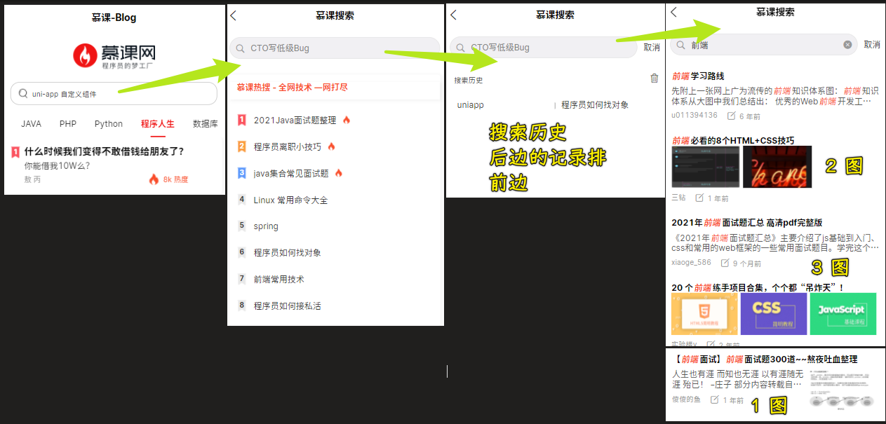

整个搜索页面分为三块大的内容：

> 首页 -> 点击搜索框 -> 慕课搜索页面 -> 聚焦「搜索框」 -> 搜索历史页面 -> 往输入框输入内容或不输入内容，回车 -> 搜索结果页面

1. 【慕课热搜】
   1. 展示 8 个热搜内容
2. 【搜索历史】
   1. 按照【从后向前】的顺序，展示搜索历史
   2. 点击【小垃圾筒】可删除历史记录 -> 可全部删除、可选择性删除
3. 【搜索结果】
   1. 不输入内容直接回车，按照当前的 `placeholder` 索引
   2. 输入内容，按照当前内容索引
   3. `item` 的展示分为三类
      1. 无图片展示
      2. 单个图片展示 
      3. 三个图片展示
   4. item 中关键字高亮
   5. 具备下拉刷新，上拉加载更多
   6. 点击 【叉号】返回【搜索历史】
   7. 点击【取消】返回【慕课热搜】

以上这些内容，就是我们整个文章搜索页面之中所具备的一些能力，接下来的开发就是围绕这三大块来进行开发！

3）文章搜索 - 使用分包，创建 `search-blog` 页面

创建文章搜索页面，即创建`search-blog`页面

但在创建这个页面的时候，我们将使用「分包」这个概念来创建我们的页面

1、分包

💡：什么是分包？

[分包](https://developers.weixin.qq.com/miniprogram/dev/framework/subpackages.html) 指的是将小程序划分成不同的子包，在构建时打包成不同的分包，用户在使用时按需进行加载

简单来说，就是把一个完整的项目拆成了不同的几个子项目，或者你可以认为我们将一个大的 JS 文件按照模块拆成了几个小的 JS 文件 -> 当我们去构建我们这个项目的时候，就可以把这些功能打包成不同的分包，也就是所谓的模块 -> 当用户使用时就可以进行按需加载了

> 把「小程序」看做是一个大的 JS 文件，把「子包」看做是小的模块，那么「啥是分包」就很好理解了

💡：分包的好处

- 可以优化小程序首次启动的下载时间 -> 如本来要下载一个大的 JS 文件（`100 k`），现在把它拆成十个小模块（假设每个模块是`10 k`），可以看到 `10 k`的下载速度显然要比`100 k`的快！
- 在多人协作共同开发时，可以更好的解耦协作 -> 10 个人改一个 JS 文件和一个人改一个 JS 文件 -> 方便解耦协作

微信小程序提供了分包的能力，而 uni-app 也对分包的功能进行了支持！

2、实现分包

在 uni-app 中如何实现分包功能 ？

1. 打开 `pages.json`，新建 `subPackages` 节点 -> 是一个数组，数组中每一个对象元素都是一个分包
2. 节点中每个对象为一个分包，其中
   1. `root`：分包包名
   2. `name`：分包别名
   3. `pages`：分包下的关于别名的页面路径和窗口表现
      1. `path`：分包下的页面路径
      2. `style`：页面的样式
3. 自己手动创建页面，小程序里边会根据这个`path`自动创建页面
   1. 新建一个`subpkg`目录
      1. 创建一个`pages`目录 -> 存放当前所有的页面
         1. 右键，新建 uni-app 页面：`search-blog.vue` -> 如果你对 uni-app 不爽，那你可以在 VS Code 里边通过之前安装的插件来新建页面

> [Demo](https://github.com/ppambler/imooc-uni-app/commit/fbfa7eb)

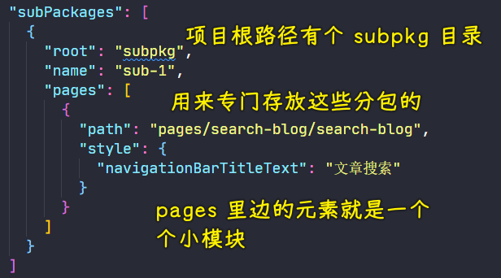

> 创建的`search-blog.vue`是子页面 -> 这个文件在`subpkg/pages/search-blog/`里边，我们得手动创建它 -> 你用 HbuilderX 创建这个页面时，会有不好的体验

💡：如何验证我们当前的分包已经实现了？

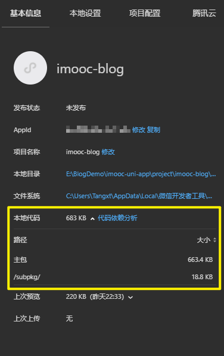

微笑小程序开发者功能 -> 详情 -> 本地代码有：主包 + `/subpkg/`（分包）这两个包 -> 这就证明我们的分包已经创建完成了

如果没生效，请注意是不是 uni-app 的编译问题！

---

我看了这个项目最终完成时的分包代码：

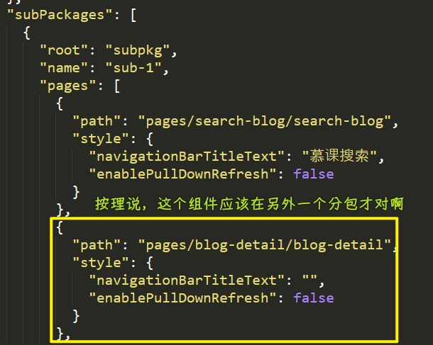

这样岂不是只分了一个包？

👇：有了这个分包页面后，就可以来开发这个`search-blog`页面了

4）文章搜索 - 完成跳转，渲染搜索框

定位到首页，完成页面跳转

1. `hot.vue` -> `my-search`组件的包裹器`view`添加点击事件 -> `@click="onToSearch"`
2. 用户点击这个`view` -> 触发`onToSearch` -> 使用`uni.navigateTo({})`方法完成页面跳转 -> 页面路径在分包路径下：`'/subpkg/pages/search-blog/search-blog'`
3. 在`search-blog`页面渲染搜索框
   1. `my-search`组件目前值拥有一个按钮，还没有输入的能力 -> 我们需要赋予它新能力（下一节再赋予，这节只是让它渲染出来）
   2. 添加基础结构
   3. 添加基础样式 -> 有吸顶效果

效果：

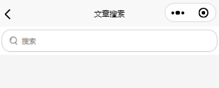

> [Demo](https://github.com/ppambler/imooc-uni-app/commit/6c7c95a)

5）文章搜索 - 为 `my-search` 组件赋予搜索的能力-1

我们希望通过`my-search`组件来渲染我们的搜索框，但是就目前的这个`my-search`组件，它并不具备搜索能力

💡：如何给`my-search`赋予搜索的能力？

对于 uni-app 来说，它提供了一个`uni-search-bar`搜索栏组件

文档：[uni-search-bar 搜索栏 - DCloud 插件市场 ](https://ext.dcloud.net.cn/plugin?id=866)

这个搜索栏组件具备的功能：

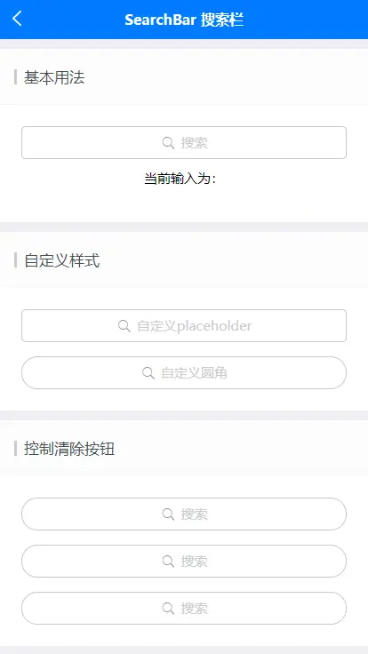

从文档里边我们可以看到它的：

- 兼容性
- 基本的使用姿势
- API
- 事件
- 插槽（替换`icon`）

我们之前创建这个项目的时候，选择了`uni-ui`，所以这个搜索栏组件已经被安装了

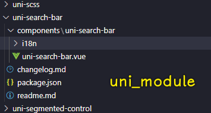

因此，我们可以直接使用它

总之，我们可以利用它来完成我们的搜索功能

💡：实现逻辑

> 为了好调试（不要每次都在`hot`页面点击然后进入页面），请修改编译模式，把`search-blog`页面作为启动页面

1. 定位到`my-search.vue`
   1. 添加`uni-search-bar`组件标签
   2. 「搜索按钮」和「搜索输入框」不能同时展示 -> 添加`isShowInput`这个`props`
   3. 根据想要的效果 -> 添加样式 -> 由于这个组件在很多地方都要用，所以不要把样式给写死了 -> 添加配置对象`config`这个`props`（有图标、背景色、边框等样式的配置） -> 让父组件指定`my-search`的样式
2. 给`uni-search-bar`传递参数，如`radius`、`bgColor`等
   1. 添加插槽 -> 指定图标：使用`uni-icons`组件，图标类型是`clear`
3. 给`my-search-bar`添加宽度`100%`样式
4. 改造输入框，让它符合最终实现效果 -> 搜索框的交互 -> 根据输入内容，点击按钮等，其底部会有视图切换
   1. 绑定`value`：`uni-search-bar`不使用双向数据绑定，因为会修改父组件传递过来的数据 -> 毕竟我们定义了一个`value` props -> 所以使用单向绑定
   2. 绑定事件 -> 看文档了解这些事件有啥用

> [Demo](https://github.com/ppambler/imooc-uni-app/commit/536ef29)

效果：

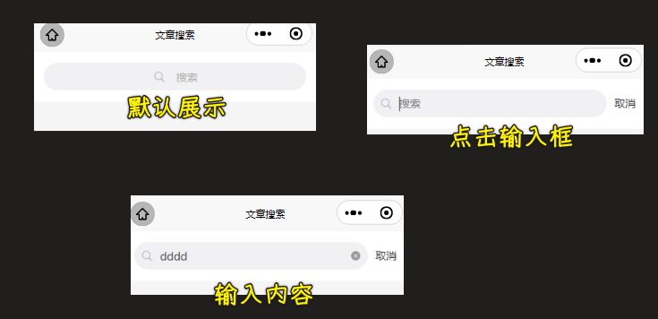

💡：`uni-icons`的效果

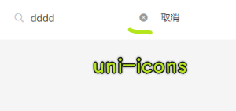

6）文章搜索 - 为 `my-search` 组件赋予搜索的能力-2 

💡：什么时候触发某个事件？

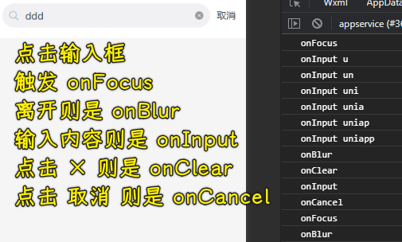

> `confirm`在输入框内回车就会触发

💡：让`my-search`组件具备非常强大的搜索输入框能力

`my-search`组件输入内容 -> 触发`onInput`事件 -> 把这个事件的发生通知给父组件，并且把这次输入的内容传给父组件

父组件在使用`my-search`组件时添加`v-model`

注意，可以使用这个`v-model`是有条件的（vue 中的基本知识）：

`v-model`是 vue 中完成双向数据绑定的指令，如果说该指令想要应用到组件的绑定中，那么需要遵守以下条件：

1. 子组件中，也就是`my-search`组件中接收到的值必须以`value`命名
2. 子组件中想要修改`value`时，必须要发送一个叫做`input`的事件

满足以上两点，父组件就可以通过`v-model`指令把值直接传递给`value`这个`props`了

> [Demo](https://github.com/ppambler/imooc-uni-app/commit/1d3f529)

> 这个代码的主要功能就是把子组件触发的事件抛给父组件这一层去处理 -> 关键点：父子组件的双向数据绑定！

💡：占位内容居中展示？

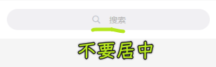

设计稿是居左展示

这个功能是无法通过`uni-search-bar`进行配置的，毕竟它没有提供可以让文本居中这样的一个属性

当组件无法提供给我们想要的能力的时候，那我们只能去修改这个组件了 -> 也就是修改`uni-search-bar`的源代码

``` css
.uni-searchbar__box {
  /* 处理初始 searchbar 位置 */
  /* 默认值是 center */
  justify-content: start;
}
```

至此，我们就完成了对整个搜索框的赋能，我们给`my-search`组件赋予了全新的能力：搜索输入框

本质就是间接给`uni-search-bar`组件添加非常多的配置项，以及对应的回调方法

并且，我们也可以通过`v-model`来完成父组件与子组件中绑定数据的双向绑定：

父组件`search-blog`：`<my-search v-model="searchVal"></my-search>`

子组件`my-search`：`value` + `this.$emit('input',val)`

7）文章搜索 - 显示推荐搜索

需要发送请求 -> 看「返回默认搜索内容」这个接口

1. 创建`api/search.js` -> 和搜索相关的接口都在这儿
   1. 添加`getDefaultText`函数
2. 在`search-blog.vue`里边定义`loadDefaultText`函数 -> 用来加载数据 -> 在`created`里边调用

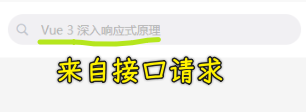

> [Demo](https://github.com/ppambler/imooc-uni-app/commit/c41574f)

8）文章搜索 - 创建三个业务组件

创建我们开头所说的三个组件：

- 慕课热搜
- 搜索历史
- 搜索结果

毕竟我们整个文章搜索页面，说白了就是由这三个组件来组成的

目前这个代码的效果有个小问题：

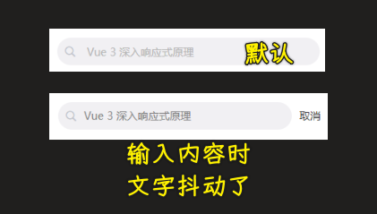

为啥会抖动？

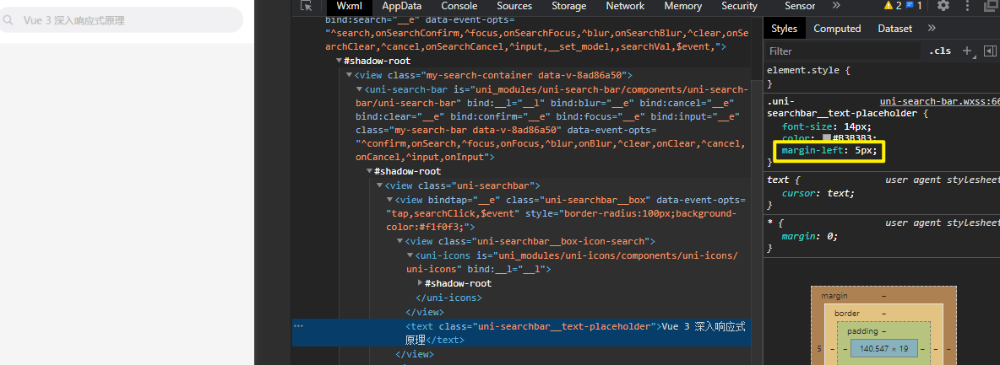

默认情况下是有`5px`，当你输入时，`text`变成了`input`，这`5px`就消失了

💡：创建三个组件

- `search-hot-list`：搜索列表
- `search-history`：搜索历史
- `search-result-list`：搜索结果

在`search-blog`页面里边渲染这三个基本组件

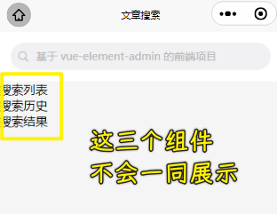

> [Demo](https://github.com/ppambler/imooc-uni-app/commit/46f0424)

正常情况下，这三个组件可不会一同展示！

👇：控制这个三个组件的展示！

10）文章搜索 - 控制业务组件的展示效果

按照不同的业务逻辑，分别展示这三个组件：

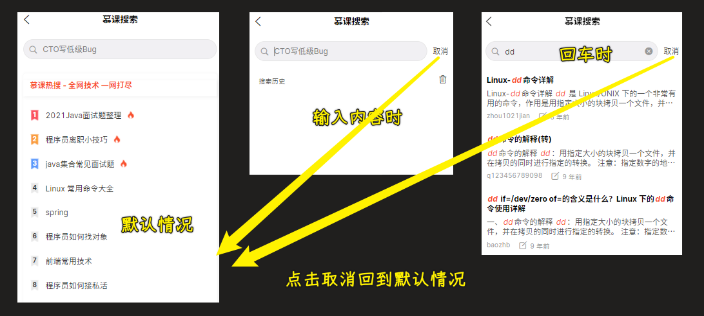

- 默认展示「搜索列表」 -> 点击了输入框的取消按钮时，也会展示「搜索列表」
- 输入框获取到焦点时，就会展示「搜索历史」 -> 点击输入框清空按钮时，也会展示「搜索历史」
- 用户点击热搜列表 `item` 或者用户点击搜索历史 `item` 或者输入框回车或输入内容后回车，就会展示「搜索结果」页面

组件的展示逻辑搞明白后，就得通过代码来实现这个展示逻辑了！

💡：实现过程

1. 通过一个数据`showType`来决定展示哪个组件
   1. 用`0`、`1`、`2`表示吗？ -> 这很不清晰，得用常量
   2. `HOT_LIST`、` SEARCH_HISTORY`、`SEARCH_RESULT`
   3. 默认值是：`HOT_LIST`
2. 在 HTML 中使用常量（注意：`template`里边，只可以访问`data`中定义的数据）
   1. 让这三个常量都作为`data`
3. 控制`showType`的值 -> 也就是那几个事件要干的事儿
   1. 失去焦点啥也不干 -> 这个处理函数无用
   2. 注意这个`clear`事件 -> 此时展示搜索结果，你点击清空按钮，也得返回搜索历史


> [Demo](https://github.com/ppambler/imooc-uni-app/commit/f0bd78d)

👇：实现这三个组件

11）热搜列表 - 数据获取
