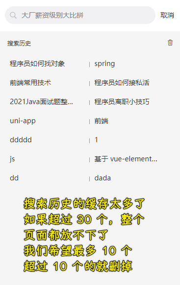

### ✍️ Tangxt ⏳ 2021-12-23 🏷️ uni-app

# 第 7 章 全局状态管理

### <mark>1）开篇</mark>

在上一章中我们完成了 “一半” 的文章搜索功能，并且留下了一些问题。那么这些历史残留的问题，我们将会在本章节中通过 **全局状态管理工具** 进行处理。

那么究竟什么是 **全局状态管理工具**呢？我们又如何在 `uniapp` 中使用 全局状态管理工具来解决我们的问题呢？，在完成我们剩下的 文章搜索功能 的时候，我们是否还会再遇到其他的坑呢？

这些内容我们都会在本章节中为大家一一讲解。

### <mark>2）状态管理 - 全局状态管理工具</mark>

> 老套路，接触一个新知识，还是得先从「为什么要学习它」，然后「针对它提出你的疑问」，最后「带着你的疑问在学习它的时候去解决这些疑问」 -> 终极目的：应用到你的项目中！

#### <mark>1、场景</mark>

在上一章中，我们遇到了一个问题：**`search-blog` 和 `search-history`、`searchData` 和 组件** 之间 **强耦合** 。

如果想要解决这个问题，那么我们需要使用到一个叫做：**全局状态管理工具** 的东西。

学习过 `vue` 的同学应该知道，在 `vue` 中，存在一个 [vuex](https://vuex.vuejs.org/zh/)  的库，这个库的作用就是：**全局状态管理**。

而在 `uniapp` 里，如果我们想要实现 **全局状态管理**，那么 [vuex](https://vuex.vuejs.org/zh/) 也将是一个非常好的选择。

那么下面我们就来看一下，什么是 **全局状态管理工具**，以及什么是 [vuex](https://vuex.vuejs.org/zh/) 

#### <mark>2、问题</mark>

> 1. 什么是全局状态管理模式 和 什么是全局状态管理工具
> 2. 什么是 vuex

#### <mark>3、知识</mark>

明确这两个问题，就开始学习新知识了

**“单向数据流” 理念示意图**

这种图表示的是单向数据流这个模型概念

啥意思？当我们的应用运用在用户手中的时候 -> 用户所有的操作，这最终操作的东西是什么呢？ -> 用户直接操作的是视图吗？ -> 其实并不是，对于当前的所有用户而言，用户直接操作的内容其实是我们的数据，当我们的数据发生变化的时候，我们的视图是跟随发生变化的，而视图的跟随发生变化会直接反馈到用户他的这一个操作之中 -> 这样一个模型我们就把它称之为是一个单向的数据流模型

简单来说就是：用户操作 -> 修改数据，数据变化 -> 视图跟随数据发生变化，视图发生变化 -> 反应到用户的眼中来完成用户最初的这个操作

- **state**，驱动应用的数据源；
- **view**，以声明方式将 **state** 映射到视图；
- **actions**，响应在 **view** 上的用户输入导致的状态变化。

---

这是我最初的认识误区：

---

但是，这样一个单向数据流处理其实在某些情况下会非常危险

比如说：

当我们的应用遇到**多个组件共享状态（数据）**时，单向数据流的简洁性很容易被破坏（回忆 `search-blog` 和 `search-history` 的代码，`searchData`这个数据在这两个组件里边都有被访问到） -> 破坏的原因是：

- 多个视图依赖于同一状态（数据）
- 来自不同视图的行为需要变更同一状态（数据）

我们在这两个组件里边分别对这个数据做不同的操作 -> 这种不同行为，影响了同一个数据的变化

为了解决这个问题

所以我们不得不通过 **父子组件传递数据** 的方式，来频繁的修改状态（数据）：

但是这种方式是 **非常脆弱，通常会导致无法维护的代码。**

说白了就是组件之间的耦合性太强了

那如何解决呢？ -> 必须使用全局状态管理模式

💡：什么是全局状态管理模式？

 > 全局状态管理模式：**把多个组件之中共用的数据给抽离出来，也就是抽离到一个单独的地方，然后通过一个 单例模式 去进行管理**，而这种管理的方式就叫做【全局状态管理模式】。（关于全局状态的一个管理模式）

而具备 【全局状态管理模式】 的库，我们就把它称之为：【全局状态管理工具】

而在 `vue` 中存在一个专门的 【全局状态管理工具】，叫做 `vuex`。

因为 `uniapp` 其实追随了 `vue` 和 `微信小程序` 的语法，所以我们可以在 `uniapp` 中使用 `vuex` 来进行 【全局状态管理】，并且这是一个 **非常被推荐** 的选择。

明确了这些概念之后，就来看一下之前我们描述的问题

#### <mark>4、答案</mark>

问题 1：

问题 2：

学到了啥？

- 全局状态管理工具的概念是啥？
- 接触到的新工具：Vuex

👇：使用 Vuex 管理我们整个项目中的所有共享数据！

### <mark>3）状态管理 - 在项目中导入 vuex</mark>

使用 vuex 分成两大步：

1. 创建`store`模块
2. 在`main.js`中注册`vuex`插件

实现：

1. 定位到根目录 -> 创建`store/index.js` -> 这个文件就是`store`模块
   1. 导入`vue`和`vuex`
   2. 安装`vuex`插件
   3. 创建`store`实例
2. 在`main.js`的`new Vue({})`的`{}`里边挂载`store`实例

> [Demo](https://github.com/ppambler/imooc-uni-app/commit/dfbc296)

### <mark>4）状态管理 - 测试 vuex 是否导入成功</mark>

测试 vuex 是否可以正常使用，测试的方式一共分成了三步：

1. 创建一个单独的模块：`modules/search.js` -> 用来表示当前 vuex 中的模块
2. 在 `index.js` 中注入（或者说绑定）这个模块
3. 在 `search-blog` 中使用 模块中的数据 -> 看一下我们模块里边的数据是否可以被正常访问 -> 可以被正常访问，意味着我们当前的 vuex 已经导入成功了

> [Demo](https://github.com/ppambler/imooc-uni-app/commit/0534bef)

➹：[vuex namespaced 的作用以及使用方式](https://blog.csdn.net/fuck487/article/details/83411856)

👇：让`searchData`这个数据和我们的组件解耦

### <mark>5）状态管理 - 构建 search 模块</mark>

在这个 `vuex` 模块里边，我们已经拥有了`searchData`这个数据，也拥有了三个可以修改它的`mutation`：

1. 添加数据
2. 删除指定数据
3. 删除所有数据

> [Demo](https://github.com/ppambler/imooc-uni-app/commit/191910d)

明确了`search`模块的`mutation`后，接下来就是实现关于`search`模块的数据管理

### <mark>6）状态管理 - 使用 search 模块完成搜索历史管理</mark>

> [Demo](https://github.com/ppambler/imooc-uni-app/commit/1cf403e)

至此，我们就已经使用 vuex 来分离了我们的数据`searchData`和我们的业务组件（`search-blog`和`search-history`）

数据都被 `vuex` 中的 `search`模块去管理，而所有的业务逻辑都被我们的组件调用 -> 目前的`searchData`数据和我们的组件之间已经没有任何关系了 -> 说白了，我们**已经完成了数据和组件业务的一个解耦**

👇：数据持久化

### <mark>7）状态管理 - 数据持久化</mark>

这是搜素历史的最后一个功能

目前，由于基本已完成数据和组件的分离，所以【数据持久化】不会涉及到组件内的代码，也就是整个「数据持久化」操作在`search`模块里边就可以完成了

数据持久化，分成两块部分：

1. 数据的保存
2. 数据的读取

数据保存后再读取出来，这个「持久化」功能就完成了！

> 保存方式跟 localStorage 没啥区别，都是一个`key`，一个`value`
> 
> `localStorage.setItem("data", JSON.stringify(data))` 和 `localStorage.getItem("data")`
> 
> `uni.setStorage({key: 'xxx', data: [] })` （可以保存多种类型的数据，而 localStorage 会把值自动转化为字符串）和 `uni.getStorageSync('xxx')`

数据持久化搞定后，不管你怎么重新编译，只要有搜索历史，那么这个搜索历史始终都会存在，当然，除非你把对应的`key`的本地存储给清空了

> [Demo](https://github.com/ppambler/imooc-uni-app/commit/6f78321)

三个模块中已完成两个 -> 最后一个「搜索结果」模块

👇：处理搜索结果的逻辑展示

### <mark>8）搜索结果 - 获取搜索结果数据</mark>

分析完成后的效果，得出整个搜索结果所涉及到的业务：

1. 根据搜索内容获取搜索结果
2. 搜索结果会分成三种样式进行展示
   1. 没有图片的样式
   2. 包含一张图片的样式
   3. 包含三张图片的样式
3. 下拉刷新
4. 上拉加载更多
5. 点击「向上按钮」返回到最顶部

接下来就是实现业务

💡：根据搜索内容获取搜索结果

分析接口：

1. `q`：第一个参数是要搜索的内容
2. `p`：第二个参数是分页 -> 毕竟搜索出来的结果条数有很多

> [Demo](https://github.com/ppambler/imooc-uni-app/commit/d54fd00)

拿到数据后就可以开始渲染对应的 `item` 项了！

### <mark>9）搜索结果 - 渲染搜索结果数据</mark>

创建三个组件，应对三种展示情况：

1. `search-result-item-theme-1`：无图片样式
2. `search-result-item-theme-2`：一张图片样式
3. `search-result-item-theme-3`：三张图片样式

每个`item`数据根据自己到底有没有图片或者有几张图片，来决定自己选择哪件衣服穿！

效果：

> [Demo](https://github.com/ppambler/imooc-uni-app/commit/8c88986)

💡：`rich-text`

返回结果里边有带标签的数据，所以我们用了`nodes`属性

---

展示的时间是文章发布的真实时间，而我们想要的是相对于今天的时间

### <mark>10）搜索结果 - 处理相对时间</mark>

相对时间可以借助 [dayjs](https://day.js.org/zh-CN/) （体积小，非常适合用来处理日期和时间） 进行处理。想要在 `uniapp` 中使用  [dayjs](https://day.js.org/zh-CN/) ，那么需要导入 `npm` 工具（以下内指令需要在项目路径的终端下进行）：

1. 需要在电脑中安装 `node` 环境，[node 安装地址](https://nodejs.org/en/)，推荐下载 `LTS` 版本
2. 通过 `npm init -y` 初始化 `npm` 包管理工具
3. 通过 `npm install dayjs@1.10.4 --save-dev` （推荐用这个包的版本）安装，安装完成，项目中会多出 `node_modules` 文件夹
4. 打开 `filters/index.js`，添加有关日期处理的代码
5. 使用过滤器

实现相对时间的过滤器：

> 1、2、3 步是导入，4、5 步是加载，第 6 步是使用`dayjs`里边方法定义我们的逻辑

前五步是通用操作：

我们主要实现过滤器：

> `val`是字符串时间 -> `dayjs`处理后的标准时间 -> 最后一个时间是`to`处理后的时间，也就是相对于今天`dayjs()`的时间，即 10 个月前

效果：

> [Demo](https://github.com/ppambler/imooc-uni-app/commit/b605da5)

### <mark>11）搜索结果 - 高亮搜索结果关键字</mark>

分析最终完成的效果，看看哪些关键字需要被高亮？

打开 <https://www.json.cn/>，把服务器返回的数据，扔进去：

分析得知：

在 `title` 字段下，搜索关键字都通过 `em` 标签进行了标记，所以所谓的 **搜索关键字高亮** 就是 **对 `em` 标签添加高亮样式**

怎么做？

直接在`style`里边添加一个`em`标签选择器吗？

可是：

所以，这样写是没有效果的！

虽然我们无法解析我们的标签，但是在`rich-text`里边，行内样式是可以被进行解析的

因此，我们可以在高亮的地方，如标题和简介，然后通过正则表达式来搞一个替换 -> 把所有的`em`标签替换成包含行内样式的`em`标签

说白了，就是需要把请求回来的数据再加工一下 -> 给带`em`标签的，添加行内样式 -> 颜色+间距

效果：

> [Demo](https://github.com/ppambler/imooc-uni-app/commit/)

---

实现这个高亮效果，需要服务器端配合，也就是返回的数据需要有`em`标签 -> 之后，就是前端对这个`em`标签进行一个行内样式的解析

总之，`rich-text`去解析`em`标签的时候，并不会把这个`em`标签变成是真正的`em`标签，然后渲染到 DOM 树里边去，而是依然通过`rich-text`去进行解析

简而言之，我们并不能通过`em`标签选择器去指定我们的高亮样式！

### <mark>12）搜索结果 - 介绍并使用 mescroll-uni 组件</mark>

先分析最终完成效果

上拉加载和下拉刷新是移动端中非常常见的一个功能 -> 这样一个功能被叫做「`pullToRefresh`」

[mescroll-uni ](http://www.mescroll.com/uni.html) 是一个专门为 `uni app` 准备的 `pullToRefresh` 组件。可以帮助 `uniapp` 实现 **下拉刷新、上拉加载的功能**。

我们有两种姿势使用它：

- `npm` 安装依赖
- 插件导入 -> 推荐这种

1. 在 [插件市场](https://ext.dcloud.net.cn/plugin?id=343) 点击 **使用 HBuilderX 导入插件**
   
   
   
2. 导入成功，`uni-modules` 文件夹下会多出 `mescroll-ui` 文件夹
   
   
   
3. `mescroll-uni` 的实现借助了 **微信小程序** 中的 [onPullDownRefresh](https://developers.weixin.qq.com/miniprogram/dev/reference/api/Page.html#onPullDownRefresh) 和 [onReachBottom](https://developers.weixin.qq.com/miniprogram/dev/reference/api/Page.html#onReachBottom) 这两个 **页面** 事件。因为 **微信小程序组件中没有这两个事件**，毕竟它们是页面事件，所以 `mescroll-uni` 在 **页面** 和 **组件** 中的使用方式 **不同** -> 说白了，`mescroll-uni`分成了两种使用方式，一种在页面中使用，另一种在组件中使用
4. 我们是在`search-result-list.vue`里边使用的，所以我们现在先来看 `mescroll-uni` 在 **组件** 中的使用
5. `mescroll-uni` 在 **组件** 中使用分为两大块：
   1. 在组件中需要去完成的代码
   2. 组件所在页面中需要去完成的代码

💡：在组件中需要去完成的代码

1. 通过 `mescroll-body` 包裹列表，指定 `ref` 为 `mescrollRef` ，监听`@init`（表示初始化）、`@down`（表示下拉）、`@up`（表示上拉） 事件
2. 导入对应的 `mixins`
3. 注册 `mixins`
4. 实现三个回调方法
   1. 首次加载
   2. 下拉刷新的回调
   3. 上拉加载的回调

完成这四步，`mescroll-uni`在组件的使用就完成了！

实现这四步

💡：组件所在页面中需要去完成的代码

除了要完成`mescroll-uni`在组件中的代码的以外，还要去完成一下组件所在页面中的一个代码，毕竟`mescroll-body`需要依赖页面中的下拉刷新和上拉加载这两个回调事件

`mescroll`在组件所在页面中代码分成了三部分：

1. 给 `mescroll-body` 的组件添加：`ref="mescrollItem"` （`mescrollItem`这个值是固定的，不可改，与 `mescroll-comp.js` 对应）
2. 导入`mescroll-comp.js`
3. 注册 `mixins`

经过了以上几个步骤之后，我们的这个`mescroll-uni`组件就已经导入到`search-result-list.vue`中了！

效果：

> [Demo](https://github.com/ppambler/imooc-uni-app/commit/82f60bb)

至此，关于这个`mescroll`的介绍以及导入就已经完成了，简单来说就是从插件市场中导入组件，然后如果你想要在组件中使用的话，首先你得在组件代码中配置一下，之后还得在使用这个组件的页面中配置一下它！

👇：实现上拉刷新和下拉加载对应的功能

### <mark>13）搜索结果 - 实现下拉刷新上拉加载功能</mark>

需求：

通过一个`isInit`数据来管控 -> 说白了，`downCallback`、`upCallback`这两个函数执行了，但是业务逻辑没有执行，直接`return`了

注意：

- 第一次加载完成，页面的底部一直会有一个上拉加载动画 -> 我们需要取消掉 -> 也就是数据获取完成后提示你要关闭动画
- 下拉刷新一直都是加载第一页的数据
- 面对不同的行为（下拉刷新、上拉加载），给数据源赋值的策略是不用的

效果：

> [Demo](https://github.com/ppambler/imooc-uni-app/commit/21af760)

### <mark>14）搜索结果 - 处理空数据场景</mark>

目前，对于「搜索结果」，我们已经完成了：

- 相对时间
- 关键字高亮
- 下拉刷新和下拉加载

这样几个功能

对这个「搜索结果」，还剩下最后一个功能——处理空数据这种情况

也就是说，这个搜索关键字没有对应的搜索结果

我测试了一下最终完成的效果，发现不管我怎么搜索，似乎都会有搜索结果，不过当我搜索「seqing」的时候：

另一种测试：直接`this.resultList = []`即可

怎么做？

1. 创建一个用来处理空数据的组件
2. 什么时候显示这个组件？ -> 定义一个变量`isEmpty`来管控这个组件的显示与否

效果：

> [Demo](https://github.com/ppambler/imooc-uni-app/commit/e00565f)

### <mark>15）文章搜索 - 细节修复</mark>

目前，文章搜索的功能几乎已经完成了，只不过还有一些细节我们需要进行额外的处理

啥细节呢？

比如：搜索历史数据量限制 `store/modules/search.js`

实现：

1. 添加常量
2. 只保留前 10 个元素，后边的元素都截掉

效果：

> [Demo](https://github.com/ppambler/imooc-uni-app/commit/c1fbed6)

至此，文章搜索的功能就已经全部完成了

### <mark>16）总结</mark>

在本章节中我们接触到了一个全新的知识点 **全局状态管理工具  vuex**， 我们利用它解决了 **数据与组件深度耦合** 的问题。

在正式的企业级项目中（无论是 `uniapp` 项目还是 `前端项目`） ，**全局状态管理工具** 都是非常重要的一个内容。

利用「全局状态管理工具」处理完了 “历史遗留” 问题之后，我们解决了文章搜索的最后一个模块 **搜索结果**，在「搜索结果」里边，我们利用「三个组件」分别应对了三种不同的渲染场景，并且通过 **行内样式** 的形式解决了「关键字高亮」的问题。

最后，为了处理 **pullToRefresh** 这种场景，我们还接触到了一个新的库 **mescroll-uni**，利用它很好地解决了 **下拉刷新，上拉加载的问题**。

那么在下一章节，我们则会进入到 **文章详情的功能开发**（展示文章评论、文章内容等），而这等待我们的又将会是什么样的难题呢？

