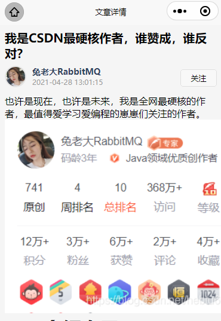

### ✍️ Tangxt ⏳ 2021-12-25 🏷️ uni-app

# 第 8 章 文章详情模块开发

1）开篇（加片头） 

从本章开始我们要进入文章详情的页面开发。

总共分成两部分：


在文章详情页面可以展示：

1. 文章标题
2. 作者信息
3. 发布时间
4. 文章内容
5. 文章评论


同时你可以在这里进行：

1. 作者关注
2. 文章评论
3. 文章点赞
4. 文章收藏

等操作。


> 这些操作需要判断是否已点击过 -> 需要登录才行

其它基本功能大家可以进入到我们已经发布的小程序《慕课热搜》中进行查看。

那么在这样的一个复杂的详情页面中，我们又会遇到什么样的复杂难题？又将如何进行解决呢？

我们一起来期待吧！

2）文章详情 - 点击进入文章详情页面

如何进入到文章详情页？

1. **热搜列表进入文章详情**
2. **搜索结果页面进入文章详情**

💡：实现

在 `subpkg` 下创建 **文章详情页面** `blog-detail`


修改`pages.json`


完成页面的跳转

1. `hot-list-item`发送通知被点击了 -> `hot.vue`监听这个通知 -> 跳转页面
2. `search-result-list` -> 给循环遍历时的那个`view`添加点击事件 -> 跳转页面

> [Demo](https://github.com/ppambler/imooc-uni-app/commit/d523bb7)

3）文章详情 - 获取文章详情数据

分析接口得知，需要两个参数：

- 作者名称
- 文章 `id`

如何拿到这两个数据呢？


> 是`user_name`，不是`nickname` -> 在搜索结果里的是`author`

我们知道小程序在发送请求的时候带参数，遵循了`GET`请求标准形式

在`blog-detail`的`onLoad`里边拿到参数

参数有了，就发起请求呗！


注意：

- 有些文章详情数据很多，所以会响应很慢 -> 添加一个加载框 -> 加载框的关闭在`request`的`complete`方法里边，如果你加载数据的时候，有用到加载框，那么这个`complete`方法是有效果的，当然，如果你没用到这也没事哈，这相当于什么也没做！

> [Demo](https://github.com/ppambler/imooc-uni-app/commit/a50a375)

4）文章详情 - 分析并渲染文章详情的基本结构

> 渲染文章详情的 UI 结构

整个文章详情可以被分为三个部分实现：

1. 文章内容区
2. 评论列表区
3. 底部功能区


我们先来实现 **文章内容区** -> 主要是搭建 UI 结构

完成后的效果：


> [Demo](https://github.com/ppambler/imooc-uni-app/commit/13a4c19)

5）文章内容 - 美化文章内容区域

美化效果：



> [Demo](https://github.com/ppambler/imooc-uni-app/commit/f2b0cbe)

方便调试（不用每次点击 `item` 进入文章详情页）：


6）文章内容 - 分析文章内容的样式实现

目前我们虽然已经完成了基本的 `html` 和 `css` ，但是我们可以发现，现在的 **文章内容** 部分与完成之后的项目差距其实挺大的。那么怎么解决这个问题呢？

想要解决这个问题，我们需要先明确一点：**所有和样式相关的问题，都需要通过 `css` 进行解决！**

明确了这点之后，我们就知道，想要解决这个问题，那么还是必须要从 `css` 进行着手。

回忆一下我们之前解决 **搜索结果高亮关键字的功能**，我们知道 对于 `rich-text` 来说，它并不会把 **富文本** 渲染为真实 `DOM` ，放入到 `DOM` 中，所以我们如果直接通过 `css` 指定样式，那么是没有效果的。

所以我们当时通过了 **行内样式** 的形式进行了 **高亮文本的展示**。

但是这样的一种方案，放入到我们当前的场景中是否合适呢？

答案是：**不合适的**。

因为对于 **文章内容** 来说，它涉及到了非常多的 `html 标签`，每个 `html 标签` 设计到的样式也非常复杂，如果我们还期望通过 **行内样式** 来去解决的话，那么未免 **太不现实** 了。

那么我们应该怎么去解决这个问题呢？大家可以先去思考一下这个问题。不需要思考出具体的实现方案，只需要给出一个可行的方案即可。

-----

在这里，我就认为大家已经针对这个问题进行过思考了，那么我们就直接公布可行方案：

1. 把包含 `html` 的富文本，转化为 **小程序可识别的 元素 进行展示**
2. 获取网络中现有的，用来处理文章详情的 `css`，对该 `css` 进行改造
3. 为每个元素添加对应的类名，使其可拥有更完美的样式

通过以上三步即可实现。

那么在下一节中我们将去实现对应的代码

7）文章内容 - 实现文章内容的样式渲染

- mp-html 富文本组件
- 文章主题演示 -> typora 的开放主题
- 给数据添加`class`，追加自己的样式，毕竟有些主题样式用到了小程序不支持的标签选择器

注意：

- 样式主题需要指定父类名？ -> `<mp-html class="markdown_views">` -> `markdown_views`就是父类名
- 需要添加`<block v-if="articleData">`，因为第一次渲染时数据还未到 -> `articleData`为`null`

---

在上一章中我们明确了 **文章内容样式渲染的实现方案**，一共分为三步：

1. 把包含 `html` 的富文本，转化为 **小程序可识别的 元素 进行展示**
2. 获取网络中现有的，用来处理文章详情的 `css`，对该 `css` 进行改造
3. 为每个元素添加对应的类名，使其可拥有更完美的样式

那么这一章节，我们就一步一步来进行实现。

💡：把包含 `html` 的富文本，转化为 小程序可识别的 元素 进行展示

想要实现这个功能，我们需要借助一个现有的第三方库 [mp-html](https://ext.dcloud.net.cn/plugin?id=805) 

 [mp-html](https://ext.dcloud.net.cn/plugin?id=805) 是一个专门用来解决 **富文本渲染的一个库** ，它的解决方案就是 **把包含 `html` 的富文本，转化为 小程序可识别的 元素 进行展示**，正好符合我们的需求。

导入并使用 [mp-html](https://ext.dcloud.net.cn/plugin?id=805) ：

1. 点击进入 [mp-html](https://ext.dcloud.net.cn/plugin?id=805)，点击 **使用 `HBuilderX 导入插件`**
2. 在 `blog-detail` 中导入组件，并使用

通过 **微信小程序** 查看渲染之后的 `DOM` 树，可以发现所有的 **富文本** 已经被真实渲染了


💡：获取网络中现有的，用来处理文章详情的 `css`，对该 `css` 进行改造

那么现在，我们就只需要增加对应的 `css` 样式就可以了。那么 `css` 样式从哪里来呢？

获取 `css` 的样式大家可以直接从：[theme](https://theme.typora.io/) 网站去进行下载，然后进行导入：

1. 下载对应的 css 压缩包
2. 在 `styles` 中新建 `article-detail.scss` 文件
3. 复制下载的 `css` 到 样式文件
4. 在 `blog-detail.vue` 中导入 `css`

``` html
<!-- 注意：需要删除 scoped  -->
<style lang="scss">
@import '~@/styles/article-detail.scss';
```

💡：为每个元素添加对应的类名，使其可拥有更完美的样式

现在虽然 `DOM` 虽然已经被渲染出来了，但是其实现在距离我们最终的样式还是又一些差距的。

因为在导入的 `css` 中，很多的样式都是根据 `p` 标签，`span` 标签 这样的，标签选择器进行的样式指定，而我们被渲染出来的 `dom` 是不包含这些选择器的，所以我们需要给不同的标签增加不同的类名，然后修改对应的 `css` 使其可以通过 **类名选择器** 覆盖样式。

**为 `dom` 增加类名**

想要添加类名比较简单，我们可以直接通过 **正则进行选取替换：**


现在查看 `DOM` 结构，我们就可以发现，在部分被渲染为 `view` 组件的元素上，已经多了一个 `class` 为 `blockquote-cls` 了。


**为 `css` 修改类名选择器**

在 `css` 文件中，全局搜索 `blockquote` ，将其修改为 `.blockquote-cls`。

即可发现样式已经被渲染成功了：


接下来我们就可以为 **所有的标签增加类名** ，同时为 **`css` 修改对应的样式**


替换之后得到如下页面：


> [Demo](https://github.com/ppambler/imooc-uni-app/commit/1048c54)

如果 **忽略掉文字大小**，只看这个样式其实还是蛮好看的对吧。

但是这个字体大小是怎么回事呢？我们下一小节为大家解惑！

8）文章内容 - 解决字体过小的问题

在上一小节我们解决了 **文章内容** 的渲染样式问题，但是在渲染之后，我们发现这个 **文字也太小了吧**。那么这个问题怎么解决呢？我们一起来看一下！

**分析问题：**

首先我们先来看一看下出现这个问题的原因是什么呢？

我们知道：**所有影响样式的问题都是由 `css` 引起的。** 那么这样的问题也不例外，查看我们的 `css` 可以发现，**文章内容** 中所有的 **文字大小** 都是由  `rem` 进行指定的。


同时我们知道 `rem` 的大小取决于 `html` 根目录的 `font-size` 大小，那么明白了这个之后，问题应该就好解决了对不对。我们是不是只需要给 **`html` 根标签添加一个对应的 `font-size` 就可以了**。

所以我们可以到 `article-detail.scss` 顶部，但是我们发现它这里已经有了对应的 `css` 了！！


既然已经有了这个 `css` 那为什么还不能生效呢？？

---

原因其实非常简单，大家想一下咱们现在是在 **微信小程序** 中，**微信小程序** 中有 `html` 标签吗？ 是不是没有啊。

所以通过指定 `html` 样式的形式是无法解决 **微信小程序** 中的字体大小问题的。

**微信小程序字体大小解决方案：**

那么我们应该怎么解决这个问题呢？

在 `uniapp` 中，为我们提供了一个单独的组件  [page-meta](https://uniapp.dcloud.io/component/page-meta?id=page-meta) 。


[page-meta](https://uniapp.dcloud.io/component/page-meta?id=page-meta) 是一个特殊的标签，有点类似 `html` 里的`header`（`head`？）标签。页面的背景色、原生导航栏的参数，都可以写在这里。我们可以通过 `root-font-size` 属性指定页面的 **`根 font-size`（类似于 `html` 根元素的 `font-size`）**

所以，我们可以直接使用 <page-meta> 包裹元素


此时，在返回模拟器，即可发现 **文字大小问题已经解决**


> [Demo](https://github.com/ppambler/imooc-uni-app/commit/1c71b09)

**注意：目前文章详情还无法在 浏览器 中进行展示，具体原因我们会在后面 【适配方案】 中进行讲解！！**


> 对于文章内容，最复杂的地方，莫过于我们对整个内容区域的渲染部分 -> 这里最核心的一个点就是「如何把我们的富文本通过微信小程序可识别的组件来把它们渲染出来」

9）评论列表 - 获取评论列表数据

