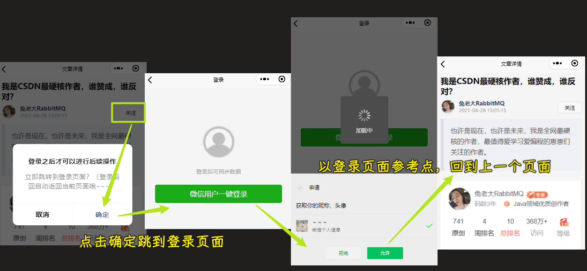

### ✍️ Tangxt ⏳ 2021-12-27 🏷️ uni-app

# 第 9 章 用户登录

1）开篇

在上一章中，我们说到：如果想要完成：关注、收藏、点赞、评论 这些功能的话，那么需要首先完成 **用户登录** 的功能。

那么这一章中，我们就来看一下，我们应该如何完成 **用户登录** 的功能实现。

首先我们先来看一下 **用户登录** 的业务逻辑。

对于 **用户登录** 来说，主要有两个登录的入口：

1. 在《我的页面》中 -> 也叫个人中心
2. 在调用需要登录权限的功能时

那么在明确了 **用户登录** 的业务逻辑之后，接下来我们就去实现用户登录的对应功能。

2）用户登录 - 登录页面基本样式

效果：

> [Demo](https://github.com/ppambler/imooc-uni-app/commit/fa93150)

3）用户登录 - 封装登录组件

在开篇中，我们说到，对于 **登录** 功能来说提供了两个登录的入口。

那么大家想一下，现在我们已经在 **我的** 这个 `tab 页` 中实现了 **登录的 `UI`**，难道我还需要在另外一个页面中再去实现一遍吗？

这个肯定是不需要的，对不对。所以我们希望可以复用**登录的 `UI`**，而复用的方式则可以把 **登录的 `UI`** 封装称为一个 **组件**

1. 创建登录组件 `my-login`
2. 在`my`里边使用`my-login`组件

**在调用需要登录权限的功能时，进入的登录页面** -> 我们先不需要去创建，等到使用的时候，再创建就可以了。

> [Demo](https://github.com/ppambler/imooc-uni-app/commit/dbf9c6f)

4）用户登录 - 明确登录的实现思路

在实现登录的具体功能之前，为了避免一些没有开发经验的同学直接看代码一脸懵逼，我们需要先来明确一下登录的实现基本逻辑。

首先对于登录来说，我们会分为两个不同的端来进行适配实现：

1. 微信小程序
2. 非微信小程序（在讲解适配时实现）

我们这里先只讲解 【微信小程序的实现】，【非微信小程序】的实现将在后面的 **适配环节进行**。

**微信小程序：**

1. 想要实现登录功能，那么我们需要调用登录接口来进行实现，而登录接口所需要的参数，我们可以直接通过 `getUserProfile` 方法进行获取。
2. 调用登录接口成功，服务端会返回用户的 `token`，这个 `token` 为当前的用户身份令牌。（拥有 token） 则表示用户已经登录了。
3. 而此处的 `token`，我们需要在多个组件中进行使用，所以 `token` 需要被保存到 `全局状态管理工具 - vuex` 中，同时需要保存的还有通过 `getUserProfile` 获取到的用户基本信息。
4. 而当前的用户登录状态，我们希望可以一直保存（PS：不需要每次都进行登录）。所以在登录完成后，我们需要把 **`token` 和 `userinfo`** 保存到 **本地存储中**
5. 最后，为了实现 **数据与组件的分离**，我们需要把与 **与登录相关的逻辑** 都封装在 `vuex` 中进行。

这些业务是 **前端用户登录的标准逻辑**，大家在以后的前端登录业务处理中，也可以按照此逻辑进行。

那么从下一小节开始，我们就按照这个逻辑实现一下对应的代码。

5）用户登录 - 封装 action 调用登录接口

在上一小节中，我们分析了【微信小程序】中进行登录的实现逻辑，那么从这一小节开始，我们就实现对应的功能。

实现：

1. 在`api/user.js`里边定义`login`函数，用来发送`POST`请求，请求地址是`'/sys/login'`，传递的数据是「用户信息」
2. 在`my-login`里边定义`getUserInfo`方法，用来获取用户信息，这个信息是微信登录的用户信息 -> 把这个用户信息交给在`vuex`里边定义的`login`方法，用作登录时的请求参数
3. 在`store/user.js`里边定义`user`模块，在`store/index.js`里边注册`user`模块，在`my-login`里边通过`mapActions`注册`user`模块的`login`方法

> [Demo](https://github.com/ppambler/imooc-uni-app/commit/d935742)

6）用户登录 - 保存用户登录状态

用户的登录状态需要被保存到 `vuex` 中，同时需要进行 **本地存储**。

- 用户信息
- 用户`token`

效果：

> [Demo](https://github.com/ppambler/imooc-uni-app/commit/7e9ba20)

7）用户登录 - 完成已登录的用户视图

当 `token` 存在时，表示用户已经登录了，此时需要 **展示用户登录完成的视图：**

> [Demo](https://github.com/ppambler/imooc-uni-app/commit/9c7ce0b)

8）用户登录 - 实现退出登录功能

删除`token`和用户信息即可 -> 两个地方需要删除，`vuex`和本地存储

> [Demo](https://github.com/ppambler/imooc-uni-app/commit/5cc2bb8)

9）用户登录 - 判断用户登录状态

截止到目前为止， **用户登录** 的功能其实就已经全部构建完毕了。

接下来我们就需要实现：

- 关注用户
- 文章点赞
- 文章收藏
- 文章评论

这四个对应的功能。

之前我们说过，想要实现这四个功能， 那么需要有一个前提条件就是：**当前用户已登录。**

所以说，我们就需要在用户使用这四个功能之前，来判断用户的登录状态。

也就是说，在 **用户登录功能完成之后**，我们其实还不可以立刻着手这四个功能的开发，我们还需要进行一步操作，那就是 **判断用户的登录状态！**

想要判断用户的登录状态，我们依然需要在 `vuex` 中进行（数据和组件分离）：

> [Demo](https://github.com/ppambler/imooc-uni-app/commit/3891588)

如果用户未登录，则引导用户进入登录页面，那么这一步功能如何进行实现呢？

10）用户登录 - 新建登录页面，处理当前场景

开篇的时候，我们说过，对于 **登录** 来说，包含有两个入口：

1. 在 《我的页面》中
2. 在调用需要登录权限的功能时

那么此时，就是使用到第二个场景的时候了。

1. 我们创建一个新页面，叫做 `login-page`，在这个页面中，导入 `my-login` 组件
2. 当 **进行登录判定，用户未登录时，进入 `login-page` 页面**
3. 在 **关注** 用户时，调用这个`isLogin` `action`

注意点：

- `uni.showModal`的返回值 -> 根据你是点击确定还是点击取消，来决定下一步操作
- `uni.showModal`的使用 -> 没有用`success`方法，而是用了`async/await`去处理 -> 因为需要返回`false`

效果：

> [Demo](https://github.com/ppambler/imooc-uni-app/commit/06cff8c)

11）用户登录 - 监听登录成功的状态，返回之前页面

在上一节，我们已经完成了 **在调用需要登录权限的功能时，进入登录页面** ，但是当我们登录完成之后，我们 **还需要返回之前页面**，因为只有这样才能完成我们的功能闭环，所以在这一小节中，我们就去完成这一块的功能：

1. `my-login`：在登录成功后，发送事件
2. `login-page`：监听登录成功的事件，并返回上一个页面

效果：

> [Demo](https://github.com/ppambler/imooc-uni-app/commit/8468fc2)

12）用户登录 - 处理登录时无 loading 的 bug

13）文章操作 - 关注用户

