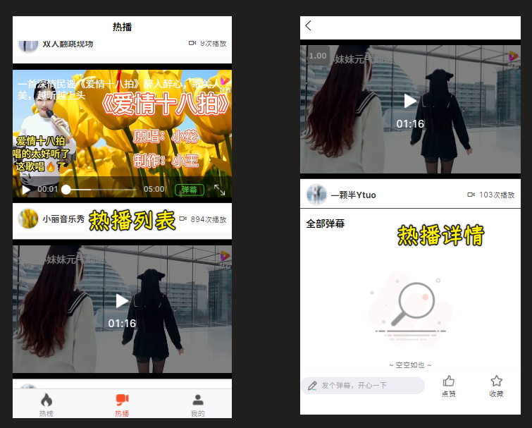
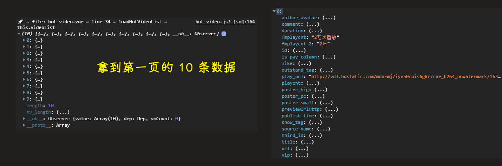
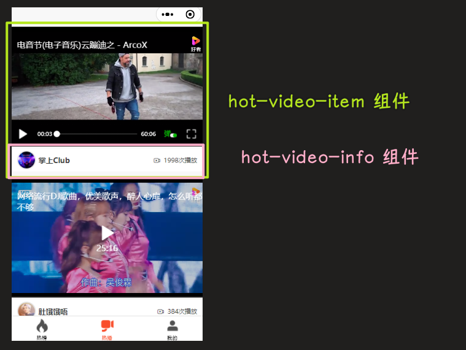
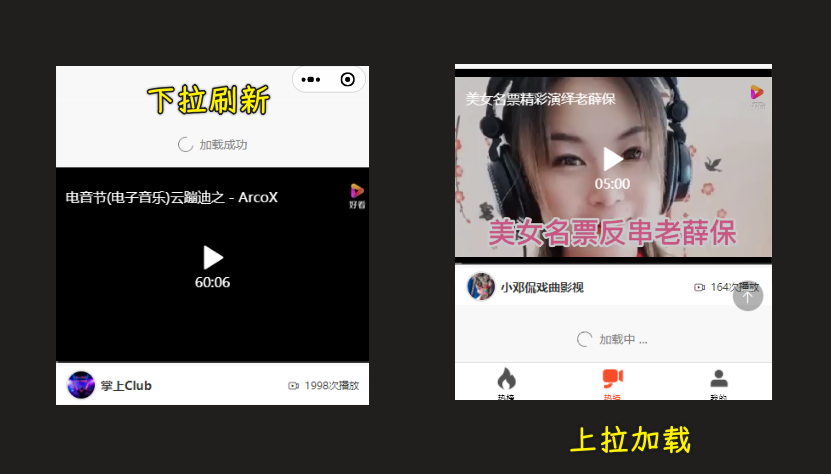
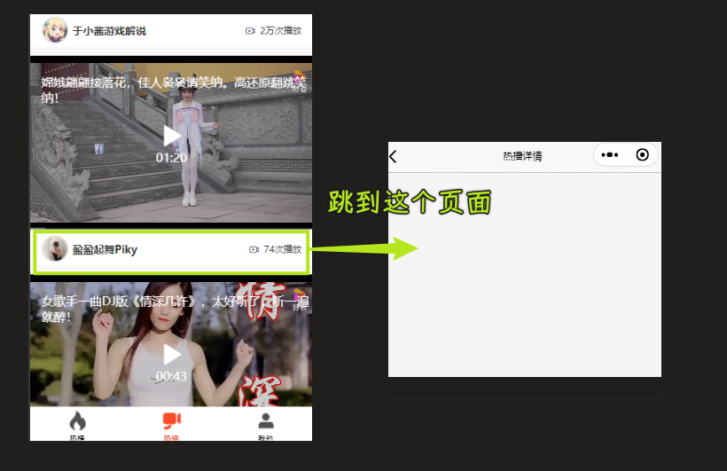
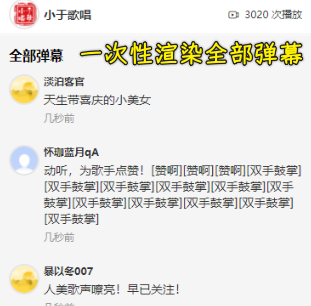
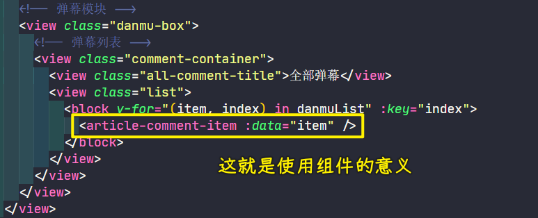

### ✍️ Tangxt ⏳ 2021-12-29 🏷️ uni-app

# 第 10 章 热播模块

1）开篇

在本章节中我们将要完成【慕课热搜】中的最后一个模块【热播】。



【热播模块】分为两个页面：

1. 热播列表
2. 热播详情

对于【热播列表】而言，包含：

1. 下拉刷新  + 上拉加载更多
2. 视频播放（`video` 组件）

对于【热播详情】而言，包含：

1. 视频播放（`video` 组件）
2. 分页的弹幕列表
3. 发表弹幕
4. 点赞 + 收藏

所以说，对于【热播】模块而言，核心的点在于【视频播放】，也就是 `video` 组件的用法。

那么下面就让我们来开始【热播模块】的开发吧

> 控制台出现「渲染层网络层错误」 -> 这不是前端代码的问题，这是视频请求的问题！ -> 我们可以忽略它

2）热播列表 - 获取热播列表数据

1. 定义接口：`api/video`
2. 在 `hot-video` 中获取数据



> [Demo](https://github.com/ppambler/imooc-uni-app/commit/b6c14dd)

3）热播列表 - 渲染 UI 结构

文档：[video - uni-app 官网](https://uniapp.dcloud.io/component/video)

效果：



> [Demo](https://github.com/ppambler/imooc-uni-app/commit/b07a3aa)

4）热播列表 - 列表的下拉刷新与上拉加载

1. `hot-video`：在页面中使用 `mescroll` 比较简单（之前我们是在组件中使用）
   1. 导入 `mescroll-body`
   2. 导入 `mixin`
   3. 注册 `mixin`
   4. 实现回调方法



> [Demo](https://github.com/ppambler/imooc-uni-app/commit/cf950bb)

5）热播列表 - 点击进入详情页



> [Demo](https://github.com/ppambler/imooc-uni-app/commit/feda621)

6）热播详情 - 渲染详情页面的视频组件

没有获取单个视频的接口，我们需要把单个视频的数据传给热播详情页

因为在 `Uniapp` 中无法直接通过 `navigateTo` 方法，传递一个复杂的对象。 -> `url` 参数是有大小限制的

在为了不影响 **简洁数据流** 的前提下，我们通过 `vuex` 来保存当前用户点击的 `video` 数据。

1. 创建 `store/video` 模块
2. 在 `store/index` 中注册 `video` 模块
3. 监听 `hot-video-item` 中 `info` 的点击事件，对父组件传递事件
4. 在 `hot-video` 页面中进行跳转
5. 在 `video-detail` 中获取 `video` 数据，同时构建页面

效果：


> [Demo](https://github.com/ppambler/imooc-uni-app/commit/d31fbfa)

7）热播详情 - 展示视频弹幕

想要展示视频弹幕，那么首先我们需要获取到 **视频弹幕数据**

1. 定义 `api` 请求接口
2. 在 `video-detail` 中调用该接口，并把获取到的数据通过 `danmu-list` 绑定到 `video` 组件中
3. 注意：为了防止无法找到弹幕视频的情况，我们可以使用该数据来进行调试

``` json
{
  id: "8094282426594482339",
  title: "2 首民谣《二泉映月》《爱情路上风雨多》句句独特，希望你会喜欢",
  author_avatar: "https://pic.rmb.bdstatic.com/bjh/user/2d39834af3abb3648bf481159561c25f.jpeg?x-bce-process=image/resize,m_lfit,w_200,h_200&autime=11152",
  poster_small:
    "https://tukuimg.bdstatic.com/processed/2cfa34e3dc199083960fdc0281edd472.jpeg@s_0,w_660,h_370,q_80",
  poster_big:
    "https://tukuimg.bdstatic.com/processed/2cfa34e3dc199083960fdc0281edd472.jpeg@s_0,w_660,h_370,q_80",
  poster_pc:
    "https://tukuimg.bdstatic.com/processed/2cfa34e3dc199083960fdc0281edd472.jpeg@s_0,w_660,h_370,q_80,f_webp",
  source_name: "小于歌唱",
  play_url:
    "http://vd2.bdstatic.com/mda-mjackqq9kjp5tdpi/cae_h264_nowatermark/1633943179857973669/mda-mjackqq9kjp5tdpi.mp4?v_from_s=hkapp-haokan-hbe",
  duration: "06:37",
  url: "https://haokan.hao123.com/v?vid=8094282426594482339&pd=&context=",
  show_tag: 0,
  publish_time: "2021 年 06 月 13 日",
  is_pay_column: 0,
  like: "163",
  comment: "41",
  playcnt: "3020",
  fmplaycnt: "3020 次播放",
  fmplaycnt_2: "3020",
  outstand_tag: "",
};
```

只需要把该数据指定到 `vuex` 的 `video` 模块下的 `videoData` 中，然后指定 **编译模式到 `video-detail` 即可**

效果：


> [Demo](https://github.com/ppambler/imooc-uni-app/commit/e1f1e9a)

8）热播详情 - 渲染全部弹幕模块

弹幕的数据直接使用 `getVideoDanmuList` 的接口即可，如果想要实现分页功能，可以使用 `/video/comment/list` 接口获取分页的评论数据

提供了两个接口，一个是获取全部弹幕数据，也就是全部评论数据（选择这个），另一个则是分页获取（用于熟悉之前的分页评论功能，用作练习）

效果：



> [Demo](https://github.com/ppambler/imooc-uni-app/commit/acbcf62)

💡：使用组件的意义？



9）热播详情 - 渲染底部功能区

