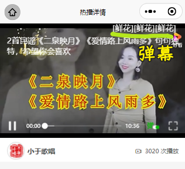
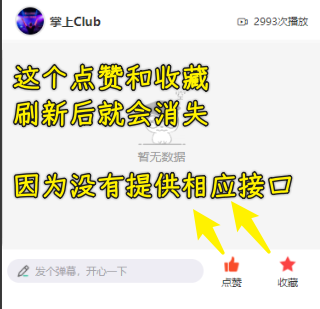

### ✍️ Tangxt ⏳ 2021-12-29 🏷️ uni-app

# 第 10 章 热播模块

### <mark>1）开篇</mark>

在本章节中我们将要完成【慕课热搜】中的最后一个模块【热播】。


【热播模块】分为两个页面：

1. 热播列表
2. 热播详情

对于【热播列表】而言，包含：

1. 下拉刷新  + 上拉加载更多
2. 视频播放（`video` 组件）

对于【热播详情】而言，包含：

1. 视频播放（`video` 组件）
2. 分页的弹幕列表
3. 发表弹幕
4. 点赞 + 收藏

所以说，对于【热播】模块而言，核心的点在于【视频播放】，也就是 `video` 组件的用法。

那么下面就让我们来开始【热播模块】的开发吧

> 控制台出现「渲染层网络层错误」 -> 这不是前端代码的问题，这是视频请求的问题！ -> 我们可以忽略它

### <mark>2）热播列表 - 获取热播列表数据</mark>

1. 定义接口：`api/video`
2. 在 `hot-video` 中获取数据


> [Demo](https://github.com/ppambler/imooc-uni-app/commit/b6c14dd)

### <mark>3）热播列表 - 渲染 UI 结构</mark>

文档：[video - uni-app 官网](https://uniapp.dcloud.io/component/video)

效果：


> [Demo](https://github.com/ppambler/imooc-uni-app/commit/b07a3aa)

### <mark>4）热播列表 - 列表的下拉刷新与上拉加载</mark>

1. `hot-video`：在页面中使用 `mescroll` 比较简单（之前我们是在组件中使用）
   1. 导入 `mescroll-body`
   2. 导入 `mixin`
   3. 注册 `mixin`
   4. 实现回调方法


> [Demo](https://github.com/ppambler/imooc-uni-app/commit/cf950bb)

### <mark>5）热播列表 - 点击进入详情页</mark>


> [Demo](https://github.com/ppambler/imooc-uni-app/commit/feda621)

### <mark>6）热播详情 - 渲染详情页面的视频组件</mark>

没有获取单个视频的接口，我们需要把单个视频的数据传给热播详情页

因为在 `Uniapp` 中无法直接通过 `navigateTo` 方法，传递一个复杂的对象。 -> `url` 参数是有大小限制的

在为了不影响 **简洁数据流** 的前提下，我们通过 `vuex` 来保存当前用户点击的 `video` 数据。

1. 创建 `store/video` 模块
2. 在 `store/index` 中注册 `video` 模块
3. 监听 `hot-video-item` 中 `info` 的点击事件，对父组件传递事件
4. 在 `hot-video` 页面中进行跳转
5. 在 `video-detail` 中获取 `video` 数据，同时构建页面

效果：


> [Demo](https://github.com/ppambler/imooc-uni-app/commit/d31fbfa)

### <mark>7）热播详情 - 展示视频弹幕</mark>

想要展示视频弹幕，那么首先我们需要获取到 **视频弹幕数据**

1. 定义 `api` 请求接口
2. 在 `video-detail` 中调用该接口，并把获取到的数据通过 `danmu-list` 绑定到 `video` 组件中
3. 注意：为了防止无法找到弹幕视频的情况，我们可以使用该数据来进行调试

``` js
{
  id: "8094282426594482339",
  title: "2 首民谣《二泉映月》《爱情路上风雨多》句句独特，希望你会喜欢",
  author_avatar: "https://pic.rmb.bdstatic.com/bjh/user/2d39834af3abb3648bf481159561c25f.jpeg?x-bce-process=image/resize,m_lfit,w_200,h_200&autime=11152",
  poster_small:
    "https://tukuimg.bdstatic.com/processed/2cfa34e3dc199083960fdc0281edd472.jpeg@s_0,w_660,h_370,q_80",
  poster_big:
    "https://tukuimg.bdstatic.com/processed/2cfa34e3dc199083960fdc0281edd472.jpeg@s_0,w_660,h_370,q_80",
  poster_pc:
    "https://tukuimg.bdstatic.com/processed/2cfa34e3dc199083960fdc0281edd472.jpeg@s_0,w_660,h_370,q_80,f_webp",
  source_name: "小于歌唱",
  play_url:
    "http://vd2.bdstatic.com/mda-mjackqq9kjp5tdpi/cae_h264_nowatermark/1633943179857973669/mda-mjackqq9kjp5tdpi.mp4?v_from_s=hkapp-haokan-hbe",
  duration: "06:37",
  url: "https://haokan.hao123.com/v?vid=8094282426594482339&pd=&context=",
  show_tag: 0,
  publish_time: "2021 年 06 月 13 日",
  is_pay_column: 0,
  like: "163",
  comment: "41",
  playcnt: "3020",
  fmplaycnt: "3020 次播放",
  fmplaycnt_2: "3020",
  outstand_tag: "",
};
```

只需要把该数据指定到 `vuex` 的 `video` 模块下的 `videoData` 中，然后指定 **编译模式到 `video-detail` 即可**

效果：



> [Demo](https://github.com/ppambler/imooc-uni-app/commit/e1f1e9a)

### <mark>8）热播详情 - 渲染全部弹幕模块</mark>

弹幕的数据直接使用 `getVideoDanmuList` 的接口即可，如果想要实现分页功能，可以使用 `/video/comment/list` 接口获取分页的评论数据

提供了两个接口，一个是获取全部弹幕数据，也就是全部评论数据（选择这个），另一个则是分页获取（用于熟悉之前的分页评论功能，用作练习）

效果：


> [Demo](https://github.com/ppambler/imooc-uni-app/commit/acbcf62)

💡：使用组件的意义？


### <mark>9）热播详情 - 渲染底部功能区</mark>

- 此处的 **底部功能区** 与 文章详情的底部功能区一样，所以可以复用 `article-operate` 组件
- 功能区的 `placeholder` 与文章详情 **不同** ，可以通过 `props` 指定
- 在 `video-detail` 中指定 `placeholder`

效果：


> [Demo](https://github.com/ppambler/imooc-uni-app/commit/c2e44c6)

### <mark>10）热播详情 - 发布弹幕</mark>

- 发布弹幕需要用到 uni-app 提供方法：[视频组件控制 - uni-app 官网](https://uniapp.dcloud.io/api/media/video-context?id=createvideocontext)
- 请求接口：用之前发送评论的接口

效果：


> [Demo](https://github.com/ppambler/imooc-uni-app/commit/ff1dc81)

问题：发送三次弹幕，只展示一次弹幕 -> 该`video`组件有 bug

我测试发现，不管发送几次，弹幕始终没有出现

### <mark>11）热播详情 - 解决弹幕不显示的问题</mark>

**原因：**

弹幕之所以不显示，是因为我们修改了 `danmuList` 的数据源导致的，这个问题其实为 `video` 组件的 `bug` 。

**解决方案：**

深拷贝 `danmuList` 到一个新的数组，用于展示 **弹幕列表**

效果：


> [Demo](https://github.com/ppambler/imooc-uni-app/commit/d8092c3)

### <mark>12）热播详情 - 定义弹幕的随机颜色值</mark>

1. 在 `utils` 下创建一个新的 `js` 文件，用来定义 **随机颜色方法**：`getRandomColor`
2. 在 `video-detail` 中使用该方法

效果：


> 虽有弹幕都是彩色的，不管是默认已存在的，还是刚刚发的

> [Demo](https://github.com/ppambler/imooc-uni-app/commit/5689be9)

### <mark>13）热播详情 - 处理弹幕列表数据加载动画</mark>

当弹幕为空的时候，我们需要给用户一个提示。

以此，弹幕的状态可分为三种：

1. 数据加载中
2. 无弹幕数据
3. 有弹幕数据

那么我们分别对这三种情况进行处理


> [Demo](https://github.com/ppambler/imooc-uni-app/commit/945b45a)

### <mark>14）热播详情 - 点赞、收藏的实现思路</mark>

在前面我们让大家自己实现过 **文章详情的 点赞和收藏 功能**，并且在 `video-detail` 中我们复用了 收藏和点赞的组件，但是大家可以发现，此时  **点赞与收藏** 的功能无法在 `video-detail` 中进行使用。

出现这个问题的原因，是因为此时我们的 `videoData` 数据源，被保存到了 `vuex` 中。如果想要实现 **点赞和收藏** 的功能，那么需要在 **监听到成功事件之后，修改 `vuex` 中的数据**

对于视频的点赞和收藏，并没有提供相应的接口，视频的`id`是用`id`字段，而文章的`id`是用`articleId`，而且即便你点赞和收藏成功了，页面一刷新这也就没了



> [Demo](https://github.com/ppambler/imooc-uni-app/commit/2628828)

### <mark>15）总结</mark>

那么到这里我们整个的 **热播** 功能就全部完成了。

**热播** 功能的完成，也标记着我们整个 **慕课热搜** 业务功能全部搞定。

现在 **慕课热搜** 在微信小程序端运行的时候，我们可以发现无论是 **功能 还是 业务** 上，都是比较完善的。

但是，当我们把 **慕课热搜** 运行到浏览器端的时候，我们发现 **应用会出现非常多的问题。** 

比如：

1. `hot` 列表滚动，`tabs` 置顶效果消失
2. 在火狐浏览器中，横线出现非常粗的滚动条
3. 进行文章详情再返回，会出现 `ui` 错乱
4. 文章详情无法展示
5. 热播视频全部无法播放
6. 登录功能无法使用

等等问题。

那么这些问题，我们怎么处理呢？

请看下一章：《多平台适配》

