### ✍️ Tangxt ⏳ 2021-12-31 🏷️ uni-app

# 第 11 章 多平台适配

1）开篇

在上一章中，我们知道了，当【慕课热搜】运行到 `h5` 端的时候，那么会出现一些问题，这些问题具体有：

1. `hot` 列表滚动，`tabs` 置顶效果消失
2. 在火狐浏览器中，横线出现非常粗的滚动条
3. 进行文章详情再返回，会出现 `ui` 错乱
4. 文章详情无法展示
5. 文章详情样式问题（现在无法看到）
6. 热播视频全部无法播放
7. 登录功能无法使用

那么本章节中，我们就会专门来去处理这些问题。

这些问题处理的过程，也就是 **项目适配到 `h5` 的过程。**

针对每个问题的处理，我们会分成三块来进行讲解，分别是：

1. 分析问题出现的原因
2. 提出对应的解决方案
3. 完成该问题的处理代码

> 这个问题为何会出现？ -> 提出解决这个问题的方案 -> 用代码解决之！

那么一切准备就绪，接下来就进入我们本章节的内容吧。

2）uniapp 中的条件编译

想要搞定适配的功能，那么我们首先需要了解一个东西，那就是：[条件编译](https://uniapp.dcloud.io/platform)

我们可以通过：**特殊的注释作为标记，将注释里面的代码编译到不同平台**。

这样的注释主要有两种：

1. 以 `#ifdef %PLATFORM% ` 开头，以 `#endif` 结尾：仅在某平台存在
2. 以 `#ifndef %PLATFORM%  ` 开头，以 `#endif` 结尾：除了某平台均存在

> `if defined`和`if not defined`，前者是让代码只在这个平台有效，而后者则是让代码不在这个平台有效，而对于其它平台是有效的

其中 `%PLATFORM% ` 表示 **平台名称**

> 平台的取值有：`H5`、`MP-WEIXIN`、`VUE3`等

比如说，我们可以在 `App.vue` 中，写下这样一行代码：

```js
{
  onLaunch: function () {
    /* #ifdef H5 */
    console.log('当前处于 H5 编译平台');
    /* #endif */
    /* #ifndef H5 */
    console.log('当前处于非 H5 编译平台');
    /* #endif */
  },
}  
```

那么 `当前处于 H5 编译平台` 只会在 **浏览器打印**

`当前处于非 H5 编译平台` 只会在 **非浏览器打印**

具体的 `%PLATFORM% `  取值，大家可以参考 [条件编译官方文档](https://uniapp.dcloud.io/platform) ， 这里就不作一一的赘述了。

那么在了解了，条件编译的语法之后，接下来我们就可以处理 多平台适配相关的内容了。

💡：代码测试

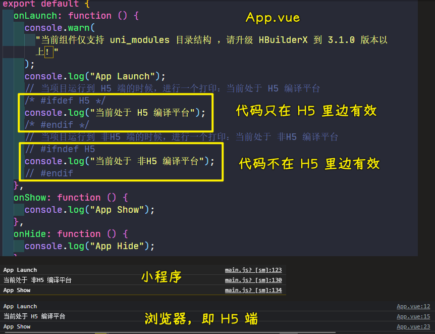

> [Demo](https://github.com/ppambler/imooc-uni-app/commit/1f7a179)

3）多平台适配 - `tabs` 置顶效果消失

1、分析原因

在控制台中检查 `tab-sticky` 的，我们可以发现 它的样式指定其实是没有问题的：

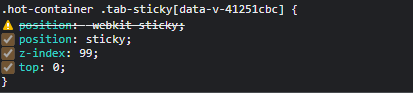

`position: sticky` 依然生效，那么问题是出现在哪里呢？

当我们把页面进行滚动之后，然后再控制台查看 `tab-sticky` 的位置，此时我们就可以发现问题：

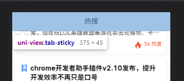

`tab-sticky` 虽然吸顶了，但是它的吸顶位置为 `top:0` 。

这样的效果在 **微信小程序是没有问题的**，但是在 **浏览器端就会被遮挡！**

2、解决方案

明确了原因之后，想要处理这个问题就很容易了。我们只需要在 **浏览器端调整 `top` 的位置就可以了。**

3、处理代码

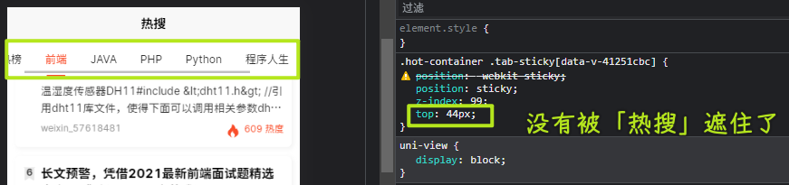

> [Demo](https://github.com/ppambler/imooc-uni-app/commit/fd960f9)

4）多平台适配 - 火狐浏览器处理粗滚动条

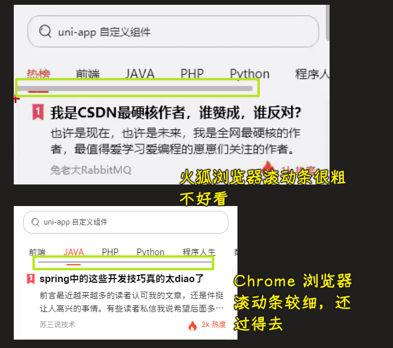

1、分析原因

在浏览器中出现 **粗滚动条** 的原因是因为： **浏览器对滚动条的处理问题**。

2、解决方案

隐藏浏览器滚动条

3、处理代码

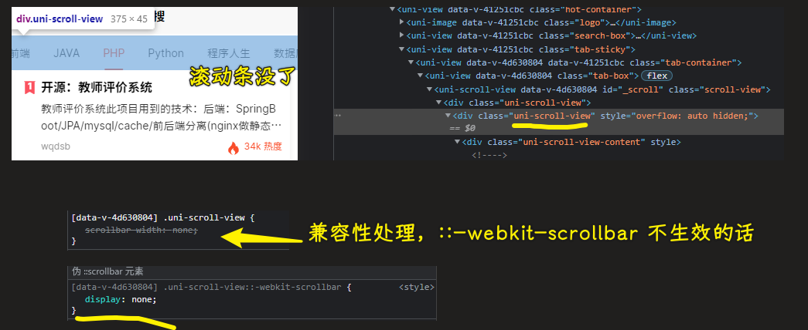

> [Demo](https://github.com/ppambler/imooc-uni-app/commit/d77bee7)

5）多平台适配 - `ui` 错乱 与 文章详情无法展示

1、分析原因

在我们刚进入到首页的时候，我们的 `ui` 是没有任何问题的。但是当我们进入到 **文章详情** 在返回到首页时，我们就会发现：**`item` 的 `ui` 变得错乱了** 

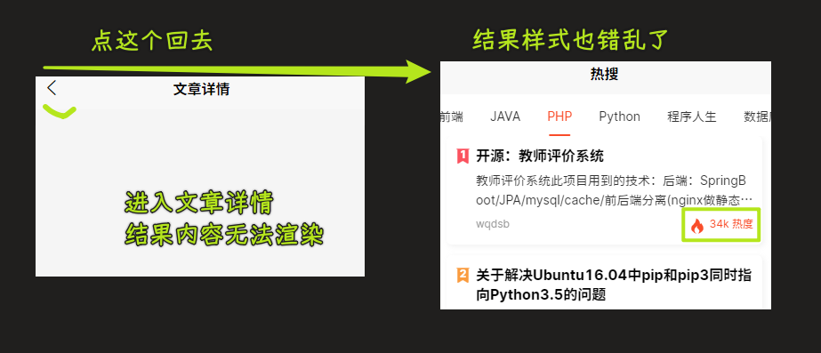

那么想要去分析这个问题的原因，就需要到 **文章详情** 页面，看一下，看看 **文章详情** 究竟做了什么事情。

在 **文章详情** 中，我们之前使用过 `page-meta` 来去处理：**微信小程序中文章详情文字过小的问题**。

而现在在 **浏览器端** 之所以出现这些问题，就是因为 `page-meta` 导致的。

2、解决方案

在 `h5` 中，不使用 `page-mate` ，只使用 `article-detail.scss` 中的 

```css
html {
  font-size: 52px;
}
```

即可

3、处理代码

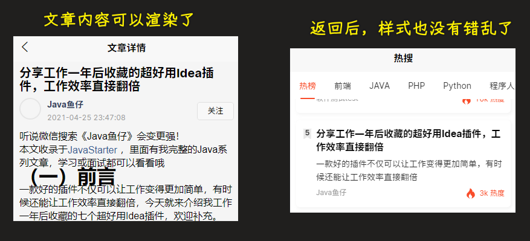

> [Demo](https://github.com/ppambler/imooc-uni-app/commit/ba7ec15)

6）多平台适配 - 文章详情样式处理

1、分析原因

通过控制台查看，我们可以发现 `article-detail.scss` 文件的样式并没有生效，出现这个问题的原因，是因为当 `uni-app` 运行到浏览器端的时候，页面组件中 `style` 标签的引入会失效。

2、解决方案

在 `main.js` 中统一引入

3、处理代码

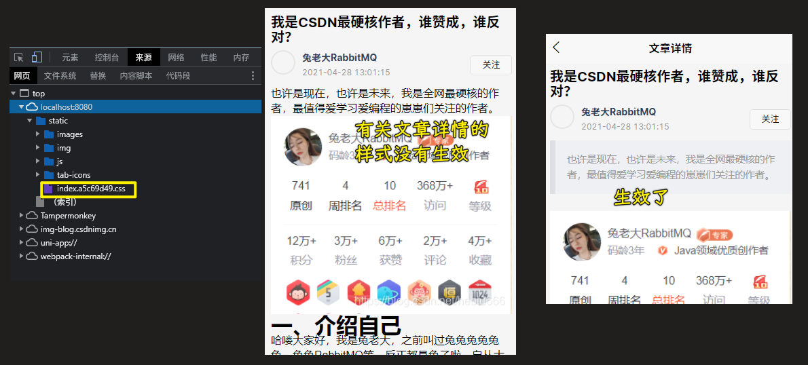

> [Demo](https://github.com/ppambler/imooc-uni-app/commit/50f1c1b)

7）多平台适配 - 热播视频全部无法播放

1、分析原因

在浏览器中视频无法播放，并且会出现 `403` 的错误。

对于这一块，大家需要首先先明确 `403` 错误表示的是什么意思：

> 403 错误是一种在网站访问过程中，常见的错误提示，表示资源不可用。 服务器理解客户的请求，但拒绝处理它，通常由于服务器上文件或目录的权限设置导致的 WEB 访问错误。

简单来说就是：服务端不愿意处理你的请求。

在某些网站中，服务端只会处理 **它信任的客户端请求，而不愿意处理它不认识的客户端的请求。** 

而想要解决这个问题，我们就需要对 **请求进行伪装**，我们无法伪装成 **他信任的人**，但是我们可以 **隐藏身份，让服务端不确定它是不是认识你。** 这样在默认情况下，**服务端就 “勉为其难” 的处理你的请求**。

> 不认识你就行了？

那么想要进行伪装，就需要使用到  [referrer](https://developer.mozilla.org/zh-CN/docs/Web/HTTP/Headers/Referrer-Policy) 的 `no-referrer` 指令

2、解决方案

1. 在项目的根目录创建 `index.html` 文件，作为 **根模板**。（可参考：[自定义模板](https://uniapp.dcloud.io/collocation/manifest?id=h5) 相关文档）
2. 添加 `<meta name="referrer" content="no-referrer" />` 标签
3. 在 `manifest.json->h5->template` 节点中关联这个`html`文件的路径
   
   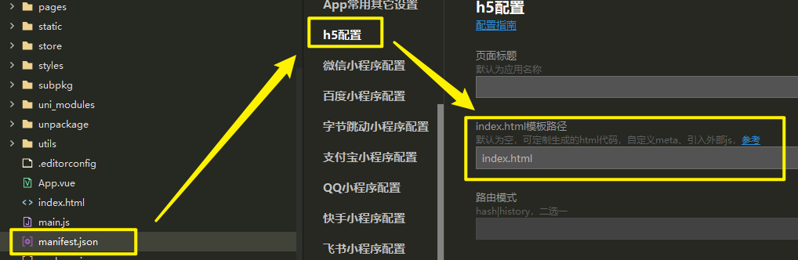
   
4. 重新编译项目到浏览器

注意，这个项目在创建的时候，给了这个模板：

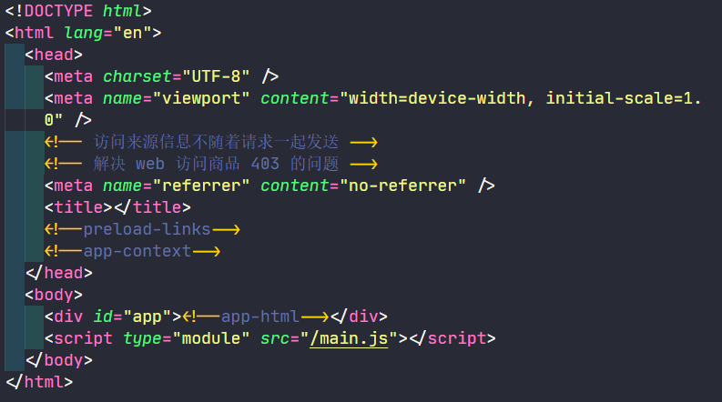

它的效果是：

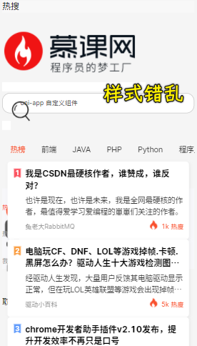

拷贝官方的自定义模板就好了

3、处理代码


不管是图片 403，还是视频 403，现在统统都没有了

> [Demo](https://github.com/ppambler/imooc-uni-app/commit/b59e813)

8）多平台适配 - 一键登录功能

1、分析原因

在 `my-login` 中，只处理了 **微信一键登录** 的功能

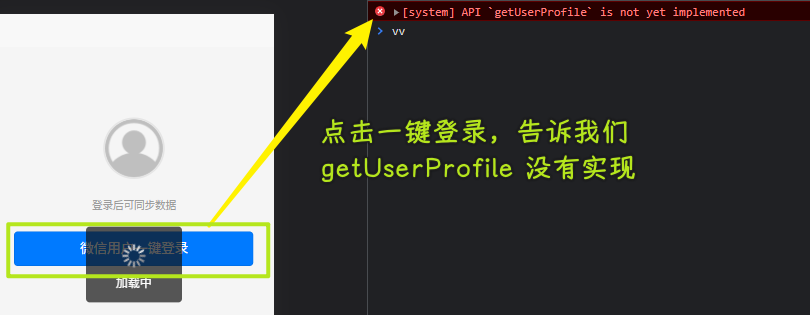

2、解决方案

按照接口，直接处理对应数据即可

给了一个模拟的用户信息，一般在 H5 端是让用户注册，让用户自己填信息！而微信小程序不需要注册，直接用该微信用户的信息就好了！

3、处理代码

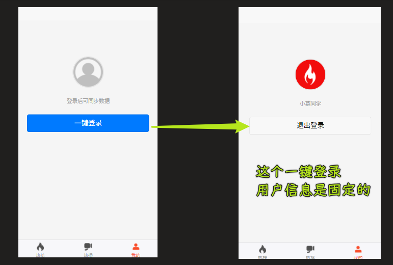

> [Demo](https://github.com/ppambler/imooc-uni-app/commit/4ac1980)

9）总结

本章节中，我们处理了 **多平台适配** 的问题，其中的核心 `api` 就是 **`uni` 所提供的条件编译语法**

那么到现在为止【慕课热搜】已经可以在：

1. 微信小程序
2. `h5`

进行运行了。这样其实就已经达到了我们的目的。

这里大家要注意，在实际的开发场景中，我们去进行 **多平台适配** 的时候，并不是适配的越多越好的。

> 我们这里只适配了 H5 端 和 微信小程序

为啥不是适配越多越好？

因为适配的越多，证明我们需要付出的成本越大。

所以，在实际开发场景里边，为了控制成本，通常我们会根据我们的应用属性，来决定我们的应用要适配哪些平台。

比如说：

如果你的应用是涉及到 **支付** 相关的，那么一般需要适配：

- 微信小程序
- 支付宝小程序（适配支付宝小程序同样用条件编译语法来搞）

如果是非支付相关的（如当前的这个慕课热搜项目），一般只需要：

- 微信小程序
- `h5` 

就可以了。
