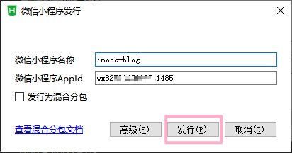
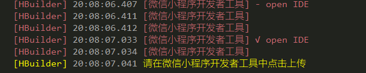
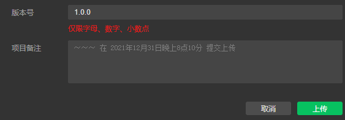
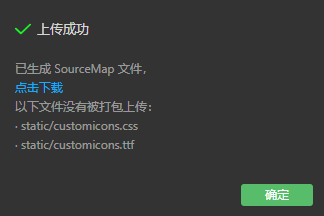
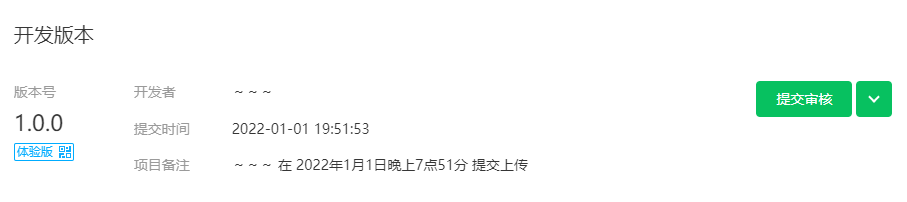
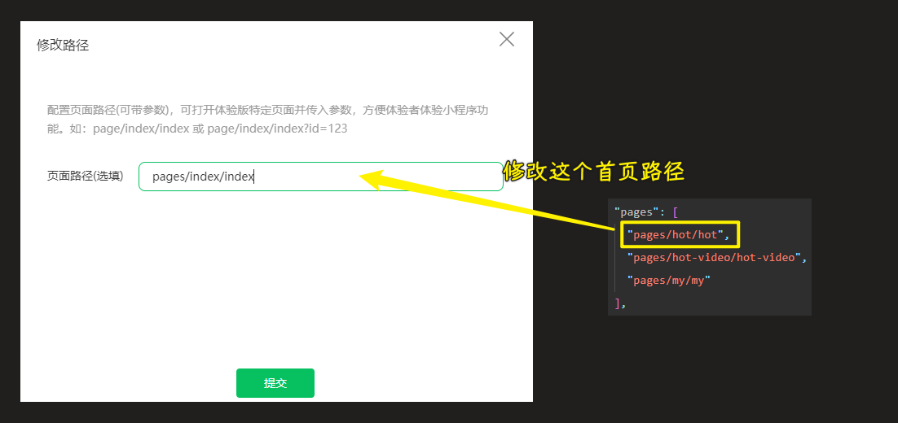
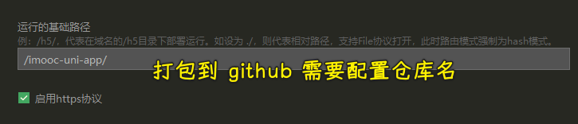
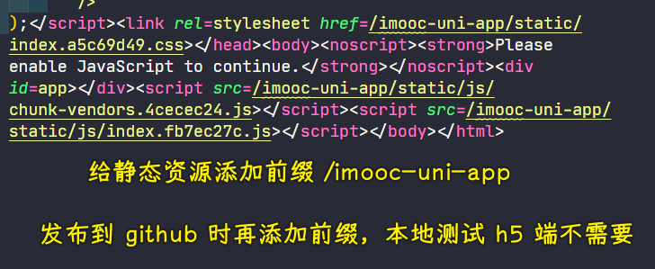

### ✍️ Tangxt ⏳ 2021-12-31 🏷️ uni-app

# 第 12 章 项目发布

### <mark>1）开篇</mark>

截止到此时，我们整个的【慕课热搜】项目就已经全部开发完成了。

那么接下来我们就可以打包上线这个项目。

我们这里的打包会分为：

1. 微信小程序
2. `h5`

两个平台的项目打包。

那么下面我们就分别来去看。

### <mark>2）打包微信小程序</mark>

1. 打开 `HBuilder`
2. 打开当前要打包的项目
3. 点击发行，找到【小程序 - 微信】
4. 确认小程序名称和 `appid`，确认无误点击 【发行】
   
   
   
5. 等待控制台编译
   
   
   
6. 编译完成之后，会自动打开【微信开发者工具】
7. 点击【上传】即可
   
   
   
   
   
8. 后续流程可参考【02-小程序初体验】 - 【项目发布流程】

发布体验版：



访问体验版（仅限管理员、项目成员、体验成员）：


> 不发布了，一个账号只能发布一个小程序，而这个项目只是用作学习罢了！

💡：上传后，预览体验版，页面空白



---

💡：小程序上传的项目配置项

``` json
{
  "description": "项目配置文件。",
  "packOptions": {
    "ignore": []
  },
  "setting": {
    "urlCheck": true,
    "es6": true,
    "enhance": true,
    "postcss": true,
    "preloadBackgroundData": false,
    "minified": true,
    "newFeature": false,
    "coverView": true,
    "nodeModules": false,
    "autoAudits": false,
    "showShadowRootInWxmlPanel": true,
    "scopeDataCheck": false,
    "uglifyFileName": true,
    "checkInvalidKey": true,
    "checkSiteMap": true,
    "uploadWithSourceMap": true,
    "compileHotReLoad": false,
    "lazyloadPlaceholderEnable": false,
    "useMultiFrameRuntime": true,
    "useApiHook": true,
    "useApiHostProcess": true,
    "babelSetting": {
      "ignore": [],
      "disablePlugins": [],
      "outputPath": ""
    },
    "enableEngineNative": false,
    "useIsolateContext": true,
    "userConfirmedBundleSwitch": false,
    "packNpmManually": false,
    "packNpmRelationList": [],
    "minifyWXSS": true,
    "disableUseStrict": false,
    "showES6CompileOption": false,
    "useCompilerPlugins": false
  },
  "compileType": "miniprogram",
  "libVersion": "2.19.6",
  "appid": "你的小程序 id",
  "projectname": "imooc-blog",
  "debugOptions": {
    "hidedInDevtools": []
  },
  "scripts": {},
  "staticServerOptions": {
    "baseURL": "",
    "servePath": ""
  },
  "isGameTourist": false,
  "condition": {
    "search": {
      "list": []
    },
    "conversation": {
      "list": []
    },
    "game": {
      "list": []
    },
    "miniprogram": {
      "list": []
    }
  }
}
```

💡：浏览文章时，代码高亮

选择代码高亮样式：

- [PrismJS/prism-themes: A wider selection of Prism themes](https://github.com/PrismJS/prism-themes)
- [prism.css](https://gist.github.com/HallerPatrick/0fc87eb900b5b85e5c9c7417ba1892bb)
- [kaicataldo/prism-material-themes: 🎨 Themes for the Prism syntax highlighting library based on the Material color scheme](https://github.com/kaicataldo/prism-material-themes)
- [Download ▲ Prism](https://prismjs.com/download.html#themes=prism-funky&languages=markup+css+clike+javascript)

压缩 CSS 代码：

- [在线 JS/CSS/HTML 压缩](https://tool.oschina.net/jscompress/)

💡：主包超出限制

把 `project.config.json` 文件里边的`minified`字段设置为 `true` 即可

➹：[预览上传一直报错 Error: 系统错误，错误码：80200,main? - 微信开放社区](https://developers.weixin.qq.com/community/develop/doc/0008848f00c358562a7c9908256400)

💡：打包上线不输出`console.log`

- [uni-app 生产环境 去除调试打印 - 掘金](https://juejin.cn/post/6844904205430292488)
- [vue.config.js - uni-app 官网](https://uniapp.dcloud.io/collocation/vue-config)

### <mark>3）打包 h5 页面</mark>

1. 打开 `HBuilder`
2. 打开当前要打包的项目
3. 点击发行，找到【网站 - PC web 或手机 H5 】
4. 确认【网站标题】，无需【网站域名】，直接点击发行即可 -> 需要填写`DCloud APPID`（可以重新获取），不填写这个无法打包
5. 等待项目编译
6. 编译成功后，项目会被导出到指定路径
7. 找到该路径下的文件，即为【打包后的文件】
8. **注意：** 不可直接打开 `index.html` 进行访问，需要通过 `web 服务` 进行访问！

打包到 Github：





### <mark>4）总结</mark>

本章节我们讲解了如何打包：

1. 微信小程序
2. `h5` 客户端

那么如果大家想要打包其他平台应用的话，也非常简单，同样在发行下点击对应的按钮即可。
