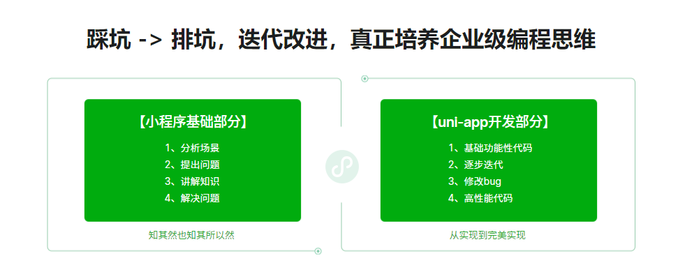

### ✍️ Tangxt ⏳ 2022-01-01 🏷️ uni-app

# 第 13 章 课程

### <mark>1）总结</mark>

那么到这里我们整个的课程就已经全部完成了。

整个课程有接近【30 个小时】 的视频量了，在实战课中应该算是体量比较大的了。

整个课程我们先去讲解了 【微信小程序基础】，然后又去讲解了 【慕课热搜】的 `uniapp` 项目开发。

也希望无论是 【没有工作经验的同学】还是【具备一定工作经验（`1~2`年）】的同学都能够从这门课中有所收获。或者能够找到一个满意的工作，或者能够达到升职加薪的目标。如果是这样的话，那么我会很开心的 😀

大家在学习的过程中，有任何的问题，都可以在评论区跟我留言，我看到了会立刻进行回复。

最后祝大家：**学习愉快，前程似锦~~~**

我们下次再见！

---

💡：学习目标？

💡：做了什么？

💡：收获了什么？

