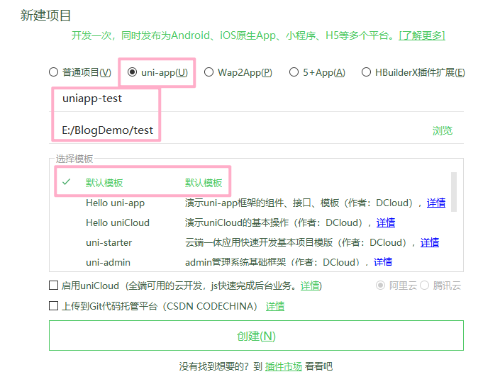
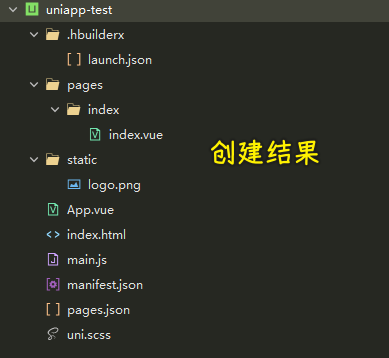
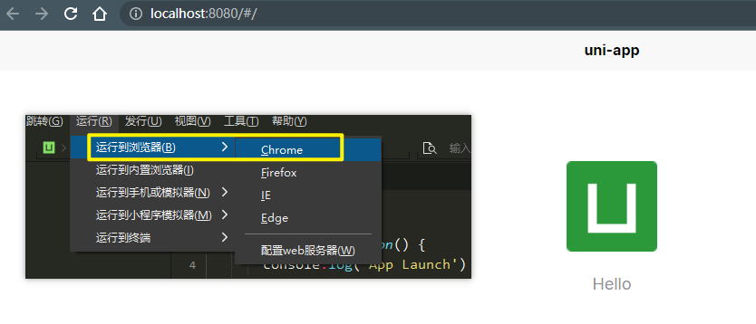

### ✍️ Tangxt ⏳ 2022-01-21 🏷️ uni-app

# 01-工具介绍、新建项目及插件配置

> 软件开发的时间通常是这样的：一开始的 90% 开发工作用掉了整个计划 90% 的时间，剩下的 10% 同样需要整个计划 90% 的时间，而最终发布前的修改也是如此。—— 汤姆 · 嘉吉

创建项目：

> 选择 uni-app(U) 创建项目是为了开发者编写一套代码，可发布到 iOS、Android、H5、以及各种小程序

目录结构：

* pages 业务页面文件存放的目录
* static 静态文件目录 (images 之类）
* App.vue App 全局应用配置
* main.js 初始化入口文件
* manifest.json 多端配置信息
* pages.json 配置页面路由、导航等信息，类似原生小程序的 app.json

建议安装的插件：

* NPM -> 这个没搜到
* 内置浏览器
* 内置终端
* App 真机运行
* uni-app 编译
* Git 插件
* js-beautify -> 这个没搜到
* prettier
* htmlhint
* stylelint
* eslint-plugin-vue
* eslint-js
* js 压缩
* css 压缩
* scss/sass 编译
* es6 编译

其余根据自己需要安装

运行 Uniapp 项目主要有 3 种方式：

* 浏览器
* 小程序
* 手机 App

