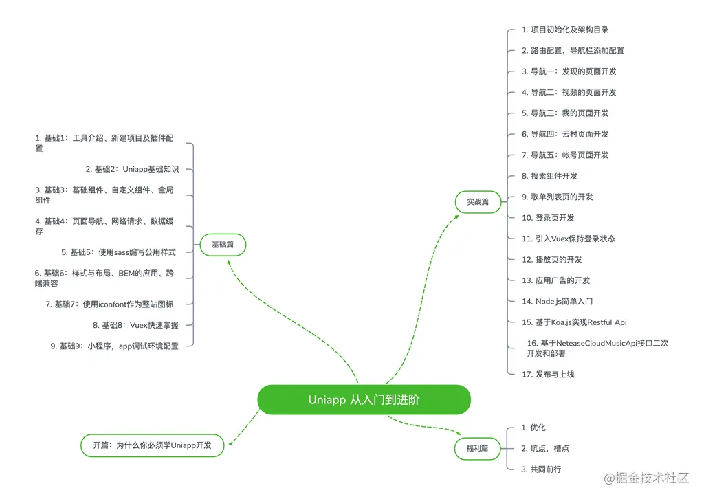

### ✍️ Tangxt ⏳ 2022-01-21 🏷️ uni-app

# 02-uni-app 从入门到进阶

> 程序界的「二八定律」，百分之八十的问题可以运用百分之二十的知识来解决，而剩下的百分之二十的问题需要运用百分之八十的知识来解决。准备好那百分之八十的知识，才会在遇到有挑战的问题时更加游刃有余，机会永远留给准备好的人

- 课程地址：[Uniapp 从入门到进阶 - 阿面 - 掘金小册](https://juejin.cn/book/6844733817438076936?scrollMenuIndex=0)
- 课程代码：[front-end-class/uniapp-music-code: 《Uniapp 从入门到进阶》章节代码和完整项目](https://github.com/front-end-class/uniapp-music-code)

## ★介绍

从基础到实战，详细讲解跨平台应用开发的方方面面，包含 Uniapp 开发常用知识点，基础 api，前端交互、组件封装，后端 Nodejs 开发、前后端联调和调优部署，是一套非常全面的综合课程。

- 目的：想独立开发小程序？或者是开发一款 app？
- 目标：实现一个某易音乐项目的开发

本小册由三部分组成：

基础--Uniapp 快速入门
实战--Uniapp 进阶，音乐项目实战和后端 Nodejs 开发
福利-- 优化，避坑和经验分享

## ★目录

> [FAQ](./faq.md)

> 基础

- [01-工具介绍、新建项目及插件配置](./01.md)

## ★需要记忆的知识点

- 在 Uniapp 中不能使用 `*` 选择器
- Uniapp 默认为 `rpx` 。这是一种作为 Uniapp 可跨端的通用单位
