### ✍️ Tangxt ⏳ 2022-02-16 🏷️ 小程序

# 01-⼩程序开发背景和项⽬介绍

## ★了解各个小程序的现状以及它们之间的对比

### <mark>1）什么是小程序？</mark>

### <mark>2）各个平台什么时候上线小程序的？</mark>

### <mark>3）各个平台为什么都需要支持小程序呢？</mark>

### <mark>4）小程序由谁来开发？</mark>

## ★小程序的技术选型

### <mark>5）开发小程序的技术选型</mark>

场景：公司要做一个小程序产品，所以你打算要用什么技术来搞呢？

uni-app 和 taro：

> 虽然我们是 coder，但站在工作角度上来说，我们的职责是前端，所以我们的侧重点是在前端！因此过多地去学习移动端的技术，不是特别有必要！

## ★（掌握）开发前的准备工作

### <mark>6）需要掌握的预备知识</mark>

### <mark>7）注册账号 – 申请 AppID</mark>

本地测试可以用同一个 APP ID

➹：[开发多个小程序时，能使用同一个 appid 吗？ - 微信开放社区](https://developers.weixin.qq.com/community/develop/doc/00004aa53104b83244391ddf15b000)

### <mark>8）下载小程序开发工具</mark>

### <mark>9）使用 VSCode 开发</mark>

## ★（掌握）小程序项目创建和代码结构

### <mark>10）创建小程序项目</mark>

- 微信云开发 -> 提供后端服务，可以让你不用购买云服务器 -> 基本功能不用付费，加资源要付费
  - 可实现的功能
    - 如：收藏、喜欢、历史记录等功能

### <mark>11）小程序项目结构</mark>

💡：熟悉一个小程序项目里边一个页面到底有啥代码结构

例子：

例子：

## ★小程序案例演练和 VSCode 使用

💡：不管是学 Vue、React，还是小程序，先完成这三个案例

💡：小程序的代码逻辑和 Vue、React 非常相似

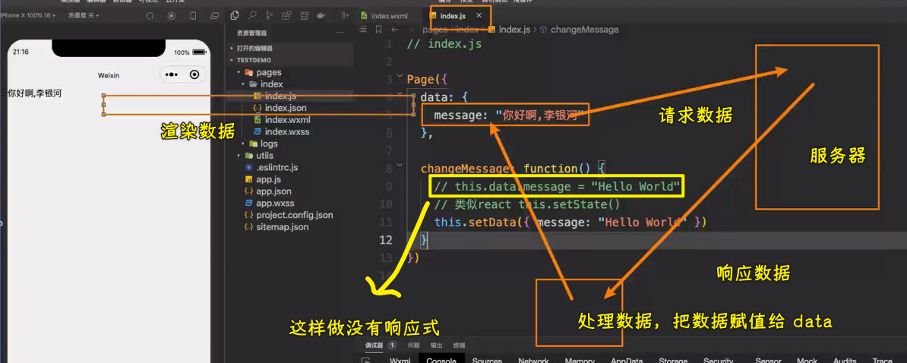

小程序的开发模式非常简单！

💡：`*this`？

> 保留关键字 `*this` 代表在 for 循环中的 item 本身，这种表示需要 item 本身是一个唯一的字符串或者数字

➹：[列表渲染 - 微信开放文档](https://developers.weixin.qq.com/miniprogram/dev/reference/wxml/list.html#wx-key)
➹：[微信小程序： wx:key 详解 - 简书](https://www.jianshu.com/p/e81d29b01fbe)

💡：使用 VSCode 编写小程序代码

1. 安装`WXML`插件
2. 模拟器抽离出来置顶

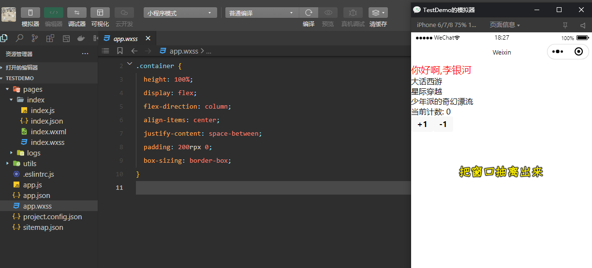

缺点：不能直接从 VSCode 那里看到控制台的内容，需要切换到小程序开发者工具

## ★掌握对小程序官方文档的阅读

### <mark>11）阅读官方文档</mark>

不管你是做前端开发，还是后端开发，遇到问题，请阅读官方文档！

> [微信开放文档](https://developers.weixin.qq.com/miniprogram/dev/framework/)

我们只关注`开发`！

1. 从 0 开始学习小程序？ -> 先看「指南」 -> 同理学习 webpack 也是如此，也是从官方文档的指南开始，也就是 Guides 开始 -> 边看边演练
2. 框架 -> 配置、接口、WXML、WSS 语法
3. 组件 -> 查询组件的属性，以及可以绑定的事件 -> 提供的内置组件越多，意味着我们要去编写的自定义组件越少 -> 可以组合两个或几个内置组件来复用
4. API -> 一般以`wx.`开头，调用全局功能
5. 平台能力 -> 直播、商城交易等
6. 服务端 -> 和微信沟通，需要调用微信提供的 API
7. 工具 -> 叫你如何更好地使用微信开发者工具
8. 云开发 -> 没有服务器？使用云开发来搞
9. 云托管 -> 提供服务
10. 更新日志 -> 什么时候更新了哪些东西

重点看「指南」，过一遍，演练一遍即可，其它的用到了就查！

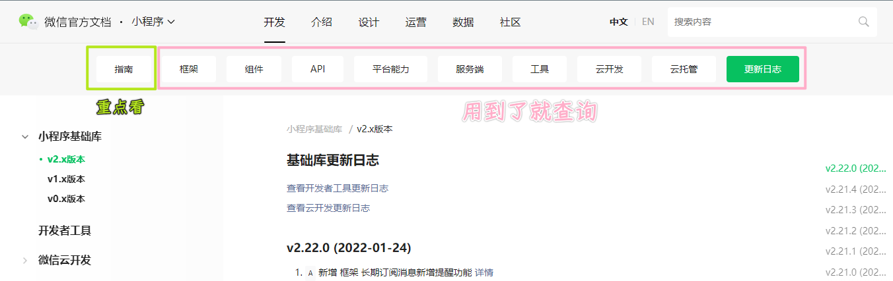

阅读官方文档是一种很重要的能力，不管你是做前端开发，还是 Java 开发，还是其它开发，阅读官方文档是最靠谱的，其余谷歌搜索等，不是那么靠谱

遇到不会的 API？ -> 第一个想到的是查官方文档

### <mark>12）创建项目</mark>

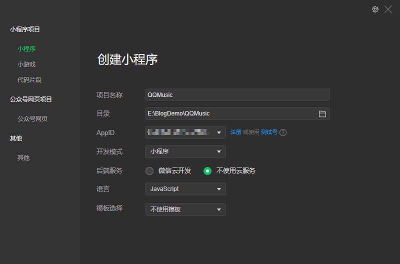

重点是状态管理 -> 用老师自己封装的库

删掉默认生成的页面，会报错 -> 小程序至少要有一个页面

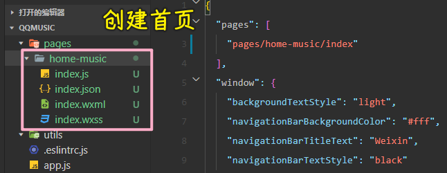

💡：创建 tabBar

可以自己定义，也可以用微信提供给我们的

## ★了解音乐数据和接口文档

### <mark>12）视频页面</mark>

先做这个，因为比较简单

数据源 -> 网易 -> 因为它是 MIT 协议的，限制少 -> 建议把数据缓存到自己的数据库里边，以防接口不能用

> [网易云音乐 NodeJS 版 API](https://binaryify.github.io/NeteaseCloudMusicApi/#/)

其它源，比如 QQ 音乐，是 GMU 的，不适合讲课

> [jsososo/QQMusicApi: 基于 Express + Axios 的 QQ 音乐接口 nodejs 版](https://github.com/jsososo/QQMusicApi)

总之，数据不重要，重要的是你是如何通过代码来组织这些数据的……

接口文档：

> baseURL：<http://123.207.32.32:9001>

这个地址跟上路径和参数就可拿到 JSON 数据

## ★掌握 Video 页面数据请求和网络分层封装

💡：为啥要对网络请求 API 进行二次封装？

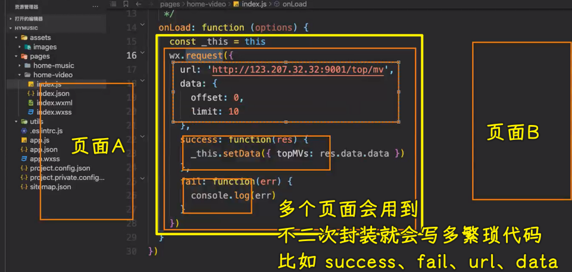

第一版：

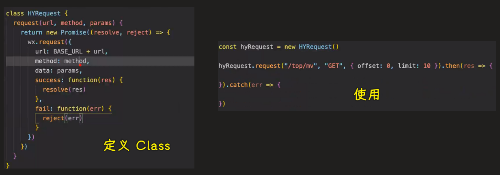

第二版：

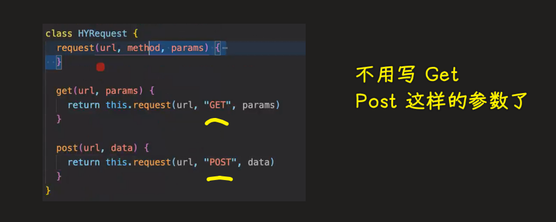

💡：网络请求分层架构

针对参数……也就是少传参数

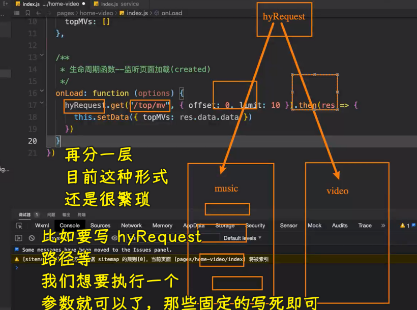

添加一个`api_video.js`

效果：

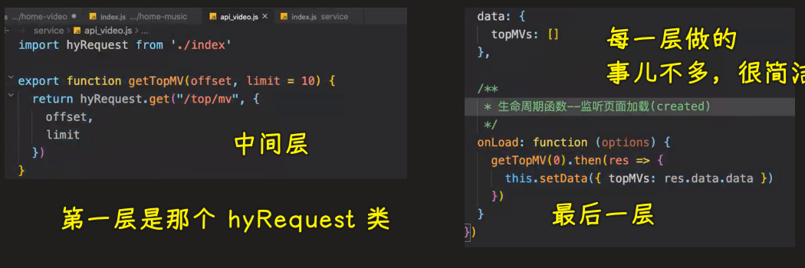

方便我们后续维护，不然，这一坨那一坨的，看起来，眼睛都花了

什么时候要对网络请求进行分层架构？ -> 一个页面需要用多次，如果一个页面只用一次，那就没有必要弄了！

## ★代码

> [Demo](https://github.com/ppambler/QQMusic/commit/8554734)

效果：

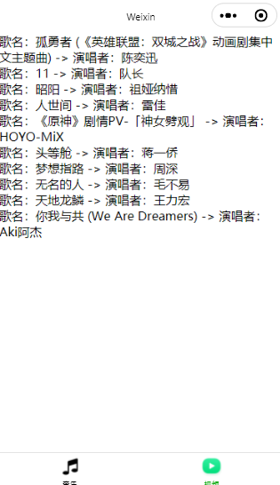