### ✍️ Tangxt ⏳ 2022-02-16 🏷️ 小程序

# 01-⼩程序开发背景和项⽬介绍

## ★了解各个小程序的现状以及它们之间的对比

1）什么是小程序？

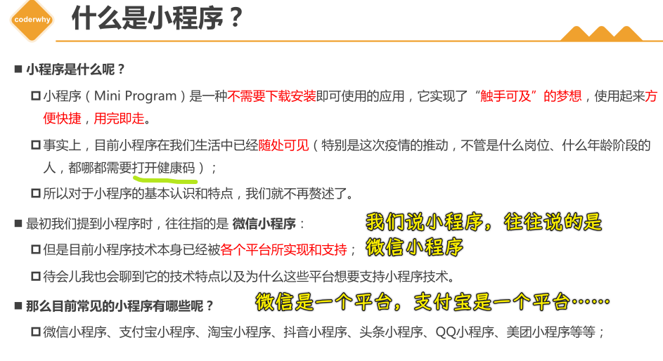

2）各个平台什么时候上线小程序的？

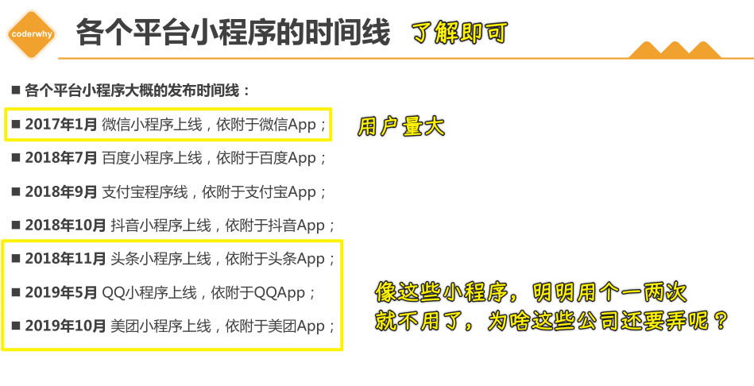

3）各个平台为什么都需要支持小程序呢？

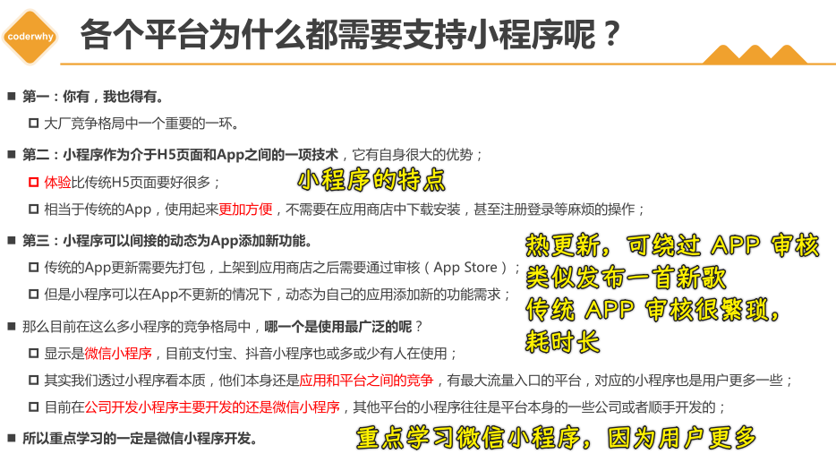

4）小程序由谁来开发？

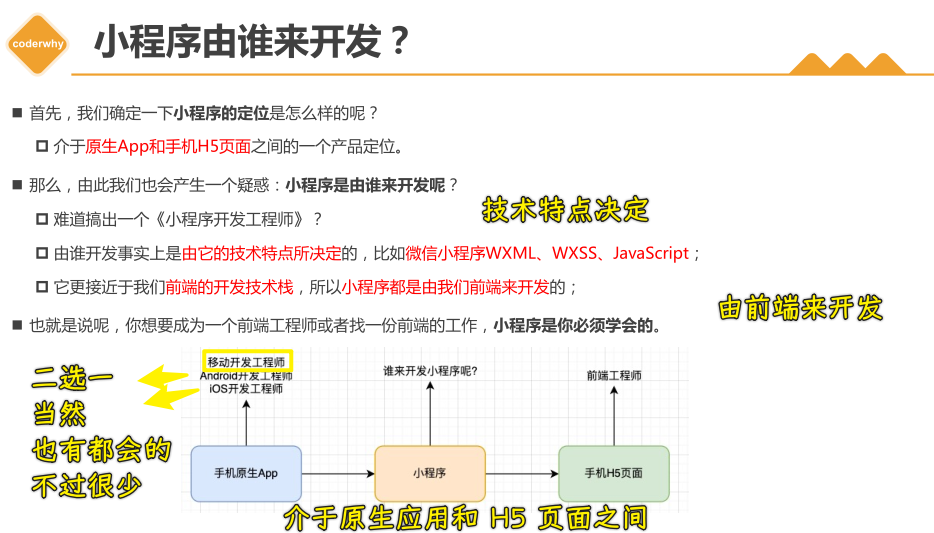

## ★小程序的技术选型

5）开发小程序的技术选型

场景：公司要做一个小程序产品，所以你打算要用什么技术来搞呢？

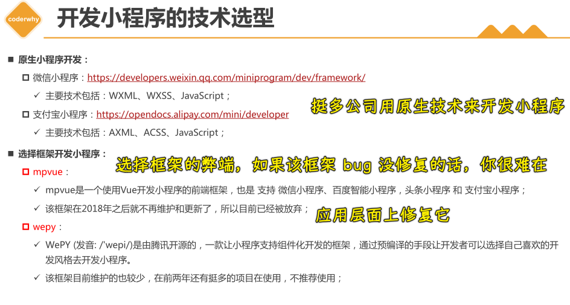

uni-app 和 taro：

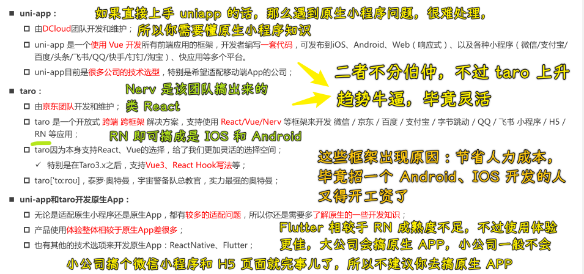

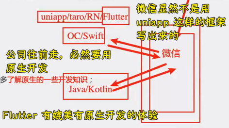

> 虽然我们是 coder，但站在工作角度上来说，我们的职责是前端，所以我们的侧重点是在前端！因此过多地去学习移动端的技术，不是特别有必要！

## ★答疑

💡：什么是混合开发？

RN -> JSBridge -> IOS/Andriod

➹：[搞定混合开发面试，这一篇就够了！ - 掘金](https://juejin.cn/post/6844904136450768909)

💡：框架开发和原生开发？

> 用原生技术开发

Vue -> WXML、WXSS、JavaScript

## ★（掌握）开发前的准备工作

6）需要掌握的预备知识

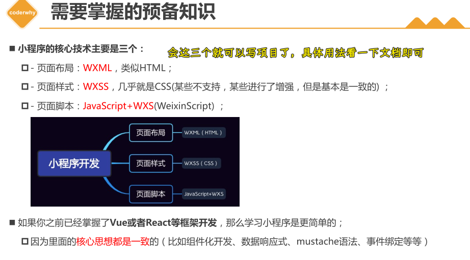

7）注册账号 – 申请 AppID

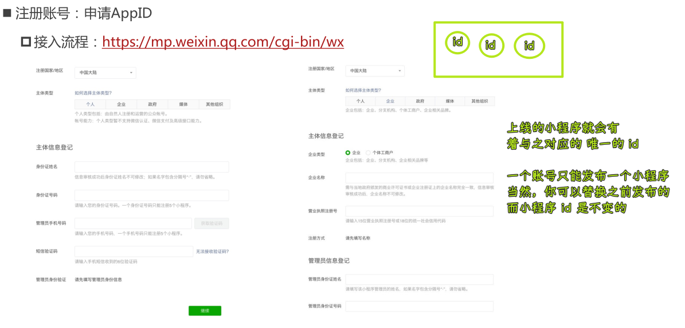

本地测试可以用同一个 APP ID

➹：[开发多个小程序时，能使用同一个 appid 吗？ - 微信开放社区](https://developers.weixin.qq.com/community/develop/doc/00004aa53104b83244391ddf15b000)

8）下载小程序开发工具

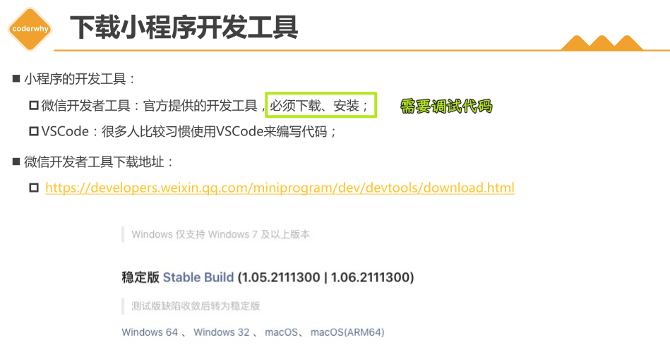

9）使用 VSCode 开发

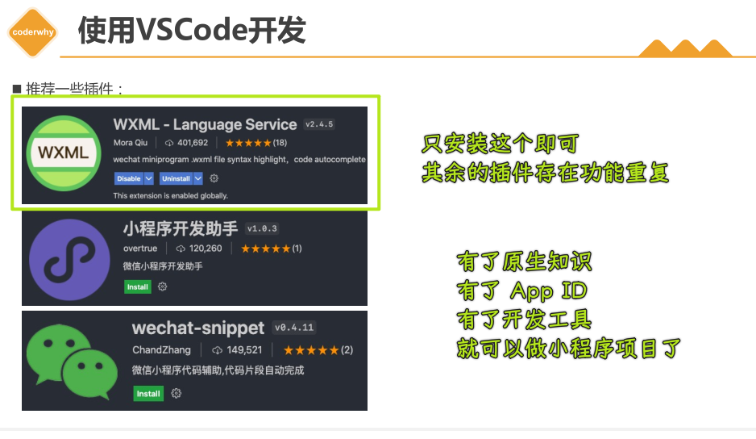

## ★（掌握）小程序项目创建和代码结构

10）创建小程序项目

- 微信云开发 -> 提供后端服务，可以让你不用购买云服务器 -> 基本功能不用付费，加资源要服务
  - 可实现的功能
    - 如：收藏、喜欢、历史记录等功能

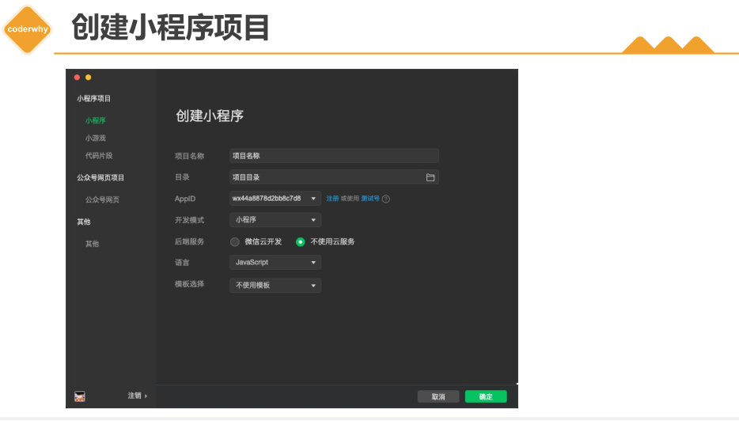

11）小程序项目结构

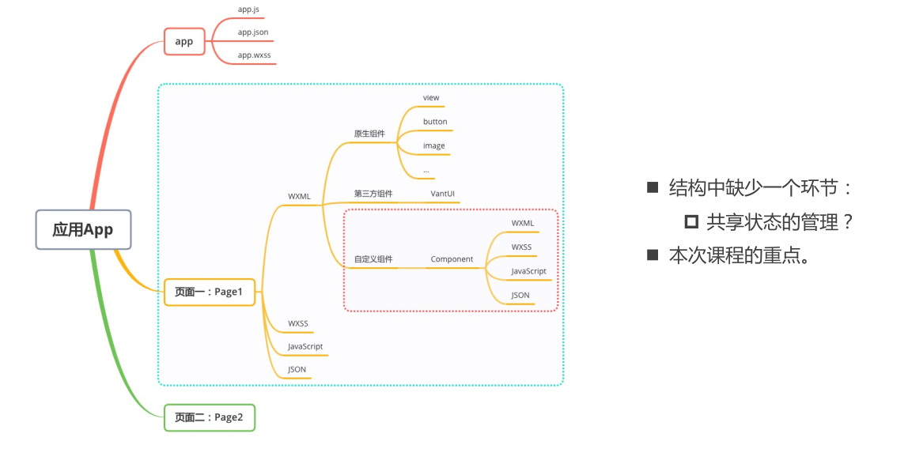

💡：熟悉一个小程序项目里边一个页面到底有啥代码结构

例子：

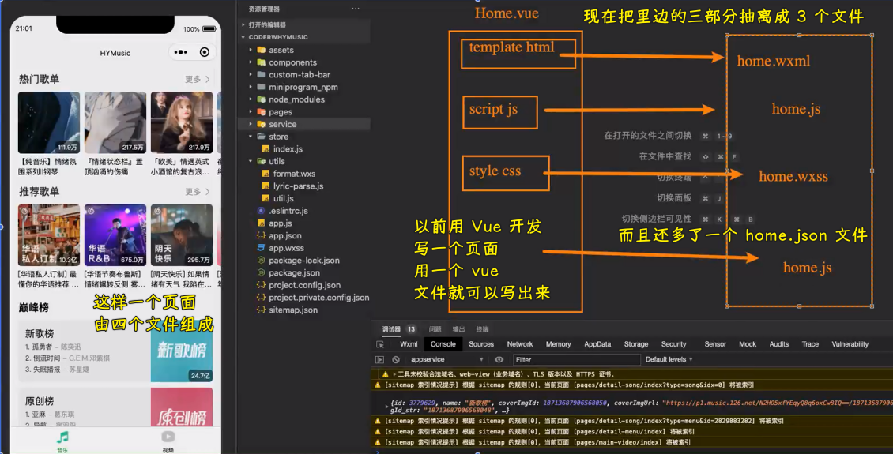

例子：

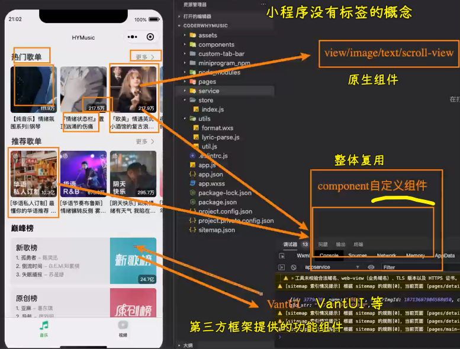

11）阅读官方文档

💡：不管是学 Vue、React，还是小程序，先完成这三个案例

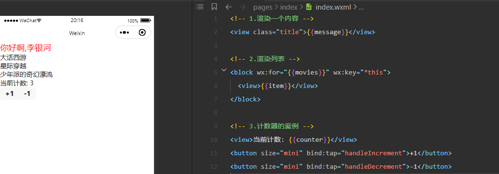

