### ✍️ Tangxt ⏳ 2022-02-28 🏷️ 小程序

# 02-HYMusic 项⽬搭建和配置

> 视频列表 -> 视频详情

### <mark>1）掌握网络请求代码的优化</mark>

💡：`res.data.data`

其它数据没有必要，我们不想要那些数据，也就是说，我们不想透过`res.data`拿到服务器返回的数据

> 为啥可以直接写`reject`？ -> 失败调用`fail`方法，而`fail`方法内部也就是调用`reject`，而默认传给`reject`的参数也就是`fail`的第一个参数
> 
> `success`这个就不行了，因为你需要把参数处理一下再传给`resolve`
> 
> 还可以用箭头函数，毕竟没有用`this`，不过这也没有必要哈！
> 
> 为啥不用方法简写？ -> 剑客到了一定境界，万物皆为剑，你想用啥为剑就用啥为剑，因此你想怎么写就怎么写呗！

传了`res.data`，那么其它层直接`res.data`即可！

💡：`async/await`

### <mark>2）掌握视频页面的展示</mark>

💡：视频列表页？

1. 结构 -> 划分块，存在多个那就用容器包裹
2. 样式

💡：Image 组件？为啥要添加`mode="widthFix"`

- image 组件默认宽度 320px、高度 240px

你改了宽度，但高度没改，还是默认的`240px`，为了让高度适配宽度，所以用`widthFix`

💡：`wx:key="id"`？

💡：待优化的部分

- 播放量、时间处理
  - 目前状态：没有单位的播放量，毫秒时长
- 下拉刷新、下拉加载

### <mark>3）掌握 WXML 数据优化的 wxs 使用</mark>

💡：播放量格式化？

用 wxs 这个语言（ES5 语法，不支持 ES6）！小程序可没有提供像 Vue 里边`filter`这样的 API，也不支持在`js`里边写一个函数，在`wxml`里边调用

在`utils`目录里边创建一个`format.wxs`

当然，你也可以创建一个`wxs`目录，不过这没有必要，毕竟这个`wxs`也是提供工具的功能，总不能说它不是`js`文件就不能放在`wxs`目录里边吧！

💡：时间格式化？

不想要这种很难看的格式 -> `6:4` -> 如果是个位数，那就加`0`，如`06:04`

💡：待优化部分

### <mark>4）掌握自定义组件 video-item-v1</mark>

小程序的项目一般不会特别复杂 -> 我们这个音乐项目相对来说，已经算比较复杂了（播放器交里边的互，数据管理，数据共享，这些内容算是比较复杂的了）

大部分的内容展示类，如商场类、旅游类、简单工具类的小程序都是比较简单的

因为长远考虑，所以这个 Item 必然要封装成一个组件

💡：如何封装组件？

组件在哪儿写？

1. 只在本页面使用，那就在该页面的文件夹里边新建一个`components`目录
2. 很多页面都会用到，那就在根目录新建一个`components`目录
3. 在根目录创建一个`baseui`，这里存放的是多个项目都会用到的组件

这个 Item 组件是在本项目中用到的，而且多个页面都会用到，所以放在`components`中

为啥叫`video-item-v1`？

> 不用驼峰命名，因为内置组件也会用`-`串联多个单词

因为 Item 有很多个版本啊，为了方便起名，直接加个`v1`就好了，同理，遇到其它版本的 Item，那就改为`v2`

组件也是放在某个文件夹中的，对于这个文件夹，你要通过「新建组件」来创建 4 个文件

把之前写的代码 copy 过去 -> 一个组件的结构+样式

如何给组件传递数据？

> 透过`properties`选项

页面如何使用组件？

> 在这个页面的`json`里边注册组件 -> 小程序内置的组件如`view/image`等，不需要注册，第三方的和自定义的都需要注册，反正哪个页面用，你就得在哪个页面里边的配置文件中去注册

注册组件：

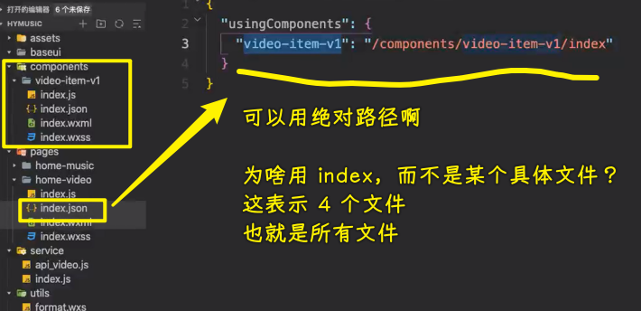

在页面中使用组件：

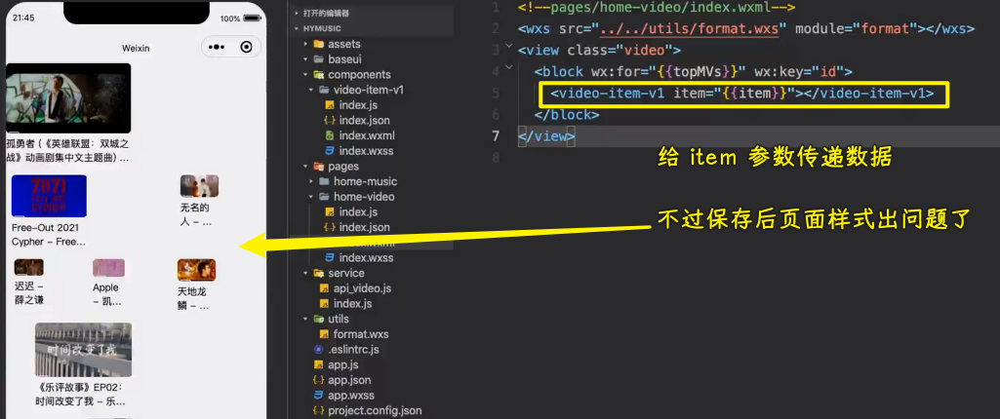

布局错乱？ -> 样式问题 -> `flex`的问题，因为现在的`item`是一个整体，一个组件了 -> 不要用`block`，改成`view`

注意`wxs`的路径 -> 还有你没用引入`wxs`模块，但是你使用了`wxs`提供的函数，而控制台居然不报错

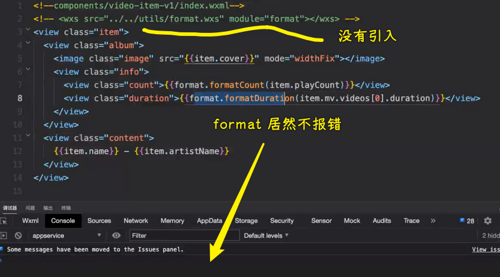

不报错，就只能靠自个儿按逻辑去排查了 -> 排除法，从大范围开始，逐渐过渡到小范围

💡：用伪元素写 icon

### <mark>5）掌握 Video 页面的网络请求封装</mark>

💡：上拉加载更多

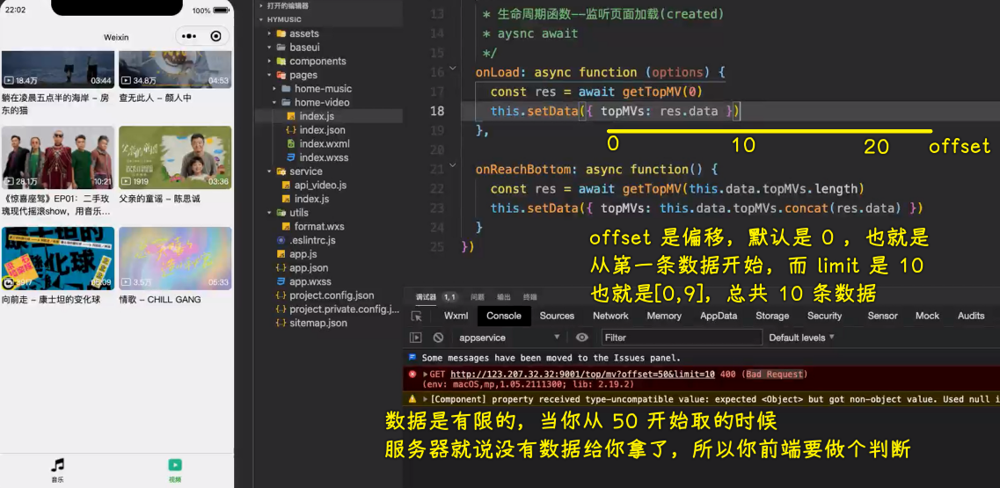

测试 API：

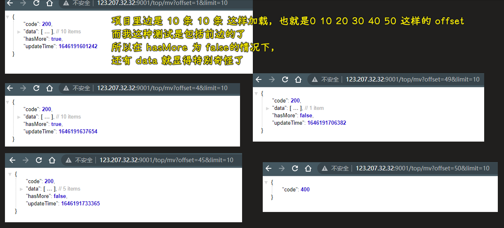

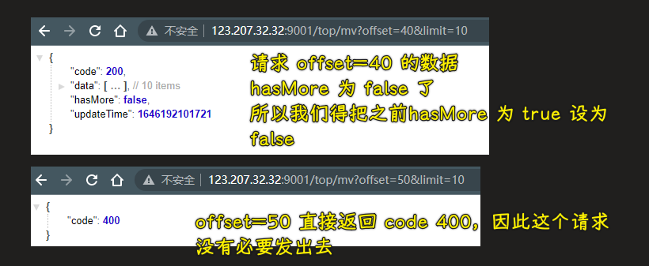

最终代码：

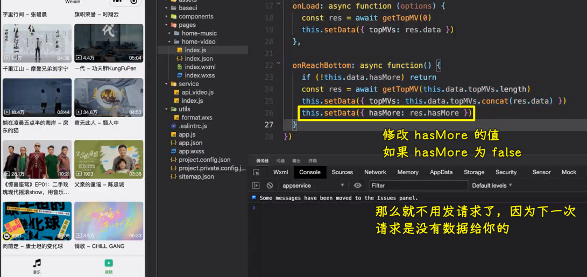

💡：下拉刷新

页面默认不允许下拉，也就会你在顶部，是下拉不动的，你得配置才行

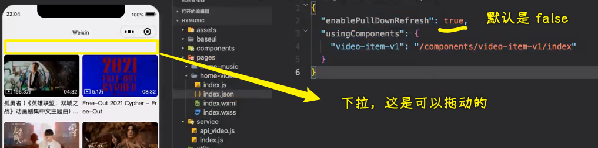

代码：

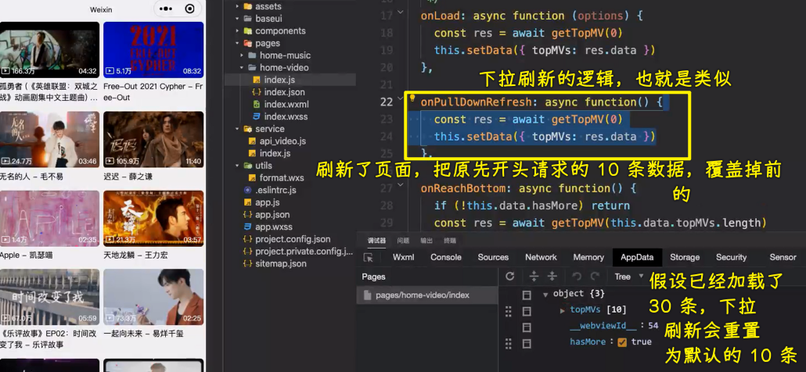

💡：优化代码

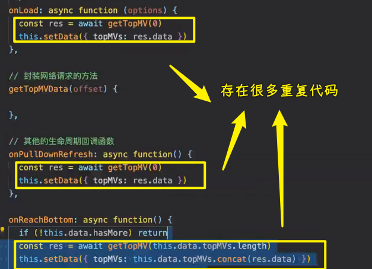

效果：

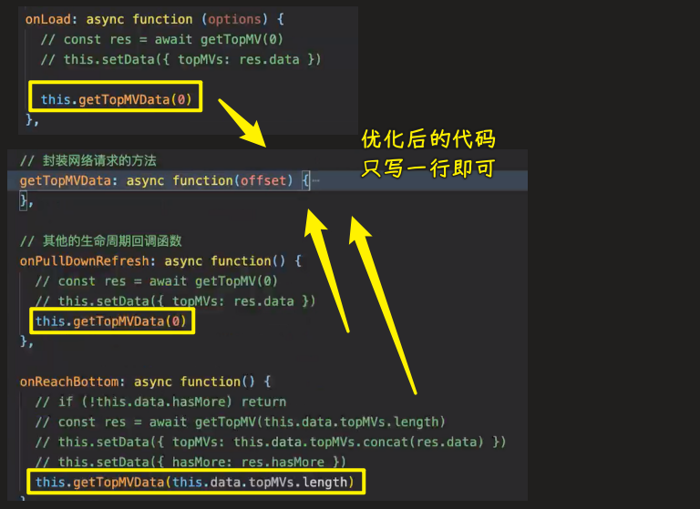

在合适的地方，合适的时机去调用这个`getTopMVData`方法

💡：展示下拉刷新的动画

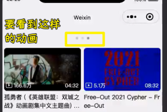

为啥看不到下拉刷新动画？

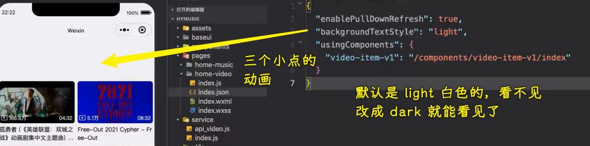

如何让代码自个触发下拉刷新？

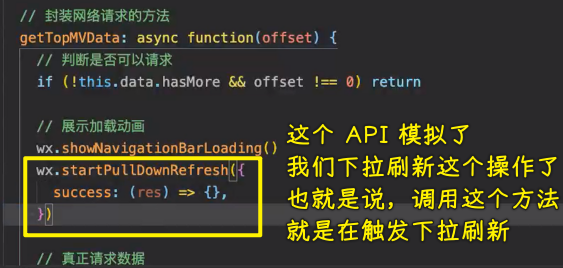

下拉刷新动画，需要我们主动给停掉

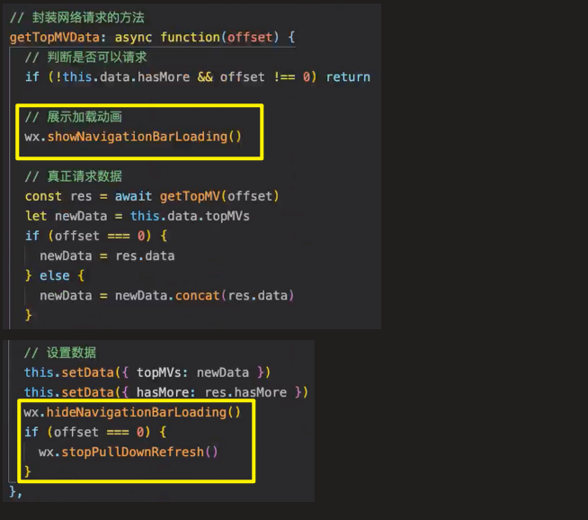

> 为啥函数体里边的第一句代码要加上`offset`作为判断条件？
> 
> 我理解的原因：`hasMore`默认是`true`，如果`hasMore`为`false`+`offset`为`0`，那么还是得发请求，因为你在上拉加载更多的时候`hasMore`被设置为了`fasle`了，此时你回到顶部下拉刷新，那么`offset`的值就是`0`了，因此我们得发送请求才行！这就是添加`offset`的原因！ -> 老师说的原因：`hasMore`的初始值可以是`false`，`offset`为`0`也就是第一次请求，第一次请求是可以发出去的，所以得加上`offset`，如果`hasMore`初始值是`true`，那么是可以不加上`offset`的
> 
> `offset === 0`，可加可不加，但加上最好！毕竟可以少写很多代码，反正执行它只会在下拉刷新的时候有反应！

### <mark>6）掌握跳转 Video 详情页和传递参数</mark>

💡：要做什么？

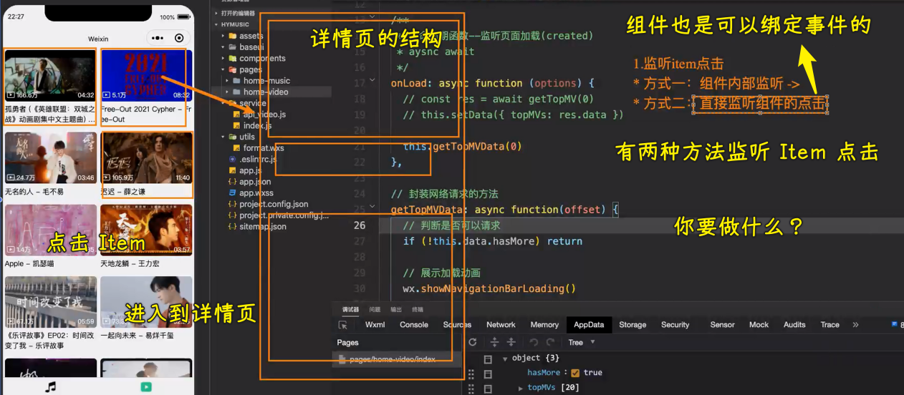

💡：监听事件

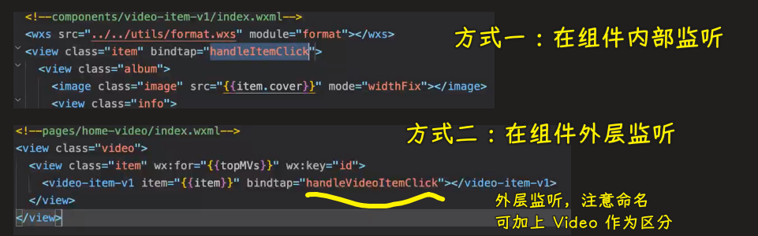

💡：如何拿到被点击的 Item 的 `id`？

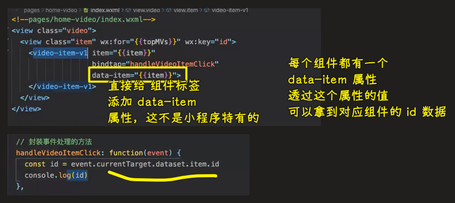

💡：如何根据`id`跳转到对应的详情页？

1. 创建`detail-video`页面 -> 详情页
2. 在详情页的`onLoad`函数里边拿到传递过来的数据，第一个参数是对象，对象里边存储的就是传递过来的数据

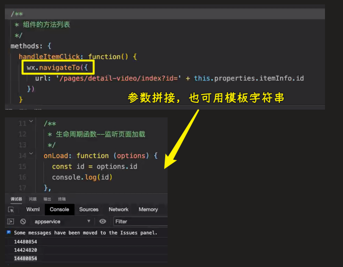

💡：如何根据`id`拿到详情页对应的三个数据？

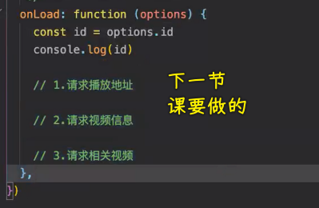

> 为了开发方便，请改一下编译模式，会帮你自带 `id` 的！

首页会涉及到多个页面的数据共享，也有很多细节层面的东西，比如轮播图的高度！

详情页的 Video 有兼容问题！

审核发布的话，要看你这个数据是不是自己的！当然，我们写这个项目的重点是这其中涉及的技术点，而不是审核发布这样的内容，也不是网易云音乐这样的数据该如何抓取（需要绕过验证，以及爬虫，还有一些 hacker 技术）！

## ★代码

> [Demo](https://github.com/ppambler/QQMusic/commit/9e2c080)