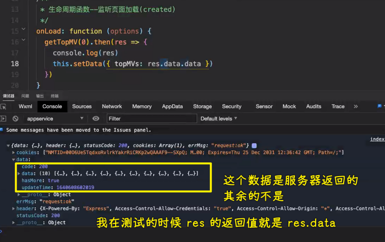
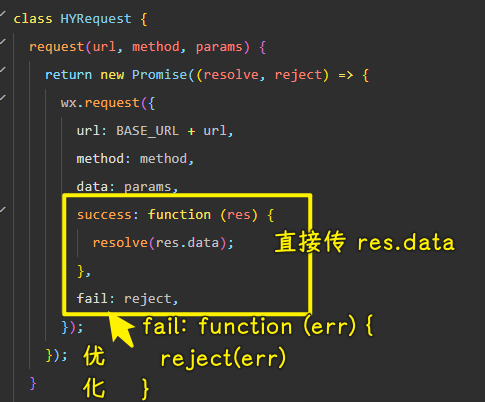
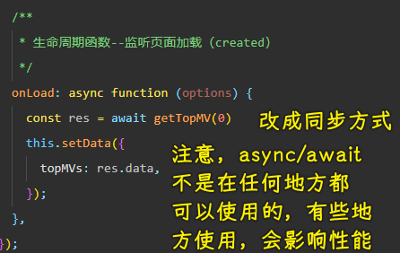
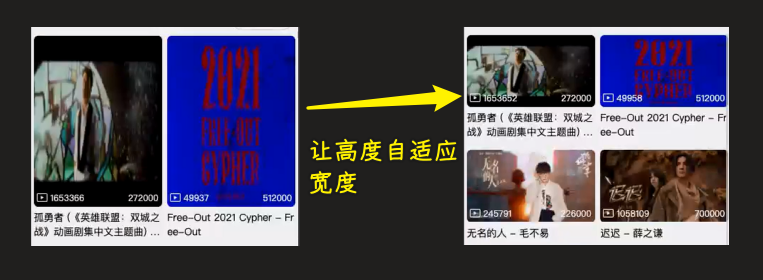
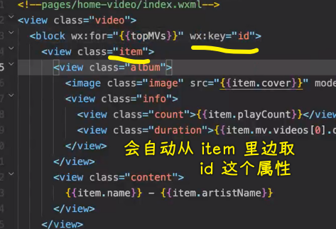
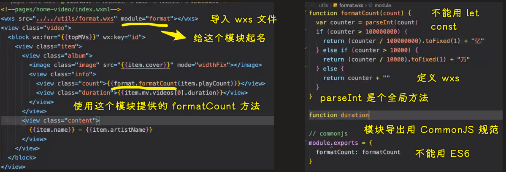
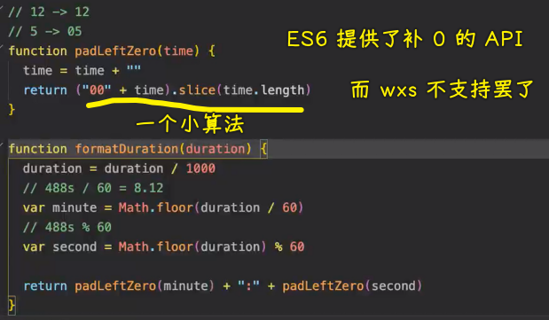
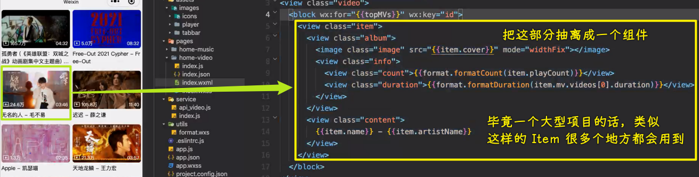

### ✍️ Tangxt ⏳ 2022-02-28 🏷️ 小程序

# 02-HYMusic 项⽬搭建和配置

> 视频列表 -> 视频详情

1）掌握网络请求代码的优化

💡：`res.data.data`

其它数据没有必要，我们不想要那些数据，也就是说，我们不想透过`res.data`拿到服务器返回的数据

> 为啥可以直接写`reject`？ -> 失败调用`fail`方法，而`fail`方法内部也就是调用`reject`，而默认传给`reject`的参数也就是`fail`的第一个参数
> 
> `success`这个就不行了，因为你需要把参数处理一下再传给`resolve`
> 
> 还可以用箭头函数，毕竟没有用`this`，不过这也没有必要哈！
> 
> 为啥不用方法简写？ -> 剑客到了一定境界，万物皆为剑，你想用啥为剑就用啥为剑，因此你想怎么写就怎么写呗！

传了`res.data`，那么其它层直接`res.data`即可！

💡：`async/await`

2）掌握视频页面的展示

💡：视频列表页？

1. 结构 -> 划分块，存在多个那就用容器包裹
2. 样式

💡：Image 组件？为啥要添加`mode="widthFix"`

- image 组件默认宽度 320px、高度 240px

你改了宽度，但高度没改，还是默认的`240px`，为了让高度适配宽度，所以用`widthFix`

💡：`wx:key="id"`？

💡：待优化的部分

- 播放量、时间处理
  - 目前状态：没有单位的播放量，毫秒时长
- 下拉刷新、下拉加载

3）掌握 WXML 数据优化的 wxs 使用

💡：播放量格式化？

用 wxs 这个语言（ES5 语法，不支持 ES6）！小程序可没有提供像 Vue 里边`filter`这样的 API，也不支持在`js`里边写一个函数，在`wxml`里边调用

在`utils`目录里边创建一个`format.wxs`

当然，你也可以创建一个`wxs`目录，不过这没有必要，毕竟这个`wxs`也是提供工具的功能，总不能说它不是`js`文件就不能放在`wxs`目录里边吧！

💡：时间格式化？

不想要这种很难看的格式 -> `6:4` -> 如果是个位数，那就加`0`，如`06:04`

💡：待优化部分

4）

小程序的项目一般不会特别复杂 -> 我们这个音乐项目相对来说，已经算比较复杂了（播放器交里边的互，数据管理，数据共享，这些内容算是比较复杂的了）

大部分的内容展示类，如商场类、旅游类、简单工具类的小程序都是比较简单的

因为长远考虑，所以这个 Item 必然要封装成一个组件

💡：如何封装组件？

1. 只在本页面使用，那就在该页面的文件夹里边新建一个`components`目录
2. 很多页面都会用到，那就在根目录新建一个`components`目录
3. 在根目录创建一个`baseui`，这里存放的是多个项目都会用到的组件

