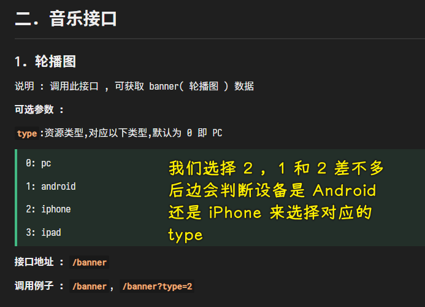

### ✍️ Tangxt ⏳ 2022-03-03 🏷️ 小程序

# 03-HYMusic 状态管理⽅案

### <mark>1）掌握 Video 详情页-获取网络数据</mark>

💡：MV 详情页如何做？


💡：定义三个获取数据的函数


> 注意 JS Doc

💡：发送网络请求获取三个数据


改成这样的：


优化一下代码：


> 可以用 `Promise.all`？ -> 可以，不过需要等数据都拿到才可以赋值，而这样并不好，我们要的是，哪个请求先结束那就先赋值呗！

关于那个`id`，如果很多地方都要用的话，那你就放到`data`里边

> 在我看来这代码是有 bug 的，你在做其它逻辑的时候，网络请求的数据还未赋值给`data`啊

### <mark>2）掌握 Video 详情页-播放视频和页面布局</mark>

💡：讲什么？


只讲视频播放，其它的自己做，毕竟这其它的是很简单的！有那么多的时间，还不如多讲点其它的内容！ -> 把时间放在功能身上

💡：video

audio 组件不维护了，现在用 video 了

video 组件，自带进度条等控制栏，不需要我们去开发！ -> 如果你对控制了不满意，那么你可以自行去开发！ -> 这是`controls`属性

video 组件提供了很多属性？ -> 意味着提供了很多功能，我们应该感到高兴，很多时候，我们要用这个功能，只需要添加一个属性就可以了（属性多越简单），如果一个组件提供的属性很少，很多时候，就需要我们自己去实现功能了！

> 模拟器无法全屏显示，你可以选择真机调试，在手机全屏查看

video 默认有宽高！

你想要弹幕？ -> 有规范 -> 必须告诉 video 组件在多少秒的时候展示哪条弹幕，当然还可以添加颜色

💡：视频固定，内容滚动


讲两种做法：

1. 使用`fixed`
2. 使用`scroll-view` -> 比较麻烦需要动态计算高度，毕竟不同机型页面高度可能是不一样的


### <mark>3）掌握小程序 npm 使用第三方包</mark>

> 人具有超越性 -> 其动力来自于自我否定 -> 这意味着进步 -> webstorm 大，收费 这是否定它，用 VS Code 不适应，用久了适应，这就是进步，超越了自我

💡：做什么？


> 这个设计稿不是最终的成品，这里边有一些细节需要完善、优化，比如轮播图这块的图片显示不全，推荐歌单这块的每个 item 需要有一些偏移

💡：vant-weapp

> [youzan/vant-weapp: 轻量、可靠的小程序 UI 组件库](https://github.com/youzan/vant-weapp)

公司用得比较多

💡：如何引入 vant-weapp？

使用`npm` -> 早期小程序不支持使用`npm`引入第三方库，而现在是支持的

定位到项目根目录：

``` bash
npm init -y
```


安装：

``` bash
npm i @vant/weapp
```


在`node_modules`目录里边可以看到安装的第三方库：


本地有了这个库后，我们还不可以使用它

想要使用它，你还得这样：


当然，这样还不够，你还得把这个 `npm` 包转化成小程序能够使用的形式


💡：我们想要使用`search`组件

需要注册这个组件才能使用：


> [Search 搜索 - Vant Weapp](https://youzan.github.io/vant-weapp/#/search)


### <mark>4）掌握 Music 页面-搜索框的展示</mark>

💡：页面背景是偏灰的，搜索框是纯白色的

可以全局设置`app.wxss`，作用给所有页面，可以局部设置，作用给一个页面

导航栏不需要偏灰


我们要做的：


`background`：


输入框区域没有提供修改样式的属性，那么我们只好覆盖它的样式了


覆盖样式：


> 效果不明显，可以用黑色背景来确定是否生效

我们还有改一下它的边框，现在是方的，我们可以用`border-radius`，但是用之前先看看文档是否有提供相应的属性，有这个属性的话，那就用属性改，没有那就覆盖它

文档提供了：`shape="round"`

💡：首页搜索框是不能输入东西的（不然会很丑），点击搜索框要跳到搜索页面，输入内容展示搜索结果

禁止首页的搜索框有输入内容的交互 -> 添加`disabled`属性

虽然不能输入，但是它还是可以监听点击事件的


💡：引入这个`search`组件，出现警告


这个警告在 Issues 可以查看到：


这是基础库的问题，基础库的更新，导致校验变严格了

> 基础库最近完善了校验逻辑，出现提示一般是因为 slot 没找到或者 properties 的类型不对，请按照提示修改代码

你可以修改源码提 PR -> 不建议你这样做，等官方更新最好

出现这个问题是从基础库`2.18.1`开始的

我们改成它的上一个版本`2.18.0`就没事儿了，不过没有这个版本的，只有`2.17.0`


> 选择`2.16.0`可以解决，不过这是一个还在灰度中的版本

无法解决，那就等这个框架开发者来对其内部修复一下呗！

➹：[解决微信小程序 Component slot “ is not found._御形封灵的博客-CSDN 博客](https://blog.csdn.net/weixin_43954962/article/details/122563524)

➹：[Component slot "" is not found？ - 微信开放社区](https://developers.weixin.qq.com/community/develop/doc/000c8295730700d1cd7c81b9656c00?page=1#comment-list)

### <mark>5）掌握 Music 页面-轮播图的展示和高度计算</mark>

💡：轮播图需要数据，我们先获取数据

1. `api_music.js`
2. 查看 API 文档
3. 把数据保存到`data`
4. 展示数据 -> 用轮播姿势 -> `swiper`
5. 美化轮播图样式
6. 加小点、自动播放、无限轮播



💡：直接写属性，不写值


💡：轮播图高度固定`150`，在 iPhone 5 下查看会有问题


图片的高度没有达到`150`，那么这个点看起来就像是跑到图片下边去了一样

正常情况下，`swiper`，也就是轮播图的高度，不是固定死的

那么轮播图的高度到底是多少呢？

> 和图片的高度永远保持一致

这不好做，尤其针对 IPhone5 这种小设备 -> iPhone6 看起来是没啥大问题，但仔细看还是有一点点像素的偏差

目前的需求：


图片的高度该什么时候哪？


url 拿不了，只有在图片加载完的时候拿

透过`bindload`可以拿到，不过这个事件拿到的图片宽高是：


`bindload`：


我们要的是`Image`组件的宽高

💡：如何拿到`Image`组件的宽高？

> 文档：[SelectorQuery - 微信开放文档](https://developers.weixin.qq.com/miniprogram/dev/api/wxml/wx.createSelectorQuery.html)

``` js
const query = wx.createSelectorQuery()
// 元素的矩形框
query.select('#the-id').boundingClientRect()
// 相当于视口的滚动位置
query.selectViewport().scrollOffset()
query.exec(function(res){
  res[0].top       // #the-id 节点的上边界坐标
  res[1].scrollTop // 显示区域的竖直滚动位置
})
```


> 函数触发多次？ -> 用防抖和节流可处理之


高度适配：


> `swiper`组件默认的宽度还是跟设备宽度保持一致的……


其它方案？ -> 高度设置成`100%`？ -> 会让图片展示不完整，这样的效果并不好！

话说，如果这些图片里边，有个别图片大小跟其它的不一致呢？

这是 UI 的锅，ta 搞的图片不规范啊！我们前端就把拿到的一张图片作为标准就好了！

### <mark>6）掌握 Music 页面-查询抽取和节流处理</mark>

💡：优化：类似`wx.createSelectorQuery()`等这样一坨的 API，很多的地方都会用到，而且这很难记忆，影响开发效率

1. 把这些代码抽到`util`的`query-rect.js`里边去
2. `promise`化这些代码，把`res`这个值`resolve`出去
3. 调用方只要传给选择器，然后通过`then`，就可以拿到这个元素的矩形信息了

封装：


使用：


💡：优化：`handleSwiperImageLoaded`调用的频率太高，毕竟我们一次请求，需要加载 12 张图片

调用频率很高 -> 在一条时间线上，连续触发 -> 防抖和节流是两个东西，具体区分看老师讲的 JS 高级课程

用谁？ -> 防抖和节流都行

1. 偏后拿到结果？ -> 用防抖（`debounce`） -> 把多个信号合并成一个信号，死歌放大，大招释放就是触发回调，在触发回调之前需要吟唱 3 秒，被打断需要重新吟唱
2. 早一点拿到结果？ -> 用节流（`throttle`） -> 次数较多，可设置时间，在指定时间内执行一次，间隔执行，也就是按固定频率执行回调函数 -> 选择这个

> 资料：[函数节流和函数防抖 – Clloz ☘️ ](https://www.clloz.com/programming/front-end/js/2019/05/21/throttle-debounce/)

怎么写这个节流函数？

1. 自己原生手写
2. 用 lodash
3. 用 underscore

对谁节流？ -> 对`queryRect`这个函数，当然，`handleSwiperImageLoaded`这个函数也行，不过这看起来就很不优雅了

如何用节流？ -> 给节流函数传入`queryRect`，这个节流函数的返回值就是新的加了 buffer 的`queryRect`

- 没用节流：查询了 12 次
- 用了节流：只查询 1 次 -> 默认在单位时间 `1s` 内查询 `1` 次，你设置成`10ms`，那么可能会查询 `2-12` 次


### <mark>7）代码</mark>

> [Demo](https://github.com/ppambler/QQMusic/commit/1185fa4)

👇：多个页面里边数据共享
