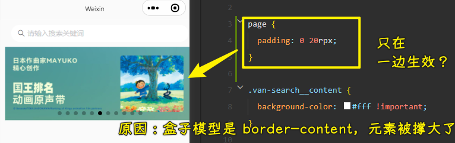

### ✍️ Tangxt ⏳ 2022-03-23 🏷️ 小程序

# 04-HYMusic ⾳乐⾸⻚搭建和开发

1）掌握其他知识点补充

💡：MV 视频可能播放不了？

有些服务器会做请求源验证

💡：小程序里自定义组件，给属性的默认值是用`value`，而不是 Vue 里边的`default`

💡：`setData`是同步的还是异步的？是同步或者异步的，对于我们开发者而言这很重要吗？

小程序的`setData`：

- 更新`data`时是同步的 -> 优点 -> 可以立刻拿到最新最正确的值
- 把数据渲染到页面时是异步的

react 设计成异步的是，是让`data`永远和页面显示的数据是保持一致的，并且传递给子组件的数据也是永远保持一致的！

> react 想要拿到最新数据 -> `setState`可以接收一个回调，等页面更新了就会拿到最新的值

而小程序则不同了，老师不喜欢小程序的这种设计方案，因为调试不方便

> 老师讲课的习惯 -> 喜欢把其他技术里边的知识拿来和正在讲的这个知识进行对比，比如讲 JS，就会看看 Vue、React 是怎样的，讲小程序，就会看看 Vue、React 是怎样的 -> 对比一下，看看不同的知识之间到底有什么联系或者有什么样的不同，又或者这种做法有啥优点，有啥缺点…… -> 经常性地对比来看，就这样，逐渐地你就能形成自己的思想了

2）掌握音乐界面-轮播图的细节处理

💡：优化：轮播图的边缘是有间距的

给间距有两个思路：

1. 单独给`swiper`的左右两边一个`padding`就得了
2. 给整个页面加左右两个间距 -> 毕竟其它部分也要间距

选择第二种：

💡：优化：整个页面有间距了，但搜索框不需要有间距

去掉默认间距：

💡：优化：给轮播图增加圆角边框

给谁加圆角？图片？还是`swiper`？

显然是`swiper`

> 图片超出圆角边框范围了，那么那部分就得隐藏掉，不然圆角无法显示出来，会被图片给遮住

如果你发现左上角没有圆角，那么这是模拟器的问题，不是你写的这个代码有问题，你在真机调试上，是不会有这个问题的！

当然，有些手机系统，是不会显示圆角的，我们知道小程序的页面渲染是手机系统提供的 webview，而它的 webview 不支持`border-raduis`，也就是针对 HTML 的渲染有些地方不支持。我们在做 h5 开发时，也会时常遇到这样的适配问题

3）

