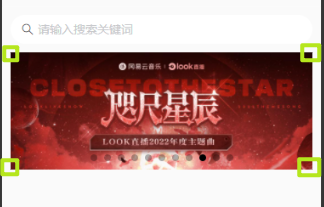

### ✍️ Tangxt ⏳ 2022-03-23 🏷️ 小程序

# 04-HYMusic ⾳乐⾸⻚搭建和开发

1）掌握其他知识点补充

💡：MV 视频可能播放不了？

有些服务器会做请求源验证


💡：小程序里自定义组件，给属性的默认值是用`value`，而不是 Vue 里边的`default`


💡：`setData`是同步的还是异步的？是同步或者异步的，对于我们开发者而言这很重要吗？


小程序的`setData`：

- 更新`data`时是同步的 -> 优点 -> 可以立刻拿到最新最正确的值
- 把数据渲染到页面时是异步的


react 设计成异步的是，是让`data`永远和页面显示的数据是保持一致的，并且传递给子组件的数据也是永远保持一致的！

> react 想要拿到最新数据 -> `setState`可以接收一个回调，等页面更新了就会拿到最新的值

而小程序则不同了，老师不喜欢小程序的这种设计方案，因为调试不方便

> 老师讲课的习惯 -> 喜欢把其他技术里边的知识拿来和正在讲的这个知识进行对比，比如讲 JS，就会看看 Vue、React 是怎样的，讲小程序，就会看看 Vue、React 是怎样的 -> 对比一下，看看不同的知识之间到底有什么联系或者有什么样的不同，又或者这种做法有啥优点，有啥缺点…… -> 经常性地对比来看，就这样，逐渐地你就能形成自己的思想了


2）掌握音乐界面-轮播图的细节处理

💡：优化：轮播图的边缘是有间距的

给间距有两个思路：

1. 单独给`swiper`的左右两边一个`padding`就得了
2. 给整个页面加左右两个间距 -> 毕竟其它部分也要间距


选择第二种：


💡：优化：整个页面有间距了，但搜索框不需要有间距


去掉默认间距：


💡：优化：给轮播图增加圆角边框



给谁加圆角？图片？还是`swiper`？

显然是`swiper`


> 图片超出圆角边框范围了，那么那部分就得隐藏掉，不然圆角无法显示出来，会被图片给遮住

如果你发现左上角没有圆角，那么这是模拟器的问题，不是你写的这个代码有问题，你在真机调试上，是不会有这个问题的！

当然，有些手机系统，是不会显示圆角的，我们知道小程序的页面渲染是手机系统提供的 webview，而它的 webview 不支持`border-raduis`，也就是针对 HTML 的渲染有些地方不支持。我们在做 h5 开发时，也会时常遇到这样的适配问题


3）掌握音乐页面-封装 Header 组件和插槽使用

> 只要是技术上的问题，都会有对应的解决方案 -> 老师讲了很多小问题，有些小问题挺难解决的，比如刚刚那个`transform: translateY(0);`的添加，但这终归都会有解决方案（查 Stack Overflow 或者 Issues） -> 有时你会遇到基础库的问题，但你不要就这样认为，这个问题无法解决了，其实还是可以解决的 -> 小程序不支持的功能，还是有其它途径可以实现这个功能的

💡：做什么？


我们要完成两部分内容：

1. Header 组件封装 -> 涉及插槽的使用 -> 如何给插槽设置默认值
   1. 小程序不支持给插槽设置默认值，但我们可以通过别的方案来设置 -> 有些功能我们特别想用，但小程序不支持，而且这些功能实现起来也非常简单，更何况在 17、18 年就提出来了，到现在 2022 年了，这简单的功能还是不支持
   2. 老师会提供一种很优雅的方案来实现给插槽设置默认值
2. 多个页面之间如何共享数据 -> 小程序提供的方案：`app.js`，无法响应式 -> 用其它共享数据方案，可以做到响应式
   1. 音乐首页：歌曲推荐的列表数据
   2. 搜索页面：也有歌曲推荐的列表数据

💡：封装`Header`组件

为啥要封装？ -> 很多个地方都会用到 -> 有些地方标题不同，有些地方没有「更多」这样的文本 -> 我们要封装的更通用一些

1. 创建一个`area-header`组件 -> 放在`components`里边
2. 定义`wxml`、给样式、给属性
   1. 涉及到图标 -> 可以用 vant 组件库，但没必要，用图片就好了
3. 使用组件
   1. 注册组件

`wxml`：


效果：


---

是否显示右边？ -> 添加`showRight`属性，默认是显示的


你在使用时，给个`false`值就行了：


---

使用插槽，指定你想要的右边部分

小程序做不到这样：


我们的需求是：给插槽内容，那就显示给的内容，不给插槽内容，那就显示组件默认给的

一种很笨的方案，用 JS 来控制显示和隐藏：


对使用这个组件的开发者而言，这种体验很不好 -> 每次写插槽内容都得传入那个`showMore`属性

另一种方案，用 CSS：

使用`empty`这个伪类，它可以判断一个组件的子组件是否为空，也就是一个元素是否有子元素（即便你是个回车空白字符，这也代表没有子元素）


这个方案好很多，非常方便，不用在 JS 里边定义一个个属性了，使用者也不用写一些很繁琐的属性了，比如`showMore`属性

> CSS 很重要，遇到一些问题时，用 CSS 解决起来要更方便一些 -> 系统课会讲 CSS，B 站也有老师讲 CSS 的视频

> [Demo](https://github.com/ppambler/QQMusic/commit/4b5e5b2)

4）掌握小程序状态管理方案解析

💡：小程序多页面状态管理


面临问题：

- 多页面共享数据
- 多页面事件传递

页面联系：

- 一个页面由另一个页面推出来的 -> 联系紧密 -> 数据沟通和事件沟通很方便
- 一个页面和另一个页面 -> 不存在直接联系 -> 跨页面之间的事件传递，一个页面抛出事件，其它页面监听这个事件 -> 于是，有了一些库，比如`mitt`，这些库也叫事件总线（JS 高级课有手写） -> 这些库一般只负责帮助我们传递事件，不会帮你去管理一些状态的

什么叫管理状态？

就是有一个数据仓库，每个页面都能访问这个仓库，某个页面修改了这个仓库里边的某个数据，用到这个数据的页面都会有相应的响应式更新

小程序的数据共享方案：

- 只有共享数据
- 没有响应式 -> 需要新数据需要重新调用函数拿，可是你怎么知道数据是什么时候更新呢？

第三方方案？ -> 一些库会改变了的写法，让你的代码和这个库耦合度太高，也就是说，你不用这个库，代码就写不下去了！还有不利于其他人的维护，毕竟这个代码和小程序官方的代码很不相同 -> 除此之外，基础库更新了，这个库可能不用了

老师在网上没有找到合适的库

于是，老师自个写了一个库 -> 这个库适合小程序，也适合 Vue 和 React 等 -> 学了 JS 高级课程，这样的库很容易写出来

💡：这个库是如何使用的？在小程序里边又是如何使用的？

> 文档：[coderwhy/hy-event-store: An event-based global state management tool for vue, react, mini-program, ect.](https://github.com/coderwhy/hy-event-store)

这个库不依赖任何框架，是个独立的库

这个库是基于事件的状态管理

- 有事件总线功能
- 通过事件存储来管理状态

> 原理：事件总线+响应式

安装：

``` bash
npm i hy-event-store
```

> `hy`是前缀，毕竟叫`event-store`的库可能会存在，加上`hy`前缀，以防冲突


> API 模仿 Vuex，毕竟 Vuex 大家都熟悉

使用：

仓库存储的数据分为：

- 本地数据 -> 本地写死的数据
- 网络数据 -> 发请求得来的数据 -> 涉及`actions`

其它页面要共享数据：

- 监听某个数据`store.onState('name',(res) => {})`，一旦这个数据更新了，就会调用回调 -> 默认第一次监听，会触发一次回调
- 修改共享数据：`store.setState("name", "jack")`

发送请求获取网络数据：

``` js
// 在入口文件写
store.dispatch("getHomeDataAction", 123)
```

代码：

``` js
// src/main.js
const { HYEventStore } = require("hy-event-store")
const axios = require("axios")

// 创建 Store 对象
const store = new HYEventStore({
  state: {
    // 本地数据
    name: "why",
    age: 18,
    // 网络数据
    banners: [12, 23],
    recommends: []
  },
  actions: {
    // 发送网络请求
    getHomeDataAction(ctx, payload) {
      // ctx 可用来更新数据 -> 不同于 this
      axios.get("http://123.207.32.32:8000/home/multidata").then(res => {
        ctx.banners = res.data.data.banner.list
        ctx.recommends = res.data.data.recommend.list
      })
    }
  }
})

// app 启动
store.dispatch("getHomeDataAction", 123)

// page1 页面
// store.onState("name", (res) => {
//   console.log(res)
// })

store.onState("banners", (res) => {
  console.log("page1:", res)
})

// page2 页面
// setTimeout(() => {
//   store.setState("name", "jack")
// }, 1000);
store.onState("banners", (res) => {
  console.log("page2:", res)
})
```

用`node`启动这个`main.js`文件

> 给我的感觉就是发布订阅

> 建议：如果你想在你的项目里边用一些功能，而你在网上找不到合适的库，建议你自己写一个，毕竟用人家的，很有可能会有大问题。 -> 自己写一个吧 -> 前人栽树，后人乘凉

状态管理很常见，不单是小程序开发（一级一级这样传数据很繁琐），你搞前端开发都会用得上！

> 这个库，老师是如何写出来的？ -> JS 水平扎实 + 多阅读优秀的框架源码
> 
> 参考 TJ -> TJ 看了很多优秀库的源码，不止是前端方面的，后端方面的也有，他通过从这些库学到的东西，造了很多轮子


> 不看书，不听课 -> 有点天才的意思……

5）掌握 EventStore 共享数据的使用

> 对于优秀的人似乎都是：已识乾坤大，犹怜草木青 -> 有些人看到 React 牛逼，就觉得 Vue 不咋滴 -> 其实它们都有各自独特的优秀之处

歌曲推荐来自热门榜单：


把获取到的热门榜单数据放到`store`里边进行共享

💡：在小程序里边使用`hy-event-store`

在项目根目录里边：

``` bash
npm i hy-event-store
```

构建`npm`

在项目根目录旗下创建一个`store`目录 -> 用来存放共享数据 -> Vue 项目也是这样做的

创建`ranking-store.js`：


小程序的项目并不需要搞得太复杂，我们简单搞一个`store`文件就得了

定义一个`store`：

``` js
import { HYEventStore } from 'hy-event-store'

import { getRankings } from '../service/api_music'

const rankingStore = new HYEventStore({
  state: {
    hotRanking: {}
  },
  actions: {
    getRankingDataAction(ctx) {
      getRankings(1).then(res => {
        console.log(res)
        ctx.hotRanking = res.playlist
      })
    }
  }
})

export {
  rankingStore
}
```

封装网络请求 API：


`store/index.js`的作用 -> 用来统一导出`store`（更优雅的做法），也就是搞一个出口来统一导出数据 -> 为啥`service`旗下的`index.js`不这样搞？ -> 因为封装的 API 太多了，都放在一个`index.js`的话，那就太乱了，而`store`的`index.js`，就那么几个`store`


在`home-music`页面的`onLoad`里边发起请求，获取来自网络上的共享数据：


热搜榜的数据在哪？


我们在音乐首页只给它展示`6`条，而点击「更多」跳到另外一个页面，就给它展示`200`条数据


至此，数据请求和数据共享就搞定了 -> 下一步要做的就是把数据展示到页面上

> [Demo](https://github.com/ppambler/QQMusic/commit/1c9357a)

💡：每个页面获取到的`rankingStore`都是同一个对象

为啥这样说？ -> `ranking-store.js`这个模块里边的代码只会执行一次，这意味着其它页面拿到的导入对象都是同一个对象

➹：[模块 (Module) 简介](https://zh.javascript.info/modules-intro)

6）掌握音乐页面-推荐歌曲的展示

💡：一个小建议


💡：封装组件`song-item-v1`


这个`>`图标大小跟标题的`>`是一致的，参照 QQ 音乐微信小程序，也是这样的

> [Demo](https://github.com/ppambler/QQMusic/commit/198e80a)
