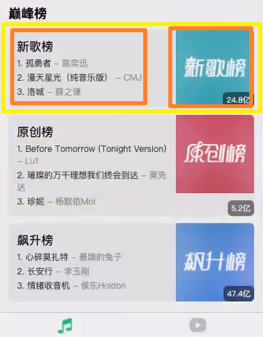
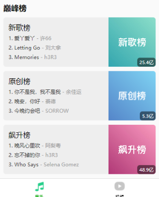

### ✍️ Tangxt ⏳ 2022-03-26 🏷️ 小程序

# 05-HYMusic 视频⾸⻚和详情⻚开发

### <mark>1）掌握音乐页面-歌单区域的布局细节</mark>

> 关于直播课，有人每次直播都来听，有人来几次后就不听了 -> 人与人之间的差距就这样拉开了吗？ -> 并不是，差距不是一天两天就能拉开了，而是一个人的习惯 -> 牛逼的人，都有很好地学习习惯

💡：推荐歌曲的 Item 图片有点大？

可以搞个 wxs 来优化一下

💡：图片转 Base64？

- JS 转
- 后端转
- 线上工具转

💡：先深度后广度？

综合起来学

💡：做什么？


目前要封装的这个组件，其实只是在这个音乐首页里边使用，所以最初在实现它的时候，是放到页面里的`cpns`目录里边的，不过为了方便日后会有其他页面需要用到这个组件，我们现在来实现它的话，是把它放到`components`目录里边

💡：封装`song-menu-area`组件

`menu`这个名字想了很久，最终还是用了这个`menu`

题外话：


---

封装组件时，关于`wxml`似乎需要一个`view`包裹？ -> 看你是怎么想的，用一个`view`包裹的话，搞背景色和添加边距是非常方便的 -> 如果你用不上这个`view`，那么你也可以不添加

---

你自定义一个组件 -> 在写`wxml`时需要到其它组件 -> 那么这同样需要注册这个组件

---

`scroll-view` -> 关于 x 轴和 y 轴的划分：


---

> 为了方便开发 -> 暂时把那个推荐歌曲榜单给注释了

左右滑有几个 Item -> 按照其它应用的设计 -> 总共有 `6` 个歌单信息

先不请求真实数据，我们遍历数字`6`来得到`6`个 Item -> 写上相应的样式


细节处理：

- 兼容某些设备 -> 某些设备是这样的：有些 Item 会向上走一点，有些则会向下走一点，也就是说它们没有对齐 -> `vertical-align: top`
- 左右滑动的消失和出现 -> 往左滑时，也就是 Item 消失是从屏幕左侧边缘消失的，可不是`padding-left`这个位置消失，同理，Item 出现的时候，是从屏幕右侧出现的，可不是从`padding-right`这个位置出现的
- 第一个 Item 要和热门歌单这个标题的左边对齐 -> 改成`margin-right`吗？ -> 不行，这样的话，最后一个`Item`也会对不齐

我们先来处理 Item 的消失或出现的边缘问题，然后再来处理第一个 Item 的对齐问题

---

我们不想让`scroll-view`这个元素有内边距，可我们对这个`page`都设置内边距了，也就是说我们的布局是在这个绿色框框里边进行的：


其它元素都要内边距，就`scroll-view`不想要 -> 我们难道要把`page`设置的内边距给去掉，然后再对这些需要内边距的元素一个个去设置吗？

我们这里的方案是保持原有`page`设置的内边距，单独给`scroll-view`设置不要内边距，即让它占满整个屏幕的宽度

两种思路：

1. 直接获取屏幕的宽度
   1. 屏幕宽度数据获取 -> `wx.getSystemInfoSync()` -> 这个数据是不会变的，毕竟同一台手机的屏幕宽度总不能一天一个样吧 -> 所以把这个数据存储到`store`里边是不合理的，毕竟`store`的特点是响应式 -> 放到`app.js`里边的`globalData` -> 在`onLaunch`这个钩子里调用这个 API，注意这是同步方法，我们想等这个结果
   2. 屏幕宽度数据有了，就把内联样式的方式把它搞到组件的`style`属性里边去


`scroll-view`处理前`355px` -> 处理后`375px`

这个方案有点复杂，还有一个更简单的方案

那就是直接给`.menu-list`，也就是`scroll-view`一个`100vw`的宽，这样就不用通过 JS 去获取设备的`width`值了

👇：把红色框框改成是我们想要的布局、真实数据展示

### <mark>2）掌握音乐页面-热门和推荐歌单的展示</mark>

💡：展示每个小歌单

获取歌单的接口：


定义请求方法：

``` js
// cat -> category 类别
export function getSongMenu(cat="全部", limit=6, offset=0) {
  return hyRequest.get("/top/playlist", {
    cat,
    limit,
    offset
  })
}
```

在哪儿发送请求呢？

你可以在这个`song-menu-area`组件里边发送，不过你这样做的话，那这个组件的复用性就差一点了

所以我们一般是**在页面里边发送**，把请求回来的数据，再传给组件去展示 -> 这样一来，这个组件的复用性就强很多了 -> 比如「推荐歌单」就可以用这个组件了，只是数据不同罢了

💡：封装`song-menu-item`组件

如果其他地方有这个组件的话，那么你可以加个`v1`这样的前缀

这个组件的`wxml`用了一个`view`包裹 -> 因为这是一体的

💡：推荐歌单

同热门歌单，只是数据不同罢了 -> 这就是封装组件的意义

推荐的是「华语歌单」 -> 因为大家大多都是听华语歌曲的


> [Demo](https://github.com/ppambler/QQMusic/commit/ea67d0c)

### <mark>3）掌握音乐页面-排行榜数据的请求和处理</mark>

💡：小程序里边的样式有必要写兼容性的东西吗？


💡：Vue 中的`data`是个函数，而小程序的`data`则是对象

Vue 最初也是对象，不过这会共享这个`data`，也就是数据被污染了，之后才是函数，而由于小程序它的内部设计，对于`data`它是不会被共享的

React 的 `state` 也是个对象

💡：优化：在`recommendSongs`、`hotSongMenu`、`recommendSongMenu`有值之前，是不会展示组件的


效果：


> [Demo](https://github.com/ppambler/QQMusic/commit/f96d793)

💡：做什么？


这次换个思路 -> 先拿数据再封装组件

关于这个数据，有三个：

- 新歌榜 -> 0
- 原创榜 -> 2
- 飙升榜 -> 3

之前我们根据接口拿了热门榜（热歌榜（`1`））的数据，这里同样也是这样的


获取到的四个数据：


数据处理细节：

- 由于接口没做分页，也就是不能只拿三条数据，所以我们需要截取头三条数据
- 由于榜单的「更多」，也就是详情页也要用到这些数据 -> 所以我们可以把这些数据存储到`store`里边去

关于每个榜单的组件封装 -> 你可以在页面旗下新建一个`cpns`，毕竟这个组件只在`home-music`页面用到，当然，你也可以封装到`components`目录旗下

💡：优化：不用`switch`，毕竟这需要判断`4`次，而且处理代码的逻辑几乎一样


`Map`是映射之意，表示`0`映射这个`newRanking`、`1`映射这个`hotRanking`……

`switch`虽然可读性更强，但这个`rankingMap`其可读性也还过得去，更何况它还能让我们少写很多代码

> [Demo](https://github.com/ppambler/QQMusic/commit/1226bf9)

### <mark>4）掌握音乐界面-从 Store 获取榜单数据</mark>

💡：把共享数据展示到音乐首页

共享数据 -> 传递给页面 -> 页面传递给组件

`onUnload` -> 在页面销毁的时候调用 -> 可以用来取消监听


数据处理思路：

把三个数据的「头三条+标题+图片」拿出来组成一个数组，遍历这个数组，把一个个元素分别出给那三个榜单组件

为啥要抽离出来？ -> 因为接口没有设置分页，数据量很大！


这样处理看起来有点复杂 -> 如果你想简单点，你就得把得到的三个数据赋值给`newRanking`等对象就得了，之后再把这些数据传给组件就好了

同理，其它两个数据也要搞这样一个处理函数 -> 不过这样一来，代码就有很多重复了

- `getOriginRankingHandler`
- `getUpRankingHandler`

💡：优化：封装一个`getRankingHandler`高阶函数

为啥要封装？ -> 因为事件处理函数是个函数啊，所以这个函数得返回一个函数

根据传入的不同`idx`（比如`0、2、3`） -> 返回了一个固定了一个参数的函数 -> 这个`idx`其实没用


💡：组装出来的这个数据的顺序问题


不按顺序的例子：


如果该项目没有要求这个榜单是按特定顺序排列了，那么这个`getRankingHandler`函数写成这样就已经搞定了

但是非得要顺序呢？

那么`rankings`的初始值就不是数组`[]`，而是对象`{ 0:{}, 2:{}, 3:{} }` -> 这样在处理的时候，数据的顺序就不会乱了 -> 这个时候我们传入`idx`就有用了


我们做了什么？

> 我们把`store`里边的数据处理了一下，把它们抽离到`rankings`里边去，来做一个集中式的管理 -> 之后我们遍历这个`rankings`来展示数据就得了

> [Demo](https://github.com/ppambler/QQMusic/commit/8d56efe)

### <mark>5）掌握音乐页面-巅峰榜的 Item 封装</mark>

💡：小程序支持对对象进行遍历

`wx:for`的值可以是个对象


💡：创建一个`ranking-area-item`组件

`item` 组件的布局：



这个布局效果里边，某个排行出现了两行 -> 这看起来不好看，我们需要截成一行，用`...`省略



> [Demo](https://github.com/ppambler/QQMusic/commit/801fb3f)

一个思维认识（不管是编程语言，还是数据结构与算法）：

关于 CSS -> 不需要花太多时间去讲解 -> 我们要关注的是，比如`store`里边，一次性请求多个榜单的这种逻辑封装（懂得它是如何设计的） -> 有了这些榜单数据后，我们在`home-music`里边是如何来处理这些数据的

整个前端开发的核心任务 -> 任何编程语言定位到「帮我们做啥？」这都是对数据处理 -> 所有的编程语言最终落实到的都是对数据进行处理 -> 如何把数据组织地更合适一点？ -> 更合适意味着在其它地方用它的时候会更方便一点

后端也是如此 -> 你给后端数据 -> 后端组织这个数据 -> 组织后存到数据库里边 -> 需要查的时候，后端再把数据从数据库里边取出来，然后再把这个数据用一种合适的方式组织起来，再返回给你前端

可以看到，编程语言都是对数据进行处理的 -> 在编程语言里边学习数据结构和算法是一种非常好的方式，用来把自己的内功基础打好

- 数据结构告诉我们该怎么去组织我们的数据才会更加地高效
- 算法则是在组织地过程当中如何去优化里边的一些「获取」、「存储」等这样的时间复杂度和空间复杂度

> 数据结构与算法书籍推荐 -> 有一本用 Java 讲的 -> 看这样的书需要一定的功底，文字+解读，其实还是很难理解这些算法的核心思想的


这种肯定会存在问题的 -> 正常情况下，前端应该让后端把这个数据组织好 -> 有很多后端在返回数据之前，他是不对这个数据做任何的处理、做任何的验证的，把这些乱七八糟的数据交给前端去处理，这是不好的 -> 正常情况下，应该返回前端需要的，并且这些数据格式应该让后端组织好

对于这种不组织数据发送给前端的后端 -> 就是怼他！

💡：如何封装？

知道老师为什么这样封装就好了！（老师每讲一次封装都会讲为什么要这样封装） -> 你照着写就得了！

👇：歌曲详情页 -> 搜索页面 -> 播放页面 -> 还有时间就讲一些其它东西

系统课 5 个月 -> 白天也会讲 4-5 个小时

微前端 -> 很多公司也在用了

年底不要跳槽 -> 二月份准备、三四月份面试（岗位较多）

招聘软件 -> 拉钩、Boss 直聘、100 offer
