### ✍️ Tangxt ⏳ 2022-03-28 🏷️ 小程序

# 06-HYMusic 搜索⻚和搜索功能开发

1）答疑

💡：事件总线什么时候用？

- 跨组件通信
- 跨页面通信

事件总线 -> 类似订阅发布模式 -> 相当于是一种事件传递

A `$emit` 一个事件，此时 B 组件还未创建，那么 B 组件能监听到这个事件吗？ -> 一般是不能的，除非你做了特殊处理的，比如老师写的那个库 EventStore，第一次监听事件，会自动触发一次回调！

💡：pnpm 是趋势吗？

现在很多项目在用它，但变成整体趋势还不好说，毕竟 npm 也在更新，也变得越来越好用了

总之，看后边发展情况就得了！

💡：音视频方向？

音视频未来会越来越好 -> 网速会越来越快（不管有没有 5G 都这样），再加上元宇宙，元宇宙如果火起来，那它内部对音视频这些东西也是要求很高的！ -> VR（目前 VR 眼镜分辨率低，体验不好，但这终归是未来的一种趋势，目前你想体验好点的话，得设备好+网速快）

💡：前端到高级了，是不是就不仅限于页面业务了？

是的 -> 业务你做多了的话，你会发现业务都差不多的

💡：bug 排查？

缩小范围 -> 定位到什么时候情况下会出现这个问题 -> 针对性解决这个问题

---

2）掌握跳转歌曲详情页-区分榜单

💡：做什么？

某个排行榜详情页：

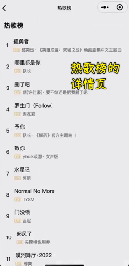

某个歌单的详情页：

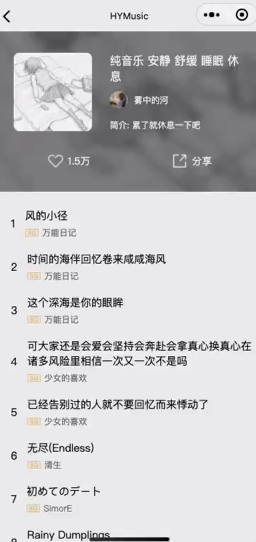

💡：怎么做？

这是我们要做的第一件事：

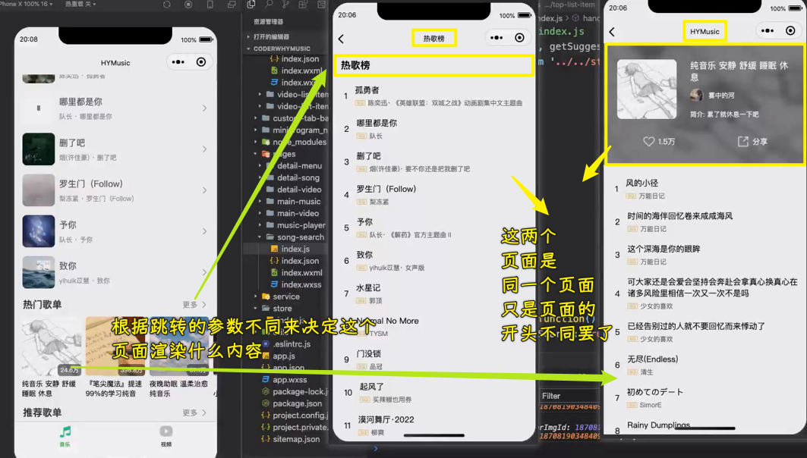

💡：实现它？

先来完成榜单的详情页：

1. 谁要跳转？ -> 「更多」、榜单排行榜的整个区域
2. 在`pages`旗下，创建`detail-songs`页面

在哪儿处理事件？

组件吗？ -> 不是 -> 有两个「更多」，这两个更多的逻辑是不一样的 -> 所以我们不能在组件内部处理事件，而是让组件把这个事件发送出去

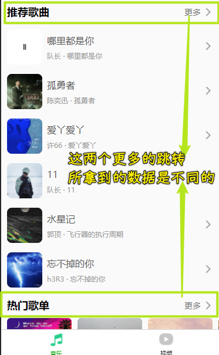

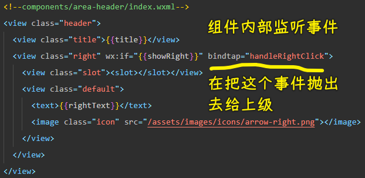

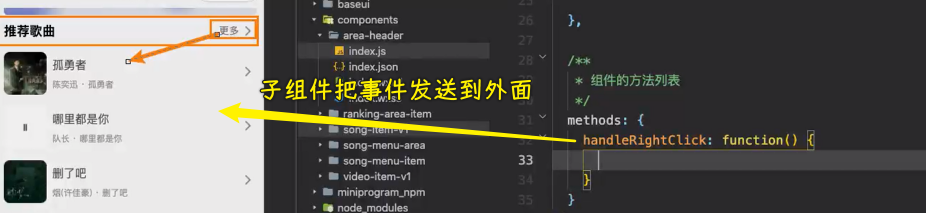

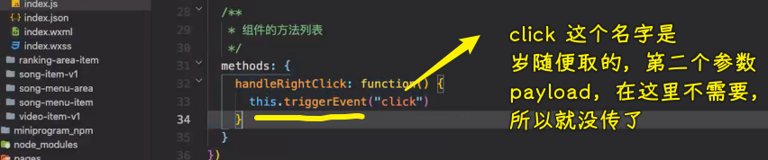

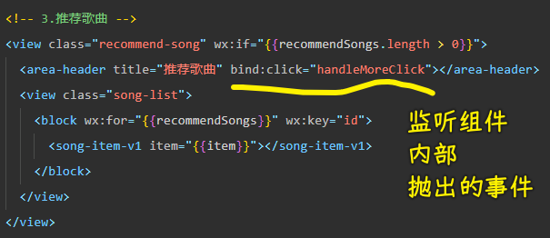

> 以上是针对「热门榜」的监听处理 -> 也就是「推荐歌曲」的`更多`

💡：榜单的事件监听

有两种方法监听：

1. 直接在自定义组件写`bindtap`，不用在组件内部写`this.triggerEvent('click')` -> 内置组件（如`view`）可以用`bindtap`，自定义组件也可以直接用
2. 你也可以在自定义组件的`wxml`里边的`view`根标签监听这个`bindtap`事件，毕竟这是针对整个 Item 的监听，不是具体到某个图片的监听，然后在把事件`triggerEvent`出去

在这里我们选择第一种，因为这个`更多`的事件处理函数是一样的，为了方便日后维护和修改，我们选择第一种

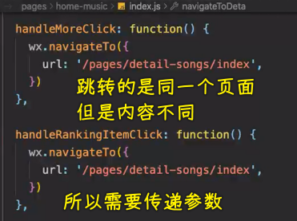

由于需要传递参数，我们对原先的处理函数里边的逻辑，提取成一个函数来调用：

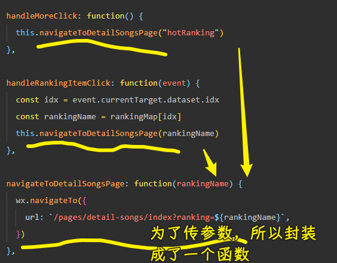

获取参数：

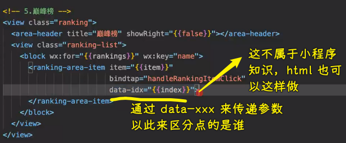

在参数的处理方面，我们可以利用之前在`ranking-store`里的`rankingMap`：

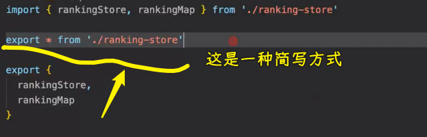

> 这种简写方式可读性不强 -> 但如果你理解清楚了，可以少写很多代码

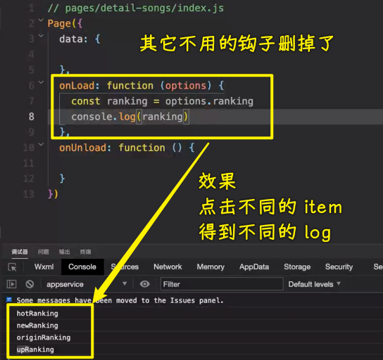

获取这些数据的意义：

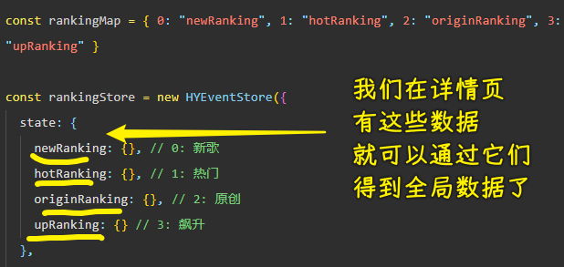

> [Demo](https://github.com/ppambler/QQMusic/commit/2375309)

3）答疑

💡：自定义属性`data`可以传对象吗？

可以的

国外视频起名 -> `index`、`indez`、`indey` -> 所以老师习惯叫`idx`，而不是`id`

4）掌握歌曲详情页-榜单数据展示

💡：详情页知道拿什么数据后，那就得获取这个数据了，获取完数据后，就得展示数据

获取数据：

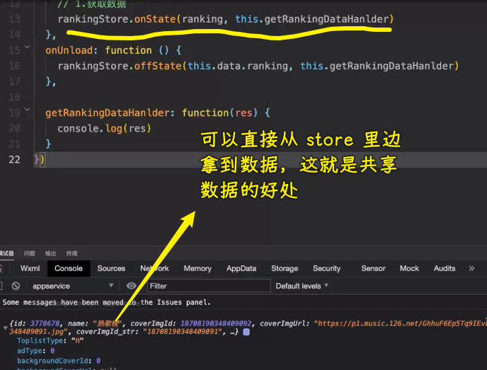

展示数据：

1. 把数据存放到`songInfo`里边
2. 定义`wxml`结构展示数据

💡：创建一个`song-item-v2`

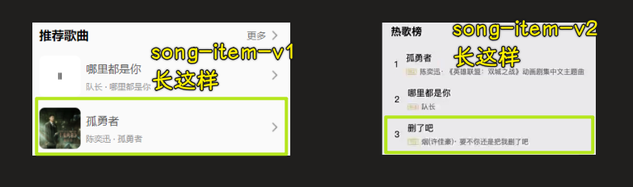

不知属性名代表哪些数据？

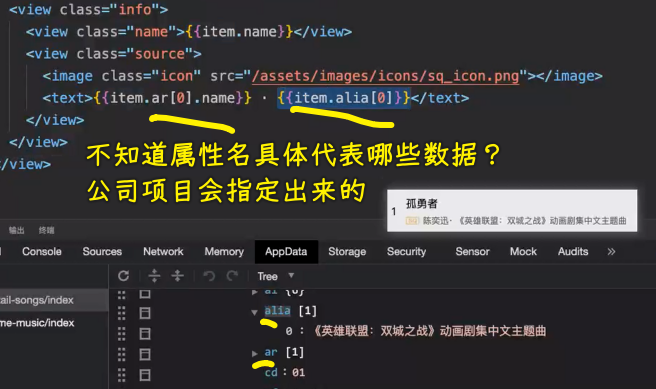

关于样式的拷贝？

由于经常封装组件，你的样式起名一定要符合你的习惯 -> `song-item-v1`和`song-item-v2`的样式有共通之处 -> 样式起名，也就是给组件标签添加`class`要一致

优化：有些歌曲没有别名

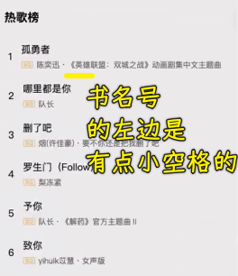

> 01 34 59

> [Demo](https://github.com/ppambler/QQMusic/commit/34ebf96)

👇：点击歌单的区分

6）答疑

💡：注册组件时的`index`可以不写吗？

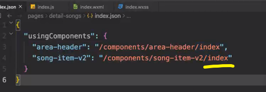

💡：模拟的内存限制

一般是 `1024M` -> 在你`setData`时，最不好要超过`1M`，超过`1M`会有警告

7）掌握歌曲详情页-歌单数据获取和展示

💡：做什么？

> 歌单数据获取 -> 跳转 -> 展示

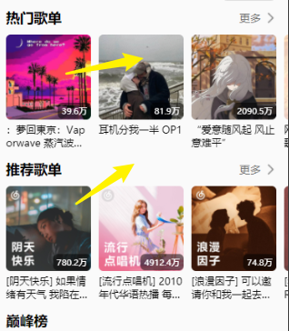

点击歌单跳到歌曲详情页，也就是监听歌单 Item，有两种姿势完成：

1. 直接监听自定义组件这个名称的点击
2. 进入到自定义组件里边，监听它的一个点击

在这里我们选择第一种，也就是监听自定义组件标签的点击

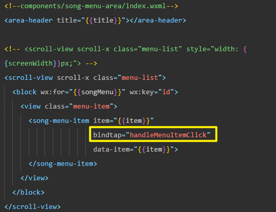

💡：如何区分点击的是哪个歌单？

很简单 -> 组件标签告诉我们就得了，也就是添加`data`属性呗

💡：跳转代码需要封装吗？

没必要，之前那个用的参数是`ranking`，即便你可以在`utils`里边封装成一个工具函数再导入进来，但这也没有必要，毕竟你这样做了，就得判断一下参数才行，而你不这样做的，无非就是写一行代码的事儿罢了

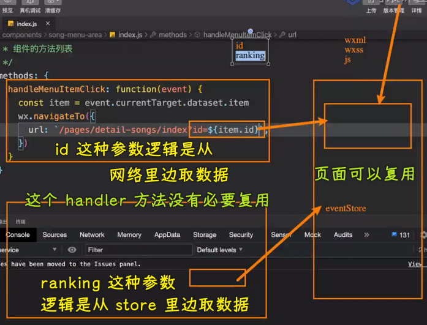

💡：歌曲详情页区分参数？

有两种姿势：

1. 非此即彼（不是`id`，就是`ranking`） -> 扩展性差，如果之后还需要用其它参数跳到这个页面来嘞？ -> 更何况有其它非歌单的数据也是用`id`呢？ -> 所以这种姿势并不好
2. 多传一个参数给歌曲详情页 -> 选择这种

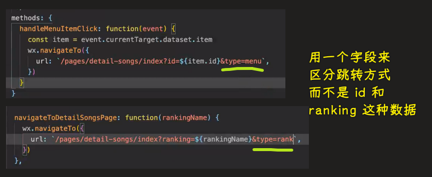

歌曲详情页的判断逻辑：

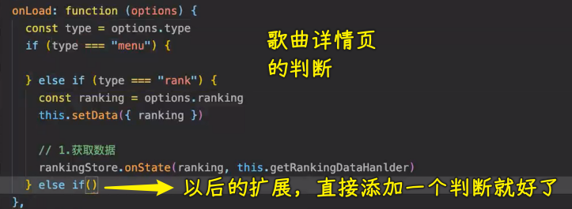

`offState`细节处理：

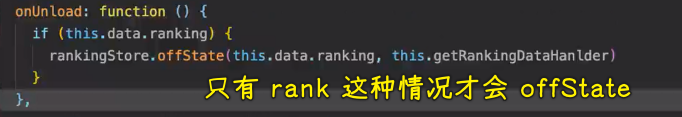

💡：获取歌单详情数据？

在`api_music.js`里边封装一个`getSongMenuDetail`方法

拿到歌单条数 -> 没有登录的情况，只有 10 条 -> 真实开发的情况，肯定不止 10 条

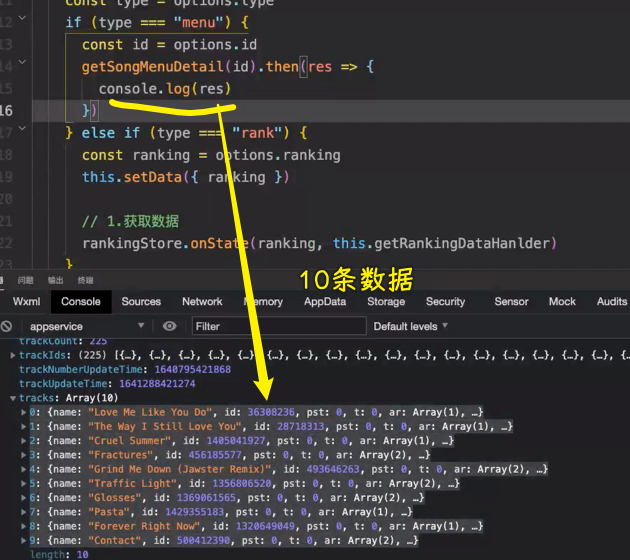

优化代码：

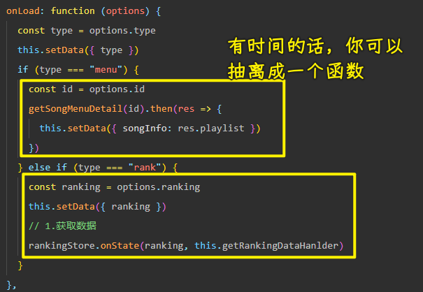

💡：数据有了，那就展示数据呗

开发设置：编译模式 -> 选择详情页

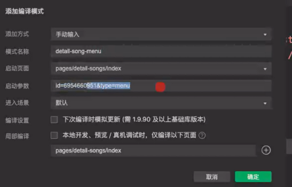

这样做的好处：不用每次跳过来

---

把获取到的歌单数据保存到`menuInfo` -> 之前保存榜单数据用的是`rankingInfo` -> 但它们俩的逻辑是一样，我们只写一个`songInfo`就得了！

💡：标题不同

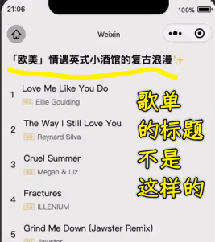

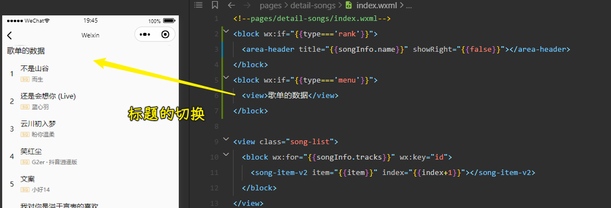

> [Demo](https://github.com/ppambler/QQMusic/commit/79d04f9)

8）答疑

💡：老师写的代码很流畅

- 逻辑理清了，就很流畅

自己写就蒙了？ -> 练习得少啊！

很多东西都需要实践，实践多了，才会让你的理论清晰起来

理论（思想还是什么的）必须实践，才能变成你自己的东西 -> 不管是编程，还是在生活中都是如此……

知行合一……

王阳明的思想到最后只有三字：致良知

> 致良知，即是指通过自省以实现良知，是明朝大儒王阳明创立的心学的核心思想之一。“致良知”学说对后世儒家、汉字文化圈都有深远影响。“致良知”是中国儒、释、道三家思想融合的产物

中国哲学史 -> 了解哲学，至少可以让你知道为什么活？ -> 搞哲学的那一批人都是很有智慧的一批人

学编程 -> 偏理性 -> 理性思考东西，而不是凭感觉，凭感性去思考东西 -> 不要让情绪掌控我们

人最大的痛苦就是难以跨越知道和做到的鸿沟…… -> 王阳明的知行合一

要理性也要有感性

唯心的人在唯物的世界里生存着……

➹：[如何理解王阳明所说的「致良知」？ - 知乎](https://www.zhihu.com/question/27915527)

💡：敲代码如何保持新鲜感？

首先要感兴趣

如果你每天都在重复的一些业务 -> 这肯定会烦躁的 -> 单调、重复没有任何进步的业务 -> 5 年后还做这些事儿，10 年后还做这些事儿，那么五年经验，10 年经验跟一年经验是一样的

建议：

1. 给公司提更高的要求，做其它的
2. 第一点达不到，那就跳槽呗

且与旧人做新事，勿与新人做旧事

公司角度 vs 个人角度

个人一定要做好规划 -> 人的差距起初不起眼，几年后你就会发现这个差距有多大了，千万不要跟随公司随波逐流啊（公司要你做啥就做啥）！一定要有自己的规范！

➹：[言语 - 多和旧人做新事，少和新人做旧事。_姜立娟](https://www.sohu.com/a/450935167_174959)

💡：在公司都快成为一个产品了

这个产品能成长为像腾讯这样的？ -> 几乎不可能，目前环境不允许了

对男生而言，掌握技术性价比更高，当然，做成品并不是说不好！

产品懂技术很好，不然不懂技术的产品，总会说「别人都能实现，你怎么不能实现呢？」

女生可以转产品

💡：coder

前端、Java 等都能干

老师后续开课讲 Java -> 会讲 1 年

💡：老师的 vux3+ts 课？

有同学认为老师这个课的 ts 不怎么深入 -> 其实就那么多东西，你要更复杂的话，用泛型就好了！ -> 这跟其它静态类型语言是一样的

💡：关于 CV 工程师的讨论

真正的 CV -> Opencv -> 头像处理 -> 很火

9）掌握歌曲详情页-歌单的头部展示

💡：做什么？

歌曲详情页 -> 关于歌单展示的标题不好看

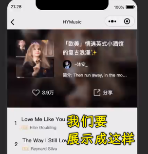

💡：实现它

---

完成内容结构部分：

毛玻璃：什么是毛玻璃，对出现在元素其后的背景进行模糊与半透明处理，被称作毛玻璃效果

> [什么是毛玻璃效果（Glassmorphism）？仅使用 HTML 和 CSS 来实现](https://chinese.freecodecamp.org/news/glassmorphism-design-effect-with-html-css/)

样式细节：

- 背景图片、封面小图片、头像是固定大小的，所以选择`aspectFill`
- icon 图片不是固定大小的，选择`widthFix`

操作：

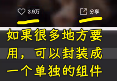

封装组件：

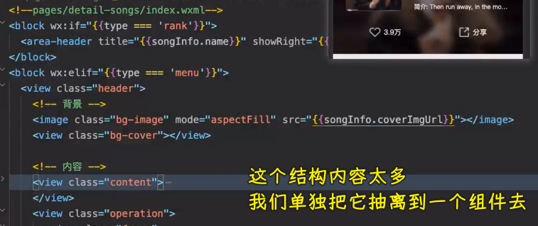

这个组件大概率不会复用，当然，这也不一定哈！

在`components`目录创建`song-detail-header`组件 -> 之前的做法是放到这个`detail-song`页面目录的`cpns`里边

---

完成内容样式部分：

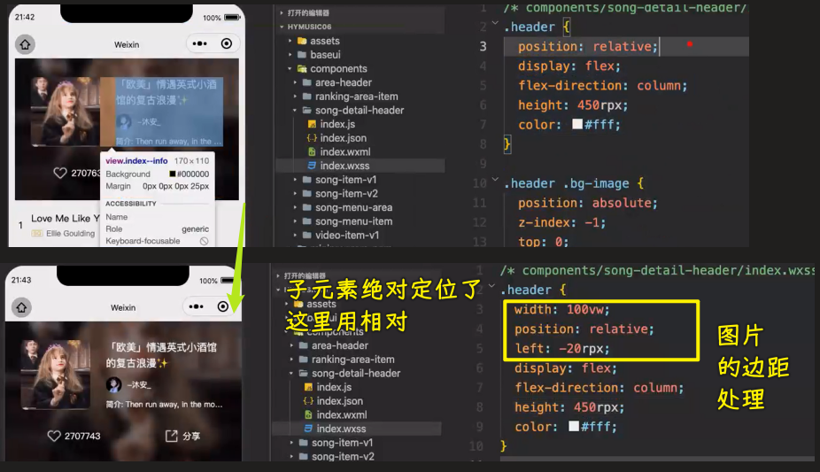

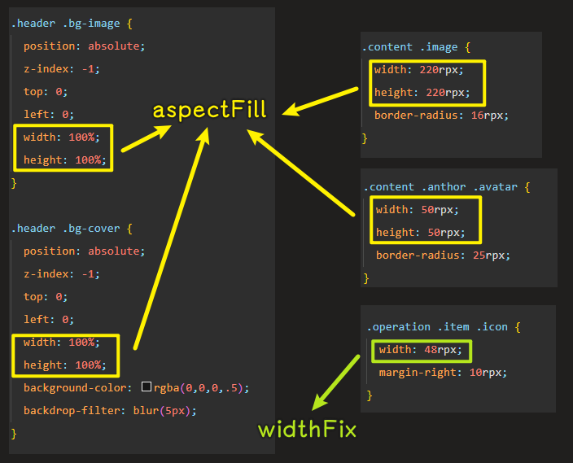

> [Demo](https://github.com/ppambler/QQMusic/commit/6d28808)

10）答疑

