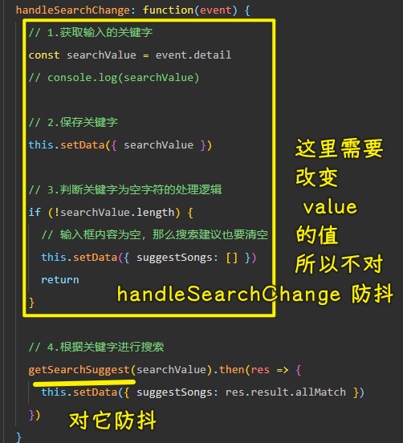
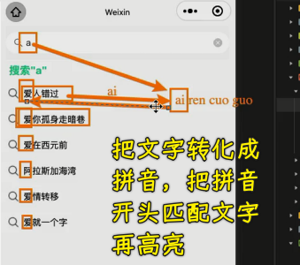
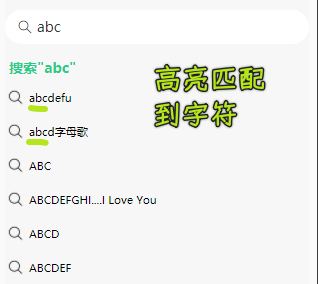
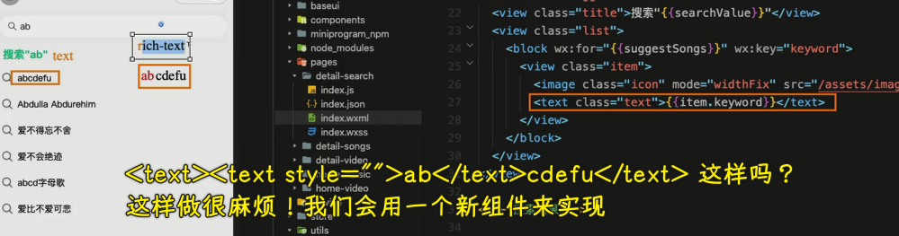
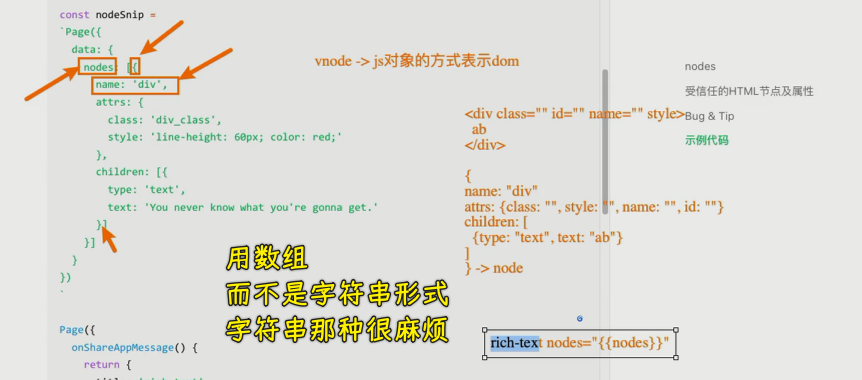
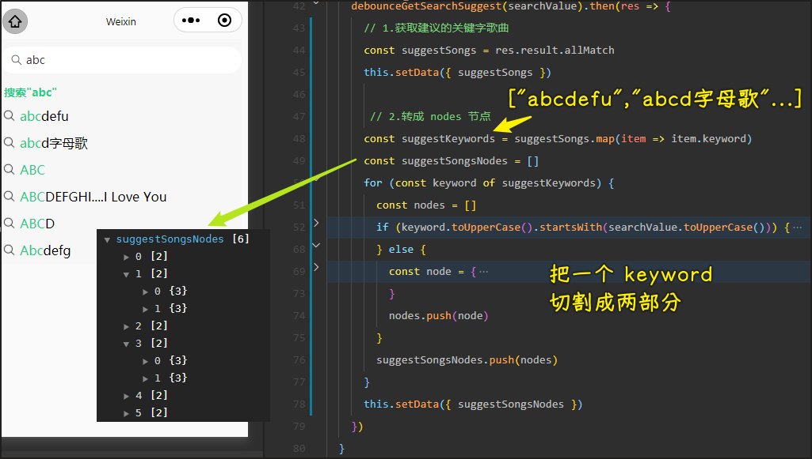

### ✍️ Tangxt ⏳ 2022-04-01 🏷️ 小程序

# 07-HYMusic 歌单和歌曲详情开发

1）掌握搜索页-防抖优化搜索建议

💡：做什么？

对了，不管你是做 PC 端，还是移动端，如小程序、手机 web 应用、安卓/IOS 应用，面对这种搜索功能都会做防抖操作，毕竟用户输入非常快的话，请求就会非常频繁了

比如：用户想搜`abc`，结果发送了三次请求 -> 搜索`a`、搜索`ab`、搜索`abc`

对于这种情况，会导致：

1. 前端有不必要的网络性能开销 -> 当然，对前端而言这样的影响是有限的，而对后端就影响很大了
2. 后端服务器压力剧增 -> 一个用户显然不会，但这显然存在成千上万个用户在不同端（PC、小程序等），在同一时刻发送搜索请求了，这样不必要的发送次数就累加起来了，所以服务器的压力会非常非常得大 -> 当然，如果服务器性能非常强的话，这一点固然没啥，但这没有必要哈！

对于这个搜索功能的处理，我们一般用防抖来处理，而不是节流，当然节流也行哈

💡：防抖处理搜索请求

防抖 -> 偏后拿到结果

对谁防抖？

创建一个`debounce.js`：

- 可以设置立即执行，也就是第一次就会执行
- 延时设置成`300`，你输入一个字符会等待`300ms`后才发送请求，如果，你在这`300ms`期间输入了其它字符，那么就会重新等待`300ms` -> 体现防抖效果的话，你可以设置成`1000ms`

只要你输入停顿足足`300ms`就会发送一次请求

> [Demo](https://github.com/ppambler/QQMusic/commit/e0569c9)

💡：搜索建议优化：输入的字符是否在搜索结果里边高亮（也是绿色）匹配？

观察其它 APP：

- IOS 端的网易云音乐 -> 没有匹配功能
- 手机 QQ 音乐、QQ 音乐小程序 -> 有匹配功能 -> 大小写敏感的匹配，一般只匹配开头，当然其它也有中间匹配
- 输入字符`a`，是否要匹配`爱人错过`、`阿拉斯加湾`这样的拼音是`a`开头的中文字符？ -> 没有看到手机 QQ 音乐、QQ 音乐小程序有做 -> [hotoo/pinyin: 汉字拼音 ➜ hàn zì pīn yīn](https://github.com/hotoo/pinyin)

> 最后一点看产品需求

2）掌握搜索页-富文本优化搜索建议

💡：优化搜索建议

怎么做？

`rich-text`：

> 我们发微信时，带表情包的信息就可以用富文本来做

> [Demo](https://github.com/ppambler/QQMusic/commit/1710f34)

你可以完善这个功能：

- 中间也可以匹配，不单单是开头 -> 正则
- 中文字符也可以匹配 -> 用`pinyin`库

3）

> 57 33

