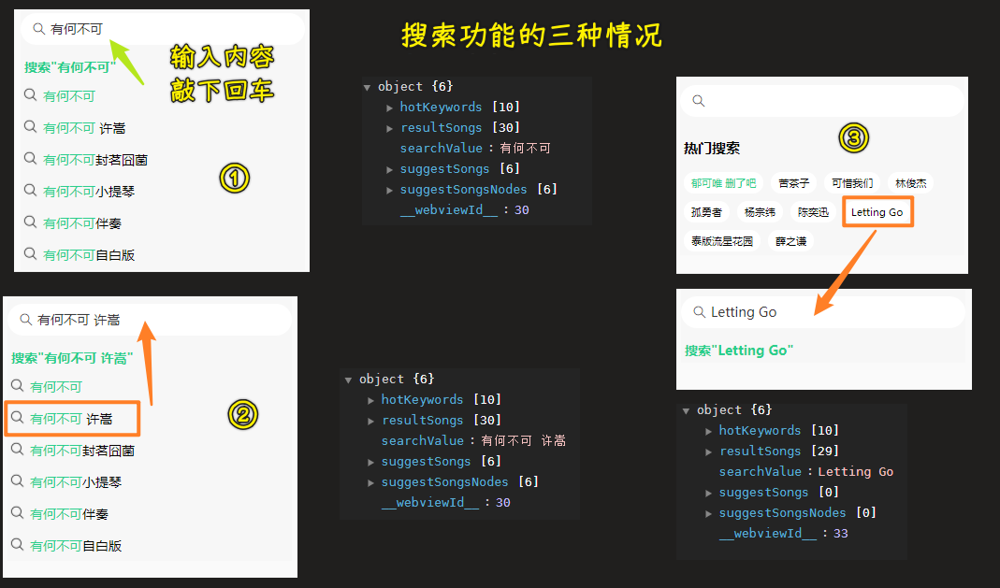
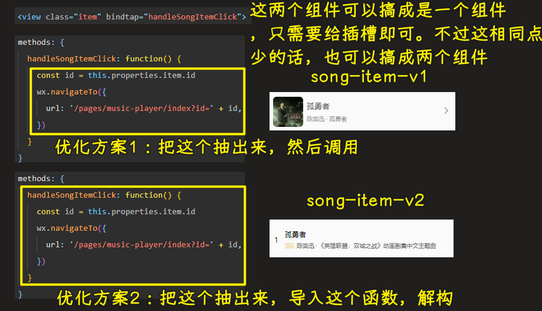

### ✍️ Tangxt ⏳ 2022-04-01 🏷️ 小程序

# 07-HYMusic 歌单和歌曲详情开发

### <mark>1）掌握搜索页-防抖优化搜索建议</mark>

💡：做什么？

对了，不管你是做 PC 端，还是移动端，如小程序、手机 web 应用、安卓/IOS 应用，面对这种搜索功能都会做防抖操作，毕竟用户输入非常快的话，请求就会非常频繁了

比如：用户想搜`abc`，结果发送了三次请求 -> 搜索`a`、搜索`ab`、搜索`abc`

对于这种情况，会导致：

1. 前端有不必要的网络性能开销 -> 当然，对前端而言这样的影响是有限的，而对后端就影响很大了
2. 后端服务器压力剧增 -> 一个用户显然不会，但这显然存在成千上万个用户在不同端（PC、小程序等），在同一时刻发送搜索请求了，这样不必要的发送次数就累加起来了，所以服务器的压力会非常非常得大 -> 当然，如果服务器性能非常强的话，这一点固然没啥，但这没有必要哈！

对于这个搜索功能的处理，我们一般用防抖来处理，而不是节流，当然节流也行哈

💡：防抖处理搜索请求

防抖 -> 偏后拿到结果

对谁防抖？

创建一个`debounce.js`：

- 可以设置立即执行，也就是第一次就会执行
- 延时设置成`300`，你输入一个字符会等待`300ms`后才发送请求，如果，你在这`300ms`期间输入了其它字符，那么就会重新等待`300ms` -> 体现防抖效果的话，你可以设置成`1000ms`

只要你输入停顿足足`300ms`就会发送一次请求

> [Demo](https://github.com/ppambler/QQMusic/commit/e0569c9)

💡：搜索建议优化：输入的字符是否在搜索结果里边高亮（也是绿色）匹配？

观察其它 APP：

- IOS 端的网易云音乐 -> 没有匹配功能
- 手机 QQ 音乐、QQ 音乐小程序 -> 有匹配功能 -> 大小写敏感的匹配，一般只匹配开头，当然其它也有中间匹配
- 输入字符`a`，是否要匹配`爱人错过`、`阿拉斯加湾`这样的拼音是`a`开头的中文字符？ -> 没有看到手机 QQ 音乐、QQ 音乐小程序有做 -> [hotoo/pinyin: 汉字拼音 ➜ hàn zì pīn yīn](https://github.com/hotoo/pinyin)

> 最后一点看产品需求

### <mark>2）掌握搜索页-富文本优化搜索建议</mark>

💡：优化搜索建议

怎么做？

`rich-text`：

> 我们发微信时，带表情包的信息就可以用富文本来做

> [Demo](https://github.com/ppambler/QQMusic/commit/1710f34)

你可以完善这个功能：

- 中间也可以匹配，不单单是开头 -> 正则
- 中文字符也可以匹配 -> 用`pinyin`库

### <mark>3）搜索页-优化搜索关键字变节点</mark>

> 57 33

💡：优化代码

文件命名 -> `string-to-nodes.js`（这个目录里边都是用`-`链接多个单词的，那么你可以用这个，不然，你可以`stringToNodes.js`） or `string2nodes.js` -> 推荐后者

> [Demo](https://github.com/ppambler/QQMusic/commit/7e6cd43)

### <mark>4）搜索页-搜索功能</mark>

💡：搜索功能

搜索三种情况：

1. 输入明确字符串，按回车
2. 模糊搜索，弹出搜索建议，点击搜索建议
3. 点击默认的热门搜索

搜索接口：

事件监听：

1. `bind:search="handleSearchAction"` -> 回车提交
2. `bindtap="handleKeywordItemClick"` -> 点击搜索建议 Item
3. `bindtap="handleKeywordItemClick"` -> 点击默认搜索

> [Demo](https://github.com/ppambler/QQMusic/commit/573e28b)

事件处理函数存在重复代码 -> 可优化

默认的遍历情况：

代码优化后的遍历：

注意：当搜索输入框为空时，搜索结果也得清空

> [Demo](https://github.com/ppambler/QQMusic/commit/80cc2c7)

💡：优化

有搜索结果就不要有搜索建议了

> [Demo](https://github.com/ppambler/QQMusic/commit/9107fc2)

👇：展示搜索结果

### <mark>5）搜索页-展示搜索结果</mark>

细节处理：

- 输入框不应该跟着滚动 -> 有 `fixed` bug（部分安卓手机不兼容），那就用`scroll-view`
- 每个 Item 应该有该歌曲的作者名等
- 输入框有取消按钮

> [Demo](https://github.com/ppambler/QQMusic/commit/6f8be46)

其它功能补充：

- 上拉加载和下拉刷新
- 在顶部添加选项卡，用来选择这个搜索结果是来自歌单、专辑、歌手还是其它
- 历史搜索 -> 不能重复、可以保存到本地，可以保存到服务器 -> 在`handleSearchAction`里边做

> 搜索功能 -> 电商等常用 -> 复杂的地方只有防抖

### <mark>6）播放页-跳转到播放页</mark>

💡：播放页 -> 该项目重点

谁会跳转到播放页？

1. 都是`song-item-v1`和`song-item-v2`会跳转
2. 我们不用在每个页面写跳转函数，直接在组件里边写就好了

在组件里边，我们在哪儿写钩子和方法？

1. `lifetimes`
2. `methods`

以前的写法是不写在一个对象里边的，当然，如果写熟悉了，不管是写在一起，还是不写在一起都是一样的，不过这就是规范的问题了！

点击后传数据？ -> 有两种做法：

1. 在`wxml`里边添加属性`data-id -> item.id`，透过`event`形参拿到值
2. `this.properties.item.id` -> 保证属性叫`item`，不能叫`itemInfo`之类的

选择哪种方案呢？ -> 取决于你怎么做 -> 如果你不想传`event`，那就用第二种，如果你想传`event`，那就用第一种

我们选择第二种

> [Demo](https://github.com/ppambler/QQMusic/commit/fa7979e)

💡：优化思路

