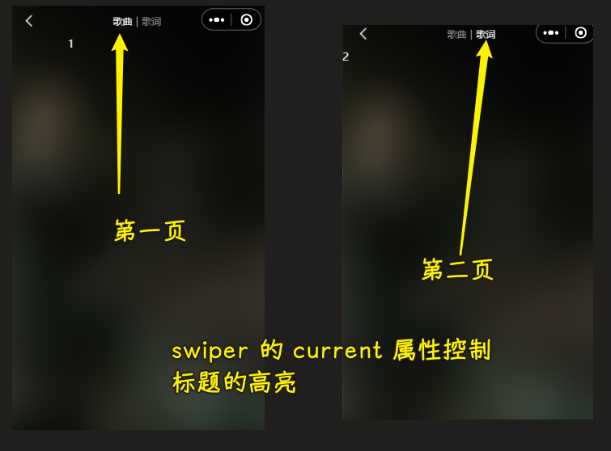

### ✍️ Tangxt ⏳ 2022-04-12 🏷️ 小程序

# 08-播放器⻚⾯界⾯ UI 实现

1）答疑

💡：前端哪些技术已经过时了 -> 不用学了？

像 Bootstrap、jQuery 这些技术不学也没事哈！ -> 简单做一两个项目即可

💡：系统课偏向就业还是拔高？

都有

之前老师讲了一次 JS 高级，这次系统课再讲一遍 JS 高级，会让你的收获再多一点……

一些东西反复学，每次感觉都不一样 -> 比如 JS -> 把 JS 搞懂，不管是学框架，还是阅读框架的源码都会容易很多

学完 JS 高级后，很多东西都能写出来了，但是自己叙述说不明白 -> 面试需要表达能力 -> 能表达出来，别人才知道你是会的 -> 写文章锻炼表达能力

可以把老师讲的内容总结成 blog 吗？ -> 可以的！

💡：Java 源码的`>>`？

`>>` 性能大于乘法`*` -> 汇编、操作系统原理会了解到这一点

同理，`<<` 对于除法`/`也是如此

💡：面试时，这个项目如何介绍？

1. 把项目拿出来
2. 介绍这个项目包含哪些功能
3. 说一下做这个项目的过程中，遇到的一些问题
4. 总之，就是把你比较有优势的地方给提出来 -> 勇敢地表达自己
5. 面对不同的人聊不同的话题，比如 HR，你给 ta 讲你的项目，这显然是不行的， HR 关注的是你这个人如何，为啥从上一家公司离职？会不会随便离职、稳定性如何？跟同事相处如何？你平常的爱好？

面试不要一问一答，这是很尴尬的一种场面

候机法则 -> 在等飞机的时候，沟通顺畅，作为同事也需这样的人

> 候机法则就是，HR 要在面试中选出一个他愿意与之等候一个小时飞机的人。 也就是说，你必须有趣不无聊，让人乐意与你相处。 在面试中，注意说话的艺术，不能干巴巴地说话（也就是一问一答），而是争取建立起 HR 对你的认同感

💡：fetch api 用得多吗？

用的越来越多！

2）掌握搜索页-搜索建议的 bug 处理

💡：bug

> 后边再解决

💡：取消防抖

> 不管你是什么开发，当你遇到某一个 bug，某一个问题的时候，你都要先去猜「这个问题是怎么产生的？」 -> 你能猜到大概什么样的原因之后，你就知道怎么去解决了

怎么产生的？

如何解决？

方案一：

这个方案是可以的，但我认为当输入内容为空的时候，这个请求是没有必要发出去的

> `setData` 设置数据是同步的，更新页面数据显示是异步的

方案二：

这个取消功能如何实现？ -> 就得看这个这个防抖函数内部是如何实现的，也就是其原理 -> 用到了计数器

💡：一些优化

> [Demo](https://github.com/ppambler/QQMusic/commit/2b6eea3)

💡：遇到类似 bug 时，你应该按照什么样的思路去解决呢？

1. 知道这个问题会在什么情况下出现 -> 删字符直到为空，依旧展示搜索建议结果
2. 分析为什么会产生这个问题 -> 防抖处理过的请求函数等待时机执行
3. 知道如何产生，自然就会知道如何解决 -> 取消这次等待

3）掌握播放页-请求播放歌曲的详情

💡：要实现的效果

> 布局啥的，很简单，主要是机型适配问题

💡：怎么做？

先来根据`id`获取数据

> 接口，在某些地方很不规范……比如同样意思的字段，在不同接口里边，叫法不同……

> [Demo](https://github.com/ppambler/QQMusic/commit/e088f7f)

效果：

4）掌握播放页-背景和自定义导航方式

> [Demo](https://github.com/ppambler/QQMusic/commit/c9161c2)

效果：

5）掌握播放页-自定义可复用的导航栏

> 封装自定义导航

💡：什么是手机状态栏、导航栏高度？

> 可计算得知 -> iPhone6 44、iPhone5 20

➹：[iOS  iPhone 各机型尺寸及导航栏高度 - 简书](https://www.jianshu.com/p/8f566ce3bc2c)

➹：[Android ：状态栏的高度获取、getWindowVisibleDisplayFrame_Mars-xq 的博客-CSDN 博客](https://blog.csdn.net/sinat_31057219/article/details/105795422)

💡：做什么？

💡：实现自定义导航栏组件

在哪个目录创建组件？

1. 在`baseui`创建 -> `navbar`  -> 因为它可以在下一个项目里边使用
2. 你也可以在`components`下创建 -> `navigation-bar` -> 名字起这么长？是为了匹配当前目录下组件命名比较长

获取状态栏的高度：

1. 可以在自定义组件的`lifes`对象的`ready`钩子里获取
2. 也可以在之前定义全局变量的地方（`app.js`）获取

区域划分：

1. 整个叫`nav`
2. 状态栏叫`status`
3. 导航栏叫`nav-bar`

一般情况下，导航栏会分成三部分：左中右

导航栏的一般固定高度是`44px`（iPhone 手机一般都是这个），有些则是`46px`、`50px` -> 总之大多都是`44px`

把左右宽度固定死了 -> 你可以不固定，可以通过传参数来确定左边的宽度

图片下边经典 `3px` -> 手机端、PC 端都有

小程序里边使用多插槽 -> 在其`js`里边必须添加`options`属性 -> 指定`multipleSlots: true`

> [Demo](https://github.com/ppambler/QQMusic/commit/5960d8f)

效果：

6）掌握播放页-播放页的分页布局展示

💡：tab 布局和样式

> 可以抽离成一个组件 -> 两个 tab 是传进来的，中间的分割线也是传进来的

> [Demo](https://github.com/ppambler/QQMusic/commit/a867317)

💡：分页效果，左右滑动

怎么做？

有两种做法：

1. 自己封装分页效果
2. 使用第三方组件

但是我们其实可以用`swiper`来做 -> 很像轮播图 -> 该做法非常方便，不用我们自己封装，是内置的

💡：`swiper`的高度确定

需要动态计算出来

对常量的处理：

不建议在代码写这种数字常量，那我们该如何处理它呢？

有两种管理方案：

1. 常量比较多 -> 搞一个`constants`文件夹 -> 在该目录里边定义各种各样的常量 -> 如定义有关设备信息的常量：`device-const.js`
   1. 好处：多个地方都用到同一个常量，那就只在一个地方里边改就好了
   2. 场景：用到很多常量的大项（前后端项目）
2. 常量少 -> 搞一个全局变量就好了 -> 在`app.js`里边搞

💡：监听滑动

效果：

> [Demo](https://github.com/ppambler/QQMusic/commit/cc21800)

