### ✍️ Tangxt ⏳ 2022-04-17 🏷️ 小程序

# 09-播放器暂停、上⼀⾸、下⼀⾸、进度控制

### <mark>1）答疑</mark>

💡：从 tabbar 页面跳转到其它普通页面 -> 再从普通页面返回到这个 tabbar 页面时需要刷新这个 tabbar 页面？

监听返回 -> 用事件总线监听某个事件

也可以用`onShow`（页面重新出现）

根据需求选择方案

💡：CSS 选择器警告？

可以不处理，只是它不推荐使用像`image`这样的标签选择器罢了！

💡：写样式的快慢

- 确定了布局 -> 写样式很快
- 写样式很纠结 -> 样式就写得很慢了

💡：播放页的设计图？

可以自己设计 -> 比如把图片换成是圆的 -> 早期 QQ 音乐就是圆的

### <mark>2）理解播放页-页面布局的设计调整</mark>

> 优化：小屏幕不展示歌词，大屏幕展示歌词

💡：在小屏幕，如 iP5，歌词不显示如何做？

对图片使用`aspectFill`的情况：

我们对图片使用`widthFix`：

屏幕高了 -> 影响底部布局 -> 屏幕宽了，图片也高了，也影响底部布局

根据设备的宽高比来决定是否显示歌词 -> `设备高度 / 设备宽度`

比例是超过 2 就显示歌词，不超过就隐藏歌词

iP5 和 iP6 都会低于 2 的，所以我们不显示歌词

> [Demo](https://github.com/ppambler/QQMusic/commit/287d34f)

> 2 22 09

以后遇到这样的设计问题，都可以这样做，当然，产品会给出具体的布局方案

### <mark>3）掌握播放页-界面数据优化 和 audioContext 优化</mark>

💡：目前的问题：不管点击谁，这进入的都是一样的页面

所以需要动态化这些数据

💡：如何获取歌曲总时长？

有两种方案：

1. `audioContext`有个`duration`可以获取歌曲总时长，不过需要等歌曲播放后才能获取到
2. 接口会返回有关歌曲总时长的字段 -> 比如`dt`字段（`duration`的缩写）

服务器给了字段那就选择方案 2，没给，那就选择方案 1

💡：如何获取当前歌曲正在播放到的时间？

这个时间不好拿

💡：优化：我们只需创建一个播放器就好了，同一时刻只会播放一首歌

播放器不止在一个地方使用，还会在其它地方使用 -> 需要共享这个对象

有两个方案：

1. `app.js`
2. `event-store`

选择谁？ -> 取决于这个对象有一天会不会被修改，然后修改后是否会引起界面的变化 -> 也就是根据数据变化作出响应式（比如 UI 布局变化等）

之后要共享的数据 -> 歌词、当前播放时间、歌曲

不选择方案 1 -> 因为我们还用利用`audioContext`旗下的 API 去监听一些事儿，在`app.js`里边写的话，会让这个文件很大很混乱

我们的做法是 -> 放到一个`js`文件里边 -> 统一在这个文件处理有关`audioContext`的逻辑

这种做法，可以结合`event-store`

---

效果：

> 有些地方专辑那部分没有数据

> [Demo](https://github.com/ppambler/QQMusic/commit/50674c6)

💡：流媒体

播放的时候，`audioContext.src`需要获取流媒体数据（封装格式、编码格式） -> 解码 -> 播放

> 不需要缓存完才会播放，会边缓存边播放

需要学 c  -> 一个很重要的库 `FFmpeg`

老师 coderwhy 简书有介绍

这个流媒体不属于前后端，也不属于移动端，就是流媒体这个领域的知识 -> 未来会很火

写简单应用的话，不用学 c 和 c++ -> 有些库底层有封装

➹：[前端流媒体播放从入门到入坑 - 掘金](https://juejin.cn/post/7015100196631609351)

### <mark>4）掌握播放页-Slider 和播放进度的控制</mark>

💡：进度控制

得到播放的当前时间：

1. 明确知道歌曲播放到什么时间
2. `audioContext`提供了一个叫`onTimeUpdate`的钩子 -> `on`开头的函数命名，一般是指在什么什么情况下你准备做一件事情的时候（不管是做 Java 开发还是其它开发都是如此） ->我们监听在时间发生变化的时候，我们要做一件事
3. `audioContext`有个`currentTime`属性，可以拿到当前播放的时间 -> 得到是`s` -> 我们格式化的是`ms`

拖动进度可以改变时间，时间变化可以自动拖动进度：

我们手动拖动进度的情况 -> 分为两种情况：

1. 点到哪个位置，就立马播放哪个位置 -> 监听`bindchange`事件
2. 来回拖拽进度条时 -> 不影响原来歌曲的播放节奏 -> 等到松手时，才会播放在这个位置时的歌曲 -> 来回拖动触发`bindchanging`事件，停下来那一刻触发`bindchange`事件

让进度条随着歌曲播放自动拖动：

- 当前时间和总时长的占比 -> 乘上 100 -> `slider`的值是`0-100`

效果：

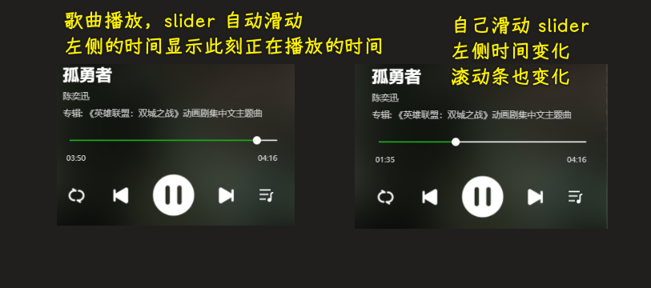

> [Demo](https://github.com/ppambler/QQMusic/commit/9296d7e)

相较于展示数据的逻辑 -> 这种数据处理的逻辑要更复杂一点

### <mark>5）答疑</mark>

💡：状态控制？

用一些变量记录状态 -> 在某些情况下把它的状态改回来，也就是在需要的时候把它的状态改回来

像

- `isSliderChanging`
- `isMusicLyric`

这样的变量，就是用来控制状态的

💡：重新打开小程序，如何再接着听之前播放的歌曲？

本地存储 -> 记录`currentSong` -> `currentTime`、`sliderValue` -> `seek`到对应的位置

💡：想让 slider 的滑块平滑一点？

可以加动画 -> 让它从 1s 到 2s，2s 到 3s 这样过渡，而不是从 1s 直接到 5s 这样过渡！

💡：不需要`log`值，就可查看效果

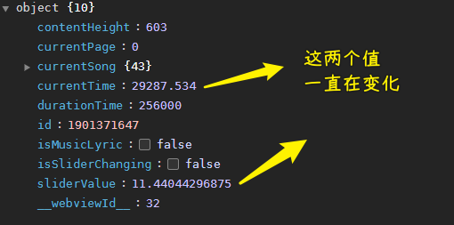

💡：音乐首页 -> 轮播图高度处理 -> 偶尔会出现高度没计算的情况 -> 刚打开这个项目会复现这个问题

添加`trailing`设置为`true` -> 表示最后一次节流一定会执行

💡：log 和 debug -> 选择谁？

先 log，log 不行就 debug

### <mark>6）掌握播放页-请求和解析歌词的过程</mark>

💡：优化事件监听

💡：代码比较多的时候，如何让注释更清晰？

> [Demo](https://github.com/ppambler/QQMusic/commit/79edd75)

💡：歌词处理

当前时间和歌词匹配

接口测试：

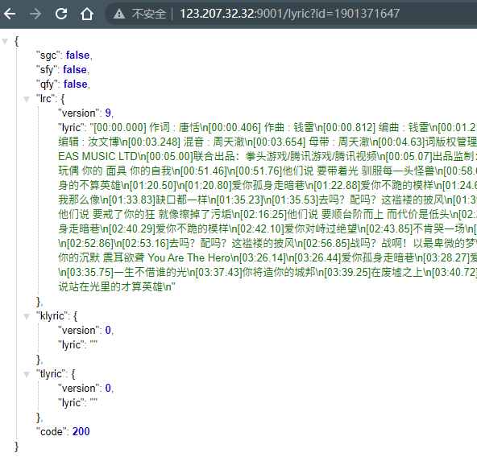

代码实现逻辑：

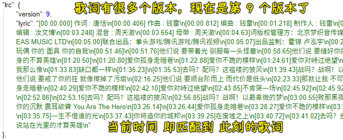

获取歌词：

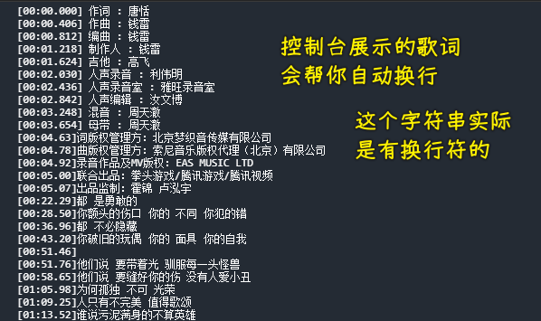

解析歌词：

把时间和歌词解析出来

💡：如何解析歌词？

解析歌词是一个独立的功能，我们可以把它放到一个独立的文件里边

做法：

1. 数组化一段字符串 -> 以`\n`作为`split`的分割符
2. 遍历数组
3. 正则匹配时间 -> 提取出时间
4. 提取歌词
5. `key` 是时间，`value` 是歌词

解析成什么样的数据格式：

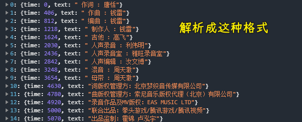

> [Demo](https://github.com/ppambler/QQMusic/commit/ba2a33c)

💡：什么是正则表达式？

一句话：字符串匹配利器

- 字符串匹配 -> 匹配一段字符串里边的某串字符
- 利器 -> 非常好用的一个工具

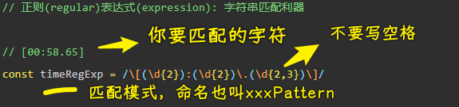

> 有些字符有特殊含义，需要转义

### <mark>7）答疑</mark>

💡：一个文件的代码行数多了，就得考虑代码的抽取 -> 为了好维护

抽取的粒度 -> 自己决定

redux 作者说了 -> 作为一个开发者，有些东西你如何选择，是你该做的决定，这是你的任务

了解老师更多的思路，当你在做一些决定的时候，会有更多的一个参考

总之，老师会讲为什么会这样做，这样做都是考虑过的！

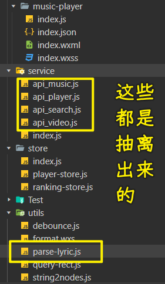

### <mark>8）掌握播放页-根据时间匹配正确的歌词</mark>

💡：匹配歌词

理清楚业务再去写代码 -> 理清楚这个匹配歌词的算法再去写代码（先伪码，再真实代码）

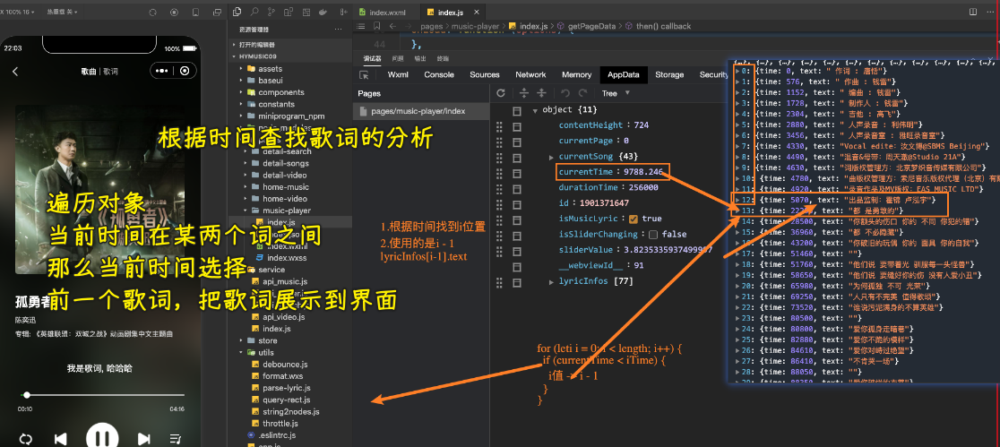

💡：待优化的代码

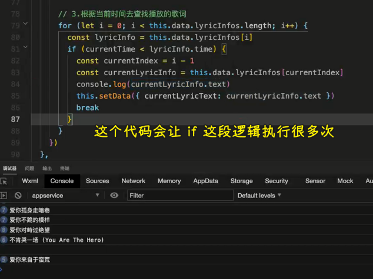

优化代码：

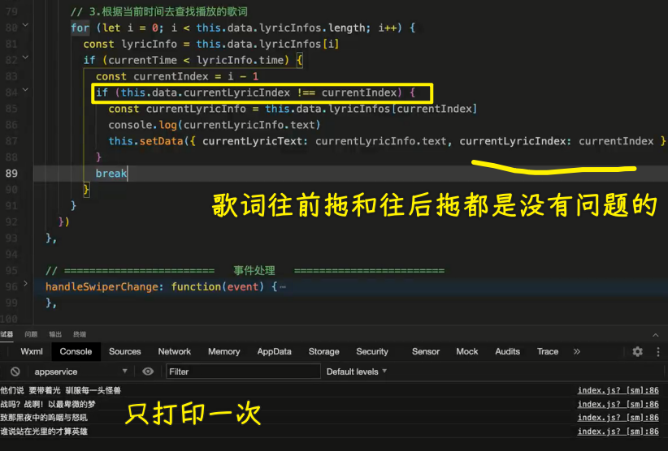

继续优化：

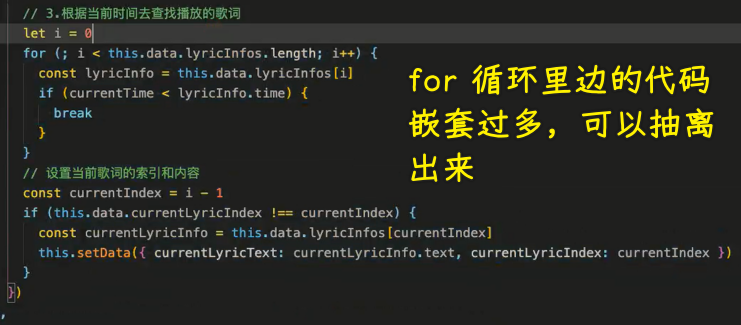

> 二分法优化？ -> 也可以 -> 确定当前时间，前边的就不用找了，可是用户可以随便拖拽啊，这点优化其实就没必要了

效果：

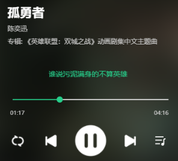

> [Demo](https://github.com/ppambler/QQMusic/commit/7c5a81d)

### <mark>9）答疑</mark>

💡：如果歌词超出一行呢？

要么用点点点，要么显示两行

### <mark>10）了解歌词字变化的思路分析</mark>

💡：如何做到歌词里每个字的渐变？

唱到某个字的时候，就会高亮到某个字

在这里我们无法实现，要实现这样的功能，那么服务器给我们的歌词，就得是这样格式的：

- `[00:58.65]`怎
- `[00:59.650]`么

也就是让每个字都有时间

在播放下一个字之前的等待时间，就渐变当前这个字 -> 用 css 样式

所以说，这些技术都是可以实现的，没有什么技术是实现不了的 -> 计算机里边没有黑魔法，只要你能把这里边的逻辑都搞清楚，这些技术都可以实现

其它思路 -> 计算一句歌词的总时长，然后平均分配给每个字
