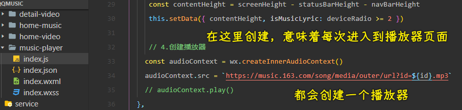

### ✍️ Tangxt ⏳ 2022-04-17 🏷️ 小程序

# 09-播放器暂停、上⼀⾸、下⼀⾸、进度控制

1）答疑

💡：从 tabbar 页面跳转到其它普通页面 -> 再从普通页面返回到这个 tabbar 页面时需要刷新这个 tabbar 页面？

监听返回 -> 用事件总线监听某个事件

也可以用`onShow`（页面重新出现）

根据需求选择方案

💡：CSS 选择器警告？

可以不处理，只是它不推荐使用像`image`这样的标签选择器罢了！

💡：写样式的快慢

- 确定了布局 -> 写样式很快
- 写样式很纠结 -> 样式就写得很慢了

💡：播放页的设计图？

可以自己设计 -> 比如把图片换成是圆的 -> 早期 QQ 音乐就是圆的

2）理解播放页-页面布局的设计调整

> 优化：小屏幕不展示歌词，大屏幕展示歌词

💡：在小屏幕，如 iP5，歌词不显示如何做？

对图片使用`aspectFill`的情况：

我们对图片使用`widthFix`：

屏幕高了 -> 影响底部布局 -> 屏幕宽了，图片也高了，也影响底部布局

根据设备的宽高比来决定是否显示歌词 -> `设备高度 / 设备宽度`

比例是超过 2 就显示歌词，不超过就隐藏歌词

iP5 和 iP6 都会低于 2 的，所以我们不显示歌词

> [Demo](https://github.com/ppambler/QQMusic/commit/287d34f)

> 2 22 09

以后遇到这样的设计问题，都可以这样做，当然，产品会给出具体的布局方案

3）掌握播放页-界面数据优化 和 audioContext 优化

💡：目前的问题：不管点击谁，这进入的都是一样的页面

所以需要动态化这些数据

💡：如何获取歌曲总时长？

有两种方案：

1. `audioContext`有个`duration`可以获取歌曲总时长，不过需要等歌曲播放后才能获取到
2. 接口会返回有关歌曲总时长的字段 -> 比如`dt`字段（`duration`的缩写）

服务器给了字段那就选择方案 2，没给，那就选择方案 1

💡：如何获取当前歌曲正在播放到的时间？

这个时间不好拿

💡：优化：我们只需创建一个播放器就好了，同一时刻只会播放一首歌

播放器不止在一个地方使用，还会在其它地方使用 -> 需要共享这个对象

有两个方案：

1. `app.js`
2. `event-store`

选择谁？ -> 取决于这个对象有一天会不会被修改，然后修改后是否会引起界面的变化 -> 也就是根据数据变化作出响应式（比如 UI 布局变化等）

之后要共享的数据 -> 歌词、当前播放时间、歌曲

不选择方案 1 -> 因为我们还用利用`audioContext`旗下的 API 去监听一些事儿，在`app.js`里边写的话，会让这个文件很大很混乱

我们的做法是 -> 放到一个`js`文件里边 -> 统一在这个文件处理有关`audioContext`的逻辑

这种做法，可以结合`event-store`

---

效果：

> 有些地方专辑那部分没有数据

> [Demo](https://github.com/ppambler/QQMusic/commit/50674c6)

💡：流媒体

播放的时候，`audioContext.src`需要获取流媒体数据（封装格式、编码格式） -> 解码 -> 播放

需要学 c  -> 一个很重要的库 `FFmpeg`

老师 coderwhy 简书有介绍

这个流媒体不属于前后端，也不属于移动端，就是流媒体这个领域的知识 -> 未来会很火

写简单应用的话，不用学 c 和 c++ -> 有些库底层有封装

➹：[前端流媒体播放从入门到入坑 - 掘金](https://juejin.cn/post/7015100196631609351)

4）

💡：进度控制

1. 明确知道歌曲播放到什么时间