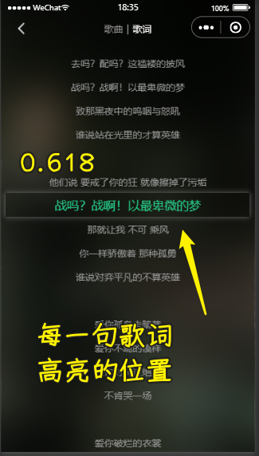
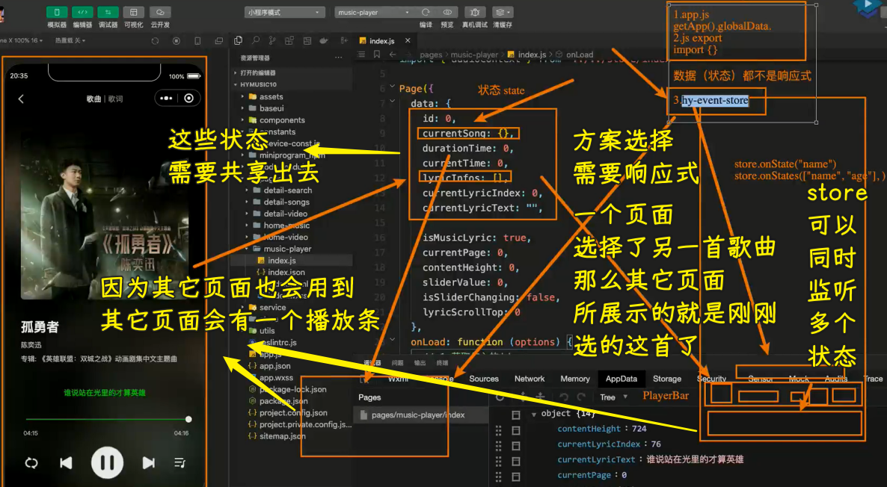
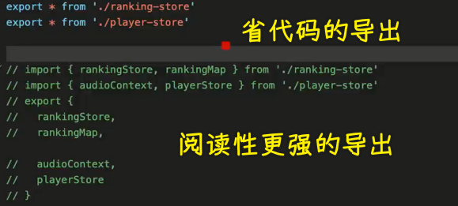

### ✍️ Tangxt ⏳ 2022-04-23 🏷️ 小程序

# 10-播放器歌词解析、展示、滚动实现

1）答疑

💡：写代码很纠结？

这是好事 -> 当你对所写的代码有要求的时候，你才会纠结 -> 比如起名字时会想很多

💡：IndexDB 开发用得多吗？

用得不多 -> 一般都是用数据库了

💡：简历项目是挑部分详细写还是大体总结的好？

多写一些比较好！

当然，对于一些大佬而言，如 python 作者，简历里边只写了一句「I write python」就行了

用最简单的词，说最狠的话 -> 到了这种境界的人，不需要用太多词来描述，简简单单就能把自己的能力体现出来！

💡：mv 界面的设计稿？

手机端 -> 网易云音乐和抖音的看起来差不多！

2）掌握播放页-歌词分页的展示和滚动

💡：做什么？

做三个东西：

1. 切换到「歌词」页，可以展示歌词，并且滚动歌词
2. 重构代码 -> 播放页里边的一些数据需要共享出去 -> 其它页面要播放歌曲，那就很容易做到了
3. 播放页的操作部分 -> 播放模式、上一首、暂停、下一首、歌曲列表展示

💡：把歌词展示到这个「歌词」页

💡：歌词样式

1. 不能给整个`scroll-view`上下`padding` -> 不然，在滚动的时候，上下歌词会消失掉
   1. 给第一句歌词和最后一句歌词加`padding-top/bottom` -> 作用于`item`
   2. 第一句歌词所处的位置在中间 -> 通过`contentHeight`计算可得 -> 可是这是从这中间开始的，太靠中了，所以再提上个`80` -> 适配黄金分割点
2. 动画效果
   1. 一行歌词的高度设置成了`35px`，在移动端设备这是比较舒适的高度，居中效果很好 -> 因此，我们的滚动距离也是`35px`
   2. 在 CSS 里边写了`35px` -> 你可以设置成常量 -> 用行内样式
   3. 出现滚动 -> 用`scroll-top` -> 不过这样的滚动很突兀，有跳跃的感觉 -> 加点动画效果

---

效果：

> [Demo](https://github.com/ppambler/QQMusic/commit/8d963c0)

3）答疑

> 1 59 32

💡：歌词展示的空白？

那个空白也是有时间的

💡：歌词拖拽播放？

1. 你可以根据`scrollTop`除以`35`计算得到`index`
2. 根据`index`拿到对应的时间，再设置（`seek`）对应的时间

➹：[前端有什么拖动歌词改变播放进度的开源项目？ - SegmentFault 思否](https://segmentfault.com/q/1010000022232384)

💡：歌词前后高度用另一种方式计算

父盒子的伪类给`calc(50% +/- 行高）`

4）掌握播放页-状态管理的 store 逻辑抽取

💡：重构播放页面代码

会修改很多代码，甚至删掉一些代码

目前的代码存在什么问题？

怎么重构？

把数据的原始位置放到其它地方，目前还在这个播放页里边，播放页只有使用权

💡：导出代码

💡：重构步骤

1. 抽离网络请求过来的数据 -> 如`currentSong、durationTime、lyricInfos` -> `id`
2. 在哪里发起网络请求？ -> `song-item-v1`、`song-item-v2`

> [Demo](https://github.com/ppambler/QQMusic/commit/18a8d2a)

5）

> 1 23 35

