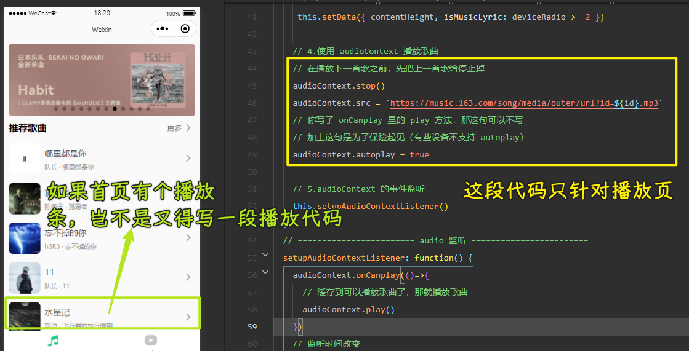
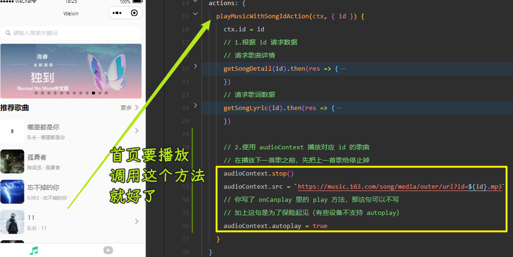
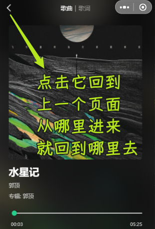
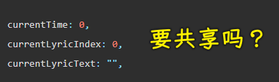
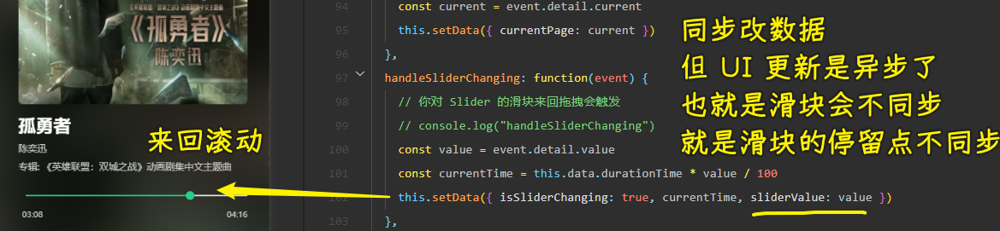
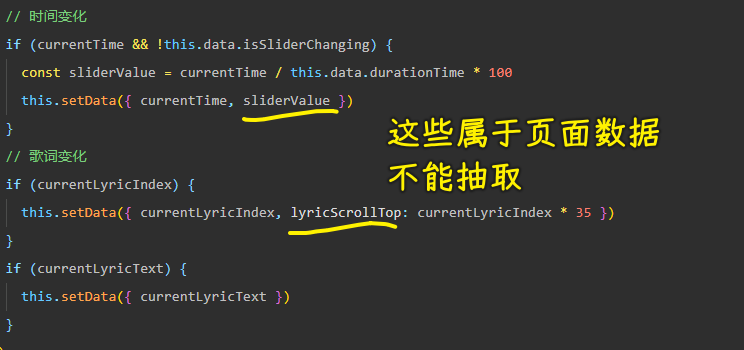
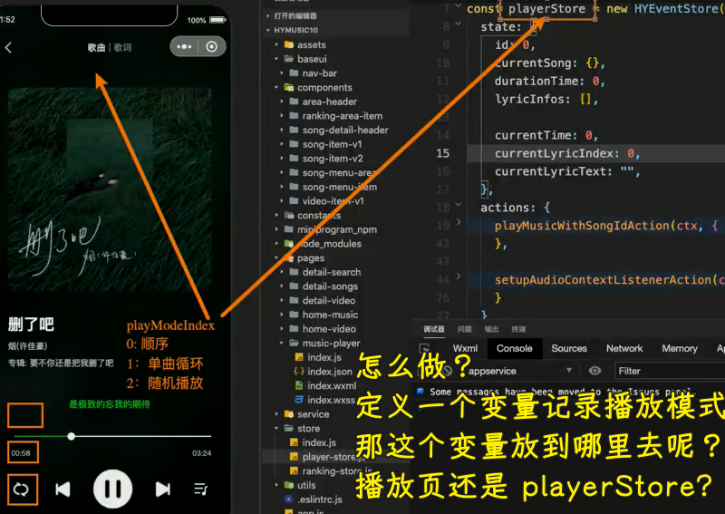
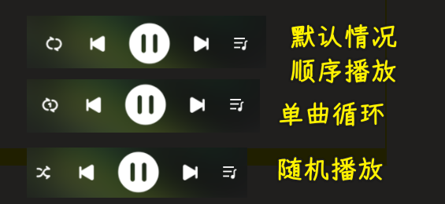
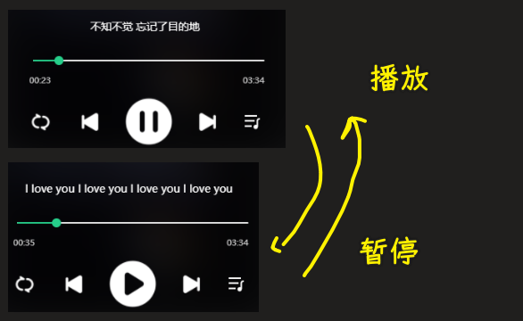
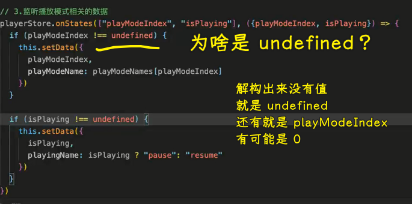

### ✍️ Tangxt ⏳ 2022-04-23 🏷️ 小程序

# 10-播放器歌词解析、展示、滚动实现

### <mark>1）答疑</mark>

💡：写代码很纠结？

这是好事 -> 当你对所写的代码有要求的时候，你才会纠结 -> 比如起名字时会想很多

💡：IndexDB 开发用得多吗？

用得不多 -> 一般都是用数据库了

💡：简历项目是挑部分详细写还是大体总结的好？

多写一些比较好！

当然，对于一些大佬而言，如 python 作者，简历里边只写了一句「I write python」就行了

用最简单的词，说最狠的话 -> 到了这种境界的人，不需要用太多词来描述，简简单单就能把自己的能力体现出来！

💡：mv 界面的设计稿？

手机端 -> 网易云音乐和抖音的看起来差不多！

### <mark>2）掌握播放页-歌词分页的展示和滚动</mark>

💡：做什么？

做三个东西：

1. 切换到「歌词」页，可以展示歌词，并且滚动歌词
2. 重构代码 -> 播放页里边的一些数据需要共享出去 -> 其它页面要播放歌曲，那就很容易做到了
3. 播放页的操作部分 -> 播放模式、上一首、暂停、下一首、歌曲列表展示

💡：把歌词展示到这个「歌词」页

💡：歌词样式

1. 不能给整个`scroll-view`上下`padding` -> 不然，在滚动的时候，上下歌词会消失掉
   1. 给第一句歌词和最后一句歌词加`padding-top/bottom` -> 作用于`item`
   2. 第一句歌词所处的位置在中间 -> 通过`contentHeight`计算可得 -> 可是这是从这中间开始的，太靠中了，所以再提上个`80` -> 适配黄金分割点
2. 动画效果
   1. 一行歌词的高度设置成了`35px`，在移动端设备这是比较舒适的高度，居中效果很好 -> 因此，我们的滚动距离也是`35px`
   2. 在 CSS 里边写了`35px` -> 你可以设置成常量 -> 用行内样式
   3. 出现滚动 -> 用`scroll-top` -> 不过这样的滚动很突兀，有跳跃的感觉 -> 加点动画效果

---

效果：

> [Demo](https://github.com/ppambler/QQMusic/commit/8d963c0)

### <mark>3）答疑</mark>

> 1 59 32

💡：歌词展示的空白？

那个空白也是有时间的

💡：歌词拖拽播放？

1. 你可以根据`scrollTop`除以`35`计算得到`index`
2. 根据`index`拿到对应的时间，再设置（`seek`）对应的时间

➹：[前端有什么拖动歌词改变播放进度的开源项目？ - SegmentFault 思否](https://segmentfault.com/q/1010000022232384)

💡：歌词前后高度用另一种方式计算

父盒子的伪类给`calc(50% +/- 行高）`

### <mark>4）掌握播放页-状态管理的 store 逻辑抽取</mark>

💡：重构播放页面代码

会修改很多代码，甚至删掉一些代码

目前的代码存在什么问题？

怎么重构？

把数据的原始位置放到其它地方，目前还在这个播放页里边，播放页只有使用权

💡：导出代码

💡：重构步骤

1. 抽离网络请求过来的数据 -> 如`currentSong、durationTime、lyricInfos` -> `id`
2. 在哪里发起网络请求？ -> `song-item-v1`、`song-item-v2`

> [Demo](https://github.com/ppambler/QQMusic/commit/18a8d2a)

---

抽取代码的思路：

1. 分析清楚哪些状态需要共享，哪些东西需要抽离出去
2. 按照第一步这个逻辑，一点一点地抽离出去

为什么不一开始就抽离了？ -> 先把逻辑都写到播放页里边，再抽取 -> 是为了让大家学会这样抽取的思路

### <mark>5）掌握播放页-播放功能的抽取和返回功能</mark>

> 1 23 35

💡：网络请求这部分抽取完了，抽离播放歌曲部分

为什么要抽取：

抽到哪儿去：

💡：播放页 -> 返回到上一页

监听的是整块区域，而不是小图标，毕竟如果小图标太小的话，会无法监听到

`nav-bar`组件不能决定用户点击这个图标区域到底要做些是啥事，而是交给使用这个组件的页面来决定

所以我们要把这个事件抛出去

效果：

返回到上一级歌曲还在播放…… -> 这首歌播放完，自动切换到下一首该如何做呢？

如果重复点击同一首歌呢？ -> 不需要重复发送 -> 判断一下`id`即可！

> [Demo](https://github.com/ppambler/QQMusic/commit/592bb16)

### <mark>6）答疑</mark>

> 1 11 17

💡：文字渐变

伪元素`::before` -> 用一个相同的有颜色的文字叠加上去，这个完全叠加是慢慢过渡的，也就是宽度从`0%`到`100%`

➹：[sample-code/lyrics-progress.html at main · oceanbaby715/sample-code](https://github.com/oceanbaby715/sample-code/blob/main/css/lyrics-progress.html)

### <mark>7）掌握播放页的播放监听逻辑的抽取</mark>

💡：这三个数据要共享吗？

首页也许不会用到它们，但未来就不一定了

为了长远考虑，我们可以把它们抽离出去

既然要抽离它们，那么这三个数据是来自哪儿的呢？ -> 产生这些数据的地方也要抽离出去！

💡：来回拖拽有 bug -> 很慢

滑块会抖动！

> 这个 bug 例子，能让你很好地理解页面 UI 更新和 `data` 更新不同步产生什么效果

💡：这个抽取过程

- 页面的内部事件、页面数据（如`lyricScrollTop`）不要抽取
- 你要知道这个数据是如何产生的，这个数据的产生需要依赖哪些数据
- 一个函数不要太长

> [Demo](https://github.com/ppambler/QQMusic/commit/3f444b0)

### <mark>8）掌握播放页中播放模式的记录和切换</mark>

> 38 30

💡：目前已经做了什么

歌曲的逻辑都抽到`player-store`里边去了，其它页面要用直接去拿即可！

💡：现在该做什么

播放模式就写三种：

- 循环播放（单曲循环）
- 顺序播放
- 随机播放

放到`player-store`里边，因为需要共享

要做的：

- 播放模式的状态记录
- 如何变化播放模式 -> 也就是图标变化

> [Demo](https://github.com/ppambler/QQMusic/commit/17e9468)

### <mark>9）掌握播放页的暂停和播放的控制处理</mark>

> 24 55

💡：暂停功能

做两件事：

1. 记录是否是暂停状态
2. 图标切换 -> 歌是真得暂停或播放了

这个状态放哪儿？ -> `player-store`里边

> 暂停状态的监听可以跟`playModeIndex`放到一起，当然，也可以分开监听 -> 选择放在一起，因为它们俩联系比较紧密，都是在一个 HTML 结构模块里边

暂停或播放歌曲 -> 调用 API -> 在`player-store`里边写这个逻辑 -> 在播放页里调用这个`action`

> [Demo](https://github.com/ppambler/QQMusic/commit/c9497e7)

💡：代码细节

> `let {a,b} = {a:'xx'}` -> `a -> 'xx'，b -> 'undefined'`

💡：其它功能

- 播放列表 -> 拿到数据 -> 展示成你想要的效果
- 上一首 & 下一首 -> 完成这个需要先拿播放列表

关键是学会代码的设计，以及如何抽取 -> 公共逻辑抽取一下 -> 如何做状态管理

### <mark>10）答疑</mark>

> 07 26

💡：暂停后，拖动进度条立马播放，而播放按钮没有变化？

> [Demo](https://github.com/ppambler/QQMusic/commit/8ac8fd7)

💡：APP 体验

原生体验更好 -> object-c java

uni-app 和 rn 有 bug
