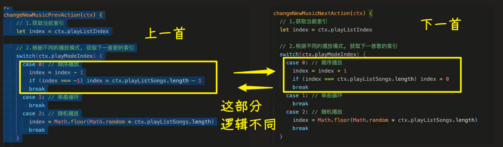

### ✍️ Tangxt ⏳ 2022-05-10 🏷️ 小程序

# 11-HYMusic 细节功能补充

### <mark>1）答疑</mark>

💡：JS 高级

看老师这个课 -> 红宝石这本书注重用法，原理啥的不是很深入

💡：react 项目

hooks 开发是趋势，很多项目还是用 class -> 这两个东西都需要掌握

### <mark>2）理解轮播图高度计算不正确 bug 处理</mark>

💡：轮播图 bug

这个 bug 很难复现

如果容易复现的话，那就很容易找到原因，最后再用代码一点点地去修复

每次出现这个 bug 是规律的

这个图片高度每次都那么高 -> 猜测是默认的 `240`

造成这个 bug 的原因：宽高比还未计算完成，就调用回调了 -> 这是小程序启动时的 bug

图片加载完的最后一次也执行回调，而不是只执行开头的初始化一次：

> 程序员每天 -> 要么写 bug，要么改 bug -> 如操作系统，也是一个软件，每天都在修复 bug

### <mark>3）掌握播放的小问题处理-同一首歌播放和新歌信息重置</mark>

> 2 20 25

要完成的功能：

- 下一首与上一首
- 首页展示播放条 -> 旋转图片，暂停后，图片的旋转初始化了，按理说应该会从原先的位置继续旋转

要优化的部分：

- 重复进入同一首歌，不应该重新播放
  - 从暂停状态切出去，再回来会继续播放
- 从播放页返回，选择一首新歌，进入到播放页，会有上一首歌的信息残留

> [Demo](https://github.com/ppambler/QQMusic/commit/5228ab9)

代码细节：

> 函数体里边的代码自己取反操作，太绝对了 -> 可以给一个默认值

### <mark>4）掌握点击播放添加播放列表和索引</mark>

> 2 04 52

多掌握这个项目里边涉及到的思想，毕竟做音乐播放器的公司就那么几家！

💡：要完成的功能

- click -> 上一首和下一首
- 音乐播放完 -> 自动播放下一首

如何实现？

1. 要有歌曲列表，没有这个，谈何下一首和上一首
2. 歌曲列表要共享 -> 首页会用到
3. 正在播放歌曲在歌曲列表里边的索引

💡：造播放列表这个数据

如果你是从 收藏、历史 等里边选择歌曲的，那么就把收藏列表和历史列表作为当前的歌曲播放列表

还是在组件里边写点击这个逻辑吗？ -> 显然不是，在使用组件的页面里边写，可以监听到在哪个列表被点击了，以及被点击的歌的索引

> [Demo](https://github.com/ppambler/QQMusic/commit/f70aa9c)

💡：下一首与上一首的逻辑

- 需要根据播放模式来决定

💡：不要把孤勇者作为测试歌曲，这首歌太不安静了

选择安静的「这世界那么多人」

### <mark>5）掌握上一首、下一首歌曲的切换封装</mark>

> 1 42 34

💡：切换歌曲的逻辑放哪儿？

其它页面也会用到，不仅仅是播放页会用到

所有切换歌曲的逻辑放到`player-store`里边的`actions`

代码细节：

- 随机播放 -> `Math.floor(Math.random() * ctx.playListSongs.length)`（`[0,1)`） -> 假设是`6`首歌在播放列表 -> 那么就是`0-5` -> 你可以抽离到工具方法里边 -> 随机播放也可以播放到之前这首歌
- 页面传的`id`参数是字符串，直接调用方法`playMusicWithSongIdAction`传的是数值 -> 用`==`
- 单曲循环（测试单曲循环，直接把播放页作为启动页就好了，此时`playListSongs`是`[]`，需要在播放页的`onload`方法调用`playMusicWithSongIdAction`播放音乐） -> 点击下一首 -> 强制刷新歌曲，也就是重新播放当前这首歌

💡：不要写重复代码，上一首和下一首的代码逻辑基本一样

让传过来的参数（`isNext`）决定是上一首还是下一首，默认是下一首！

> [Demo](https://github.com/ppambler/QQMusic/commit/353a5b3)

### <mark>6）答疑</mark>

> 1 11 39

💡：小程序分包

- 原理跟 webpack 的分包相似
- 也跟路由的动态加载比较相似

💡：小程序叫上架或者上线，不叫部署

后端把静态资源上传叫部署

商品叫上架，小程序项目一般叫上线

### <mark>7）掌握自动播放下一首歌曲</mark>

💡：这首歌播放完，自动播放下一首

监听这首歌什么时候播放完 -> `audioContext.onEnded`

> [Demo](https://github.com/ppambler/QQMusic/commit/9e5f99b)

💡：目前代码存在的问题

添加一个`isFirstPlay` -> 不要重复监听，只监听一次就好了

### <mark>8）掌握首页播放工具栏布局和内容的展示</mark>

> 49 53

💡：从播放页返回到上一个页面，此时歌曲还在播放，希望在首页有个播放条 -> 模仿 QQ 音乐

> [Demo](https://github.com/ppambler/QQMusic/commit/5d8b27a)

### <mark>9）掌握播放工具栏-播放控制和旋转动画</mark>

> 35 59

💡：播放、暂停

💡：图片旋转

方案有很多

1. 第三方库 -> 没必要，因为就简单一个旋转
2. `wx.createAnimation` -> 用 JS -> 很麻烦 -> `rotate`时需要归`0`，才能继续旋转
3. CSS3 动画

歌曲播放动画旋转，歌曲暂停动画停止如何做？

用`animation-play-state`这个样式属性就好了

> [Demo](https://github.com/ppambler/QQMusic/commit/c6b69b0)

### <mark>11）答疑</mark>

💡：进度条环绕？

- 原生有，小程序没有
- `currentTime/durationTime` -> 用 CSS3 或者 Canvas

### <mark>12）答疑</mark>

> 16

💡：优化

1. `currentSong`有值才展示播放条
2. 播放条遮住底部了
3. 后台播放（背景播放） -> 关闭小程序，也能播放 -> 侧边有个播放的东西悬浮在微信聊天列表等

💡：`store`里边的数据能在小程序面板里边展示吗？

不能 -> 之前老师写这个库的时候打算把整个`store`里的`state`搞成是对象注入到页面，可这样耦合度太强了

