### ✍️ Tangxt ⏳ 2022-05-12 🏷️ 小程序

# 12-小程序登录解析和分包处理

### <mark>1）答疑</mark>

💡：公司项目用 rematch、reselect 等这样我没有接触过的库

看文档是否健全，一个库的文档健全，那学起来是非常快的，不管是啥框架

💡：如何给开源项目添加自己的代码？

1. 自己下载这个代码，觉得某个功能没有或者不好用，自己添加功能，自己使用或者给该项目一个 PR，也许作者会合并
2. 项目有 bug，自己处理，提 PR

给知名项目提 PR，可以写到简历里边去

看源码修改源码，很少会这样，很多都是功能不足或有 bug！

当然，对于英文文档，合并贼快，也就是说这个项目有专门的人来管理！

### <mark>2）掌握播放工具栏占位、点击跳转处理</mark>

💡：目前代码存在的小问题

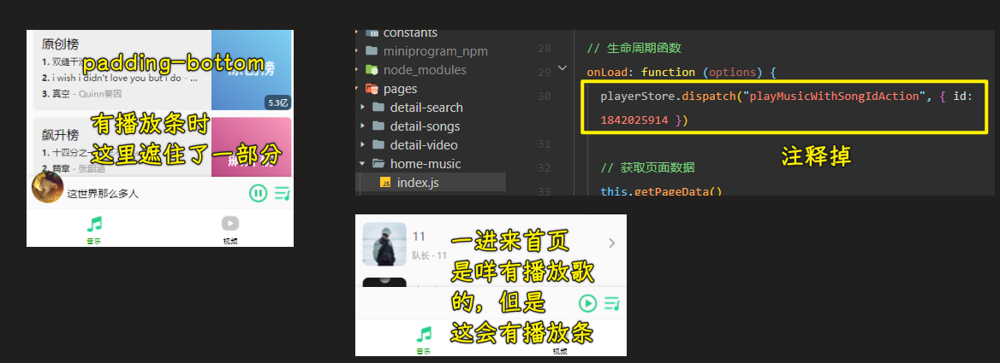

为什么给`currentSong`的初始值是`{}`，而不是`null`或`undefined`这样的值？ -> 因为要避免`null.id`或`undefined.id`这样的报错情况

所以对于这个`currentSong`最后会有拿`xxx.id`这样的属性值，建议初始值为空对象`{}`，当然，你写`null`也行，不过，除了在首页要写以外，供享的`currentSong`的初始值也要改为`null`，毕竟`event-store`会初始化一次

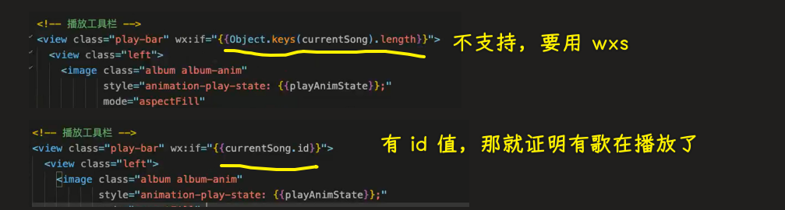

💡：如果你发现播放条跟着页面滚

这是模拟器的问题，真机上不会出现这个问题

💡：播放条遮住处理

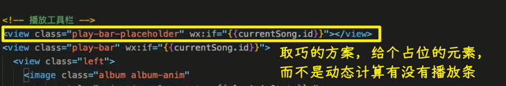

💡：点击播放条，会跳到播放详情，由于数据是共享的，所以播放到哪，进度条会展示到哪儿


为啥会这样？ -> 事件向上传递了

用`catchtap`监听播放或暂停按钮


> [Demo](https://github.com/ppambler/QQMusic/commit/c4410ed)

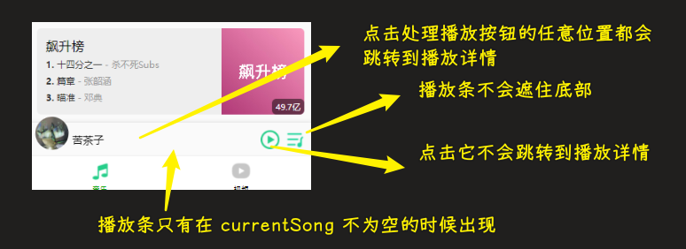

### <mark>3）掌握使用背景播放器来播放音乐</mark>

> 2 22 51

💡：能在前台（你看到的小程序界面）播放，也能在后台（你看到的微信界面或桌面）播放

文档：[wx.playBackgroundAudio(Object object) - 微信开放文档](https://developers.weixin.qq.com/miniprogram/dev/api/media/background-audio/wx.playBackgroundAudio.html)

- 前台用：`createInnerAudioContext`
- 后台用：`getBackgroundAudioManager` -> 也要记录很多信息，比如一些 APP 会在手机桌面拉下来的时候展示进度等

后台播放页写一份吗？ -> 不需要，我们前后台，都用后台播放的 API -> 为啥一开始不用 后台播放的 API？因为一般都是用前台播放的 API

当然，它们俩的播放 API 几乎一样

把`wx.createInnerAudioContext`改成是`wx.getBackgroundAudioManager`就好了

还需要添加一个配置：

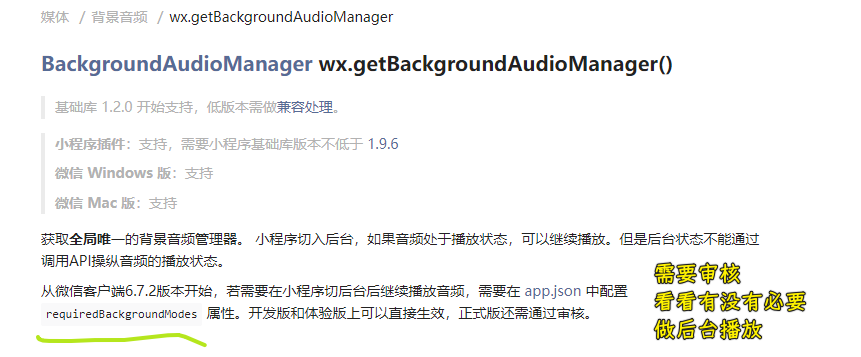

如果审核驳回了，那你就要做其它修改了

当然，添加了配置还不够 -> 可以控制那个播放小窗口的位置

需要设置`title`

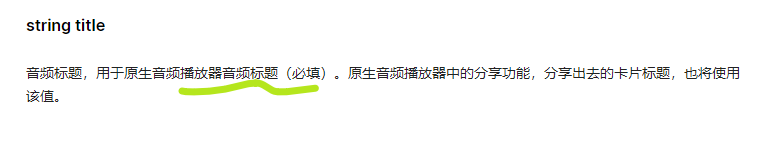

> [Demo](https://github.com/ppambler/QQMusic/commit/dfa4b1d)

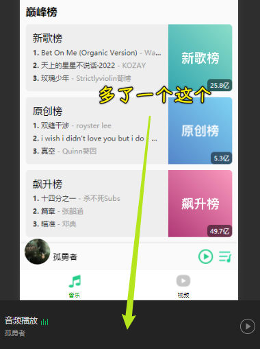

### <mark>4）掌握背景播放的暂停-播放-停止处理</mark>

> 2 7 34

💡：目前的问题

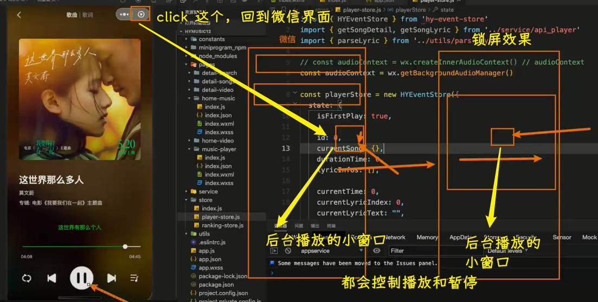

目前的问题：

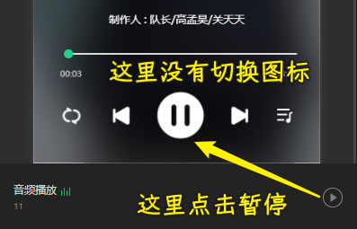

状态改变：

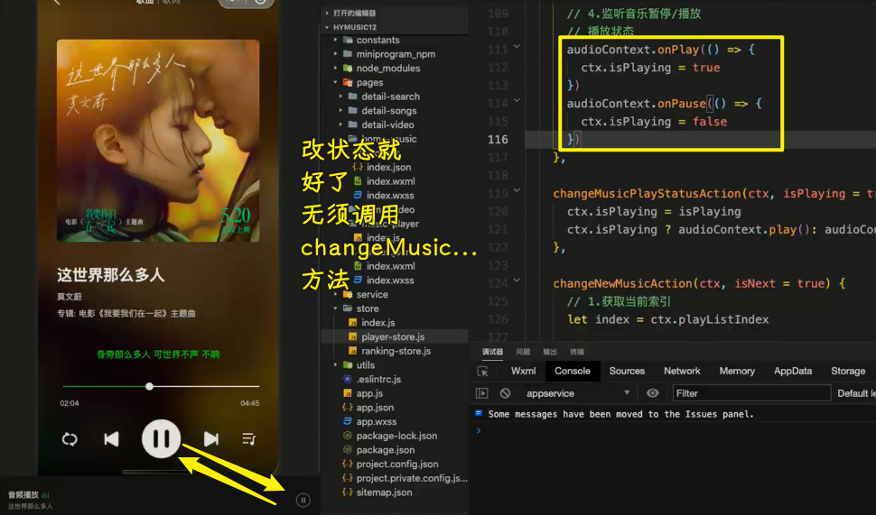

不过这有个问题，那就是在拖动进度条的时候，播放按钮会切换成暂停，然后再播放……

有两种方法可以解决：

方法一：

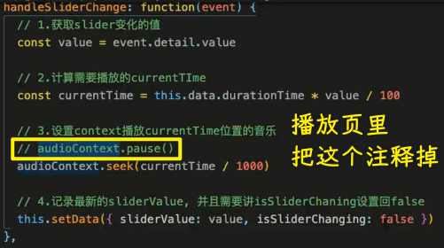

对于`audioContext`而没有暂停，等缓存下来了，就开始播放

方法二：

通过处理进度条那个 API 改的，就不需要改状态了

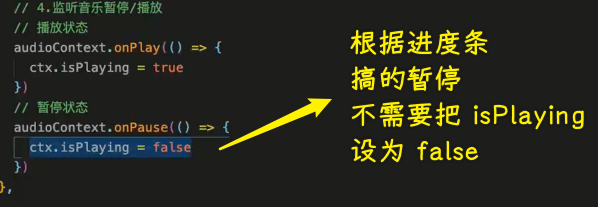

不过，`onCanplay` bug，也就是太经常出现不回调

➹：[正常网络音频用 BackgroundAudio 播放，很久才回调 onCanPlay - 微信开放社区](https://developers.weixin.qq.com/community/minigame/doc/000e2061bb8f8032c3a7bc1375b400)

所以，方法二，不要用，用方法一就好了

IOS 和 Android 的不同：

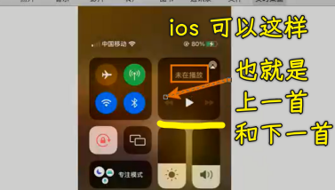

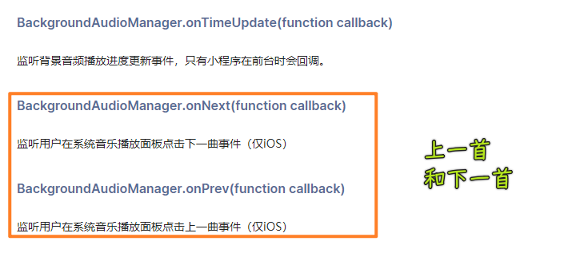

💡：`BackgroundAudioManager.onStop`

何时触发这个 API 的调用？ -> 直接点那个停止背景音乐的`x` -> 我要做的事是：停止播放条的图片旋转，同样需要把播放状态的歌改为暂停状态

`onEnded`是「监听背景音频自然播放结束事件」

这个 API 调用了：

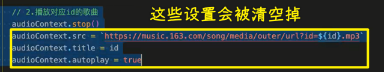

它会清空`audioContext`这里边保存的这些数据 -> 点击播放按钮没效果 -> 要重新设置这些数据 -> 这会重头播放（QQ 音乐和网易云音乐都是这样）

不过，我在测试的时候，发现并没有重置这些数据！

> [Demo](https://github.com/ppambler/QQMusic/commit/49e6f88)

### <mark>5）答疑</mark>

> 1 37

💡：只能真机模式才能发请求？

在手机打开调试模式，也就是有 VConsole 图标，这样才能发起请求

### <mark>6）掌握登录的重要性-身份标识-登录流程</mark>

> 1 25

从产品的角度来理解为什么需要用户登录，毕竟用户登录有好几种方式，可以为什么需要用户登录呢？

💡：要讲的内容

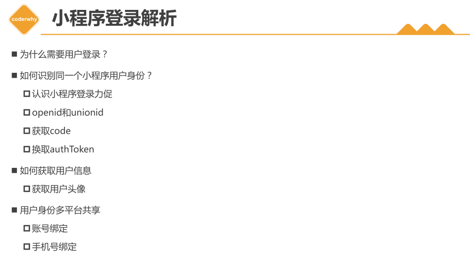

💡：为什么需要用户登录？

目的：留住用户，未来推出付费服务，可让他们关注到

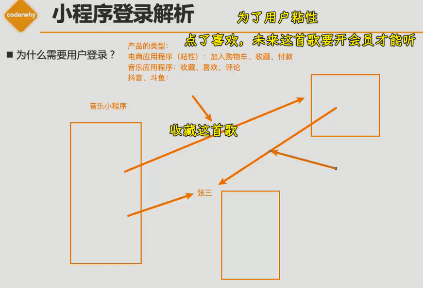

用户登录的身份标识：

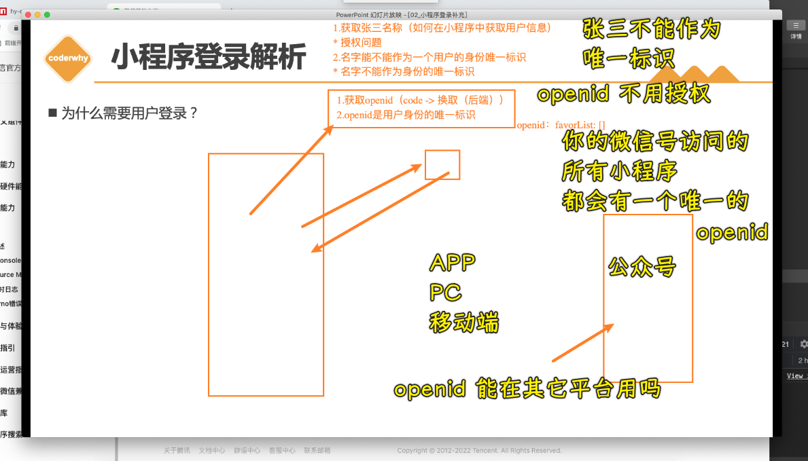

`unionid`是的多平台共享

💡：如何拿到`openid`？

这涉及到登录流程

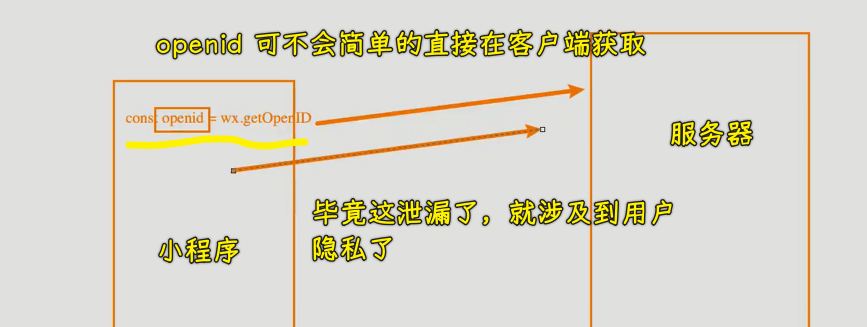

微信小程序文档给的流程图：

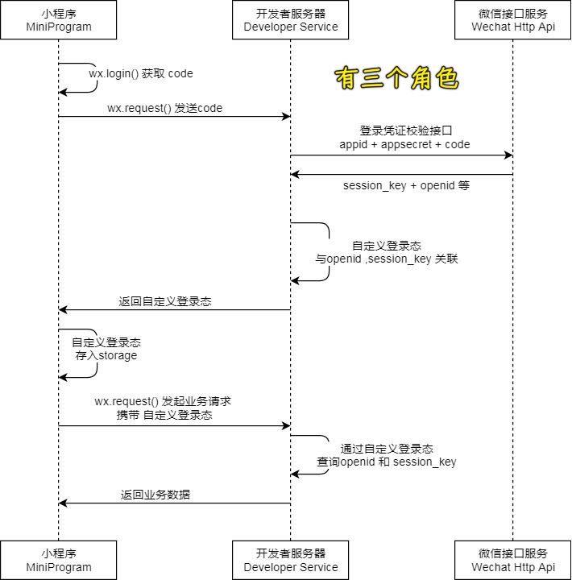

解释这张图（用户身份登录的完整流程）：

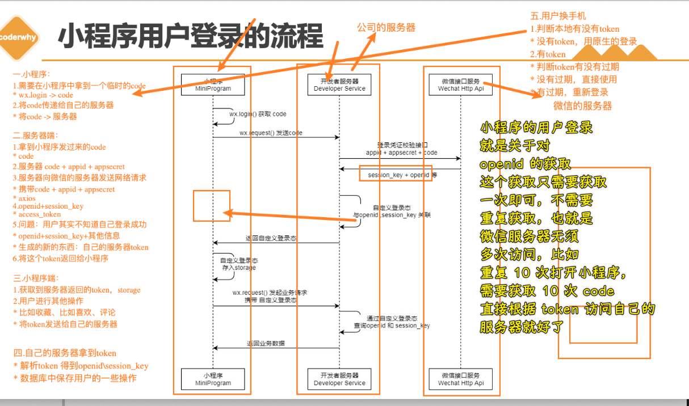

补充说明：

- 临时 code：会过期的，有有效期的，不然，一直有效的话，会不安全
- 完成小程序登录功能必须要有自己的服务器 -> 服务器需要集齐三个东西才能召唤神龙 -> 服务器也是个程序，也可以发送网络请求
- `session_key`（也有有效期） -> 用来访问微信服务器的其它东西
- 自己的服务器能解析`token`，得到一些信息，用于确定当前是哪个用户在操作
- 自定义登录态指的是「`token`」
- 业务请求指的是发起收藏、喜欢、评论等操作
- 返回业务数据 -> 这个业务数据指的是像「收藏过哪些歌曲」、「评论」等
- 图中的虚线表示一段时间

整个流程简单来说就是：

``` js
小程序 -> code -> 自己的服务器 -> code+appid+appsecret -> 微信服务器 -> openid（用户唯一身份标识）+session_key -> 自己的服务器 -> token -> 小程序 -> 发起业务请求+token -> 自己的服务器 -> 返回业务数据 -> 小程序
```

### <mark>7）掌握登录代码的封装-登录状态-登录判断</mark>

💡：用户登录

用户登录不可见 -> 等到小程序启动就发起登录，而不是打开「我的」页面点击登录

不用`getUserInfo`的背景：

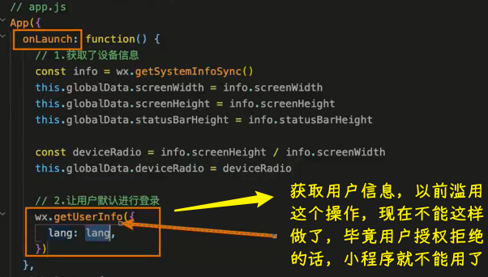

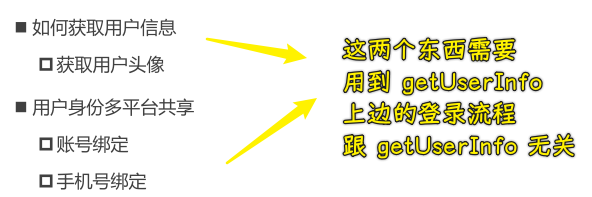

文档：[wx.login(Object object) - 微信开放文档](https://developers.weixin.qq.com/miniprogram/dev/api/open-api/login/wx.login.html)

该 API 不支持以 Promise 风格调用 -> 代码看起来很别扭，这是 jQuery 风格的代码

所以自己封装一个`api_login.js`

💡：后台服务器

选择的是 MongoDB，数据简单所以用它，如果数据复杂的话，会用 MySQL，老师的那个 Vue3+TS 项目就是用 MySQL

老师提供了一个线上服务器地址，不用我们在本地搭建用来登录的服务器

💡：在组织代码的时候

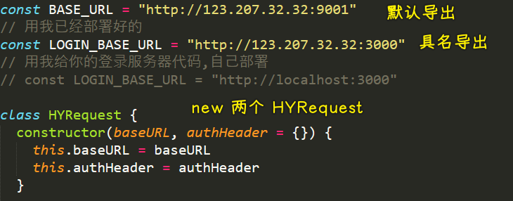

💡：`codeToToken`

用`code`换取`Token`

💡：老师提供的本地部署代码

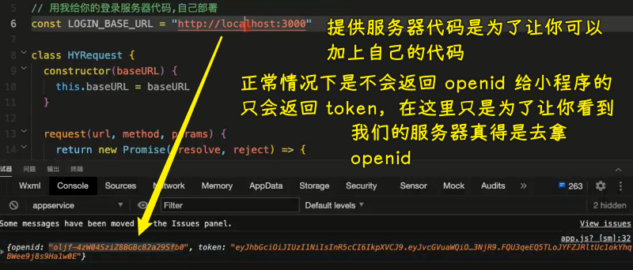

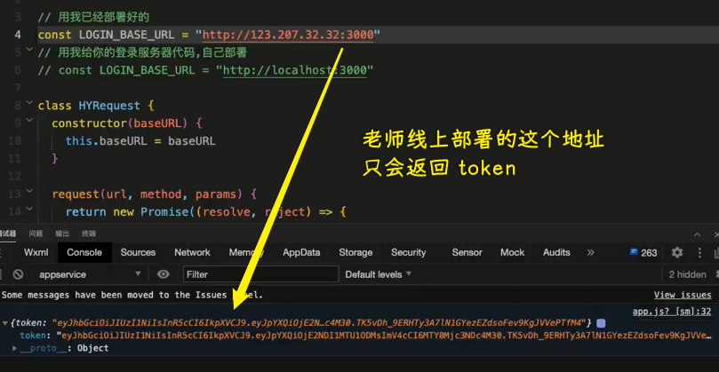

💡：把 `token` 搞成是常量

在其它页面用到`token`的时候，可以保证这个名字是一致的！

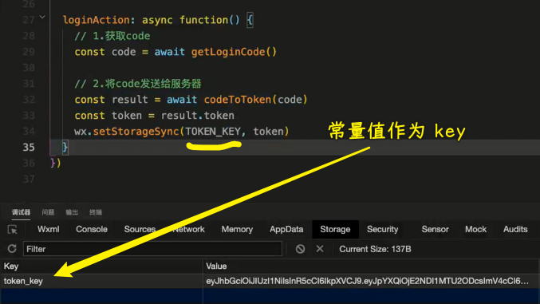

你发业务请求时，带上这个`token`，那开发者服务器就会解析你的`token`，得到你的`openid` -> 知道哪个用户做了什么样的一些操作

💡：如何验证`token`过期？

两种方式：

1. 假设请求收藏接口 -> 服务器判断`token`有没有过期 -> 服务器说过期了，那就返回给你说「`token`过期了，请重新登录」 -> 执行`loginAction`
2. 在启动小程序的时候发送一个有关校验`token`有没有过期的请求

💡：如何检查`session_key`过期？

`session_key`过期了（开发者服务器不能从微信服务器那里拿到数据） -> 重新登录

判断`session`有没有过期，微信服务器自己判断！


---

> [Demo](https://github.com/ppambler/QQMusic/commit/769f910)

### <mark>8）答疑</mark>

💡：第三方登录

第三方登录跟`unionid`有关
