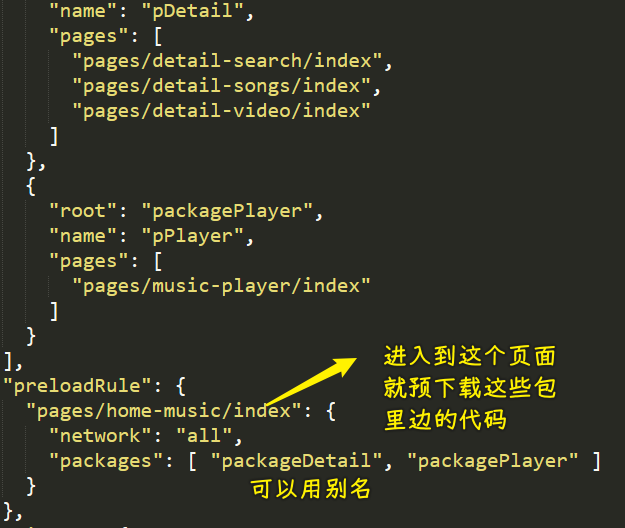

### ✍️ Tangxt ⏳ 2022-05-17 🏷️ 小程序

# 13-项⽬上线发布流程解析

### <mark>1）答疑</mark>

💡：看 redux 的使用很难，但看它的源码并不难

这个源码看懂了，那么你再看其它框架的源码，你会发现这并不难

💡：JS 高级为啥不讲 svg、canvas？

它们属于浏览器功能，不属于语言本身

💡：`node_modules`里边的东西是源码吗？

大部分是源码，有些则是打包后的 -> 你发布的是什么，那就是什么

### <mark>2）掌握登录-登录代码逻辑的优化</mark>

💡：分包

项目源代码过多？ -> 那就采用分包吧！

把首次启动不需要加载的东西，单独放到一个包里 -> 单独加载

类似的实现 -> 路由懒加载

💡：`session_key`的有效期

有效期是多少是不确定的 -> 小程序使用越频繁，那么它的有效期越久，也就是说小程序长时间没有登录的话，那就需要换取新的`session_key`了

不过，这些都是后端操作

前端所要做的操作是很少的！ -> 前端只需要发起一个请求就可以了！

💡：优化代码


优化：


💡：继续优化代码


改造`HYRequest`这个`Class` -> 目的：为`HYRequest`多添加点东西，让我们在其它地方做更少的事儿 -> 简单来说，`HYRequest`更复杂一点，那么别人在用这个`HYRequest`做某些事儿的时候就会更简单了，比如`token`的传递

`baseHeader`？`authHeader`？ -> 起名

前者都需要，后者只是部分需要


``` js
// isAuth 可控制第二个参数是否被携带上
const hyLoginRequest = new HYRequest(LOGIN_BASE_URL, {
  token
})
```

优化好后的使用：


虽然都是用`hyLoginRequest`这个实例，但是这个实例下发起的请求，有些是不需要权限，也就是不需要`token`

并不是说，用了`hyLoginRequest`，那么用它发起的这个请求就必然会携带上`token`

---

> [Demo](https://github.com/ppambler/QQMusic/commit/b9c56ac)

### <mark>3）掌握登录-获取用户的相关信息</mark>

> 2 25 36

💡：`openid`的作用


💡：`wx.getUserInfo`

公告：[小程序登录、用户信息相关接口调整说明 - 微信开放社区](https://developers.weixin.qq.com/community/develop/doc/000cacfa20ce88df04cb468bc52801?blockType=1&page=3)


4 月 28 日 24 时后发布的新版本小程序，开发者调用 `wx.getUserInfo` 或`<button open-type="getUserInfo"/>`将不再弹出弹窗，直接返回匿名
的用户个人信息，获取加密后的 `openID`、`unionID` 数据的能力不做调整。

使用`wx.getUserProfile`来调用：


以前通过事件获取的做法：


通过`event`参数获取

现在的做法：

``` html
<button open-type="getUserInfo" bindtap="handleGetUser">获取用户信息</button>
```

通过`wx.getUserProfile`获取


我们获取用户信息的作用仅仅是做展示作用

> [Demo](https://github.com/ppambler/QQMusic/commit/305d344)

### <mark>4）掌握登录-用户身份的多平台共享</mark>

💡：`unionid`？


需要申请`unionid`：

[微信开放平台](https://open.weixin.qq.com/)


💡：用户身份多平台共享

让`unionid`和手机号绑定到一起，为啥不是邮箱和用户名呢？ -> 因为注册了微信号就有对应的手机号

产品场景 -> 某 APP 一打开，叫你登录，可以选择第三方登录，你选择用微信登录后，会提示你叫你绑定某些信息，比如用户名、邮箱、手机号等等 -> 假设绑定了手机号，你在小程序的操作都可以同步到 PC、App 等，这些平台用手机号登录就可以了

说白了，手机号和`unionid`是关联在一起的！

💡：个人开发者不能拿到手机号

要有企业身份，营业执照才能拿到手机号

假设你有企业身份：

文档：[获取手机号 - 微信开放文档](https://developers.weixin.qq.com/miniprogram/dev/framework/open-ability/getPhoneNumber.html)


以前从微信服务器拿到加密信息，传给开发者服务器解析拿到手机号 -> 发现这也是不安全的

现在是拿到 code，传给开发者服务器 -> 传给微信服务器 -> 去拿手机号


> [Demo](https://github.com/ppambler/QQMusic/commit/baf3180)

---

总之，获取手机号的目的，是为了在多个平台共享用户身份 -> 第三方平台，即是没有提供微信登录，也可以把操作同步到其它平台

以前是账号（用户名、邮箱）绑定，现在则是手机号绑定了，因为要实名啊！

### <mark>5）答疑</mark>

💡：公众号开发和 h5 开发？

前者可以用微信提供的能力，也就是说它依赖微信 -> 可以用微信 SDK

h5 -> 在任何浏览器都能打开！

小程序的体验，要比 h5 好很多！

💡：h5 页面微信自定义分享跟公众号开发差不多

💡：大前端

移动端开发也在大前端里边 -> 不建议把工作时间放在这里边，包括移动端跨平台适配之类的，多年后这些东西都用不上了

移动端（IOS 开发、Android 开发）岗位需求非常少，现在很多都转到前端这边来了

💡：源码

- axios
- koa

💡：前端还是 Java？

coder

### <mark>6）掌握小程序的分包代码拆分</mark>

文档：[小程序性能优化指南 - 微信开放社区](https://developers.weixin.qq.com/community/develop/doc/00040e5a0846706e893dcc24256009)

> 1 28 08

💡：分包

文档：[分包加载 - 微信开放文档](https://developers.weixin.qq.com/miniprogram/dev/framework/subpackages.html)

查看项目大小：

- 详情
- 代码依赖分析


看起来不怎么大……

注意：

- 图片这些能放到服务器就放到服务器

为什么小程序的包有大小限制？ -> 像 APP 这样的，动不动就是几十 M 起步的，而游戏则是 G 起步的

这跟小程序的设计理念有关 -> 用完即走 -> 小程序太大，打开时间太长，会让用户不耐烦

要优化的地方：

第一次启动时渲染要快 -> 微信的渲染机制我们无法改变，但是我们可以让包变得更小一点

- 主包 -> 第一次需要下载的叫主包
- 分包 -> 后边用到的叫分包

优化目标 -> 主包尽可能小

我们这个项目才 500 多 KB，其实没有必要分！

💡：没有分包的情况


目前所有的东西都在主包里边，现在我们把详情页、播放页搞到单独一个包里边去

规定：不能把 tabBar 所对应的页面分到单独的包里边去


💡：如何划分？

1. 建包的入口文件夹 -> 除了放页面，还可以放其它资源（如图片等）
   1. 把页面拖到`pages`里边去 -> 注意路径的修改和页面跳转的路径
2. 在全局配置文件里边配置分包路径
   1. `root`入口目录
   2. `name`别名，可以不写


分包后的结果：


打开分包后的页面，自动会有一个加载图标

> [Demo](https://github.com/ppambler/QQMusic/commit/6f5599c)

### <mark>7）掌握小程序分包的其它内容补充</mark>

> 1 06

💡：独立分包

之前分的那两个包 -> 用到了主包里的东西，比如组件、网络请求、store 等东西

所以这就不是独立分包了 -> 它们俩依赖了主包里的东西

独立分包存在的意义 -> 可以独立运行 -> 场景：用户只是使用这个小程序的某个功能而已，比如核酸码 -> 每次都得做一堆操作，才扫那个码，这很麻烦

💡：分包预下载

为什么需要分包预下载？ -> 没有它，跳转的时候比较慢

小程序闲置状态时 -> 预下载 -> 类似 webpack 的`preload/prefetch`



> [Demo](https://github.com/ppambler/QQMusic/commit/e7a1d0f)

💡：分包异步化

分包 A 用 分包 B 里的组件

### <mark>8）答疑</mark>

💡：联想到其它知识

宇宙存在运行规律，找到这种规律的逻辑（牛顿找到了，其它伟大的科学家也找到了） -> 代码逻辑也是如此

💡：知识储备越多，阅读文档越容易

### <mark>9）掌握手动优化 vant 包的大小</mark>

💡：vant ui 库优化

两种做法：

1. 自己写一个`search`组件
2. 把除了 `search` 组件的组件都删了？ -> 不能这样，你不确定`search`组件依赖了谁
   1. 公共东西不能删 -> 看名字
   2. 从`search`组件的`json`文件开始找它所依赖的组件，没有依赖的都删了

`2`这种做法是 -> 手动摇树

结果 -> 体积少了一半

### <mark>10）掌握小程序的发布流程和细节</mark>

文档：

- [小程序协同工作和发布 - 微信开放文档](https://developers.weixin.qq.com/miniprogram/dev/framework/quickstart/release.html#%E5%8D%8F%E5%90%8C%E5%B7%A5%E4%BD%9C)
- [小程序成员管理](https://kf.qq.com/faq/170302zeQryI170302beuEVn.html)

库：[miniprogram-ci - npm](https://www.npmjs.com/package/miniprogram-ci)

域名配置（请求地址需要规划化，如果地址访问得到是乱七八糟的东西，这显然是不行的）：

- [网络 - 微信开放文档](https://developers.weixin.qq.com/miniprogram/dev/framework/ability/network.html)

### <mark>11）掌握小程序项目的细节优化补充</mark>

💡：MV 视频详情 bug

在某些机型里边，滚动列表数据，视频也会抖动

解决这个 bug -> 下面这部分用`scroll-view`

💡：停止后台播放时，接着上次位置播

> [Demo](https://github.com/ppambler/QQMusic/commit/806eaa4)

💡：数据监听的取消

- 播放页

> [Demo](https://github.com/ppambler/QQMusic/commit/c7b3b4b)

💡：更多歌单

- `wx:for` 是循环数组，`wx:for-item` 即给列表赋别名


➹：[微信小程序 wx:for 和 wx:for-item 的正确用法 - SegmentFault 思否](https://segmentfault.com/a/1190000007727913)

> [Demo](https://github.com/ppambler/QQMusic/commit/da0db01)

💡：视频详情列表

`redirectTo`和`navigateTo`的区别 -> 前者会关闭当前页面再跳转，而后者则不会

点击某个推荐视频用的是`redirectTo`，而不是`navigateTo`，不然会叠加起来播放 MV

> [Demo](https://github.com/ppambler/QQMusic/commit/603d512)

➹：[小程序奇技淫巧之页面跳转管理 - Here. There.](https://godbasin.github.io/2019/12/08/wxapp-navigate/)

💡：播放列表

> [Demo](https://github.com/ppambler/QQMusic/commit/b93d55b)