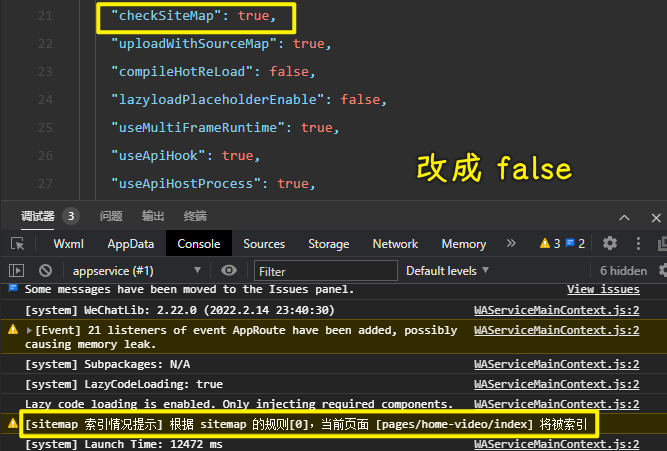
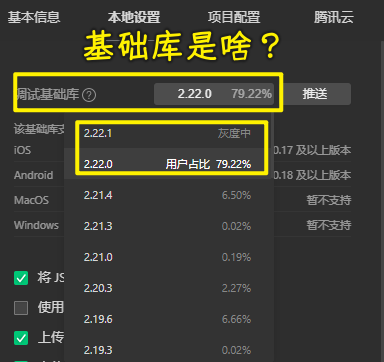
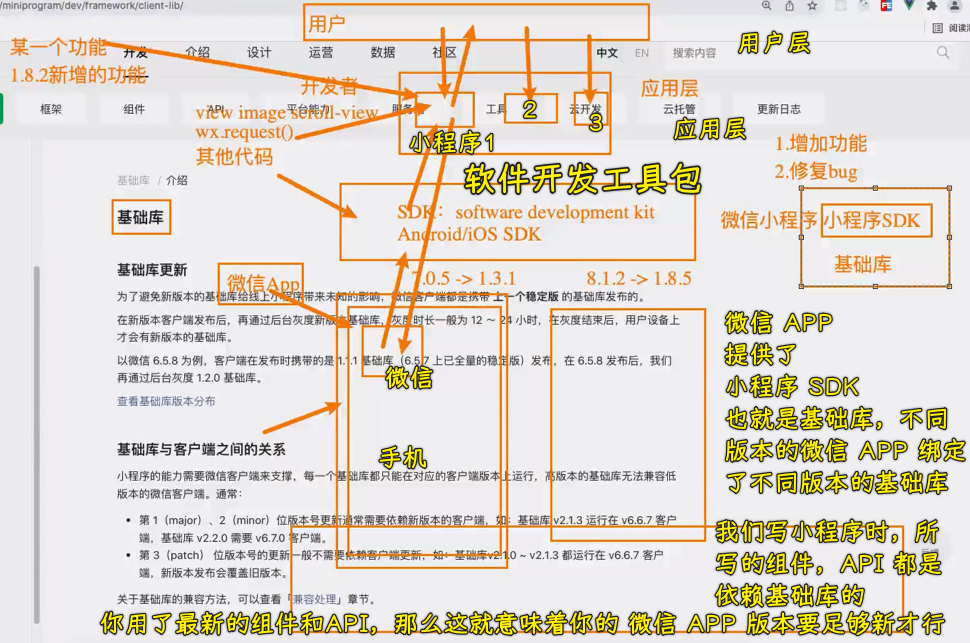
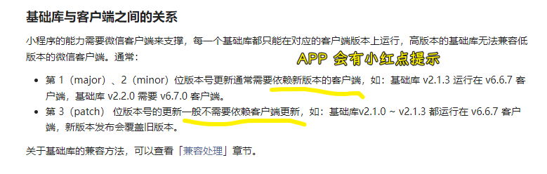
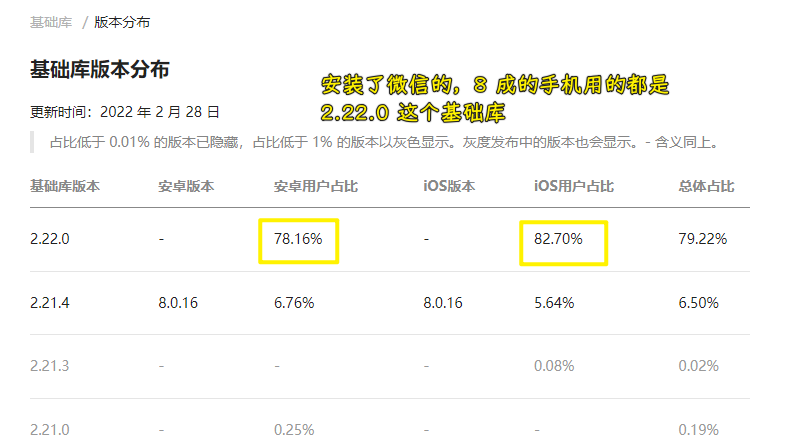
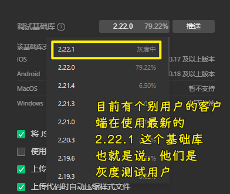

## ★答疑

💡：什么是混合开发？

RN -> JSBridge -> IOS/Andriod

➹：[搞定混合开发面试，这一篇就够了！ - 掘金](https://juejin.cn/post/6844904136450768909)

💡：框架开发和原生开发？

> 用原生技术开发

Vue -> WXML、WXSS、JavaScript

💡：可以用 Vue3 吗？

可以用了，公司新项目一般会用 Vue3 来搞！

> 关于老师的课，为了找工作先看 Vue3，打基础先看 JS 高级

Vue3 兼容 Vue2

💡：广州和深圳，同水平去哪儿？

- 广州更适合生活
- 深圳更适合奋斗

💡：请求写在哪儿？created 和 mounted？

这两个都行，建议写在 created！

💡：推荐书籍

- 高程 4
- 你不知道的 JS -> 看完老师的 JS 高级，你会发现这本书看得很流畅，老师讲的课也是按照书中那种从一个小点慢慢地过渡到一个大知识点！

💡：去掉 sitemap 警告？

💡：基础库？

- 灰度发布（也叫金丝雀发布） -> 软件工程概念

什么是 SDK？

---

灰度发布 -> 国外没有这个概念，国外叫「A/B 测试」，当然，这其中的概念、思想都是类似的 -> 国内都叫灰度发布，支付宝小程序也是如此，所以我们一律叫灰度发布 -> 简单来说，就是黑白之间的平衡过渡 -> 推广给部分用户，用服务器推送

全量发布 -> 推广给所有用户，用服务器推送

---

patch 版本会自动更新，微信 APP 不会提示

---

查看目前用户用的基础库占比：

---

基础库的测试选择？

可以不用最新稳定的那个，毕竟这个版本，无非就是增加了一个功能或者修复一个 bug，而这些对于你的小程序而言可有可无的

建议用最新稳定那个的低一个版本：

---

关于文档的阅读：

没听老师解释之前，我是看不懂这个

文档读不懂，那就先把不懂的地方给搞懂！

这是一个需要积累的过程……

➹：[蓝绿部署、金丝雀发布（灰度发布）、AB 测试_微服务_看山_InfoQ 写作平台](https://xie.infoq.cn/article/cb4c23379a9e2d2b07c4a61fe)

➹：[基础库 - 微信开放文档](https://developers.weixin.qq.com/miniprogram/dev/framework/client-lib/)

💡：小程序的`background-image`不能用本地图片，只能用网络图片

没有网络图片，只有本地图片？ -> 转成 Base64 即可！

💡：Tailwind css

写 CSS 很快！未来趋势 -> 写个类即可

💡：小程序对 ts 的支持如何？

不是特别好！

Vue3 对 TS 支持特别好，而 Vue2 不那么好！

为啥 Axios 和 React 不用 TS 重构？

重构不是那么简单的，一重构那就是大版本更新了，你看 Vue2 就升级为 Vue3 了

Axios 目前很稳定了，没啥更新的必要，而 React 是 Facebook 的，之前 Facebook 推出了 Flow，如果用 TS，那就意味着不支持自家的东西了！

💡：onReachBottom 和 scroll-view 搞下拉刷新，谁好？

页面本身能做下拉刷新，那就用页面的！

💡：小程序无法上线，如何给面试官看？

可以聊这个项目，聊一些这其中涉及到的技术点！

> 候机法则就是，HR 要在面试中选出一个他愿意与之等候一个小时飞机的人。 也就是说，你必须有趣不无聊，让人乐意与你相处。 在面试中，注意说话的艺术，不能干巴巴地说话，而是争取建立起 HR 对你的认同感。 你可以使自己的话语幽默起来，吸引 HR 的注意。

➹：[HR 问：“请做个自我介绍”，这样回答最加分！ - 知乎](https://zhuanlan.zhihu.com/p/76677170)

💡：JS DOC

- [JavaScript 之注释规范化（JSDoc）](https://knightyun.github.io/2020/03/13/js-comment-format)

💡：MongoDB？

公司一般用得少，大数据用的比较多 -> 一般公司用的是关系型数据库，MySQL 和 Oracle

