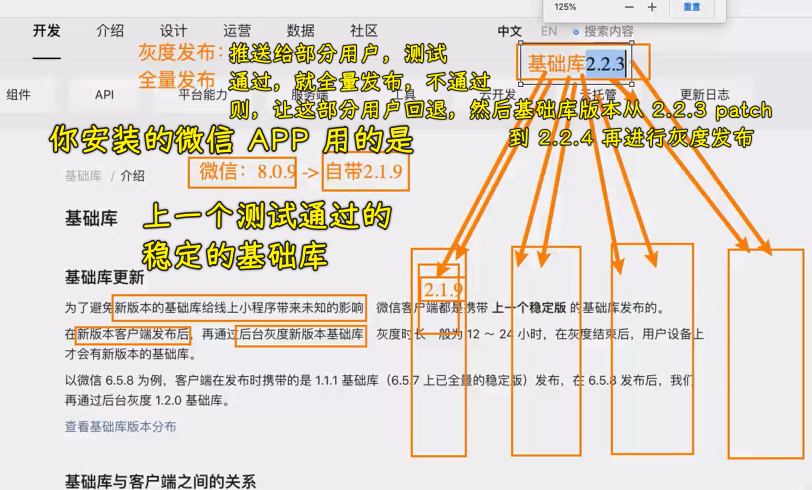
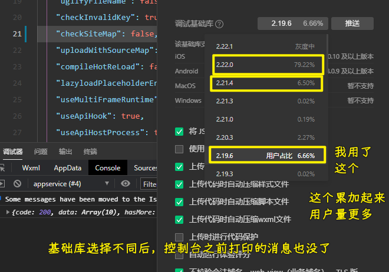

## ★答疑

💡：什么是混合开发？

RN -> JSBridge -> IOS/Andriod

➹：[搞定混合开发面试，这一篇就够了！ - 掘金](https://juejin.cn/post/6844904136450768909)

💡：框架开发和原生开发？

> 用原生技术开发

Vue -> WXML、WXSS、JavaScript

💡：可以用 Vue3 吗？

可以用了，公司新项目一般会用 Vue3 来搞！

> 关于老师的课，为了找工作先看 Vue3，打基础先看 JS 高级

Vue3 兼容 Vue2

💡：广州和深圳，同水平去哪儿？

- 广州更适合生活
- 深圳更适合奋斗

💡：请求写在哪儿？created 和 mounted？

这两个都行，建议写在 created！

💡：推荐书籍

- 高程 4
- 你不知道的 JS

💡：去掉 sitemap 警告？

💡：基础库？

- 灰度发布（也叫金丝雀发布） -> 软件工程概念

什么是 SDK？

---

灰度发布 -> 国外没有这个概念，国外叫「A/B 测试」，当然，这其中的概念、思想都是类似的 -> 国内都叫灰度发布，支付宝小程序也是如此，所以我们一律叫灰度发布 -> 简单来说，就是黑白之间的平衡过渡 -> 推广给部分用户，用服务器推送

全量发布 -> 推广给所有用户，用服务器推送

---

patch 版本会自动更新，微信 APP 不会提示

---

查看目前用户用的基础库占比：

---

基础库的测试选择？

可以不用最新稳定的那个，毕竟这个版本，无非就是增加了一个功能或者修复一个 bug，而这些对于你的小程序而言可有可无的

建议用最新稳定那个的低一个版本：

---

关于文档的阅读：

没听老师解释之前，我是看不懂这个

文档读不懂，那就先把不懂的地方给搞懂！

这是一个需要积累的过程……

➹：[蓝绿部署、金丝雀发布（灰度发布）、AB 测试_微服务_看山_InfoQ 写作平台](https://xie.infoq.cn/article/cb4c23379a9e2d2b07c4a61fe)

➹：[基础库 - 微信开放文档](https://developers.weixin.qq.com/miniprogram/dev/framework/client-lib/)

💡：小程序的`background-image`不能用本地图片，只能用网络图片

没有网络图片，只有本地图片？ -> 转成 Base64 即可！

💡：Tailwind css

写 CSS 很快！未来趋势 -> 写个类即可

