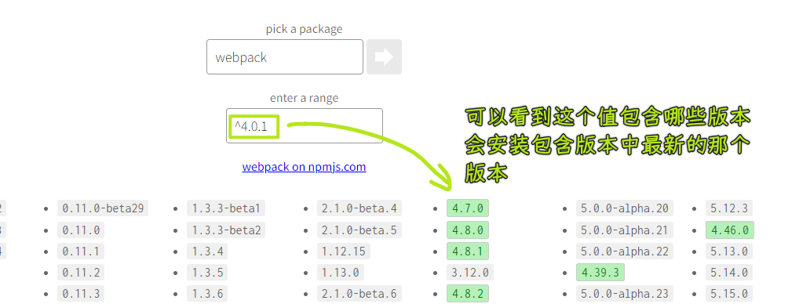
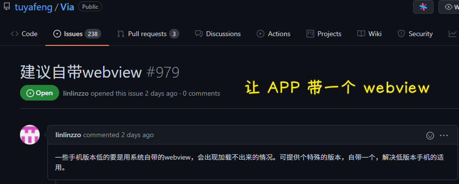

### ✍️ Tangxt ⏳ 2021-12-04 🏷️ FAQ

# FAQ

### <mark>1）多端开发框架</mark>

- [dcloudio/uni-app: uni-app 是使用 Vue 语法开发小程序、H5、App 的统一框架](https://github.com/dcloudio/uni-app)
- [NervJS/taro: 开放式跨端跨框架解决方案，支持使用 React/Vue/Nerv 等框架来开发微信/京东/百度/支付宝/字节跳动/ QQ 小程序/H5/React Native 等应用。  https://taro.zone/](https://github.com/NervJS/taro)
- [didi/chameleon: 🦎 一套代码运行多端，一端所见即多端所见](https://github.com/didi/chameleon)
- [max-team/Mars: Mars - Vue 驱动的多端开发框架](https://github.com/max-team/Mars)

### <mark>2）多端开发框架评测</mark>

- [小程序多端框架全面测评 - 知乎](https://zhuanlan.zhihu.com/p/59764741)
- [2021 年了，uniapp 发展的怎么样了？- 李白龙的回答 - 知乎](https://www.zhihu.com/question/444976489/answer/2169982328)
- [简直是神仙打架！ 多端统一框架哪家强？ - 知乎](https://zhuanlan.zhihu.com/p/143779783)

### <mark>3）阿拉丁指数</mark>

- [ 2021 年上半年小程序互联网发展白皮书 _行业资讯_阿拉丁指数](https://aldzs.com/viewpointarticle?id=15524)
- [阿拉丁指数—小程序互联网洞察平台](http://www.aldzs.com/)

### <mark>4）小程序 ID 泄漏了？</mark>

没事，随便泄漏！

➹：[微信小程序的 appid 可以告诉别人吗？ - 知乎](https://www.zhihu.com/question/290602722)

### <mark>5）一个项目的版本命名是这种格式`0.0.1`，那这所代表的含义到底是什么呢？</mark>

NPM 使用语义版本号分为 `X.Y.Z` 三位，分别代表主版本号、次版本号和补丁版本号。当代码变更时，版本号按以下原则更新。

* 如果只是修复 bug，需要更新 `Z` 位。
* 如果是新增了功能，但是向下兼容，需要更新 `Y` 位。
* 如果有大变动，向下不兼容，需要更新 `X` 位。

> `^`：caret (aka hat) -> 帽子

关键看这个：[npm semantic version calculator](https://semver.npmjs.com/)

➹：[关于 npm 中 package.json 的 dependencies 的版本符号问题？- 知乎](https://www.zhihu.com/question/47016884)

➹：[SemVer 版本规则 - 知乎](https://zhuanlan.zhihu.com/p/355635613)

➹：[npm install 版本号`^`的坑 - 知乎](https://zhuanlan.zhihu.com/p/66039729)

### <mark>6）webview 是啥？</mark>

> webview 是原生系统，用于用于移动端 APP 嵌入 (Embed) Web 技术，方式是内置了一款高性能 webkit 内核浏览器。 -> 一般会在 SDK 中封装为一个叫做 WebView 组件

Webview 是一个基于 webkit 的引擎，可以解析 DOM 元素，展示 html 页面的控件，它和浏览器展示页面的原理是相同的，所以可以把它当做浏览器看待。（chrome 浏览器也是基于 webkit 引擎开发的，Mozilla 浏览器是基于 Gecko 引擎开发的）

---

如果 App 中的 webview 和手机内置浏览器一模一样，为什么会出现各种各样的 BUG? 就连支付证书都不支持，还是需要 app 端自己写方法调用。

说白了就是 APP 内的一个容器的概念。虽然我不是 andriod 开发，但嵌入式 H5 页面写的也绝对不少。

就是一个阉割版本的浏览器。都不具备真正浏览器内核的东西！

---

写小程序时，为啥支持的 CSS 选择器就那么几种？

➹：[webview 是什么？作用是什么？和浏览器有什么关系？ - 知乎](https://zhuanlan.zhihu.com/p/142800148)

➹：[webview 到底是什么？ - 掘金](https://juejin.cn/post/6950890297450561550)

➹：[微信小程序 webView 开发精华记录 看完不懂你打我 - 掘金](https://juejin.cn/post/6844903971862085646)